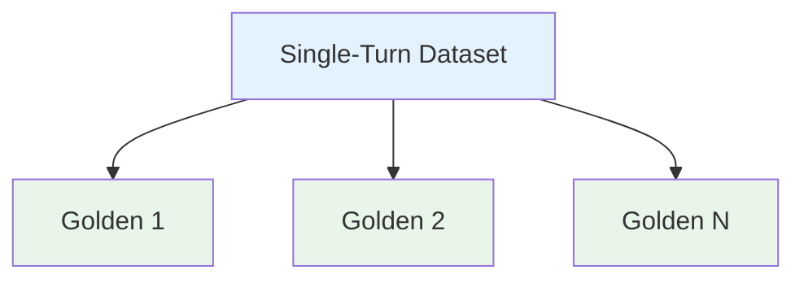
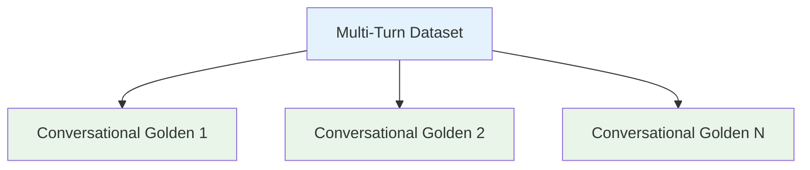

import { Callout } from "nextra/components";

# Data Models for Datasets

A **dataset** is a collection of goldens, which at evaluation time will be used for creating test cases that are ready for evaluation.

• **Dataset**: Collection of goldens, can be multi-turn or single-turn.

• **Golden**: Similar to test cases, represents interactions with your LLM app. However, a golden does not contain the outcome/output of a particular interaction, there is not ready for evaluation. Goldens can either be single or multi-turn.





Similar to test runs, dataset can either be single or multi-turn. This means you cannot add a `Golden` to a single-turn dataset, and vice versa.

## Dataset

```typescript filename="dataset.d.ts"
type Dataset = {
    alias: string;
    goldens?: Golden[];
    conversationalGoldens?: [];
    multiTurn?: boolean; // defaults to false
}
```

The alias of your dataset must be unique for a particular project.

## Goldens

### Single-Turn

A single-turn golden is represented simply by a `Golden`:

```typescript filename="golden.d.ts"
type Golden = {
    input: string;
    expectedOutput?: string;
    context?: string[];
    expectedTools?: ToolCall[];

    actualOutput?: string;
    retrievalContext?: string[];
    toolsCalled?: ToolCall[];

    customColumnKeyValues?: Record<string, string>;
}
```

### Multi-Turn

A single-turn golden is represented simply by a `ConversationalGolden`:

```typescript filename="conversational-golden.d.ts"
type ConversationalGolden = {
    scenario: string;
    expectedOutcome?: string;
    userDescription?: string;

    customColumnKeyValues?: Record<string, string>;
}
```

