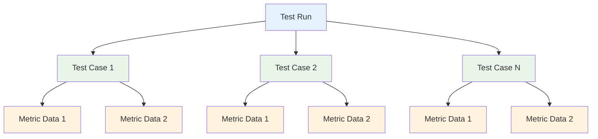

import { Callout } from "nextra/components";

# Data Models for Evaluation

A **test run** is a snapshot of your LLM app's performance at any point in time, and is represented by a collection of **test cases**. Each **test case** can have one or more **metric data**, which determines whether each test case has passed or failed. A combination of all your test cases and metric data in a test run ultimately forms the benchmark for you to quantify LLM app performance.

• **Test Run**: Collection of test cases, acts as a snapshot/benchmark of your LLM app at any point in time.

• **Test Case**: Represents interactions with your LLM app, and belongs to a test run. For single-turn use cases, this will be an `LLMTestCase`. For multi-turn use cases, this will be a `ConversationalTestCase`.

• **Metric Data**: A unit of computed metric data, and belongs to a test case. Contains data such as the metric score, reason, verbose logs, etc. for analysis.



Test runs can either be single or multi-turn. This means you cannot evaluate a combination of `LLMTestCase`s and `ConversationalTestCase`s, and metric data cannot act on both in a single test run.

## Test Case

Despite introducing **test runs** and **metric data**, test cases are actually the only data models you have to learn about. This is because Confident AI automatically creates test runs and metric data under-the-hood to group test cases together, so it's not something you have to worry about.

### LLM Test Case

An `LLMTestCase` represents a single-turn LLM interaction, and is all you need for running single-turn evals on Confident AI:

```typescript filename="llm-test-case.d.ts"
type LLMTestCase = {
    input: string;
    actualOutput: string;
    expectedOutput?: string;
    retrievalContext?: string[];
    context?: string[];
    toolsCalled?: ToolCall[];
    expectedTools?: ToolCall[];
}
```

As with anything else on Confident AI, it 100% follows the DeepEval data structure of an `LLMTestCase`. You can learn what each parameter in an `LLMTestCase` represents in [DeepEval's docs.](https://deepeval.com/docs/evaluation-test-cases)

The `ToolCall` structure is as follows:

```typescript filename="tool-call.d.ts"
type ToolCall = {
    name: string;
    description?: string;
    inputParameteres?: Record<str, any>;
    output?: any;
}
```

### Conversational Test Case

A `ConversationalTestCase` represents a **multi-turn LLM interaction**, and is all you need for running multi-turn evals on Confident AI:

```typescript filename="conversational-test-case.d.ts"
type ConversationalTestCase = {
    turns: Turn[];
    scenario?: string;
    expectedOutcome?: string;
    userDescription?: string;
    chatbotRole?: string;
}
```

You can also learn what each parameter in a `ConversationalTestCase` represents in [DeepEval's docs.](https://deepeval.com/docs/evaluation-multiturn-test-cases)

The `Turn` data model follows the OpenAI API format for a message:

```typescript filename="turn.d.ts"
type Turn = {
    role: "assistant" | "user";
    content: string;
    retrievalContext?: string[];
    toolsCalled?: ToolCall[];
}
```