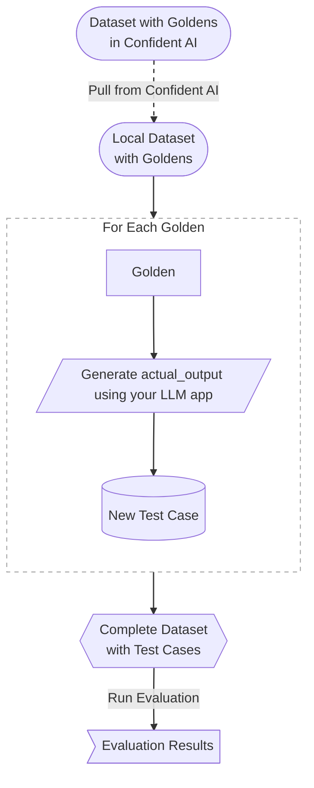

# Datasets

A dataset in Confident AI is a collection of [test cases](/docs/concepts/test-cases) and/or [goldens](/docs/concepts/datasets#goldens) that you use to evaluate your LLM application. Datasets help you systematically assess your LLM's performance across a range of inputs and scenarios.

A well-curated dataset should:

- **Reflect real-world inputs**: Include diverse linguistic styles, varying complexity levels, edge cases, and domain-specific examples
- **Serve specific evaluation purposes**: Each golden should align with clear objectives while allowing for meaningful, statistically reliable insights
- **Mirror usage patterns**: Include both common and rare scenarios that represent the actual distribution of user inputs

We find users that run evaluations most successfully have datasets in the range of 100-500 goldens. Without a well-curated dataset, it is not possible to run LLM evaluations.

## Goldens vs Test Cases

You'll notice that we mentioned goldens a few times already but haven't made the distinction on how it is different from a test case. There are two main types of entries in a dataset - goldens and test cases.

### Goldens

A golden is similar to a test case but is more flexible. The key differences are:

- Goldens do not require an `actual_output` at initialization
- Goldens are useful when you want to generate LLM outputs at evaluation time
- Goldens are ideal for scenarios where you have a **set of inputs** but haven't run them through your LLM yet
- Goldens are best for **storing ground truth data** such as `expected_output` and `expected_tools`
- Goldens contain a `custom_column_key_values` field, which allows you to use data from custom columns pairs you have [created on Confident AI's dataset editor](/docs/dataset-editor/annotate-datasets#adding-custom-columns)

Goldens are particularly useful when:

- You want to run evaluations each time you make a change to your LLM application
- You want to compare different versions of your LLM application

Another way to think about it is, **goldens are designed for editing** and are basically test cases that aren't ready for evaluation, since the dynamic values: `actual_output`, `retrieval_context`, and `tools_called`, haven't been called yet.

A `Golden` has nearly the same data structure as an `LLMTestCase`:

```python showLineNumbers copy
from deepeval.dataset import Golden

golden = Golden(
    input="Can you write me a poem?",
    # Notice that this is not the actual_output but the expected_output
    expected_output="Sure! Here is a poem about..."
)
```

For the record, here are the default `Golden` fields:

```python
from typing import Optional, List, Dict

class Golden:
    input: str
    actual_output: Optional[str]
    expected_output: Optional[str]
    retrieval_context: Optional[List[str]]
    context: Optional[List[str]]
    comments: Optional[str]
    additional_metadata: Optional[Dict]
    finalized: bool
    custom_column_key_values: Optional[Dict[str, str]]
```

The `custom_column_key_values` field will be populated by your dataset's custom column values (if any) when you [pull a dataset](/docs/dataset-editor/using-datasets#pull-a-dataset) from Confident AI.

#### Why shouldn't goldens contain `actual_output`?

You're really looking to generate dynamic `actual_output`s and optionally the `retrieval_context` and/or `tools_called` at evaluation time based on your golden `input`, so if you find your dataset containing goldens with `actual_output`s, think twice! For the record, we highly recommend **AGAINST** pre-computed datasets.

#### A note on `comments` and `additional_metadata`

The `comments` field allows adding notes and instructions about a golden, often left by domain experts, while the `additional_metadata` field stores any custom key-value pairs for any custom metadata you may have.

### Test Cases

A test case (`LLMTestCase`) represents a completed interaction with your LLM application. It contains:

- `input`: The user's input to the LLM
- `actual_output`: The LLM's response
- Optional parameters like `expected_output`, `context`, etc.

Test cases are ready for immediate evaluation since they already contain the LLM's output. This also means that test cases are **NOT** meant for editing, unlike a golden.

## Convert Goldens to Test Cases at Evaluation Time

At evaluation time, you will [pull your dataset from Confident AI](/docs/dataset-editor/using-datasets), generate any required test case parameters such as the `actual_output`, before running evaluations on the set of newly created test cases. Here's what it looks like:



## How to Curate Datasets

There are several ways to build a high-quality dataset:

- **Manual Creation**: Start with prompts you currently use to manually evaluate your LLM, document real user interactions, and create goldens for specific scenarios you want to ensure your LLM handles correctly

- **Synthetic Generation**: Use Confident AI's tools to generate goldens from documents in your knowledge base, create goldens from prepared contexts, or generate goldens from scratch without relying on existing content

- **Data Augmentation**: Modify existing goldens to create variations, use templates to generate multiple similar goldens, or combine different aspects of existing goldens to create new ones

### Best Practices

Here are some best practices for managing datasets effectively:

- **Collaboration** between technical and non-technical domain experts
- **Version control** and track changes for datasets
- **Incorporate production data** into existing datasets to keep them updated real-world usage
- **Aim for around 150 goldens** to get statistically significant evaluation results

When you use Confident AI, you'll be able to [manage, annotate, and centralize datasets on the cloud](/docs/dataset-editor/annotate-datasets). Versioning is automated for each change, and domain experts can edit datasets directly through the platform. Production data is also automatically flagged for team members to incorporate into existing datasets as well.

## Dataset Implementation

Datasets are a list of goldens. You would [pull your dataset from Confident AI](/docs/dataset-editor/using-datasets) like how you would pull a github repo via DeepEval, before generating dynamic values such as `actual_output` and `retrieval_context` per golden and convert them into a test case. These test cases in your dataset are then used for evaluation.

```python
from deepeval.dataset import EvaluationDataset
from deepeval.metrics import AnswerRelevancyMetric
from deepeval import evaluate

# Pull from Confident AI
dataset = EvaluationDataset()
dataset.pull("First dataset")

# Populate test cases
for golden in dataset.goldens:
    test_case = LLMTestCase(
        input=golden.input,
        # Generate an LLM output by replacing this with
        # the output your LLM app generated for this `golden.input`
        actual_output="..."
    )
    dataset.add_test_case(test_case)

# Define metric
metric = AnswerRelevancyMetric()

# Run evaluation
evaluate(test_cases=dataset, metrics=[metric])
```

## Further Reading

For more detailed information on working with datasets in code, refer to [DeepEval's documentation](https://deepeval.com/docs/evaluation-datasets).
