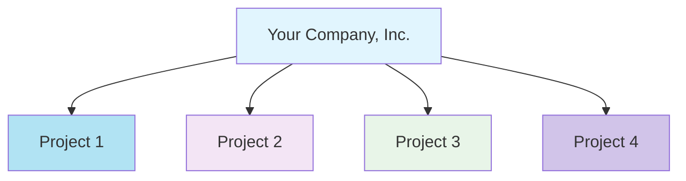

## Overview

Confident AI uses API keys for authentication. Every API request must include your API key, which authenticates your request and tracks usage against your quota.

The platform supports a multi-tenant structure for clean project-level isolation and scalability. This gives you modular control with two levels of authentication:

- **Organization-level Authentication** — Manage organization-wide resources such as projects, teams, and billing.
- **Project-level Authentication** — Access everything within a specific project, including datasets, prompts, traces, and more.

<br />


<br />

## Create an Account

If you don't already have a Confident AI account, visit [app.confident-ai.com](https://app.confident-ai.com) to sign up. You can register with your email address or use Google authentication for a faster experience.

<Tip>
  Want to use **SSO**? Check out our [enterprise offering.](https://confident-ai.com/pricing)
</Tip>

Once registered, follow the onboarding flow to create your first project.

## Organization Authentication

Organization-level authentication gives you access to manage teams, billing, and multiple projects across your organization. You'll use the **Organization API Key** to authenticate.

To retrieve your Organization API Key:

1. Visit [app.confident-ai.com](https://app.confident-ai.com) and log in.
2. Click your organization name in the top-left corner.
3. Navigate to **Settings** to view your **Organization Name**, **Organization ID**, and **Organization API Key**.

You can now copy your Organization API Key and use it for authentication.

## Project Authentication

Project-level authentication provides access to all resources within a specific project — including datasets, prompts, metric collections, traces, and more.

To get your **Project API Key**:

1. Visit [app.confident-ai.com](https://app.confident-ai.com) and log in.
2. Select the project you want to work with.
3. Go to **Project Settings** to view your **Project Name**, **Project ID**, and **Project API Key**.

Copy the Project API Key to authenticate all project-scoped API calls. You can also integrate with DeepEval by setting the key as an environment variable:

```bash
export CONFIDENT_API_KEY=YOUR-API-KEY
```

🎉 You're now ready to use Confident AI's Evals API with full access to powerful evaluation workflows and performance insights for your LLM applications.