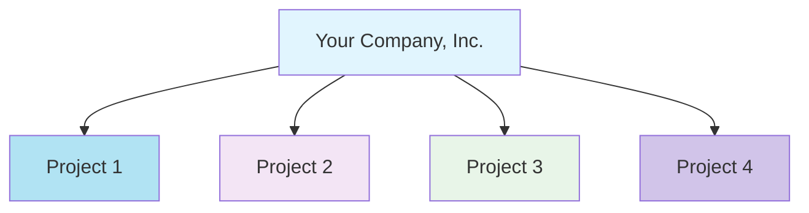

## Overview

Confident AI uses API keys for authentication. Every API request must include your API key, which authenticates your request and tracks usage against your quota.

The platform supports a multi-tenant structure for clean project-level isolation and scalability. This gives you modular control with two levels of authentication:

- **Organization-level Authentication** — Manage organization-wide resources such as projects, teams, and billing.
- **Project-level Authentication** — Access everything within a specific project, including datasets, prompts, traces, and more.

<br />



<br />

<Tip>
  Want to use **SSO**? Check out our [enterprise
  offering.](https://confident-ai.com/pricing)
</Tip>

## Organization-Level Auth

Organization-level authentication gives you access to manage teams, billing, and multiple projects across your organization. You'll use the **Organization API Key** to authenticate.

To retrieve your **Organization API Key**:

1. Visit [app.confident-ai.com](https://app.confident-ai.com) and log in.
2. Click on your organization name in the top-left corner.
3. Navigate to **Settings** to view your **Organization Name**, **Organization ID**, and **Organization API Key**.

<Frame caption="Organization Settings Page">
  
</Frame>

You can now copy your Organization API Key and use it for authentication.

## Project-Level Auth

Project-level authentication provides access to all resources within a specific project — including datasets, prompts, metric collections, traces, and more.

<Note>
  Learn how to get your API keys [here.](/docs/settings/project/api-keys)
</Note>

<Frame caption="Project API Keys">
  
</Frame>

You can also integrate with DeepEval by setting the key as an environment variable:

```bash
export CONFIDENT_API_KEY="confident_us..."
```
