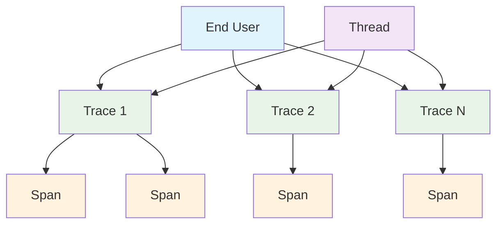
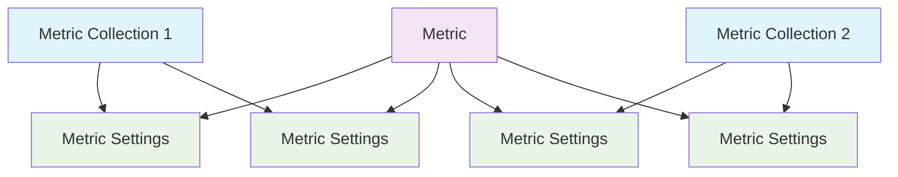
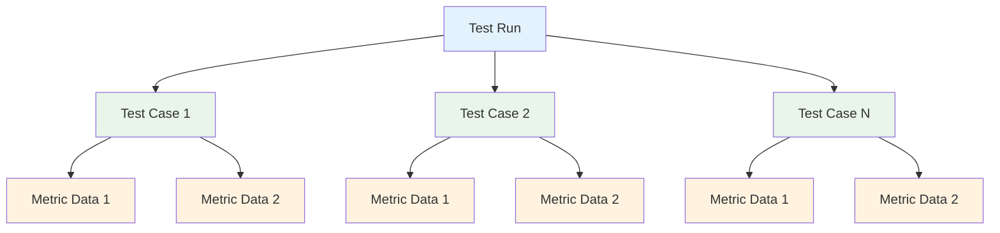
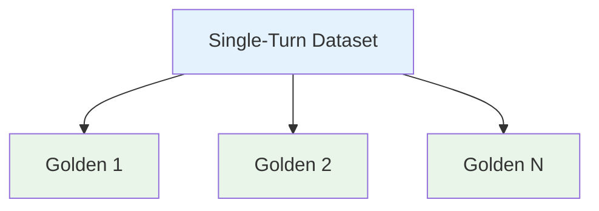
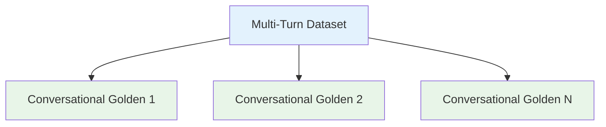

## Overview

A core functionality of the Evals API is to allow users to manipulate data on Confident AI without having to go through the UI. In this case, it is important to get a broad understanding how data terminologies and how they relate to one another.

## Trace Models

A trace represents the overall process of tracking and visualizing the execution flow of your LLM application. Each observed function creates a span, and many spans together make up a trace.

• **Trace**: Complete execution flow containing multiple spans representing an LLM request's full lifecycle.

• **Span**: Individual units of work (LLM calls, tool executions, retrievals) that compose a trace.

• **Thread**: Logical grouping of traces sharing execution context for organizing related operations, this will 99.9% be a conversation.

• **End User**: Human user interacting with the trace, which is usually also the consumer of the LLM application.

 

## Metric Models

A **metric** is responsible for computing evaluation scores, and a **metric collection** represents a group of related **metrics** that you want to evaluate together.

• **Metric**: A DeepEval metric - all of DeepEval's metrics are available through the Evals API.

• **Metric Settings**: Configuration options for how a metric within a metric collection should be evaluated, including the **thresold**, **strictness**, and whether to **include reasoning**.

• **Metric Collection**: A group of metrics that you wish to evaluate together (either for a test run or online evaluation).

 

 

<Note>
  Metric collections and metrics are connected in-directly via **metric
  settings**, which specifies the specific threshold, strictness, etc. of each
  metric in different collections.
</Note>

## Testing Models

A **test run** is a snapshot of your LLM app's performance at any point in time, and is represented by a collection of **test cases**. Each **test case** can have one or more **metric data**, which determines whether each test case has passed or failed.

<Tip>
  A combination of all your test cases and metric data in a test run ultimately
  forms the benchmark for you to quantify LLM app performance.
</Tip>

• **Test Run**: Collection of test cases, acts as a snapshot/benchmark of your LLM app at any point in time.

• **Test Case**: Represents interactions with your LLM app, and belongs to a test run. For single-turn use cases, this will be an `LLMTestCase`. For multi-turn use cases, this will be a `ConversationalTestCase`.

• **Metric Data**: A unit of computed metric data, and belongs to a test case. Contains data such as the metric score, reason, verbose logs, etc. for analysis.

 

 

Test runs can either be single or multi-turn. This means you cannot evaluate a combination of `LLMTestCase`s and `ConversationalTestCase`s, and metric data cannot act on both in a single test run.

## Dataset Models

A **dataset** is a collection of goldens, which at evaluation time will be used for creating test cases that are ready for evaluation.

• **Dataset**: Collection of goldens, can be multi-turn or single-turn.

• **Golden**: Similar to test cases, represents interactions with your LLM app. However, a golden does not contain the outcome/output of a particular interaction, there is not ready for evaluation. Datasets are either single-turn, contanining single-turn goldens:

 

 

Or multi-turn, containing multi-turn goldens:

 

 

Similar to test runs, dataset can either be single or multi-turn. This means you cannot add a `Golden` to a single-turn dataset, and vice versa.
