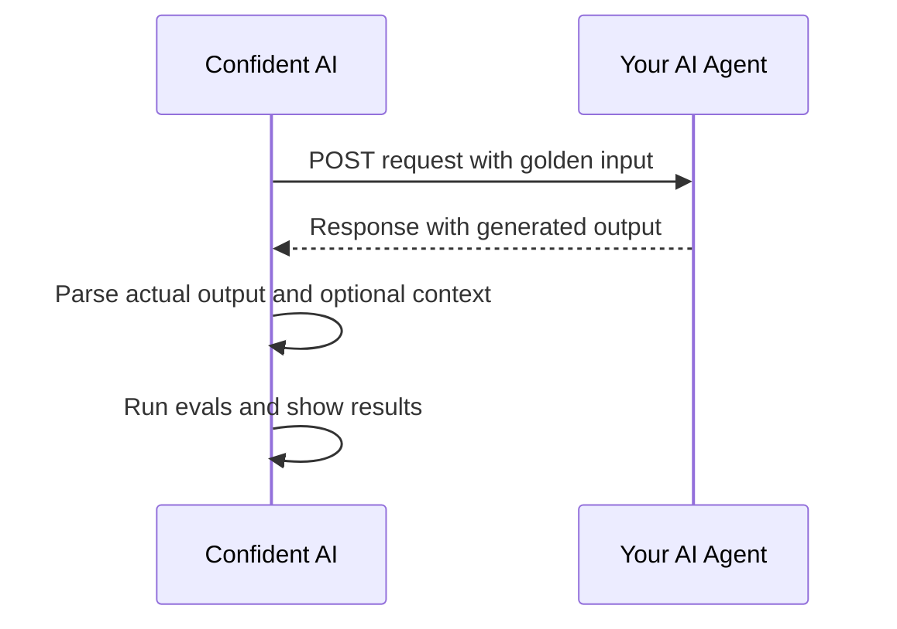

## Overview

[AI Connections](/docs/settings/project/ai-connections) let Confident AI call your AI agent directly from the platform. Once connected, you can run no-code evals, experiments, simulations, and red teaming without rewriting your application around a new interface.

Here's the flow: Confident AI sends a `POST` request to your endpoint, your AI app returns a response, and Confident AI extracts the fields needed for evaluation.



<Note>
  AI Connections are configured in **Project Settings** → **AI Connections**.
  For the full reference, see [AI Connections](/docs/settings/project/ai-connections).
</Note>

<Frame caption="Connect your AI agent to Confident AI" background="subtle">
  <video
    autoPlay
    loop
    muted
    playsInline
    src="https://confident-platform.s3.us-east-1.amazonaws.com/discovery%3Aai-connections%3A1-4k.mp4"
    type="video/mp4"
  />
</Frame>

## Connect Your AI Agent

<Steps>
  <Step title="Create a connection">
    In Confident AI, go to **Project Settings** → [**AI Connections**](/docs/settings/project/ai-connections#setting-up-an-ai-connection), click **New AI Connection**, and give the connection a clear name like `production-support-agent`.

    This name is what your team will select when running no-code evals or experiments against your agent.
  </Step>

  <Step title="Provide an endpoint">
    Add the [HTTPS endpoint](/docs/settings/project/ai-connections#ai-app-endpoint) that Confident AI should call. Your endpoint must accept `POST` requests and return the generated output from your AI app.

    ```text
    https://api.example.com/agent/generate
    ```

    Your endpoint can return a regular HTTP response, HTTP stream, or SSE stream. Start with **HTTP Response** unless your agent already streams output.
  </Step>

  <Step title="Configure the payload">
    Define the [request payload](/docs/settings/project/ai-connections#payload) Confident AI sends to your endpoint. At minimum, pass the golden input into the field your AI app expects.

    ```json
    {
      "input": golden.input,
      "context": golden.context,
      "metadata": golden.additional_metadata,
      "testCaseId": testCaseId
    }
    ```

    The payload can also include prompts, hyperparameters, conversation turns, or state for multi-turn simulations.

    <Note>
      For agent evaluation, use the payload to send inputs into your agent. The
      endpoint should generate the `actual_output`; do not pass a prefilled
      `golden.actual_output` as the answer unless you intentionally want to
      replay a static output.
    </Note>

    <Tip>
      Match your existing API contract. The goal is to adapt the AI Connection
      payload to your app, not to rebuild your app around Confident AI.
    </Tip>
  </Step>

  <Step title="Parse the output">
    Tell Confident AI where to find the generated answer in your endpoint response by setting the [**Actual Output Key Path**](/docs/settings/project/ai-connections#actual-output-key-path).

    If your endpoint returns:

    ```json
    {
      "response": {
        "message": "Paris is the capital of France."
      }
    }
    ```

    Set the actual output key path to:

    ```json
    ["response", "message"]
    ```

    You can also configure key paths for `retrieval_context`, `tools_called`, and multi-turn `state` when your metrics need them.
  </Step>

  <Step title="Test the connection">
    [Test your connection](/docs/settings/project/ai-connections#testing-your-connection) by clicking **Ping Endpoint** to send a test request. A successful ping confirms that Confident AI can reach your endpoint, send the payload, and parse the output.

    Done ✅ You now have an AI agent connected to Confident AI.
  </Step>
</Steps>

## Example Endpoint

Your endpoint can use any framework or language as long as it accepts the configured payload and returns a parseable response.

```python main.py
from fastapi import FastAPI

app = FastAPI()

@app.post("/agent/generate")
def generate(request: dict):
    user_input = request["input"]
    context = request.get("context", [])

    answer = run_agent(user_input=user_input, context=context)

    return {
        "response": {
            "message": answer
        }
    }
```

With the response above, set **Actual Output Key Path** to `["response", "message"]`.

## FAQs

<AccordionGroup>
  <Accordion title="How can non-engineers run no-code LLM evaluations on an AI agent?">
    In Confident AI, use [AI Connections](/docs/settings/project/ai-connections) to connect your agent once, then let product managers, QA teams, domain experts, or customer-facing teams run [no-code evals](/docs/llm-evaluation/no-code-evals/quickstart) from the platform. In the [Generating AI Outputs](/docs/llm-evaluation/no-code-evals/quickstart#generating-ai-outputs) step, select the AI Connection so Confident AI calls your deployed agent during the evaluation.

    This is the best fit when your team wants to:

    - Evaluate an AI app through a UI without writing Python or TypeScript
    - Review datasets, traces, outputs, and metric scores in one place
    - Test prompts, agents, and production-like endpoints before release
    - Run no-code red teaming with [risk assessments](/docs/red-teaming/no-code-assessments/quickstart#run-your-first-risk-assessment)

    Engineers still own the endpoint and payload contract, but non-engineers can run evaluations once the connection is configured.
  </Accordion>

  <Accordion title="How do I evaluate an AI agent with tool calls, RAG, or multi-step workflows?">
    In Confident AI, connect the full AI agent endpoint, not just the final LLM call. In the [no-code evaluation workflow](/docs/llm-evaluation/no-code-evals/single-turn-evals#run-an-evaluation), select your AI Connection as the output generation method so Confident AI can send dataset inputs to your app and score the generated responses.

    For RAG evaluation, return the answer plus retrieved context and configure the [Retrieval Context Key Path](/docs/settings/project/ai-connections#retrieval-context-key-path). For agent testing with tools, return tool-call information and configure the [Tool Call Key Path](/docs/settings/project/ai-connections#tool-call-key-path) so metrics can evaluate whether the agent selected the right tools and produced the right final response.

    If you also instrument the app with [LLM tracing](/docs/llm-tracing/introduction), you can inspect the underlying spans, tool calls, and intermediate steps behind each evaluation result.
  </Accordion>

  <Accordion title="How do I test multi-turn AI agents and chatbot simulations without writing eval code?">
    In Confident AI, use [multi-turn no-code evals](/docs/llm-evaluation/no-code-evals/multi-turn-evals) when your AI agent handles follow-ups, remembers context, or needs to satisfy an outcome over several turns. The [simulation workflow](/docs/llm-evaluation/no-code-evals/multi-turn-evals#controlling-simulations) lets you define the scenario, expected outcome, and simulated user behavior before running the evaluation.

    Confident AI can run simulations against your connected endpoint and call your agent once per turn. Use [multiturn state](/docs/settings/project/ai-connections#configure-multiturn-state) to preserve session details like a `threadId`, and include [`turnId`](/docs/settings/project/ai-connections#linking-turns-to-traces) when you want to link each simulated turn back to its trace. This helps you test context loss, incomplete handoffs, policy failures, and whether the agent reaches the expected outcome by the end of the conversation.
  </Accordion>

  <Accordion title="How do I compare prompts, models, tools, or agent configurations with evaluation metrics?">
    In Confident AI, use [experiments](/docs/llm-evaluation/experiments) to compare different agent configurations side by side. For prompt or AI Connection comparisons, use [Arena Experiments](/docs/llm-evaluation/experiments#arena-experiments) so each contestant generates outputs across the same dataset before Confident AI scores them with the same metrics.

    For runs you have already completed, use [Experiments with test runs](/docs/llm-evaluation/experiments#experiments-with-test-runs) to compare historical results. This is useful for controlled LLM experimentation, prompt variant testing, model comparisons, tool-selection changes, and regression testing before deploying a new agent version.
  </Accordion>

</AccordionGroup>

## Next Steps

Now that Confident AI can call your agent, you can start evaluating it from datasets, experiments, and no-code workflows.

<CardGroup cols={2}>
  <Card title="Run No-Code Evals" icon="browser" href="/docs/llm-evaluation/no-code-evals/quickstart">
    Build datasets and evaluate your connected agent directly from the platform.
  </Card>
  <Card title="AI Connections" icon="globe" href="/docs/settings/project/ai-connections">
    Configure authentication, streaming, transformers, state, and advanced parsing.
  </Card>
</CardGroup>
