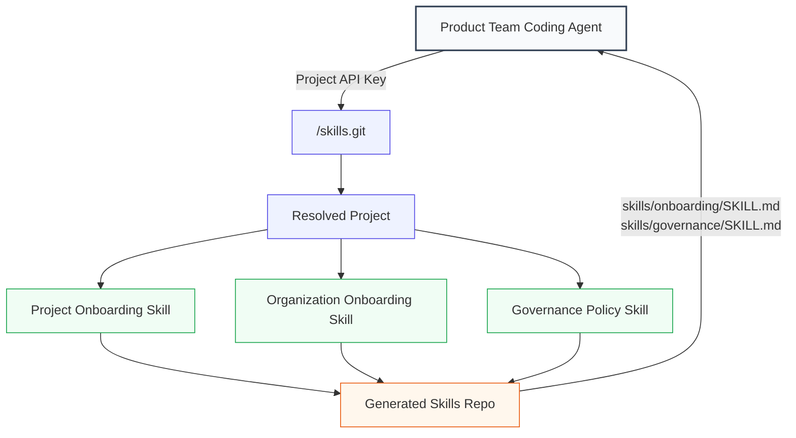

## Overview

This guide is for platform and governance teams that need a standardized way to onboard product teams into AI coding tools such as Claude Code, Codex, Cursor, Windsurf, and other agents that support the Agent Skills standard.

Instead of asking every team to copy local instruction files by hand, Confident AI can serve the right **Custom Agent Skills** for each project over git smart-HTTP at `/skills.git`. Product teams install the skills once with their **Project API Key**, and the endpoint returns a read-only repository tailored to that project.

In this guide, you will:

- **Publish onboarding guidance** from [Organization Settings](/docs/settings/organization/onboarding-skill), with project-specific routing.
- **Define governance guidance once** on the governance policy assigned to the project.
- **Install project-specific skills** into a coding agent with the Skills CLI.
- **Verify the generated repository** contains the expected `SKILL.md` files.

By the end, each product team can install the same URL pattern while receiving instructions that match their project and policy requirements.



## Build It

<Steps>

<Step title="Create your custom skills">

Create the Custom Agent Skills you want product teams to receive when they install from Confident AI.

Use an **onboarding** skill, managed from [Organization Settings](/docs/settings/organization/onboarding-skill), for project setup instructions such as:

- required package managers and setup commands
- repository conventions
- how to run tests, evals, and linters
- how to instrument traces and send results to Confident AI
- team-specific coding workflow expectations

Use a **governance** skill, defined once on a [governance policy](/docs/ai-governance/policies), for policy requirements such as:

- required eval gates before merge
- trace, alert, and risk assessment requirements
- approved model, data handling, and release practices
- what the coding agent should check before changing AI behavior

Each generated skill uses the stored skill `description` as the `SKILL.md` frontmatter description and the stored skill `body` as the markdown body.

</Step>

<Step title="Configure onboarding in Organization Settings">

Confident AI resolves the `onboarding` skill in this order:

1. Use the project's onboarding skill when the project has one.
2. Otherwise, fall back to the organization's onboarding skill.

Configure the organization-level onboarding skill from [Organization Settings](/docs/settings/organization/onboarding-skill). This lets platform teams define a default onboarding skill once, then override it only for projects with special requirements.

<Tip>
  Keep organization onboarding broad and stable. Put team-specific setup, service owners, local commands, and repository constraints in the project onboarding skill.
</Tip>

</Step>

<Step title="Define governance once on the policy">

Confident AI resolves the `governance` skill from the [governance policy](/docs/ai-governance/policies) assigned to the project.

Define the governance skill once on the policy, then assign projects to that policy. Any project governed by the policy receives the same `skills/governance/SKILL.md` content when its Project API Key is used.

<Note>
  Governance skills are policy-driven, so coding agents receive the same instructions as every other project governed by that policy.
</Note>

</Step>

<Step title="Install skills in a coding agent">

Give the product team their Project API Key and your Confident AI host. They must install one skill at a time with the Skills CLI by specifying the skill name with `--skill`:

```bash
npx skills add "https://apikey:PROJECT_API_KEY@<host>/skills.git" --skill onboarding
npx skills add "https://apikey:PROJECT_API_KEY@<host>/skills.git" --skill governance
```

Use `--skill onboarding` for the onboarding skill and `--skill governance` for the governance skill.

The username in HTTP Basic auth is ignored. The password field carries the Project API Key, so the URL uses `apikey` only as a conventional placeholder username.

For a local git verification, the same endpoint can be cloned directly:

```bash
git clone https://apikey:PROJECT_API_KEY@<host>/skills.git
```

<Warning>
  Treat Project API Keys like secrets. Do not commit install commands containing real keys to source control, shell history snippets, tickets, or shared docs.
</Warning>

</Step>

<Step title="Verify the generated repo">

After cloning or installing, confirm the repository includes the skills resolved for that project:

```text
skills/
  onboarding/
    SKILL.md
  governance/
    SKILL.md
```

Open each `SKILL.md` and check that:

- the onboarding skill matches the content configured from [Organization Settings](/docs/settings/organization/onboarding-skill) or a project-specific override
- the governance skill matches the [governance policy](/docs/ai-governance/policies) assigned to the project
- the markdown gives the coding agent concrete commands, checks, and project expectations

When a coding agent starts work, it can read these skills and apply the same onboarding and governance guidance across product teams.

</Step>

</Steps>

## How Authentication and Routing Work

The `/skills.git` endpoint is read-only and served over git smart-HTTP. Authentication uses HTTP Basic auth:

- the username is ignored
- the password must be a Project API Key
- the key is resolved with the same cache and database lookup used by the public API
- the resolved key determines the project and organization used to build the repository

Once authenticated, Confident AI resolves skills from the `Skill` table:

- `onboarding` uses the project skill first, then falls back to the organization skill.
- `governance` uses the skill defined on the [governance policy](/docs/ai-governance/policies) assigned to the project.

The server writes one `skills/<name>/SKILL.md` file for each resolved skill, serves the temporary repository with `git upload-pack --stateless-rpc`, and deletes the temporary repository after the response ends.

## Rollout Pattern

For a large organization, start with one organization-level onboarding skill from [Organization Settings](/docs/settings/organization/onboarding-skill) and one governance skill per [governance policy](/docs/ai-governance/policies). Then pilot project-level onboarding overrides with a few teams that have special setup needs.

Once the content is stable, product teams can use the same install pattern for every project:

```bash
npx skills add "https://apikey:PROJECT_API_KEY@<host>/skills.git" --skill onboarding
npx skills add "https://apikey:PROJECT_API_KEY@<host>/skills.git" --skill governance
```

The Project API Key is the router. Teams do not need to remember which repo, branch, or file path contains their instructions; Confident AI serves the right skill content for the project behind the key.

## Next Steps

<CardGroup cols={2}>
  <Card title="AI Governance" icon="scale-balanced" href="/docs/ai-governance/introduction">
    Define policies and controls that standardize how teams build and release AI applications.
  </Card>
  <Card title="Policies" icon="file-shield" href="/docs/ai-governance/policies">
    Assign projects to governance policies so coding agents receive the right governance skill.
  </Card>
  <Card title="Onboarding Skill" icon="sparkles" href="/docs/settings/organization/onboarding-skill">
    Define the organization-wide onboarding instructions coding agents receive by default.
  </Card>
  <Card title="Provision Projects for Agents on the Fly" icon="layer-group" href="/docs/guides/multi-tenant-project-isolation">
    Create projects programmatically and hand each team the Project API Key that routes traces and skills.
  </Card>
  <Card title="LLM Tracing" icon="route" href="/docs/llm-tracing/quickstart">
    Use Custom Agent Skills to help coding agents instrument applications and send traces to Confident AI.
  </Card>
</CardGroup>
