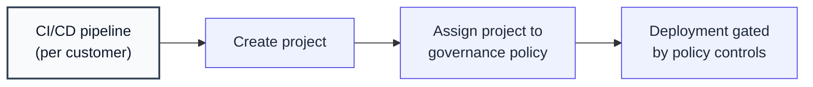

## Overview

This guide is for teams running [AI governance](/docs/ai-governance/introduction) at scale — typically one Confident AI project per customer or per agent — that need every project enrolled into a governance policy **automatically**, without anyone clicking through the platform UI.

It builds directly on [Provision Projects for Agents on the Fly](/docs/guides/multi-tenant-project-isolation): once your pipeline creates a project, the next step is to enroll that project into the governance policy that gates its deployment. A governance policy is organization-scoped (a named bundle of controls), and **each project belongs to at most one policy**.

In this guide, you will:

- **Configure the Admin SDK** with one Organization API Key.
- **Find the target governance policy** by name.
- **Assign the project to the policy** in code, as part of your pipeline.
- **Verify enrollment** by reading the project's policy back.



## Build It

<Steps>

<Step title="Install the Admin SDK">

Governance policies are managed with the `confidentai` Admin SDK.

<Tabs>

<Tab title="Python" language="python">

```bash
pip install confidentai
```

</Tab>

<Tab title="TypeScript" language="typescript">

```bash
npm install confidentai
```

</Tab>

</Tabs>

</Step>

<Step title="Configure the Admin SDK">

<Warning>

You need an **Organization API Key** before you start. [Retrieve yours here](/docs/api-reference/authentication#organization-level-auth).

</Warning>

Set `CONFIDENT_ORG_API_KEY` to your Organization API Key. The Admin SDK reads this variable by default when you create a client.

```bash
export CONFIDENT_ORG_API_KEY="confident_us_org_..."
```

<Tabs>

<Tab title="Python" language="python">

```python title="ci/confident.py"
from confidentai import ConfidentAI

confident_ai = ConfidentAI()
```

</Tab>

<Tab title="TypeScript" language="typescript">

```typescript title="ci/confident.ts"
import { ConfidentAI } from "confidentai";

export const confidentAI = new ConfidentAI();
```

</Tab>

</Tabs>

</Step>

<Step title="Find the Target Policy">

Governance policies are created and configured (with their controls) in the platform UI. From code, list them and pick the one your deployment should be gated by — usually by name.

<Tabs>

<Tab title="Python" language="python">

```python title="ci/governance.py" {6-10}
from ci.confident import confident_ai

def find_policy_id(policy_name: str) -> str:
    policies = confident_ai.organization().governance.policies.list()
    for policy in policies:
        if policy.name == policy_name:
            return policy.id
    raise ValueError(f"No governance policy named {policy_name!r}")
```

</Tab>

<Tab title="TypeScript" language="typescript">

```typescript title="ci/governance.ts" {6-11}
import { confidentAI } from "./confident";

export async function findPolicyId(policyName: string): Promise<string> {
  const policies = await confidentAI.organization().governance.policies.list();
  const policy = policies.find((p) => p.name === policyName);
  if (!policy) {
    throw new Error(`No governance policy named ${policyName}`);
  }
  return policy.id;
}
```

</Tab>

</Tabs>

<Tip>

Each policy in the list includes its `controls` and a `projectsCount`. To page through the projects already enrolled in a policy, use `governance.policies.list_projects(policy_id)` (TypeScript: `governance.policies.listProjects(policyId)`).

</Tip>

</Step>

<Step title="Assign the Project">

Assign the project to the policy. Assignment is **additive**: the listed projects are moved onto this policy (any that were on a different policy are moved over), while the policy's other projects are left untouched. The returned `count` is the number of projects **actually moved** — re-assigning an already-enrolled project returns `0`, which makes this safe to run on every pipeline execution.

<Tabs>

<Tab title="Python" language="python">

```python title="ci/enroll.py" {7-10}
from ci.confident import confident_ai
from ci.governance import find_policy_id

def enroll_project(project_id: str, policy_name: str = "Production Gate") -> int:
    policy_id = find_policy_id(policy_name)
    result = confident_ai.organization().governance.policies.assign(
        policy_id, project_ids=[project_id]
    )
    return result.count
```

</Tab>

<Tab title="TypeScript" language="typescript">

```typescript title="ci/enroll.ts" {7-12}
import { confidentAI } from "./confident";
import { findPolicyId } from "./governance";

export async function enrollProject(
  projectId: string,
  policyName = "Production Gate",
): Promise<number> {
  const policyId = await findPolicyId(policyName);
  const result = await confidentAI
    .organization()
    .governance.policies.assign(policyId, { projectIds: [projectId] });
  return result.count;
}
```

</Tab>

</Tabs>

<Tip>

To remove projects from a policy (for example when deprovisioning a customer), use `governance.policies.unassign(policyId, ...)` with the same shape.

</Tip>

</Step>

<Step title="Verify Enrollment">

Read the project back and confirm it is enrolled. Every project returned by `projects.list()` (and `project(id).get()`) includes its `governancePolicy` — `{ id, name }` when enrolled, or `null` when not.

<Tabs>

<Tab title="Python" language="python">

```python
from ci.confident import confident_ai

project = confident_ai.project("project-uuid-1").get()
print(project.governance_policy)  # NamedRef(id="...", name="Production Gate")
```

</Tab>

<Tab title="TypeScript" language="typescript">

```typescript
import { confidentAI } from "./confident";

const project = await confidentAI.project("project-uuid-1").get();
console.log(project.governancePolicy); // { id: "...", name: "Production Gate" }
```

</Tab>

</Tabs>

Done! Your pipeline now enrolls each project into the right governance policy using a single Organization API Key.

</Step>

</Steps>

## Next Steps

<CardGroup cols={2}>
  <Card
    title="Provision Projects on the Fly"
    icon="layer-group"
    href="/docs/guides/multi-tenant-project-isolation"
  >
    Create a dedicated project per customer or agent — the step before enrollment.
  </Card>
  <Card
    title="AI Governance"
    icon="building-columns"
    href="/docs/ai-governance/introduction"
  >
    Configure governance policies and the controls that gate your deployments.
  </Card>
  <Card
    title="List Governance Policies"
    icon="code"
    href="/docs/api-reference"
  >
    See the governance-policy endpoints in the API reference under Organization data models.
  </Card>
  <Card
    title="Manage Projects"
    icon="folder"
    href="/docs/settings/project/management/projects"
  >
    Update and clean up the projects your pipeline creates.
  </Card>
</CardGroup>
