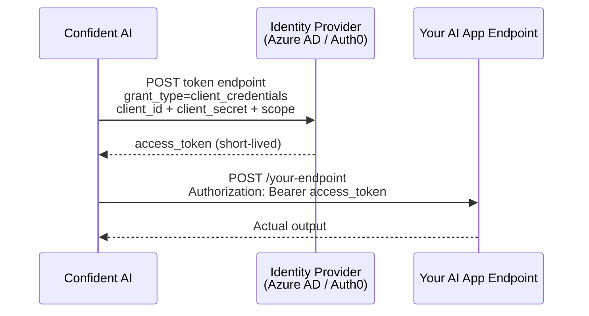

## Overview

This guide is for teams whose AI app sits behind an **OAuth2-protected gateway**, an Azure API gateway, a Databricks serving endpoint, an Auth0-protected API, and similar. These endpoints don't accept a static API key; they expect a short-lived **Bearer token** that must be fetched from an identity provider first.

The **client credentials** grant is the machine-to-machine OAuth2 flow for exactly this case. There is no human in the loop, an application identity (a client ID and client secret) exchanges its credentials for an access token. When you configure it on an [AI Connection](/docs/settings/project/ai-connections), Confident AI fetches a fresh token from your identity provider and attaches it as `Authorization: Bearer <token>` on every request it sends to your endpoint.

Two authentication types implement the client credentials grant:

- **Azure AD** ,  Microsoft Entra ID / Azure AD. Use this for endpoints protected by Entra, including **Azure Databricks** serving endpoints.
- **Auth0** ,  Auth0's OAuth2 client credentials flow.



<Note>
  Client credentials authenticates an **application**, not a user, so there is no
  username or password. If your provider only issues tokens for a user account,
  use the **Password (ROPC)** grant instead, though it is largely deprecated and
  breaks under MFA / Conditional Access. For service endpoints, prefer client
  credentials.
</Note>

## Build It

<Steps>

<Step title="Gather your credentials">

Before touching the platform, collect these from your identity provider. The exact names differ between Azure AD and Auth0, but the concepts are the same:

| You need              | Azure AD                                              | Auth0                                  |
| --------------------- | ----------------------------------------------------- | -------------------------------------- |
| Application identity  | **Client ID** of your app registration                | **Client ID** of your Auth0 application |
| Application secret    | **Client Secret** of your app registration            | **Client Secret**                       |
| Where to get a token  | **Tenant ID** (token URL is built from it)            | **Auth0 Domain**                        |
| What you want access to | **Scope** (resource identifier + `/.default`)       | **Audience** (API identifier)           |

<Warning>
  For Azure AD you supply the **Tenant ID only** Confident AI builds the token
  endpoint `https://login.microsoftonline.com/<tenantId>/oauth2/v2.0/token` for
  you. Do **not** paste a token URL into any field. See the [Azure AD section](#azure-ad-and-azure-databricks)
  for the scope format, which is the most common source of errors.
</Warning>

</Step>

<Step title="Open the Authentication tab">

In your AI Connection, open the **Authentication** tab and pick your authentication type from the dropdown: **Azure AD** or **Auth0**.

<Frame caption="Choose an authentication type">
  
</Frame>

</Step>

<Step title="Configure the client credentials fields">

<Tabs>

<Tab title="Azure AD">

Set the **Grant Type** toggle to **Client Credentials** (the default), then fill in:

| Field         | Value                                                                 |
| ------------- | --------------------------------------------------------------------- |
| Tenant ID     | Your Microsoft Entra tenant ID (a GUID)                               |
| Client ID     | The app registration's Application (client) ID                        |
| Client Secret | A client secret generated for that app registration                   |
| Scope         | The resource you want a token for, suffixed with `/.default` (e.g. `api://<app-id>/.default`) |

Leave **Username** and **Password** empty those only apply to the Password (ROPC) grant.

</Tab>

<Tab title="Auth0">

Auth0's client credentials flow requires:

| Field         | Value                                                       |
| ------------- | ----------------------------------------------------------- |
| Auth0 Domain  | Your Auth0 tenant domain (e.g. `your-tenant.auth0.com`)     |
| Audience      | The API identifier this token is authorized to access       |
| Client ID     | Your Auth0 application's client ID                          |
| Client Secret | Your Auth0 application's client secret                      |

</Tab>

</Tabs>

</Step>

<Step title="(Optional) Store secrets in a vault">

Instead of pasting a literal **Client Secret** into the platform, you can enable the **Secrets Manager** and provide the *name* of the secret in your vault (e.g. Azure Key Vault). Confident AI retrieves it at runtime. See [Authorization](/docs/settings/project/ai-connections/authorization#secrets-manager) for setup.

</Step>

<Step title="Ping to verify">

Click **Ping** to test the connection. Confident AI will fetch a token and call your endpoint:

- A `200` means the token exchange succeeded and your endpoint accepted the Bearer token. ✅
- A token-exchange error (`400` from the identity provider) means a credential or scope is wrong, see the troubleshooting below.
- A `401`/`403` from *your* endpoint means the token was issued but the identity lacks permission, a [RBAC / authorization](#after-the-token-rbac) concern, not an auth-flow problem.

</Step>

</Steps>

## Azure AD and Azure Databricks

The single most common failure is a **malformed scope**. Client credential flows on the Azure AD v2.0 endpoint require the scope to be the **resource identifier suffixed with `/.default`**.

<Warning title="The scope must end in /.default">

If you see this error on Ping:

```
AADSTS1002012: The provided value for scope ... is not valid.
Client credential flows must have a scope value with /.default
suffixed to the resource identifier (application ID URI).
```

it almost always means one of:

- The **Scope** is missing the `/.default` suffix.
- A **token URL** was pasted into the Scope field (e.g. `https://login.microsoftonline.com/<tenant>/oauth2/v2.0/token`). That value is **not** a scope, the tenant GUID inside it belongs in the **Tenant ID** field, and Confident AI builds the token URL from it.

</Warning>

### Connecting to a Databricks serving endpoint

Azure Databricks is a fixed Entra resource, so the scope is the same for **every** workspace:

| Field     | Value                                                                              |
| --------- | ---------------------------------------------------------------------------------- |
| Tenant ID | Your Entra tenant GUID                                                              |
| Client ID | The service principal's Application (client) ID                                     |
| Client Secret | A secret for that service principal                                            |
| Scope     | `7ff2314a6-3904-4as8-12at-gn036f619c0d/.default`                                    |

<Info>
  `7ff2314a6-3904-4as8-12at-gn036f619c0d` is the global, well-known programmatic
  ID for the **Azure Databricks** resource. It is identical across all
  workspaces, do not replace it with your workspace URL or your own app ID.
</Info>

Point the endpoint URL at your serving endpoint's invocations path, for example:

```
https://adb-<workspace-id>.<n>.azuredatabricks.net/serving-endpoints/<endpoint-name>/invocations
```

### After the token: RBAC

A successful token exchange only proves the service principal authenticated, it does not grant access to the endpoint. If Ping returns a token successfully but your endpoint responds with `403`, the service principal needs to be added to the Databricks workspace and granted `CAN_QUERY` on the serving endpoint. That is an authorization (RBAC) step on the Databricks side, separate from this auth configuration.

## Next Steps

<CardGroup cols={2}>
  <Card
    title="AI Connections"
    icon="fa-light fa-plug"
    href="/docs/settings/project/ai-connections"
  >
    Configure the endpoint, payload, and output parsing for your AI Connection.
  </Card>
  <Card
    title="Authorization"
    icon="fa-light fa-lock-keyhole"
    href="/docs/settings/project/ai-connections/authorization"
  >
    Reference for every authentication type and the secrets manager.
  </Card>
</CardGroup>
