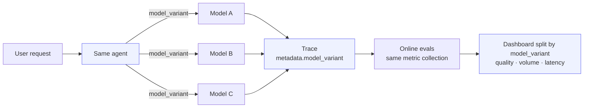

## Overview

You can compare one deployed agent across multiple models by logging the model choice as **trace metadata**. Confident AI can then run the same online metrics for every trace and build dashboards that filter, split, and trend results by that metadata.

This guide shows the pattern across OpenAI Agents, LangGraph, Vercel AI SDK, and [Strands Agents](/docs/integrations/third-party/strands). The core idea is always the same: every request emits a trace, every trace includes a stable `model_variant`, and every model variant is scored by the same metric collection.



<Note>

`model_variant` is the short, human-readable label you pick (`gpt-4o`, `nova-pro`, `claude-sonnet`) — the dimension every dashboard breaks down by. `model_id` is the exact provider model string behind it. You compare on `model_variant` and keep `model_id` for auditability.

</Note>

Here's the thing: the model name captured on an LLM span is useful for debugging, but it is often too provider-specific to analyze — and it lives on the span, not the trace. Promoting a stable `model_variant` to the trace gives every dashboard one clean, product-level dimension to break down, filter, and trend by, even if the underlying provider model ID changes.

This same pattern compares far more than models. Anything you can label on a trace — prompt versions, temperature, retrievers, tool sets — can be compared the exact same way. See [Compare Any Parameter](#compare-any-parameter) to repeat this guide for a different variable.

<Note>

This guide is for **observing model variants from deployed traffic**. If you need a controlled comparison where the same dataset is run through multiple models, use [Experiments](/docs/llm-evaluation/experiments) or [Arena](/docs/llm-evaluation/no-code-evals/arena) with one AI Connection configuration per model variant.

</Note>

## What You'll Build

By the end, you will have:

- A traced agent that records `model_variant` and `model_id` on every trace.
- A repeatable command to generate comparison traffic for each model variant.
- A metric collection that scores every variant with the same criteria.
- A dashboard that compares quality, trace volume, and latency across variants.
- A clear read of which model wins, not just on one lucky slice of traffic.

<Frame caption="The final dashboard compares model quality, traffic, and latency side by side">
  
</Frame>

## Prerequisites

You need a Confident AI project, a project API key, and credentials for whichever model provider your agent calls. For OpenAI-based examples, set `OPENAI_API_KEY`. For the Strands example, configure AWS credentials with access to the Bedrock model IDs you use.

Install the packages for the integration you are using:

<Tabs>
<Tab title="OpenAI Agents" language="openai-agents">

```bash title="Install dependencies"
python -m venv .venv
source .venv/bin/activate
pip install -U deepeval openai-agents
```

</Tab>
<Tab title="LangGraph" language="langgraph">

```bash title="Install dependencies"
python -m venv .venv
source .venv/bin/activate
pip install -U deepeval langgraph langchain langchain-openai
```

</Tab>
<Tab title="Vercel AI SDK" language="vercel-ai-sdk">

```bash title="Install dependencies"
npm install deepeval ai @ai-sdk/openai
npm install -D tsx
```

</Tab>
<Tab title="Strands Agents" language="strands">

```bash title="Install dependencies"
python -m venv .venv
source .venv/bin/activate
pip install -U deepeval strands-agents opentelemetry-sdk opentelemetry-exporter-otlp-proto-http
```

</Tab>
</Tabs>

Then configure your project and provider credentials for that same integration:

<Tabs>
<Tab title="OpenAI Agents" language="openai-agents">

```bash title="Configure credentials"
export CONFIDENT_API_KEY="confident_us..."
export OPENAI_API_KEY="sk-..."
```

</Tab>
<Tab title="LangGraph" language="langgraph">

```bash title="Configure credentials"
export CONFIDENT_API_KEY="confident_us..."
export OPENAI_API_KEY="sk-..."
```

</Tab>
<Tab title="Vercel AI SDK" language="vercel-ai-sdk">

```bash title="Configure credentials"
export CONFIDENT_API_KEY="confident_us..."
export OPENAI_API_KEY="sk-..."
```

</Tab>
<Tab title="Strands Agents" language="strands">

```bash title="Configure credentials"
export CONFIDENT_API_KEY="confident_us..."
export AWS_REGION="us-east-1"
export AWS_PROFILE="your-aws-profile"
```

</Tab>
</Tabs>

For EU projects, point OpenTelemetry export to the EU endpoint:

```bash title="EU OTEL endpoint"
export CONFIDENT_OTEL_URL="https://eu.otel.confident-ai.com"
```

<Warning>

Use the **same `CONFIDENT_API_KEY`** for every model variant you want on the same dashboard. If one service instance writes to a different project, its traces and online eval scores will not appear in the comparison.

</Warning>

## Set Up Tracing

Tracing is what feeds every dashboard in this guide. In three steps, you'll instrument the agent so each request emits a trace tagged with `model_variant`, attach the metric collection that scores every variant, and verify the data shape before building any widgets.

### Instrument the Agent

The most important implementation detail is where you attach metadata. Add `model_variant` to the **trace**, not just the LLM span, because dashboards commonly aggregate at the trace level: average trace score, trace count, trace latency, and trace-level online eval results.

<Steps>

<Step title="Create the traced agent">

Create a small agent module that accepts a normalized model variant, resolves it to the provider model ID, runs the agent, and records both names on the current trace.

Each integration below emits the same dashboard keys: `model_variant`, `model_id`, `agent`, `agent_version`, `rollout`, and `environment`.

<Tabs>
<Tab title="OpenAI Agents" language="openai-agents">

Use OpenAI Agents' `trace` context to wrap the run, then call `update_current_trace` after the agent returns.

```python title="openai_agents_model_compare.py"
import os
import sys

from agents import Agent, Runner, add_trace_processor, trace
from deepeval.openai_agents import DeepEvalTracingProcessor
from deepeval.tracing import update_current_trace

add_trace_processor(DeepEvalTracingProcessor())

MODEL_MAP = {"gpt-4o-mini": "gpt-4o-mini", "gpt-4o": "gpt-4o", "gpt-4.1": "gpt-4.1"}


def run_agent(user_input: str, model_variant: str) -> str:
    model_id = MODEL_MAP[model_variant]
    agent = Agent(
        name="Support Agent",
        instructions="Answer support questions clearly and safely.",
        model=model_id,
    )

    with trace(workflow_name="support-agent"):
        output = Runner.run_sync(agent, user_input).final_output
        update_current_trace(
            input=user_input,
            output=output,
            metric_collection="Agent Quality",
            metadata={
                "agent": "support-agent",
                "agent_version": os.getenv("AGENT_VERSION", "v2"),
                "model_variant": model_variant,
                "model_id": model_id,
                "rollout": os.getenv("ROLLOUT_NAME", "model-comparison"),
                "environment": os.getenv("APP_ENV", "production"),
            },
        )
        return output


if __name__ == "__main__":
    print(run_agent(sys.argv[2], sys.argv[1]))
```

</Tab>
<Tab title="LangGraph" language="langgraph">

LangGraph uses the Confident AI callback handler. Put `metric_collection` and `metadata` on the handler so they apply to the root trace created by the graph invocation.

```python title="langgraph_model_compare.py"
import os
import sys

from langchain.agents import create_agent
from langchain_openai import ChatOpenAI
from deepeval.integrations.langchain import CallbackHandler

MODEL_MAP = {"gpt-4o-mini": "gpt-4o-mini", "gpt-4o": "gpt-4o", "gpt-4.1": "gpt-4.1"}


def run_agent(user_input: str, model_variant: str) -> str:
    model_id = MODEL_MAP[model_variant]
    agent = create_agent(
        model=ChatOpenAI(model=model_id),
        tools=[],
        system_prompt="Answer support questions clearly and safely.",
    )

    result = agent.invoke(
        input={"messages": [{"role": "user", "content": user_input}]},
        config={
            "callbacks": [
                CallbackHandler(
                    name="support-agent",
                    metric_collection="Agent Quality",
                    metadata={
                        "agent": "support-agent",
                        "agent_version": os.getenv("AGENT_VERSION", "v2"),
                        "model_variant": model_variant,
                        "model_id": model_id,
                        "rollout": os.getenv("ROLLOUT_NAME", "model-comparison"),
                        "environment": os.getenv("APP_ENV", "production"),
                    },
                )
            ]
        },
    )
    return result["messages"][-1].content


if __name__ == "__main__":
    print(run_agent(sys.argv[2], sys.argv[1]))
```

</Tab>
<Tab title="Vercel AI SDK" language="vercel-ai-sdk">

For the Vercel AI SDK, configure the Confident AI tracer once, then wrap each generation in `setTracingContext`. The model variant is passed both to the model selector and to trace metadata.

```typescript title="vercel-ai-model-compare.ts"
import { generateText } from "ai";
import { openai } from "@ai-sdk/openai";
import { configureAiSdkTracing } from "deepeval";
import { setTracingContext } from "deepeval/tracing";

const tracer = configureAiSdkTracing({
  environment: process.env.APP_ENV ?? "production",
  name: "support-agent",
});

const modelMap: Record<string, string> = {
  "gpt-4o-mini": "gpt-4o-mini",
  "gpt-4o": "gpt-4o",
  "gpt-4.1": "gpt-4.1",
};

export async function runAgent(input: string, modelVariant: string) {
  const modelId = modelMap[modelVariant];

  return setTracingContext(
    {
      metricCollection: "Agent Quality",
      metadata: {
        agent: "support-agent",
        agent_version: process.env.AGENT_VERSION ?? "v2",
        model_variant: modelVariant,
        model_id: modelId,
        rollout: process.env.ROLLOUT_NAME ?? "model-comparison",
        environment: process.env.APP_ENV ?? "production",
      },
    },
    async () => {
      const { text } = await generateText({
        model: openai(modelId),
        prompt: input,
        experimental_telemetry: { isEnabled: true, tracer },
      });
      return text;
    },
  );
}

if (import.meta.url === `file://${process.argv[1]}`) {
  const [variant, ...rest] = process.argv.slice(2);
  runAgent(rest.join(" "), variant).then((text) => console.log(text));
}
```

</Tab>
<Tab title="Strands Agents" language="strands">

For Strands, call `instrument_strands` once at startup. Strands captures the LLM and tool spans automatically, while `update_current_trace` adds the normalized comparison metadata to the trace.

```python title="strands_model_compare.py"
import os
import sys

from deepeval.integrations.strands import instrument_strands
from deepeval.tracing import observe, update_current_trace
from strands import Agent

instrument_strands(name="support-agent", environment=os.getenv("APP_ENV", "production"))

MODEL_MAP = {
    "nova-lite": "us.amazon.nova-lite-v1:0",
    "nova-pro": "us.amazon.nova-pro-v1:0",
    "claude-sonnet": "us.anthropic.claude-3-5-sonnet-20241022-v2:0",
}


@observe(name="support-agent")
def run_agent(user_input: str, model_variant: str) -> str:
    model_id = MODEL_MAP[model_variant]
    output = str(Agent(model=model_id)(user_input))

    update_current_trace(
        input=user_input,
        output=output,
        metric_collection="Agent Quality",
        metadata={
            "agent": "support-agent",
            "agent_version": os.getenv("AGENT_VERSION", "v2"),
            "model_variant": model_variant,
            "model_id": model_id,
            "rollout": os.getenv("ROLLOUT_NAME", "model-comparison"),
            "environment": os.getenv("APP_ENV", "production"),
        },
    )
    return output


if __name__ == "__main__":
    print(run_agent(sys.argv[2], sys.argv[1]))
```

</Tab>
</Tabs>

Metadata keys can be any string you want — `model_variant` and `model_id` are just the ones we use for this example. Here, `model_variant` is the short, human-readable label you compare on, and `model_id` is the exact provider value kept for auditability, even if it is noisy. Name your keys whatever is most useful for you.

</Step>

<Step title="Run a local trace">

Send one request per variant to confirm traces reach Confident AI with the right metadata. Each script takes the variant and the input as positional arguments.

<Tabs>
<Tab title="OpenAI Agents" language="openai-agents">

```bash title="Run OpenAI Agents traces"
export CONFIDENT_TRACE_FLUSH=1
export AGENT_VERSION="v2"
export ROLLOUT_NAME="model-comparison-smoke-test"
export APP_ENV="production"

for model in gpt-4o-mini gpt-4o gpt-4.1; do
  python openai_agents_model_compare.py "$model" \
    "A customer says their invoice doubled after upgrading. Explain what to check first."
done
```

</Tab>
<Tab title="LangGraph" language="langgraph">

```bash title="Run LangGraph traces"
export CONFIDENT_TRACE_FLUSH=1
export AGENT_VERSION="v2"
export ROLLOUT_NAME="model-comparison-smoke-test"
export APP_ENV="production"

for model in gpt-4o-mini gpt-4o gpt-4.1; do
  python langgraph_model_compare.py "$model" \
    "A customer says their invoice doubled after upgrading. Explain what to check first."
done
```

</Tab>
<Tab title="Vercel AI SDK" language="vercel-ai-sdk">

```bash title="Run Vercel AI SDK traces"
export AGENT_VERSION="v2"
export ROLLOUT_NAME="model-comparison-smoke-test"
export APP_ENV="production"

for model in gpt-4o-mini gpt-4o gpt-4.1; do
  npx tsx vercel-ai-model-compare.ts "$model" \
    "A customer says their invoice doubled after upgrading. Explain what to check first."
done
```

</Tab>
<Tab title="Strands Agents" language="strands">

```bash title="Run Strands traces"
export AGENT_VERSION="v2"
export ROLLOUT_NAME="model-comparison-smoke-test"
export APP_ENV="production"

for model in nova-lite nova-pro claude-sonnet; do
  python strands_model_compare.py "$model" \
    "A customer says their invoice doubled after upgrading. Explain what to check first."
done
```

</Tab>
</Tabs>

<Warning>

Short-lived scripts often exit before traces finish posting. For the DeepEval SDK integrations (OpenAI Agents and LangGraph), set `CONFIDENT_TRACE_FLUSH=1` to flush traces synchronously before the process exits. Strands exports spans in real time and the Vercel AI SDK tracer flushes on shutdown, so they don't need it.

</Warning>

<Frame caption="Traces appear in the Observatory as soon as the agent runs">
  <video data-video="tracing.traces" controls />
</Frame>

Done ✅. You now have at least one trace per model variant.

</Step>

</Steps>

### Create Metrics

Use the same metric collection for every model variant so each is scored against identical criteria. Your project's [evaluation model](/docs/settings/project/evaluation-models) — the LLM judge — is shared across every collection, so the judge itself is already consistent. The trap is scoring `gpt-4o-mini` and `gpt-4o` with different collections: you would be trending scores from two different rubrics, so the dashboard is no longer an apples-to-apples comparison.

<Steps>

<Step title="Create a metric collection">

Open **Project** > **Metrics** > **Collections**, create a collection named `Agent Quality`, and add trace-level metrics that match the agent's job.

<Frame
  caption="Create the metric collection that every model variant will use"
  background="subtle"
>
  <video
    autoPlay
    loop
    muted
    data-video="metrics.createCollection"
    type="video/mp4"
  />
</Frame>

For a support agent, a strong starting collection is:

- **Task Completion** for whether the answer solved the user's request.
- **Answer Relevancy** for whether the response stayed focused.
- A custom **G-Eval** metric for your product-specific standard, such as "support policy compliance" or "escalation quality".

<Warning>

Online evals only run referenceless metrics during tracing. Metrics that require `expected_output`, `expected_tools`, or other reference data are better for offline test runs, Arena, or Experiments.

</Warning>

</Step>

<Step title="Attach the collection in code">

The earlier examples attach `Agent Quality` in the integration-specific trace context. That means every trace receives the same online eval collection, even though the exact API differs by framework.

<Tabs>
<Tab title="OpenAI Agents" language="openai-agents">

OpenAI Agents sets the trace-level collection with `update_current_trace`:

```python title="openai_agents_model_compare.py" {4}
update_current_trace(
    input=user_input,
    output=output,
    metric_collection="Agent Quality",
)
```

</Tab>
<Tab title="LangGraph" language="langgraph">

LangGraph sets the trace-level collection on `CallbackHandler`:

```python title="langgraph_model_compare.py" {3}
CallbackHandler(
    name="support-agent",
    metric_collection="Agent Quality",
    metadata={"model_variant": model_variant, "model_id": model_id},
)
```

</Tab>
<Tab title="Vercel AI SDK" language="vercel-ai-sdk">

The Vercel AI SDK example sets the trace-level collection inside `setTracingContext`:

```typescript title="vercel-ai-model-compare.ts" {3}
await setTracingContext(
  {
    metricCollection: "Agent Quality",
    metadata: { model_variant: modelVariant, model_id: modelId },
  },
  async () => {
    return generateText({
      model: openai(modelId),
      prompt: input,
      experimental_telemetry: { isEnabled: true, tracer },
    });
  },
);
```

</Tab>
<Tab title="Strands Agents" language="strands">

Strands sets the trace-level collection with `update_current_trace` (or on `instrument_strands(metric_collection=...)`):

```python title="strands_model_compare.py" {4}
update_current_trace(
    input=user_input,
    output=output,
    metric_collection="Agent Quality",
)
```

</Tab>
</Tabs>

If you prefer not to set the collection in code, configure [Evaluation Rules](/docs/settings/project/evaluation-rules) in Project Settings. Use a rule filter such as `metadata.agent = support-agent` or `metadata.rollout = model-comparison`, then apply the same `Agent Quality` collection to matching traces.

</Step>

<Step title="Generate enough scored traces">

Dashboards are only useful once there is enough data to compare. Run each variant across a few prompts so the metric collection scores a batch of traces.

<Tabs>
<Tab title="OpenAI Agents" language="openai-agents">

```bash title="Generate comparison traffic"
export CONFIDENT_TRACE_FLUSH=1

prompts=(
  "A customer cannot access invoices after changing teams. Help them troubleshoot."
  "Summarize why a trial user should upgrade, but do not mention unavailable features."
  "The integration failed with an OAuth callback error. Explain the likely cause."
  "A user asks for a refund after annual renewal. Give a careful support response."
)

for model in gpt-4o-mini gpt-4o gpt-4.1; do
  for prompt in "${prompts[@]}"; do
    python openai_agents_model_compare.py "$model" "$prompt"
  done
done
```

</Tab>
<Tab title="LangGraph" language="langgraph">

```bash title="Generate comparison traffic"
export CONFIDENT_TRACE_FLUSH=1

prompts=(
  "A customer cannot access invoices after changing teams. Help them troubleshoot."
  "Summarize why a trial user should upgrade, but do not mention unavailable features."
  "The integration failed with an OAuth callback error. Explain the likely cause."
  "A user asks for a refund after annual renewal. Give a careful support response."
)

for model in gpt-4o-mini gpt-4o gpt-4.1; do
  for prompt in "${prompts[@]}"; do
    python langgraph_model_compare.py "$model" "$prompt"
  done
done
```

</Tab>
<Tab title="Vercel AI SDK" language="vercel-ai-sdk">

```bash title="Generate comparison traffic"
prompts=(
  "A customer cannot access invoices after changing teams. Help them troubleshoot."
  "Summarize why a trial user should upgrade, but do not mention unavailable features."
  "The integration failed with an OAuth callback error. Explain the likely cause."
  "A user asks for a refund after annual renewal. Give a careful support response."
)

for model in gpt-4o-mini gpt-4o gpt-4.1; do
  for prompt in "${prompts[@]}"; do
    npx tsx vercel-ai-model-compare.ts "$model" "$prompt"
  done
done
```

</Tab>
<Tab title="Strands Agents" language="strands">

```bash title="Generate comparison traffic"
prompts=(
  "A customer cannot access invoices after changing teams. Help them troubleshoot."
  "Summarize why a trial user should upgrade, but do not mention unavailable features."
  "The integration failed with an OAuth callback error. Explain the likely cause."
  "A user asks for a refund after annual renewal. Give a careful support response."
)

for model in nova-lite nova-pro claude-sonnet; do
  for prompt in "${prompts[@]}"; do
    python strands_model_compare.py "$model" "$prompt"
  done
done
```

</Tab>
</Tabs>

<Tip>

This local batch is enough to populate the dashboard. For a real model decision, compare over production traffic across a stable time range.

</Tip>

</Step>

</Steps>

### Verify the Traces

Before building dashboards, verify that the data shape is right. It is much easier to fix metadata and metric-collection names before you create five widgets around them.

<Steps>

<Step title="Open the Observatory">

In [Confident AI](https://app.confident.ai), go to **Observatory** and filter for your agent or rollout:

- `metadata.agent = support-agent`
- `metadata.rollout = model-comparison`
- `metadata.model_variant = gpt-4o` for OpenAI-based examples, or `metadata.model_variant = nova-pro` for Strands

</Step>

<Step title="Inspect one trace">

Open a trace and confirm four things:

- The trace input and output are populated.
- The trace metadata includes `model_variant`, `model_id`, `agent_version`, and `rollout`.
- The LLM span captured the provider model details from your integration.
- The trace has online eval results from `Agent Quality`, or shows a clear metric error you can fix.

<Frame caption="Online eval scores appear on the trace after ingestion">
  
</Frame>

</Step>

</Steps>

## Create the Dashboard

The traces and scores from the previous step feed the dashboard. Build it either way — pick **Platform** to click through the Confident AI UI, or **CLI** to run a reproducible script against the Dashboards API. Your choice sticks across every step below, so you only pick once.

<Tip>

The examples use the OpenAI variants `gpt-4o-mini`, `gpt-4o`, and `gpt-4.1`. For Strands, swap in `nova-lite`, `nova-pro`, and `claude-sonnet`.

</Tip>

<Steps>

<Step title="Create the dashboard">

<Tabs>
<Tab title="Platform" language="platform">

In [Confident AI](https://app.confident.ai), create the dashboard from the sidebar:

1. Open **Dashboards**.
2. Click **New Dashboard**.
3. Set **Name** to `Model Variant Comparison`.
4. Set **Description** to `Compares support-agent quality, volume, and latency by metadata.model_variant`.
5. Keep **Private** off to share it with the project, or on for a personal draft.
6. Click **Create**.

</Tab>
<Tab title="CLI" language="cli">

Set your credentials, then create an empty dashboard and capture its ID for the next steps:

```bash title="Create the dashboard"
export CONFIDENT_API_KEY="confident_us..."
export CONFIDENT_API_BASE="https://api.confident-ai.com"

export DASHBOARD_ID="$(
  curl -sS -X POST "$CONFIDENT_API_BASE/v1/dashboards" \
    -H "CONFIDENT_API_KEY: $CONFIDENT_API_KEY" \
    -H "Content-Type: application/json" \
    -d '{
      "name": "Model Variant Comparison",
      "description": "Compares support-agent quality, volume, and latency by metadata.model_variant.",
      "private": false
    }' \
  | python -c 'import json,sys; print(json.load(sys.stdin)["data"]["id"])'
)"

echo "Created dashboard: $DASHBOARD_ID"
```

</Tab>
</Tabs>

</Step>

<Step title="Add quality by model">

<Tabs>
<Tab title="Platform" language="platform">

Click **Add widget** and create a time-series widget that breaks down quality by `model_variant`:

| Setting           | Value                            |
| ----------------- | -------------------------------- |
| Widget name       | `Average quality by model`       |
| Shape             | Time series                      |
| Display           | Line                             |
| Mode              | Breakdown                        |
| Data model        | Metric Data                      |
| Belongs to        | Trace                            |
| Metric collection | `Agent Quality`                  |
| Aggregation       | Average score                    |
| Filter            | `metadata.agent = support-agent` |
| Dimension         | Metadata                         |
| Metadata key      | `model_variant`                  |
| Top K             | Top 10                           |

This is the main comparison chart: _which model scores higher over time under the same metric collection?_

</Tab>
<Tab title="CLI" language="cli">

Add one line per variant. Each line filters to `support-agent` and one `model_variant`:

```bash title="Add the quality widget"
curl -sS -X POST "$CONFIDENT_API_BASE/v1/dashboards/$DASHBOARD_ID/widgets" \
  -H "CONFIDENT_API_KEY: $CONFIDENT_API_KEY" \
  -H "Content-Type: application/json" \
  -d '{
    "name": "Average quality by model",
    "type": "LINE",
    "unit": "SCORE",
    "mode": "TIME_SERIES",
    "lines": [
      { "name": "gpt-4o-mini", "color": "BLUE", "dataModel": "METRIC_DATA", "aggregation": "AVG_SCORE", "extraQueryParams": { "category": "TRACE", "metricName": "Task Completion" }, "filters": { "operator": "AND", "groups": [ { "operator": "AND", "filters": [ { "category": "Metadata", "condition": "Is", "key": "agent", "value": "support-agent" }, { "category": "Metadata", "condition": "Is", "key": "model_variant", "value": "gpt-4o-mini" } ] } ] } },
      { "name": "gpt-4o", "color": "EMERALD", "dataModel": "METRIC_DATA", "aggregation": "AVG_SCORE", "extraQueryParams": { "category": "TRACE", "metricName": "Task Completion" }, "filters": { "operator": "AND", "groups": [ { "operator": "AND", "filters": [ { "category": "Metadata", "condition": "Is", "key": "agent", "value": "support-agent" }, { "category": "Metadata", "condition": "Is", "key": "model_variant", "value": "gpt-4o" } ] } ] } },
      { "name": "gpt-4.1", "color": "VIOLET", "dataModel": "METRIC_DATA", "aggregation": "AVG_SCORE", "extraQueryParams": { "category": "TRACE", "metricName": "Task Completion" }, "filters": { "operator": "AND", "groups": [ { "operator": "AND", "filters": [ { "category": "Metadata", "condition": "Is", "key": "agent", "value": "support-agent" }, { "category": "Metadata", "condition": "Is", "key": "model_variant", "value": "gpt-4.1" } ] } ] } }
    ]
  }'
```

<Warning>

`Task Completion` is a placeholder for the trace-level metric inside `Agent Quality`. Replace it with the metric you actually want to plot, such as `Answer Relevancy` or your custom G-Eval metric.

</Warning>

</Tab>
</Tabs>

</Step>

<Step title="Add trace volume">

<Tabs>
<Tab title="Platform" language="platform">

Add a second time-series widget for traffic volume, so you don't over-trust a model that only handled a few easy requests:

| Setting      | Value                            |
| ------------ | -------------------------------- |
| Widget name  | `Trace volume by model`          |
| Shape        | Time series                      |
| Display      | Stacked bar                      |
| Mode         | Breakdown                        |
| Data model   | Trace                            |
| Aggregation  | Count                            |
| Filter       | `metadata.agent = support-agent` |
| Dimension    | Metadata                         |
| Metadata key | `model_variant`                  |
| Top K        | Top 10                           |

</Tab>
<Tab title="CLI" language="cli">

```bash title="Add the volume widget"
curl -sS -X POST "$CONFIDENT_API_BASE/v1/dashboards/$DASHBOARD_ID/widgets" \
  -H "CONFIDENT_API_KEY: $CONFIDENT_API_KEY" \
  -H "Content-Type: application/json" \
  -d '{
    "name": "Trace volume by model",
    "type": "STACKED_BAR",
    "unit": "COUNT",
    "mode": "TIME_SERIES",
    "lines": [
      { "name": "gpt-4o-mini", "color": "BLUE", "dataModel": "TRACE", "aggregation": "COUNT", "filters": { "operator": "AND", "groups": [ { "operator": "AND", "filters": [ { "category": "Metadata", "condition": "Is", "key": "agent", "value": "support-agent" }, { "category": "Metadata", "condition": "Is", "key": "model_variant", "value": "gpt-4o-mini" } ] } ] } },
      { "name": "gpt-4o", "color": "EMERALD", "dataModel": "TRACE", "aggregation": "COUNT", "filters": { "operator": "AND", "groups": [ { "operator": "AND", "filters": [ { "category": "Metadata", "condition": "Is", "key": "agent", "value": "support-agent" }, { "category": "Metadata", "condition": "Is", "key": "model_variant", "value": "gpt-4o" } ] } ] } },
      { "name": "gpt-4.1", "color": "VIOLET", "dataModel": "TRACE", "aggregation": "COUNT", "filters": { "operator": "AND", "groups": [ { "operator": "AND", "filters": [ { "category": "Metadata", "condition": "Is", "key": "agent", "value": "support-agent" }, { "category": "Metadata", "condition": "Is", "key": "model_variant", "value": "gpt-4.1" } ] } ] } }
    ]
  }'
```

</Tab>
</Tabs>

</Step>

<Step title="Add P90 latency">

<Tabs>
<Tab title="Platform" language="platform">

Add a latency widget so the quality winner isn't judged on quality alone:

| Setting      | Value                            |
| ------------ | -------------------------------- |
| Widget name  | `P90 latency by model`           |
| Shape        | Time series                      |
| Display      | Line                             |
| Mode         | Breakdown                        |
| Data model   | Trace                            |
| Aggregation  | P90 latency                      |
| Filter       | `metadata.agent = support-agent` |
| Dimension    | Metadata                         |
| Metadata key | `model_variant`                  |
| Top K        | Top 10                           |

For model-call latency instead of whole-trace latency, switch the data model to **Span**, choose the **LLM** span type, and keep the same `model_variant` breakdown.

</Tab>
<Tab title="CLI" language="cli">

```bash title="Add the latency widget"
curl -sS -X POST "$CONFIDENT_API_BASE/v1/dashboards/$DASHBOARD_ID/widgets" \
  -H "CONFIDENT_API_KEY: $CONFIDENT_API_KEY" \
  -H "Content-Type: application/json" \
  -d '{
    "name": "P90 latency by model",
    "type": "LINE",
    "unit": "MILLISECONDS",
    "mode": "TIME_SERIES",
    "lines": [
      { "name": "gpt-4o-mini", "color": "BLUE", "dataModel": "TRACE", "aggregation": "P90_LATENCY", "filters": { "operator": "AND", "groups": [ { "operator": "AND", "filters": [ { "category": "Metadata", "condition": "Is", "key": "agent", "value": "support-agent" }, { "category": "Metadata", "condition": "Is", "key": "model_variant", "value": "gpt-4o-mini" } ] } ] } },
      { "name": "gpt-4o", "color": "EMERALD", "dataModel": "TRACE", "aggregation": "P90_LATENCY", "filters": { "operator": "AND", "groups": [ { "operator": "AND", "filters": [ { "category": "Metadata", "condition": "Is", "key": "agent", "value": "support-agent" }, { "category": "Metadata", "condition": "Is", "key": "model_variant", "value": "gpt-4o" } ] } ] } },
      { "name": "gpt-4.1", "color": "VIOLET", "dataModel": "TRACE", "aggregation": "P90_LATENCY", "filters": { "operator": "AND", "groups": [ { "operator": "AND", "filters": [ { "category": "Metadata", "condition": "Is", "key": "agent", "value": "support-agent" }, { "category": "Metadata", "condition": "Is", "key": "model_variant", "value": "gpt-4.1" } ] } ] } }
    ]
  }'
```

</Tab>
</Tabs>

</Step>

<Step title="Verify the dashboard">

<Tabs>
<Tab title="Platform" language="platform">

Set the shared dashboard date range to **Last 7 days** or **Last 30 days**, then confirm all three widgets break down by `model_variant`.

Done ✅. You now have a dashboard that compares quality, volume, and latency by model.

</Tab>
<Tab title="CLI" language="cli">

Fetch the dashboard to confirm all three widgets were saved:

```bash title="Fetch the dashboard"
curl -sS "$CONFIDENT_API_BASE/v1/dashboards/$DASHBOARD_ID" \
  -H "CONFIDENT_API_KEY: $CONFIDENT_API_KEY"
```

Done ✅. You now have a dashboard that compares quality, volume, and latency by model.

</Tab>
</Tabs>

</Step>

</Steps>

## Interpret Results

A model that scores higher is only the better choice if it also handled enough traffic to trust and kept latency acceptable. Read the three widgets together:

- **Quality:** Is the candidate's average score higher over a meaningful date range?
- **Volume:** Does each variant have enough traces to trust the result? Low-volume variants can win by chance.
- **Latency:** Is P90 latency still acceptable for your product?

## Compare Any Parameter

Here's the key insight: nothing in this guide is actually model-specific. `model_variant` is just the metadata key every dashboard breaks down by. Swap it for any variable you want to A/B and the exact same workflow — one agent, one metric collection, three widgets — still applies. You're not comparing models, you're comparing _whatever you label on the trace_.

To compare something else, repeat the guide and change only two things:

- **The metadata key you attach on the trace.** Log `prompt_version` (or `temperature`, `retriever`, ...) instead of, or alongside, `model_variant`.
- **The dimension each widget breaks down by.** Point the same dashboard filters at the new key.

Everything else stays identical. The new key is attached exactly like `model_variant` — as trace metadata:

```python
update_current_trace(
    input=user_input,
    output=output,
    metric_collection="Agent Quality",
    metadata={
        "agent": "support-agent",
        "prompt_version": prompt_variant,  # the dimension you're now comparing
    },
)
```

Common parameters teams compare this way:

- **Prompt versions** — `prompt_version: v3` vs `v4`.
- **Decoding settings** — `temperature: 0.2` vs `0.7`.
- **Retrieval strategy** — `retriever: bm25` vs `hybrid`, or `chunk_size: 512` vs `1024`.
- **Tool sets** — `toolset: minimal` vs `full`.
- **Agent versions** — `agent_version: v2` vs `v3`.

<Tip>

Attach several keys on the same trace (`model_variant`, `prompt_version`, `temperature`) and build one dashboard per dimension from the same traffic — no new instrumentation required. Just change one variable at a time when you want the dashboard to attribute a difference cleanly.

</Tip>

## Chart Any Measure

And just like the breakdown dimension is swappable, so is the _measure_ each widget plots. This guide charts quality (`AVG_SCORE`), trace volume (`COUNT`), and P90 latency (`P90_LATENCY`) — but that's only three of many. Add a line with a different aggregation and you have a new comparison from the exact same traffic.

Measures you can break down by any dimension:

- **Quality** — `AVG_SCORE`, `PASS_RATE`, `FAILURE_RATE`, or `AVG_RATING` for any metric in your collection.
- **Latency** — `AVG_LATENCY`, `P50_LATENCY`, `P90_LATENCY`, `P99_LATENCY`.
- **Cost & tokens** — `TOTAL_COST`, `AVG_COST`, `AVG_COST_PER_USER`, `INPUT_TOKENS`, `OUTPUT_TOKENS`, `TOTAL_TOKENS`.
- **Volume & users** — `COUNT`, `UNIQUE_USERS`, `UNIQUE_THREADS`.
- **Reliability** — `ERROR_COUNT`, `ERROR_RATE`.

<Tip>

Combine both ideas: break any measure down by any metadata key. "Average cost by `prompt_version`" or "P99 latency by `model_variant`" is the same widget with two fields changed.

</Tip>

## Best Practices

These are optional deep-dives once the core comparison is working.

- **Compare one thing at a time.** If the prompt, tools, retriever, and model all change at once, the dashboard cannot tell you what caused the difference.
- **Keep metadata names consistent.** Dashboards depend on exact metadata keys, so do not alternate between `model`, `model_name`, and `model_variant`.
- **Separate product labels from provider IDs.** Use `model_variant` for the decision people understand and `model_id` for exact reproducibility.
- **Use enough traffic before deciding.** Low-volume variants can look better or worse by chance. Compare over a stable time range.
- **Watch quality and operations together.** A model with a higher score but much worse latency may not be the better choice.

### What to Track

The dashboard depends on consistent metadata. Start with these keys:

- `model_variant` — the comparison dimension, such as `nova-lite` or `claude-sonnet`.
- `model_id` — the exact provider model ID used for the request.
- `agent` — the stable application or agent name, such as `support-agent`.
- `agent_version` — the deployed agent version.
- `rollout` — the rollout, canary, or A/B test name.
- `environment` — production, staging, development, or testing.

Keep metadata values boring and predictable. `model_variant="nova-pro"` is easier to query than `model_variant="Nova Pro - July canary (fast)"`. Put temporary rollout context in `rollout`, not in the model name.

<Warning>

Online evals observe the model used by each trace. They do not automatically send the same request to every model unless your agent does that routing itself. For one-input-to-every-model comparisons, use [Experiments](/docs/llm-evaluation/experiments) or [Arena](/docs/llm-evaluation/no-code-evals/arena).

</Warning>

### Rollout Patterns

Three common ways to route traffic across models while comparing them:

- **Shadow compare** — send production traffic to the current model and run a copy through candidate models off the user-facing path. Log shadow traces with `rollout=shadow-model-compare`. High signal, but every request may call multiple models.
- **Canary release** — send a small percentage of real traffic to the candidate and label it `rollout=canary-v3`. The simplest production rollout; watch trace volume, since a 5% canary looks noisy until it has enough traffic.
- **Segment routing** — route a model to a specific segment such as internal users, one tenant, or one task type, and add metadata for that segment. Useful when the best model depends on the request.

### Troubleshooting

<AccordionGroup>
  <Accordion title="My dashboard has no model_variant breakdown.">
    Open a trace and check whether `metadata.model_variant` exists on the trace.
    If it only appears on an LLM span, move the value to `update_current_trace`.
    Dashboards can only break down trace-level data by metadata that exists on
    the trace.
  </Accordion>
  <Accordion title="Online eval scores are missing.">
    Confirm that the metric collection name in code exactly matches the
    collection name in Confident AI. Then check that the trace has the
    parameters required by the metrics, usually `input` and `output` for
    referenceless trace-level metrics.
  </Accordion>
  <Accordion title="One model looks much better but has tiny traffic.">
    Add a trace-count widget next to the quality widget and compare over a
    longer time range. Low-volume variants can win by chance, especially if the
    router sent them easier requests.
  </Accordion>
  <Accordion title="The raw provider model ID keeps changing.">
    Keep `model_variant` stable and put the exact provider value in `model_id`.
    The dashboard should usually break down by `model_variant`, while `model_id`
    is there for debugging and audit trails.
  </Accordion>
</AccordionGroup>

## Next Steps

Use this setup to compare model variants under one agent, then roll out the winner once quality, volume, and latency all look healthy.

<CardGroup cols={2}>
  <Card
    title="OpenAI Agents"
    icon="robot"
    href="/docs/integrations/third-party/openai-agents"
  >
    Trace OpenAI Agents workflows with agent, LLM, tool, handoff, and guardrail
    spans.
  </Card>
  <Card
    title="LangGraph"
    icon="diagram-project"
    href="/docs/integrations/third-party/langgraph"
  >
    Trace LangGraph agents with callback handlers, trace metadata, and online
    evals.
  </Card>
  <Card
    title="Vercel AI SDK"
    icon="code"
    href="/docs/integrations/third-party/vercel-ai-sdk"
  >
    Instrument AI SDK generations with Confident AI tracing and trace context.
  </Card>
  <Card
    title="Strands Agents"
    icon="diagram-project"
    href="/docs/integrations/third-party/strands"
  >
    Instrument Strands agents with OpenTelemetry, online evals, and trace
    metadata.
  </Card>
  <Card
    title="Dashboards"
    icon="chart-line"
    href="/docs/reporting-analytics/dashboards"
  >
    Build widgets from metric data, traces, filters, and metadata breakdowns.
  </Card>
  <Card
    title="Online Evaluations"
    icon="toggle-on"
    href="/docs/llm-tracing/online-evals"
  >
    Score traces and spans as production traffic is ingested.
  </Card>
  <Card title="Metadata" icon="tags" href="/docs/llm-tracing/features/metadata">
    Add metadata to traces, spans, and threads for filtering and analysis.
  </Card>
</CardGroup>
