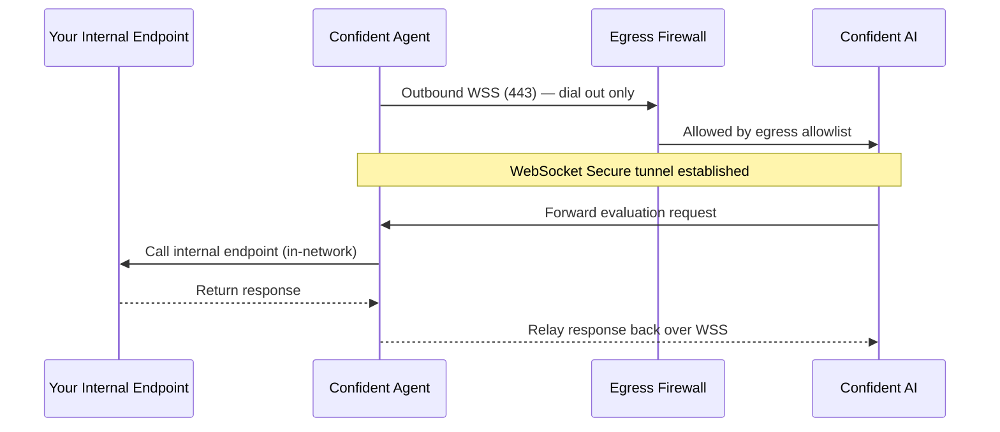

## Overview

The [Confident Agent](/docs/settings/project/confident-agent) is designed for locked-down networks. It never accepts inbound connections—it dials out to Confident AI over **WebSocket Secure (WSS)** and keeps the tunnel open, so evaluation traffic reaches your internal endpoints without exposing them to the public internet. This makes it a good fit for air-gapped and egress-restricted environments where inbound ports are closed and outbound traffic is tightly controlled.

<Note>
  A fully air-gapped network with **zero** egress cannot reach Confident AI's cloud relay. The agent needs at minimum outbound WSS access to Confident AI (see [Outbound Connectivity](#outbound-connectivity) below). If no outbound access is permitted at all, use [Self-Hosting](/docs/self-hosting/introduction) instead so the entire platform runs inside your network.
</Note>

## How It Works

The agent establishes a single **outbound** WSS connection on port `443` to Confident AI's relay. All evaluation requests and responses flow through this one tunnel—there is nothing to expose inbound.



## Requirements

- **Outbound WSS on port 443** from the machine running the agent to Confident AI's relay. WebSocket Secure is the only protocol the agent uses to reach Confident AI.
- **In-network access** from the agent to your internal API endpoint.
- **No inbound ports**—nothing needs to be opened for traffic coming into your network.
- **The `confidentai/confident-agent` container image** available inside your network (see [Distributing the Image](#distributing-the-image) for pulling it into an internal registry).

## Outbound Connectivity

The agent connects to Confident AI over **WSS** at:

```
wss://deepeval.confident-ai.com/ws/relay
```

Your egress firewall must allow this outbound connection on port `443`. You have two options for the allowlist:

<Steps>

<Step title="Preferred — allow all outbound on 443">

Allow unrestricted outbound HTTPS/WSS on port `443`. This is the simplest and most resilient option: it survives any change to Confident AI's underlying infrastructure (such as IP rotations behind the load balancer) with no action on your side.

</Step>

<Step title="Restricted — whitelist Confident AI's relay">

If your policy forbids blanket outbound access, whitelist only the destination the agent needs to reach the relay over WebSocket. Where possible, allowlist by hostname (`deepeval.confident-ai.com`) so DNS-based rules keep working across infrastructure changes.

If your firewall requires an **IP-based** allowlist, you'll need the specific IP address(es) the relay accepts WebSocket connections on.

<Warning>
  Confident AI's relay IPs can change. IP-based allowlisting is brittle and may break connectivity if the underlying infrastructure rotates. Prefer hostname-based rules, or allow all outbound on `443`, whenever your policy allows it.
</Warning>

</Step>

</Steps>

<Tip>
  Need the relay's IP address for an IP-based egress allowlist? **Reach out to the Confident AI team** and we'll provide the current IP(s) for the relay endpoint.
</Tip>

## Distributing the Image

In an air-gapped environment the deployment host usually can't pull from Docker Hub. Mirror the `confidentai/confident-agent` image into a registry that your isolated network can reach.

On a machine with internet access, pull the image and push it to your internal registry:

```bash
docker pull confidentai/confident-agent
docker tag confidentai/confident-agent <your-internal-registry>/confident-agent
docker push <your-internal-registry>/confident-agent
```

Alternatively, save the image to a tarball and transfer it across the air gap:

```bash
# On a connected machine
docker save confidentai/confident-agent -o confident-agent.tar

# After transferring confident-agent.tar into the isolated network
docker load -i confident-agent.tar
```

## Deploying the Agent

Once the image is available inside your network, run the agent pointing at your internal registry (or the loaded image) and the relay URL.

<Tabs>

<Tab title="Docker">

```bash
docker run -d \
  -e CONFIDENT_API_KEY=<your-api-key> \
  -e CONFIDENT_WS_BASE_URL=wss://deepeval.confident-ai.com/ws/relay \
  <your-internal-registry>/confident-agent
```

</Tab>

<Tab title="Docker Compose">

```yaml
services:
  confident-agent:
    image: <your-internal-registry>/confident-agent
    restart: unless-stopped
    environment:
      - CONFIDENT_API_KEY=${CONFIDENT_API_KEY}
      - CONFIDENT_WS_BASE_URL=${CONFIDENT_WS_BASE_URL:-wss://deepeval.confident-ai.com/ws/relay}
```

```bash
docker compose up -d
```

</Tab>

</Tabs>

See [Confident Agent → Environment Variables](/docs/settings/project/confident-agent#environment-variables) for the full list of configuration options.

## Verifying Connectivity

After starting the agent, confirm the outbound tunnel came up:

- Check the container logs for a successful WSS connection message:

  ```bash
  docker logs -f confident-agent
  ```

- In Confident AI, open your [AI Connection](/docs/settings/project/ai-connections) and click **Ping Endpoint**. A `200` response means the request was tunneled through the agent to your internal endpoint and back.

If the connection never establishes, the most common cause is an egress firewall blocking outbound WSS on `443`—revisit [Outbound Connectivity](#outbound-connectivity).

<Tip>
  The agent reconnects automatically. If the WSS tunnel drops—for example during a network blip—it re-establishes without manual intervention.
</Tip>
