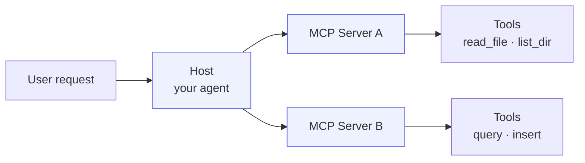
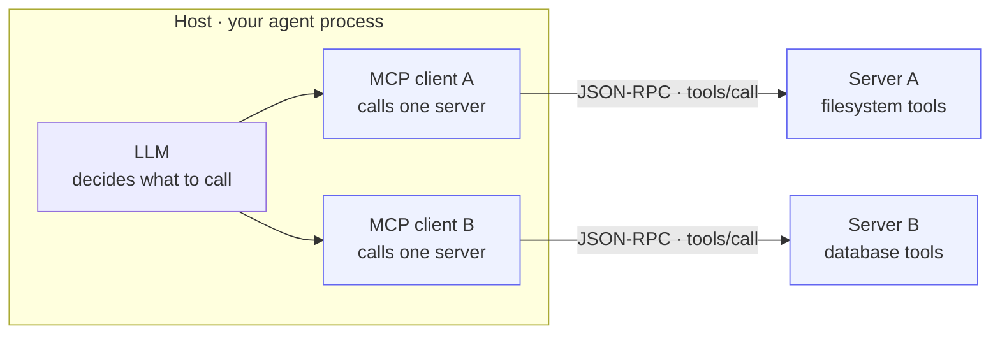
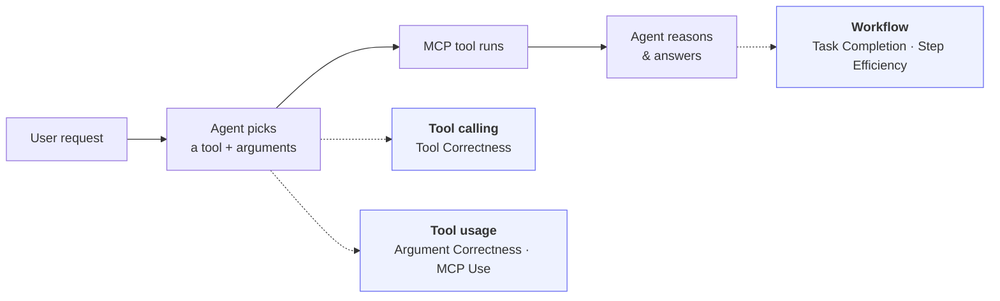
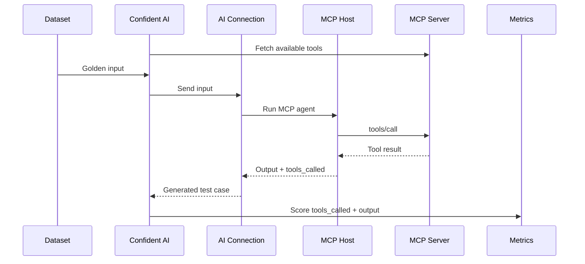

## Overview

[Model Context Protocol (MCP)](https://modelcontextprotocol.io/) is an open standard for connecting AI models to external tools, data sources, and services. An MCP setup has a **host** (your agent) that orchestrates calls to one or more **MCP servers**, each exposing a set of tools.



Evaluating MCP comes down to one question: **did your agent call the right tools, with the right inputs, to produce a good result?** This guide walks through benchmarking your agent against a dataset before you ship, then tracing and scoring it live in production.

<Note>

Every metric here reads from your **trace data** — the input, the agent's final output, and the tools it called. Most of this guide is about capturing that data cleanly on a [test case](/docs/llm-evaluation/core-concepts/test-cases-goldens-datasets), either from a trace or from a curated dataset.

</Note>

## Evaluating MCP

Before deployment, benchmark your MCP agent against a **dataset** of goldens — each golden is just an `input` for your agent. Confident AI runs your agent on each one through an AI Connection, then scores the tools it called against the ones your MCP server exposes.

You'll need two things set up on Confident AI first:

- **A [dataset](/docs/llm-evaluation/core-concepts/test-cases-goldens-datasets) of goldens** — the inputs to test your agent on. No expected output or tools required.
- **An [AI Connection](/docs/settings/project/ai-connections)** — pointed at your deployed MCP host, so Confident AI can run the agent and capture the tools it called.

With both in place, set up your metrics, connect your MCP server, and run the evaluation:

<Steps>

<Step title="Create your metric collection">

Under **Project** > **Metrics** > **Collections**, create a **[metric collection](/docs/metrics/metric-collections)** — the set of metrics your run scores against. Give it a unique name and add a tool-usage metric like MCP Use or Argument Correctness, plus any output-quality metric you care about.

<Frame caption="Create a metric collection with the metrics you'll score your MCP agent against" background="subtle">

<video
  autoPlay
  loop
  muted
  data-video="metrics.createCollection"
  type="video/mp4"
/>

</Frame>

Not sure what to add? See [Choosing Your Metrics](#choosing-your-metrics).

</Step>

<Step title="Connect your MCP server">

In **Project Settings** > **MCP Servers**, click **Add server** and enter its name and connection config. Confident AI fetches and caches the tools from the versioned server — expand **tools enabled** to confirm which ones were pulled in. This cached tool list is what every run's tool calls are scored against, so there's no `expected_tools` to label per golden.

<Frame caption="Connect your MCP server in Project Settings — expand the tools list to see what's available for evaluation">
  
</Frame>

</Step>

<Step title="Run the evaluation from your dataset">

Navigate to **Project** > **Datasets**, open your dataset, and click **Evaluate**. Select the **metric collection** you created, choose the **AI Connection** that generates outputs, attach the server you connected under **MCP Servers**, then click **Run Evaluation**.

Attaching the server links the test run to it and flags any tool call matching one of its tools as an **MCP tool call** instead of a plain function call. Each test case's `tools_called` is then scored against your server's tools.

<Frame caption="Start an evaluation from your dataset — choose the AI Connection and attach the MCP server you created">
  
</Frame>

</Step>

<Step title="Inspect the test run">

Open the test run and drill into any test case. Every tool call shows up under **Tools Used**, and any call matching your connected server's tools is tagged **MCP** — with its inputs and output inline — while your metrics score the run.

<Frame caption="Inspect a test case — MCP tool calls are tagged and scored by your metrics">
  
</Frame>

Done ✅. You now have a repeatable pre-deployment benchmark for your MCP agent's tool usage.

</Step>

</Steps>

## Advanced Usage

Once your pre-deployment benchmark is in place, you can take MCP evaluation further with tracing. The same traces work both ways — they back your **test runs** with the exact tool path behind every score, and they let you evaluate your agent **live in production**.

### Tracing MCP

<Note>

Tracing is **optional but recommended**. The [evaluation flow](#how-it-works) already captures `tools_called` from your AI Connection response, so you can evaluate without it — but tracing adds full observability, letting you [link each result back to its trace](/docs/settings/project/ai-connections/linking-traces) and inspect the exact tool path behind every score.

</Note>

The model calls an MCP server through an MCP client inside your host, and each server usually runs in its own process:



For tracing, that client/server boundary is the important part: the host owns the active trace, while the server runs in a separate process and needs the trace context passed to it explicitly.

The host and each server talk over **[JSON-RPC 2.0](https://www.jsonrpc.org/specification)** — a lightweight "call a named method with some params, get a result back" protocol. Calling a tool is a JSON-RPC request with the method `tools/call`:

```json
{
  "jsonrpc": "2.0",
  "method": "tools/call",
  "params": {
    "name": "read_file",
    "arguments": { "path": "/data/sales.csv" }
  },
  "id": 1
}
```

Here `method` is the operation, `params.name` is which tool to run, and `params.arguments` are the tool inputs. The top-level `id` is only the JSON-RPC request ID — the client uses it to match a response to this request. It is **not** the trace ID.

These messages travel over a **transport** — `stdio` for local servers (the host launches the server as a subprocess) or HTTP for remote ones. Either way, the host and server are usually different processes, so the server cannot automatically see the host's active trace. That's why the host has to send trace context along with the `tools/call` request.

To see every tool call from a single request unified under one trace, you need [distributed tracing](/docs/integrations/opentelemetry/distributed-tracing), which carries trace context across those process boundaries.

Here's the flow: the host injects W3C trace context into each MCP call's metadata, every server extracts it to create child spans under the same trace, and all processes export to Confident AI using the **same `CONFIDENT_API_KEY`**.

<Steps>

<Step title="Configure the OTLP exporter">

Set these environment variables on your host **and** every MCP server so all spans export to the same project:

```bash
export CONFIDENT_API_KEY="your-project-api-key"
export OTEL_EXPORTER_OTLP_ENDPOINT="https://otel.confident-ai.com"
```

<Warning>

Every process must share the **same `CONFIDENT_API_KEY`**. If servers use different keys, their spans land in different projects and the distributed trace won't unify.

</Warning>

</Step>

<Step title="Propagate trace context through MCP calls">

Because each MCP server runs in its own process, it would otherwise start a brand-new, disconnected trace on every call. To stitch its spans onto the host's trace, the host has to tell the server _which trace this call belongs to_.

That identifier is the W3C **`traceparent`** — a compact string holding the trace ID plus the host's current span ID. Recall the `tools/call` request from the primer: MCP reserves a `_meta` field on it for exactly this kind of cross-cutting data and passes `_meta` through to the server untouched. So the host drops the `traceparent` in there — it's the same request as before, plus one field:

```json
{
  "jsonrpc": "2.0",
  "method": "tools/call",
  "params": {
    "name": "read_file",
    "arguments": { "path": "/data/sales.csv" },
    "_meta": {
      "traceparent": "00-0af7651916cd43dd8448eb211c80319c-b7ad6b7169203331-01"
    }
  },
  "id": 1
}
```

On the other end, the MCP server reads `_meta.traceparent` and adopts it as the parent — so its tool span nests under the host's trace instead of starting a fresh one.

<Info>

You don't hand-build that `traceparent` string — injecting it on the host and extracting it on the server is standard OpenTelemetry context propagation. The [Distributed Tracing](/docs/integrations/opentelemetry/distributed-tracing#mcp-model-context-protocol-example) section walks through the inject/extract code on both ends, with a complete runnable MCP example (a Python host plus TypeScript and Python servers).

</Info>

</Step>

<Step title="Record each tool call as a tool span">

This all happens **on the host**, in the one place every tool call flows through: your MCP client's `call_tool`. Wrap that call in a `tool` span so the tool name, arguments, and result land in the trace, and inject the context from the previous step right before you send the request:

```python title="mcp_host/main.py"
async def call_tool_with_tracing(session, tool_name: str, arguments: dict):
    with tracer.start_as_current_span(f"mcp-tool-{tool_name}") as span:
        span.set_attribute("confident.span.type", "tool")
        span.set_attribute("confident.tool.name", tool_name)
        span.set_attribute("confident.span.input", json.dumps(arguments))

        # Inject trace context so the MCP server joins this trace
        trace_meta = {}
        propagator.inject(trace_meta)

        result = await session.call_tool(tool_name, arguments=arguments, _meta=trace_meta)

        span.set_attribute("confident.span.output", json.dumps(result.content))
        return result
```

Here `session` is the MCP client for one server, and `propagator.inject(trace_meta)` fills the dict with the active span's `traceparent` — you never build that ID by hand.

Done ✅. Your MCP host and servers now emit a unified trace for every request.

</Step>

</Steps>

Once your host and servers emit unified traces, [link them to your AI Connection](/docs/settings/project/ai-connections/linking-traces). Now those traces become part of your test runs: during an evaluation, each generated test case is backed by the trace that produced it, so you can open any result and inspect the exact tool path behind its score — the same runs from [Evaluating MCP](#evaluating-mcp), now with full tool-path visibility.

### Evaluate MCP in Production

Pre-deployment benchmarks catch regressions before you ship — but real users send inputs you never tested. [Online evaluations](/docs/llm-tracing/online-evals) close that loop by scoring your MCP traces live, as they're ingested, so tool-usage quality is monitored continuously in production.

Once your MCP host and servers are [tracing](#tracing-mcp) to Confident AI, turn on metrics like MCP Use for your tool spans and Task Completion for the whole trace. Every production run is then scored automatically — no dataset required — and you can set thresholds and alerts so a drop in tool-selection quality surfaces the moment it happens.

<Tip>

Online evals reuse the same MCP metrics as your pre-deployment runs, so a golden that regresses offline and a bad tool call in production are measured the exact same way.

</Tip>

## Concepts

The workflow above is all you need to run an evaluation. This section fills in the background — why MCP evaluation matters, how a run works end to end, which metrics to choose, and the practices that keep it reliable.

### Why Evaluate MCP?

MCP turns your agent into a tool-using system. The model still writes the final answer, but the quality of that answer depends on the path it took: which tool it chose, what arguments it passed, and whether it used the returned data correctly.



That means MCP evaluation has to look beyond "was the final answer good?" What you measure scales with how much of a workflow your MCP agent is — from a single tool call up to a multi-step agent:

- **Tool calling** — did the agent call the right tool? [Tool Correctness](/docs/metrics/single-turn/tool-correctness-metric) compares the tools called against the ones you expected. Best when your MCP is essentially a tool-calling interface.
- **Tool usage** — how well the LLM uses those tools. [Argument Correctness](https://deepeval.com/docs/metrics-argument-correctness) checks whether each call's inputs fit the request, and [MCP Use](https://deepeval.com/docs/metrics-mcp-use) scores tool selection and argument quality together — no labels needed. Where most MCP agents start.
- **Workflow** — for MCPs that do more than wrap a tool call, like summarizers or multi-step agents. [Task Completion](/docs/metrics/single-turn/task-completion-metric) checks whether the run met the user's goal, and [Step Efficiency](https://deepeval.com/docs/metrics-step-efficiency) whether it got there without detours.

That's the _what_ — see [Choosing Your Metrics](#choosing-your-metrics) to turn these categories into the collection you'll score every run against.

### How It Works

When you start a dataset run, here's what Confident AI does end to end:



The important part is that an MCP evaluation is not only checking the final answer. It checks whether the agent used the MCP server correctly along the way:

- **Available tools** come from the MCP server you connect in Project Settings. This is the tool menu the agent can choose from.
- **`tools_called`** comes from your MCP host after it runs the agent. This is what the agent actually chose.
- **Metrics** compare the two and judge the run: did the agent pick the right tool, pass the right arguments, and produce a useful final output?

That means you do not label `expected_tools` for every golden. The golden provides the input, the connected MCP server provides the available tools, and the AI Connection response provides the output plus `tools_called`.

### Choosing Your Metrics

A **metric collection** is the set of metrics every run is scored against, and it's the first thing you set up — it defines what "good" means for your MCP agent. The [Why Evaluate MCP?](#why-evaluate-mcp) section grouped metrics by _what_ they measure; here's how to decide _which_ to actually put in your collection.

Start with one referenceless, MCP-native metric and grow from there:

- **[MCP Use](https://deepeval.com/docs/metrics-mcp-use)** — the default. It scores tool selection **and** argument quality against the tools your server advertises, with no labels required. If you add only one metric, add this one.
- **[Argument Correctness](https://deepeval.com/docs/metrics-argument-correctness)** — a sharper lens on inputs alone: did each call pass arguments that fit the request? Pair it with MCP Use when argument quality is your main risk.
- **[Task Completion](/docs/metrics/single-turn/task-completion-metric)** — did the run accomplish the user's goal? Add it once your agent chains multiple calls, so you're scoring outcomes and not just individual tool choices.
- **[Step Efficiency](https://deepeval.com/docs/metrics-step-efficiency)** — did it get there without redundant calls or detours? Add it when cost or latency matters.
- An output-quality metric like **[Answer Relevancy](/docs/metrics/single-turn/answer-relevancy-metric)** — so a right answer reached through the wrong tools still fails.

Have labeled data? Add **[Tool Correctness](/docs/metrics/single-turn/tool-correctness-metric)** — it's the one reference-based metric here, comparing the tools called against a per-golden `expected_tools` list. Everything above is referenceless, which is why most teams start there and layer Tool Correctness on top once they've curated a labeled dataset.

<Tip>

Not sure where to start? Add **MCP Use** on its own, run once, and read the reasoning behind each score. It'll tell you whether your weak spot is tool selection, arguments, or the final answer — and which metric to add next.

</Tip>

### Best Practices

A few practices that keep MCP evaluation trustworthy as your agents, tools, and servers evolve:

- **Isolate evals from real side effects.** MCP tools take real actions — writing to databases, sending emails, moving money. Point evaluation runs at sandboxed servers, mock tools, or read-only credentials so benchmarking never mutates production systems.
- **Pin server versions and re-baseline on every upgrade.** MCP servers are versioned, and a new release can rename tools or change schemas out from under you. Evaluate against a fixed version, and treat a server upgrade like a code change: re-run your benchmark before it reaches production.
- **Seed your dataset from production traces.** Hand-written goldens miss how users actually behave. Promote real edge cases and past failures from your traces into the dataset so every regression you fix stays fixed.
- **Sample each input multiple times.** Agents take different tool paths on identical inputs. Use [multi-generation](/docs/settings/project/ai-connections/multi-generation) and judge on pass rates, not a single lucky — or unlucky — run.
- **Gate releases on your benchmark.** Attach thresholds to your metrics and run the benchmark in CI so a drop in tool-selection quality blocks the deploy, instead of surfacing after your users hit it.
- **Track cost and latency, not just correctness.** An agent that reaches the right answer through twenty redundant tool calls is still a production problem. Watch step count and latency alongside quality so inefficiency shows up as a regression.

## FAQ

<AccordionGroup>
  <Accordion title="Do I need distributed tracing if my host and MCP server run in the same process?">
    If everything runs in one process, standard
    [tracing](/docs/llm-tracing/quickstart) captures your tool spans without any
    context propagation. Distributed tracing matters the moment a tool call
    crosses a process or network boundary — the common MCP setup, where servers
    run separately from the host.
  </Accordion>
  <Accordion title="Can I measure tool usage without ground truth?">
    Yes. [MCP Use](https://deepeval.com/docs/metrics-mcp-use) scores tool
    selection and argument correctness against the tools the server advertises,
    [Argument
    Correctness](https://deepeval.com/docs/metrics-argument-correctness) checks
    whether each call's arguments fit the input, and Task Completion judges
    whether the agent achieved the user's goal — all three are referenceless, so
    none needs a labeled `expected_tools` list. Only Tool Correctness requires
    that ground truth.
  </Accordion>
  <Accordion title="How do tools_called get captured automatically?">
    Some [integrations](/docs/integrations/opentelemetry) capture MCP tool spans
    for you — for example, the [OpenAI
    Agents](/docs/integrations/third-party/openai-agents) integration records
    MCP tool calls automatically. Otherwise, set `tools_called` yourself on the
    trace or return it from your AI Connection response.
  </Accordion>
</AccordionGroup>

## Next Steps

You benchmarked your MCP agent before deployment, then saw how to trace it and score it live in production. To go deeper:

<CardGroup cols={2}>
  <Card
    title="Distributed Tracing"
    icon="globe"
    href="/docs/integrations/opentelemetry/distributed-tracing#mcp-model-context-protocol-example"
  >
    See the complete, runnable MCP tracing example across a host and multiple
    servers.
  </Card>
  <Card
    title="Datasets"
    icon="database"
    href="/docs/llm-evaluation/core-concepts/test-cases-goldens-datasets"
  >
    Build goldens that Confident AI can run against your MCP-powered endpoint
    before deployment.
  </Card>
  <Card
    title="MCP Metrics"
    icon="wrench"
    href="https://deepeval.com/docs/metrics-mcp-use"
  >
    Score MCP tool selection and argument correctness with DeepEval's MCP-native
    metrics.
  </Card>
  <Card
    title="AI Connections"
    icon="plug"
    href="/docs/settings/project/ai-connections"
  >
    Connect a deployed endpoint so Confident AI can generate outputs during
    evaluation.
  </Card>
</CardGroup>
