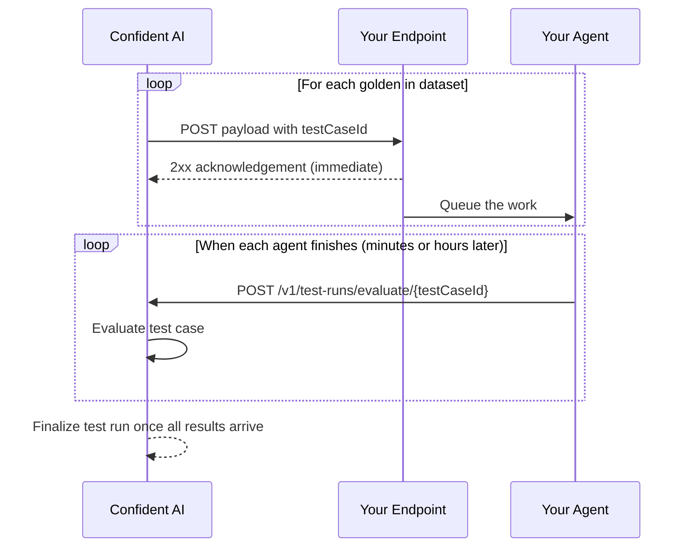

## Overview

This guide is for teams whose AI app takes **minutes or even hours, not seconds**, to produce an output — deep research agents, multi-step pipelines, or anything that queues work before responding.

By default, an [AI Connection](/docs/settings/project/ai-connections) works **synchronously**: Confident AI calls your endpoint, holds the connection open until it responds, and parses the actual output straight out of the HTTP response using your output key path. That breaks down for long-running agents — connections time out, and holding one open per golden doesn't scale.

**Async Responses** mode flips the direction of the second half of the exchange:

1. Confident AI sends each golden to your endpoint with a unique `testCaseId`, then closes the connection without waiting for an output.
2. Your endpoint acknowledges the request with a quick `2xx` and kicks off the real work in the background.
3. When your agent finishes, it posts the result back to the [`POST /v1/test-runs/evaluate/{testCaseId}`](/docs/api-reference/test-runs/submit-test-case-result) endpoint.
4. Confident AI evaluates each test case as its result arrives and finalizes the test run once every result has been received.



<Note>
  Async Responses are available for **single-turn** evaluations only, and can't
  be combined with a **streaming** response mode — the toggle is disabled while
  HTTP Streaming or SSE Streaming is selected.
</Note>

## Build It

<Steps>

<Step title="Configure your AI connection">

If you haven't already, create an AI connection under **Project Settings** → **AI Connections** and point it at your endpoint. See [AI Connections](/docs/settings/project/ai-connections) for the full setup.

The one thing that matters for long-running mode: your payload must include `testCaseId`, since your agent needs to echo it back when posting results. In JSON payload mode, map the `testCaseId` variable into your request body:

```json
{
  "input": golden.input,
  "testCaseId": testCaseId
}
```

In Code mode, `generate_payload` receives `testCaseId` as a parameter — include it in the returned dict the same way.

<Tip>
  You don't need to configure an **Actual Output Key Path** for an async
  connection. The output is collected from the results endpoint, not parsed out
  of your endpoint's immediate response.
</Tip>

</Step>

<Step title="Toggle Async Responses">

Open your AI connection's **General** tab and switch on **Async Responses**.

<Frame caption="The Async Responses toggle on the AI connection's General tab">
  
</Frame>

Once enabled, the status text under the toggle changes to "Results are posted back via the Evals API results endpoint" — Confident AI will now close the connection after dispatching each request instead of waiting for an output.

<Warning>
  The toggle is unavailable while a streaming response mode is selected. Switch
  the connection's response mode back to **HTTP Response** first.
</Warning>

</Step>

<Step title="Acknowledge fast, work in the background">

Your endpoint should return a `2xx` immediately and hand the actual work off to a background job. Confident AI treats the acknowledgement as "request received" — nothing in the response body is parsed.

```python
from fastapi import BackgroundTasks, FastAPI

app = FastAPI()

@app.post("/generate")
async def generate(request: dict, background_tasks: BackgroundTasks):
    background_tasks.add_task(run_agent, request["input"], request["testCaseId"])
    return {"status": "accepted"}
```

Click **Ping Endpoint** on the connection to verify — for async connections, a successful ping only checks that your endpoint acknowledges the request.

</Step>

<Step title="Run an evaluation">

Trigger a [single-turn evaluation](/docs/llm-evaluation/no-code/single-turn) with a dataset and select your async AI connection as the output generation method. The evaluate dialog shows a notice confirming that this connection responds asynchronously and that results must be posted back through the public endpoint.

The test run is created immediately and stays **in progress** while it waits for results.

</Step>

<Step title="Post results back through the endpoint">

When your agent finishes a test case, post its result to the results endpoint using the `testCaseId` from that request's payload, authenticated with your **Project API Key**:

<EndpointRequestSnippet endpoint="POST /v1/test-runs/evaluate/{testCaseId}" />

All fields are optional — anything you leave out falls back to the value from the golden:

- `actualOutput` — the output your agent produced (`string`).
- `retrievalContext` — retrieved documents, for RAG metrics (`string[]`).
- `toolsCalled` — tools your agent called, for tool metrics (`ToolCall[]`).
- `expectedTools` — the tool calls you expected (`ToolCall[]`).
- `metadata` — arbitrary metadata to attach to the test case (`object`).

A successful submission returns `"status": "accepted"` and the test case is evaluated right away. Once every test case's result has arrived, the test run finalizes and results appear on your dashboard as usual. See the [API reference](/docs/api-reference/test-runs/submit-test-case-result) for the full schema.

</Step>

</Steps>

## Rules and Limits

- **Single-turn only.** Conversational (multi-turn) test runs reject posted results with a `400`.
- **The result window is a few hours.** Each test case's `testCaseId` stays valid for a few hours after the evaluation starts; posting after it expires returns `410 Gone`.
- **Submissions are idempotent.** Posting the same `testCaseId` twice returns `"status": "already_received"` and the first result is kept.
- **Finalized runs are closed.** Posting to a test run that has already finished returns a `409`.

## Next Steps

You can now evaluate agents that take minutes or hours to respond — acknowledge each request fast, do the real work in the background, and post results as they finish. To take it further:

<CardGroup cols={2}>
  <Card
    title="AI Connections"
    icon="gear"
    href="/docs/settings/project/ai-connections"
  >
    Configure endpoints, payloads, output parsing, and headers for your AI
    connection.
  </Card>
  <Card
    title="Single-Turn Evals Without Code"
    icon="bolt"
    href="/docs/llm-evaluation/no-code/single-turn"
  >
    Run dataset evaluations on the platform, including long-running agent mode.
  </Card>
  <Card
    title="Submit Test Case Result API"
    icon="code"
    href="/docs/api-reference/test-runs/submit-test-case-result"
  >
    Full request and response schema for posting results back.
  </Card>
  <Card
    title="Linking Traces"
    icon="link"
    href="/docs/settings/project/ai-connections/linking-traces"
  >
    Use the same `testCaseId` to link each test case to its trace for full
    observability.
  </Card>
</CardGroup>
