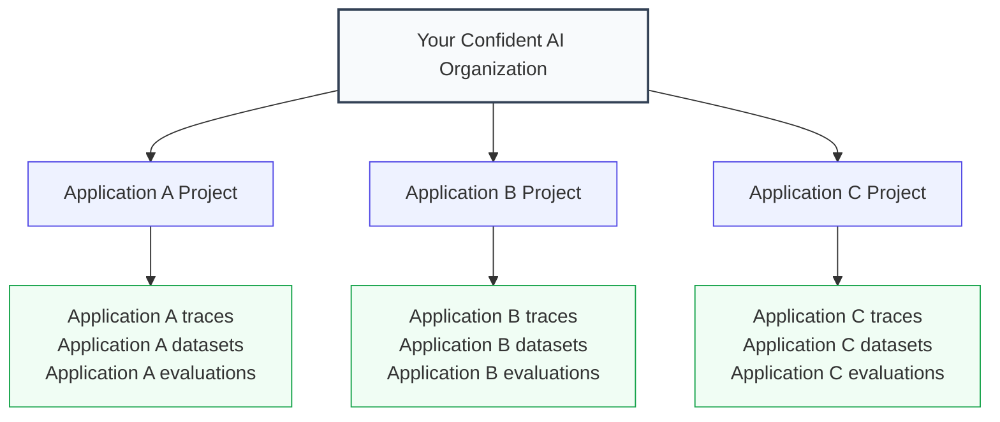

## Overview

This guide is for teams that want to create Confident AI projects programmatically instead of creating them manually in the platform UI. It is especially useful for internal agent-building platforms, multi-tenant products, and proofs of concept where each agent (or tenant or customer) should have its own isolated Confident AI project.

For example, imagine an enterprise platform where every user builds their own agents. Each agent should get its own Confident AI project so its traces and evaluations stay isolated from every other agent on the platform.

In this guide, you will:

- **Configure the Admin SDK** with one Organization API Key.
- **Create a project in code** for each agent the moment it is built.
- **Store the returned Project API Key** with the project ID for later trace routing.
- **Route traces to the correct project** by setting the Project API Key on each trace.

By the end, your platform will be able to provision an isolated Confident AI project per agent on demand and send each agent's traces, datasets, and evaluations to the right workspace.



## Build It

<Steps>

<Step title="Install SDKs">

The Admin SDK is available in both Python and TypeScript through `confidentai`. You also need `deepeval` to route traces into each project.

<Tabs>

<Tab title="Python" language="python">

```bash
pip install confidentai deepeval
```

</Tab>

<Tab title="TypeScript" language="typescript">

```bash
npm install confidentai deepeval
```

</Tab>

</Tabs>

</Step>

<Step title="Configure Admin SDK">

<Warning>

You need an **Organization API Key** before you start. [Retrieve yours here](/docs/api-reference/authentication#organization-level-auth).

</Warning>

Set `CONFIDENT_ORG_API_KEY` to your Organization API Key. The Admin SDK reads this variable by default when you create a client.

```bash
export CONFIDENT_ORG_API_KEY="confident_us_org_..."
```

<Tabs>

<Tab title="Python" language="python">

```python title="app/confident.py"
from confidentai import ConfidentAI

confident_ai = ConfidentAI()
```

</Tab>

<Tab title="TypeScript" language="typescript">

```typescript title="app/confident.ts"
import { ConfidentAI } from "confidentai";

export const confidentAI = new ConfidentAI();
```

</Tab>

</Tabs>

</Step>

<Step title="Provision Project">

Create a project for each application. The `projects.create(...)` call returns the new project and its first **Project API Key**. Store both values with that application so traces can be routed to the same project later.

The storage helpers in this example represent your own database or persistence layer.

<Tabs>

<Tab title="Python" language="python">

```python title="app/onboarding.py" {5,7-12}
from app.confident import confident_ai
from app.storage import save_application_project

def onboard_application(application_slug: str):
    new_project = confident_ai.projects.create(name=application_slug)

    save_application_project(
        application_slug,
        project_id=new_project.project.id,
        project_api_key=new_project.api_key.value,
    )
    return new_project.project.id
```

</Tab>

<Tab title="TypeScript" language="typescript">

```typescript title="app/onboarding.ts" {5,7-10}
import { confidentAI } from "./confident";
import { saveApplicationProject } from "./storage";

export async function onboardApplication(applicationSlug: string) {
  const newProject = await confidentAI.projects.create({ name: applicationSlug });

  await saveApplicationProject(applicationSlug, {
    projectId: newProject.project.id,
    projectApiKey: newProject.apiKey?.value,
  });
  return newProject.project.id;
}
```

</Tab>

</Tabs>

<Tip>

To grant project access after creation, invite members with [`project.invitations.create(...)`](/docs/settings/project/management/members-and-invitations#create-invitations) and assign a [role](/docs/settings/project/management/roles-policies-permissions) from the same Admin SDK client.

</Tip>

</Step>

<Step title="Route Traces">

The Project API Key determines **which project receives a trace**. To keep applications isolated, set the key on the current trace inside the observed function.

<Tabs>

<Tab title="Python" language="python">

```python title="app/agent.py" {2,10}
from openai import OpenAI
from deepeval.tracing import observe, update_current_trace
from app.storage import load_application_project

client = OpenAI()

@observe()
def run_for_application(application_slug: str, query: str):
    application = load_application_project(application_slug)
    update_current_trace(confident_api_key=application.project_api_key)

    return client.chat.completions.create(
        model="gpt-4o",
        messages=[{"role": "user", "content": query}],
    ).choices[0].message.content
```

</Tab>

<Tab title="TypeScript" language="typescript">

```typescript title="app/agent.ts" {2,10}
import OpenAI from "openai";
import { observe, updateCurrentTrace } from "deepeval/tracing";
import { loadApplicationProject } from "./storage";

const openai = new OpenAI();

export const runForApplication = observe({
  fn: async (applicationSlug: string, query: string) => {
    const application = await loadApplicationProject(applicationSlug);
    updateCurrentTrace({ confidentApiKey: application.projectApiKey });

    const res = await openai.chat.completions.create({
      model: "gpt-4o",
      messages: [{ role: "user", content: query }],
    });
    return res.choices[0].message.content;
  },
});
```

</Tab>

</Tabs>

</Step>

<Step title="Verify Routing">

Create a project for an application, execute the application, and confirm that the trace appears in the correct project.

<Tabs>

<Tab title="Python" language="python">

```python
from app.onboarding import onboard_application
from app.agent import run_for_application

onboard_application("support-bot")
run_for_application("support-bot", "What's on my agenda today?")
```

</Tab>

<Tab title="TypeScript" language="typescript">

```typescript
import { onboardApplication } from "./onboarding";
import { runForApplication } from "./agent";

await onboardApplication("support-bot");
await runForApplication("support-bot", "What's on my agenda today?");
```

</Tab>

</Tabs>

Open the [Observatory](https://app.confident-ai.com) and switch to the **support-bot** project. The trace appears in that project, isolated from every other application.

<Frame caption="Traces in the Observatory">
  <video data-video="tracing.traces" controls />
</Frame>

Done ✅. The workflow now creates a dedicated project per application and routes traces using a single Organization API Key.

</Step>

</Steps>

## Next Steps

Now that each tenant or application can route traces to its own project, use these sections to extend the workflow:

<CardGroup cols={2}>
  <Card
    title="Assign Projects to Governance Policies"
    icon="shield-halved"
    href="/docs/guides/assign-projects-to-governance-policies"
  >
    Enroll each project you provision into a governance policy from CI/CD.
  </Card>
  <Card
    title="Manage Projects"
    icon="folder"
    href="/docs/settings/project/management/projects"
  >
    Manage the projects your application creates, including updates and cleanup.
  </Card>
  <Card
    title="Members & Invitations"
    icon="user-group"
    href="/docs/settings/project/management/members-and-invitations"
  >
    Add users to the projects you create and assign the right project-level roles.
  </Card>
  <Card title="LLM Tracing" icon="route" href="/docs/llm-tracing/quickstart">
    Customize the traces you route by setting span types, metadata, tags, and other trace attributes.
  </Card>
</CardGroup>
