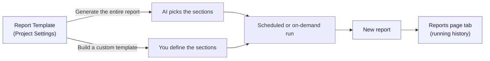

## Overview

The goal of this guide is simple: **get a curated report into your stakeholders' hands, automatically, on a schedule** — no one manually pulling numbers the night before a leadership sync.

On Confident AI you do that with an **Executive Report**: an AI-written summary of your project — quality, cost, latency, eval health — generated from a template you control and emailed out when it's ready. The winning workflow is three steps:

<CardGroup cols={3}>
  <Card title="1. Plan" icon="clipboard-list" iconType="solid">
    Decide what leadership actually needs to see, and turn each question into a
    section.
  </Card>
  <Card title="2. Build" icon="table-cells" iconType="solid">
    Curate a **custom report template** with exactly those sections — no more,
    no less.
  </Card>
  <Card title="3. Deliver" icon="paper-plane" iconType="solid">
    Schedule it and turn on **report emails** so it reaches stakeholders on its
    own.
  </Card>
</CardGroup>

<Note>
  Reports are in **beta**. If you're **self-hosted**, make sure your deployment
  is on a recent platform image and has the **Evals & Observability**
  entitlement — Reports won't appear until then.
</Note>

Reports read straight from your project's existing data — traces, test runs, metrics, and annotations — so the more you've logged, the richer they get. This guide focuses on **Executive Reports**, since that's the stakeholder workflow. Red-team [Risk Assessment Reports](#risk-assessment-reports) are covered briefly at the end.

## Planning the Report

Before you touch the builder, decide **what your stakeholders actually need to know**. A great leadership report answers a handful of standing questions — not "here's every metric we have."

Every report is built from a small set of **section types** — the primitives you'll assemble in the builder. Get familiar with them first:

<Tabs>
  <Tab title="Stat cards">
    Stat cards are a row of headline metrics, where each card carries a label, a value, and an optional caption. They work best for the numbers leadership scans first, such as pass rate, volume, and cost.

    <Frame caption="Stat cards section">
      
    </Frame>

  </Tab>
  <Tab title="Graph">
    A graph is a chart that renders as a line, area, bar, or stacked bar. It works best for showing trends over time, such as pass rate or latency by day.

    <Frame caption="Graph section">
      
    </Frame>

  </Tab>
  <Tab title="Table">
    A table is a compact grid of rows and columns. It works best for rankings and breakdowns, such as your top failures or per-metric rollups.

    <Frame caption="Table section">
      
    </Frame>

  </Tab>
  <Tab title="Content">
    Content is a block of narrative text. It works best for written summaries, context, and recommendations.

    <Frame caption="Content section">
      
    </Frame>

  </Tab>
  <Tab title="Admonition">
    An admonition is a colored callout box that comes in four severities: Info, Success, Warning, or Danger. It works best for caveats and can't-miss highlights.

    <Frame caption="Admonition section">
      
    </Frame>

  </Tab>
</Tabs>

<Note>
  You'll configure each of these when [building the
  report](#report-section-types) — some you write by hand, others AI generates
  from your data.
</Note>

With the building blocks in mind, plan around what Confident AI can actually measure. Reports draw on four kinds of project data:

- **Observability** captures how your agent behaves in production, across traces, spans, threads, and end users.
- **Evaluation** measures how your agent scores against your benchmarks, from datasets to test runs.
- **Diagnostics** surfaces what's actually going wrong, in failing traces and failing test cases.
- **Correlation** ties quality signals to human judgment, through online metric scores and annotations.

Pick the areas that map to what leadership asks, then turn each question into a section. Here are concrete report ideas for each — and the section type that fits:

<Tabs>
  <Tab title="Observability">

    - _"How much traffic did we serve, and how reliable, fast, and costly was it?"_ → a **stat cards** row (volume, error rate, p95 latency, cost)
    - _"Is that trending the right way?"_ → a **graph** of volume, latency, or cost by day
    - _"Which part of the agent is slow or expensive?"_ → a **table** broken down by span type (LLM, tool, retriever)
    - _"How many users did we serve, and are they coming back?"_ → **stat cards** for unique end users and retention
    - _"Are conversations resolving or dragging on?"_ → **stat cards** or a **table** on thread volume and turns per thread

  </Tab>
  <Tab title="Evaluation">

    - _"Are our evals improving release over release?"_ → a **graph** of test-run pass rate over time
    - _"How did the latest run stack up against the last few?"_ → a **table** comparing recent runs
    - _"How did the newest run do metric by metric?"_ → a **table** of pass rate per metric for the latest run
    - _"Which metrics are dragging the score down?"_ → a **table** of the lowest-scoring metrics
    - _"What are we testing, and how big is the benchmark?"_ → a **content** summary of dataset coverage plus **stat cards** for golden count

  </Tab>
  <Tab title="Diagnostics">

    - _"What broke in production this week?"_ → a **table** of the top failing traces and their failure modes
    - _"How bad is it?"_ → **stat cards** for failure count and failure rate
    - _"What's failing most often, and why?"_ → a **table** grouping failures by reason
    - _"Is it getting better or worse?"_ → a **graph** of failure rate over time
    - _"Which benchmark cases are we still failing?"_ → a **table** of failing test cases

  </Tab>
  <Tab title="Correlation">

    - _"How is quality trending on live traffic, not just test sets?"_ → a **graph** of online metric scores
    - _"What's our quality score on production right now?"_ → **stat cards** of average metric scores
    - _"What are reviewers flagging?"_ → a **table** of annotation labels and their frequency
    - _"Do our metrics agree with human reviewers?"_ → a **table** of metric-vs-human alignment per metric
    - _"How much are reviewers actually reviewing?"_ → **stat cards** for annotation volume and coverage

  </Tab>
</Tabs>

For example, a single cost report can weave several section types together. The one below came from one prompt: _"Show me some insights on our cost usage on average lately. In particular, I'd like to know our total trace and model costs as well as which user(s) are spending the most money."_ Confident AI answered it with three sections — a **stat cards** row (model cost, total trace cost, trace events, distinct end users, average cost per trace), a **table** of the most active day and highest-cost model, and a **content** overview that narrates the numbers.

<Frame caption="A cost report generated from a single prompt — stat cards, a summary table, and an AI-written overview">
  
</Frame>

Keep it tight — five or six sections that answer real questions beat twenty no one reads. Then cap it with a **caveat admonition** noting what the data doesn't cover, so leadership doesn't over-read it.

If a section can't be answered from this data, drop it or rephrase it. With the plan in hand, you're ready to build.

## Building the Report

You'll find your generated Executive Reports on the **Reports** page, opened from the project sidebar. But you don't create reports there directly — every report is produced from a **Report Template**, a reusable, scheduled definition that lives in **Project Settings** → **Report Templates**.

Think of a template as the recipe and a report as the dish: each scheduled run cooks a fresh report from your project's latest data. Every template gets its own tab on the **Reports** page, so a _Weekly Leadership Update_ template builds a running history you can flip through.

Both paths live in the same editor — the **Use custom template** toggle switches between them.

<Warning>
  Creating and editing templates requires the **`project:manage`** permission.
  Members without it can still read the generated reports.
</Warning>

To create a template, go to **Project Settings** → **Report Templates** → **New Template**, give it a **Name** (e.g. _Weekly Leadership Update_) and a starting **Description**, and you'll land in the template editor. Now pick your path:

- **Generate the entire report** — you write a description and Confident AI decides the sections and writes the whole report. Fastest to set up, but the structure can vary run to run.
- **Build a custom template** — the report is _still_ AI-generated, but instead of letting the model decide the layout, you define the exact sections and their order. Confident AI then fills each one from your live data every run. More upfront work, but you get the same consistent structure each time.

The rule of thumb: reach for a **custom template** whenever this is a recurring report going to stakeholders — consistency is what makes it trustworthy. Let Confident AI **generate the entire report** for quick, exploratory, or one-off reports.

### Generate the Entire Report

Leave **Use custom template** **off** and simply fill in the **Description** — a plain-English prompt of what the report should analyze:

> _"What are the trends in error rates for all types of evaluations in the past month?"_

<Frame caption="The template editor with 'Use custom template' off — just a name and a description prompt">
  
</Frame>

That's it. Confident AI plans which data to query, picks the sections that fit, and writes the whole report for you — an overview, key findings, stat cards, an optional graph and tables, recommendations, and a caveat. You don't choose sections; you describe the question and let the model do the rest.

This is the fastest path and a great default. The better your description — naming data types, metrics, and time windows — the sharper the report.

### Build a Custom Template

Turn **Use custom template** **on** when stakeholders need a **specific, consistent structure** every run (the usual case for a recurring leadership report). The section builder opens, and you assemble exactly the sections you planned earlier.

Here's the key thing to understand: a custom template **doesn't turn off AI** — it just fixes the structure. You decide which sections appear and in what order, and Confident AI still generates the content of each one from your live project data at run time (except for any sections you deliberately hardcode). Think of it as handing the model an outline instead of a blank page: you own the skeleton, the model writes the body.

<Steps>

<Step title="Add and configure sections">

Click **Add** to create a section, then set its **Heading** ("shown above the section") and its **Type**. See [the section types](#report-section-types) below.

<Frame caption="The section builder — each section has a Heading, a Type, and either a Prompt or hardcoded content">
  
</Frame>

</Step>

<Step title="Reorder and preview">

Drag sections into the order stakeholders should read them. Open the **Preview** tab to see the rendered layout with placeholder data.

</Step>

<Step title="Save">

When you have unsaved changes, a **Save** / **Discard** controller appears at the bottom — click **Save** to commit.

✅ Done. You now have a template that produces exactly the report you planned.

</Step>

</Steps>

#### Report Section Types

You've already met the five section types. In the builder, the only new decision is **how each one gets filled** — by hand or by AI. **Content** and **Admonition** support both; **Stat cards**, **Table**, and **Graph** are AI-only, since their numbers are pulled live from your data at generation time. Here's how to fill each:

- **Content** — type the exact prose into the **Content** box, or flip **Generate with AI** on and add a **Prompt** so the model drafts it from your data each run (e.g. _"Summarize agent health in two short paragraphs and list three recommendations."_).
- **Admonition** — hand-author it by choosing a **Severity** (Info, Success, Warning, or Danger) and writing the **Content**, or flip **Generate with AI** on and let a **Prompt** drive it — the model writes a 1–3 sentence callout and sets the severity to match (Success for wins, Warning/Danger for risks).
- **Stat cards** — always AI-generated, so your **Prompt** names the figures to surface: _"Pass rate, total test runs, and average cost per run for the last 7 days, each vs. the prior week."_
- **Table** — always AI-generated, so your **Prompt** describes the columns and rows: _"The five metrics with the highest failure rates, with pass rate and test-run count."_
- **Graph** — always AI-generated, so your **Prompt** says what to plot: _"Pass rate by day over the last 7 days."_ The model then picks the chart style and either runs a live query or plots the exact numbers pulled from your data.

<Tip>
  **Mix static and AI.** Hardcode a fixed **Content** intro and a **Danger**
  admonition about data caveats so they're identical every run, then let AI fill
  the **Stat cards**, **Table**, and **Graph** with fresh numbers. You get a
  consistent shape with live data inside it.
</Tip>

## Delivering the Report

A curated report is only useful if it actually reaches people. Automation has two parts: **when it generates** and **who it emails**.

### Schedule generation

Every template runs on a **daily** schedule. On the **Report Templates** list:

- **Enable / disable** — the switch on each row controls whether the template generates on its schedule.
- **Generate now** — the **⋮** menu runs it on demand. Use this to test your template without waiting for the next day.

### Turn on report emails

Now wire up delivery so a fresh report lands in the right inboxes the moment it's generated:

<Steps>

<Step title="Open the Email integration">

Go to **Project Settings** → **Integrations** (under **Miscellaneous**), then click the **Email** card under **Notifications**.

</Step>

<Step title="Add report recipients">

Find the **Notify on Report Generation** section — _"Confident AI will email these recipients whenever a report is generated."_ Open the user picker, select the stakeholders who should receive reports, and click **Save**.

Email triggers are independent, so a recipient can get **reports** without also getting test-run or alert emails.

</Step>

</Steps>

<Frame caption="The Email integration — add stakeholders under 'Notify on Report Generation'">
  
</Frame>

When a report finishes generating, each selected recipient gets an email titled _"Your executive report is ready"_ with the date range and a link straight to the report on the platform.

<Warning>
  **Recipients must be project members.** The picker only lists people on the
  project, so invite your stakeholders as [project
  members](/docs/settings/project/management/members-and-invitations) first. For
  anyone who isn't on the platform (external execs, board members), use the
  **PDF export** below as your handoff instead.
</Warning>

<Note>
  Report emails are **email-only** — Slack, Discord, Teams, and PagerDuty don't
  receive report notifications, even if you've connected them for other alerts.
</Note>

## Best Practices

Once your reports are generating on their own, a few details help you get the most out of them — exporting by hand, choosing the model that writes them, sharpening weak sections, and the separate report type built for security stakeholders.

### Exporting Reports

Beyond email, you can always read reports in-app. Open **Reports** from the project sidebar — one tab per template, newest first, with **Report N of M** arrows to step through history.

<Frame caption="The Executive Reports page — one tab per template, newest report first">
  
</Frame>

Each report's toolbar has two actions for manual sharing:

- **Download as PDF** exports the document exactly as rendered, charts and tables included. This is your handoff for stakeholders who aren't on the platform.
- **Expand** opens a full-screen, print-quality view so you can proof the report before you export it.

<Note>
  Report styling is fixed to Confident AI's document format — there's no custom
  branding, logo, or layout, and no public share link. Distribution is the
  report email or the exported PDF.
</Note>

### Selecting the Generation Model

Reports are written by your project's **platform model** — the same configured [evaluation model](/docs/settings/project/evaluation-models) used across the platform.

- When your provider is **OpenAI-compatible** (`OpenAI`, or Confident's pooled OpenAI-backed default), reports use it directly.
- For any other provider — Anthropic, Bedrock, Vertex, and friends — reports fall back to Confident AI's standard generation model so quality stays consistent.

Change the active model in **Project Settings** → **[Evaluation Models](/docs/settings/project/evaluation-models)**.

### Optimizing Report Content

The sharpness of a report comes down to how precisely each prompt names the **data type, metric, and time window** to pull. Vague prompts get vague sections, so lead with the specifics you want the model to surface.

When a prompt can't be mapped onto data the project actually has, the section comes back as an _"irrelevant query"_ instead of inventing numbers. That usually means the plan drifted from reality:

- The section asks about a feature the project has no data for (e.g. red-team scores with no red-teaming).
- The time window has no traffic.
- The prompt is too abstract to turn into a query.

Go back to your **plan** — tighten the section to name the data type, metric, and window — and the next run produces a real report.

### Risk Assessment Reports

The other kind of report comes out of [Red Teaming](/docs/red-teaming/introduction). When you run a [risk assessment](/docs/red-teaming/risk-profile), you can generate a formal, audit-ready **Risk Assessment Report** — a self-contained security document with a fixed structure you don't curate. It bundles a cover page (customer, framework, test-case count, duration, cost), a table of contents, an executive summary, remediation priorities, per-category risk breakdowns, production impact, recommendations, and a conclusion.

To get one, open a completed assessment under **Red Teaming** → **Risk Profile** and choose **Download Report**. Confident AI generates it (if it hasn't already) and downloads a print-ready PDF — ideal for security and compliance stakeholders.

## Next Steps

You can now plan a report, build it with a custom template, and automate delivery to stakeholders. To go deeper on the data behind them:

<CardGroup cols={2}>
  <Card
    title="Dashboards"
    icon="chart-line"
    href="/docs/reporting-analytics/dashboards"
  >
    Build live, drillable dashboards over the same traces, threads, metrics, and
    annotations — with filters, breakdowns, and CSV/PNG/PDF export.
  </Card>
  <Card
    title="Executive Insights"
    icon="sparkles"
    href="/docs/reporting-analytics/executive-insights"
  >
    The reference page for AI-written narrative reports, including how the
    planner and summarizer work.
  </Card>
  <Card
    title="Team Members"
    icon="user-plus"
    href="/docs/settings/project/management/members-and-invitations"
  >
    Invite stakeholders to the project so they can receive report emails and
    open reports in-app.
  </Card>
  <Card
    title="Evaluation Models"
    icon="brain"
    href="/docs/settings/project/evaluation-models"
  >
    Configure which model and credentials power your reports, including the
    `gpt-5` verification note.
  </Card>
</CardGroup>
