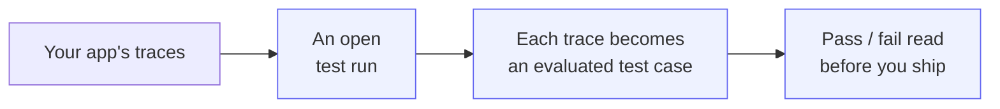
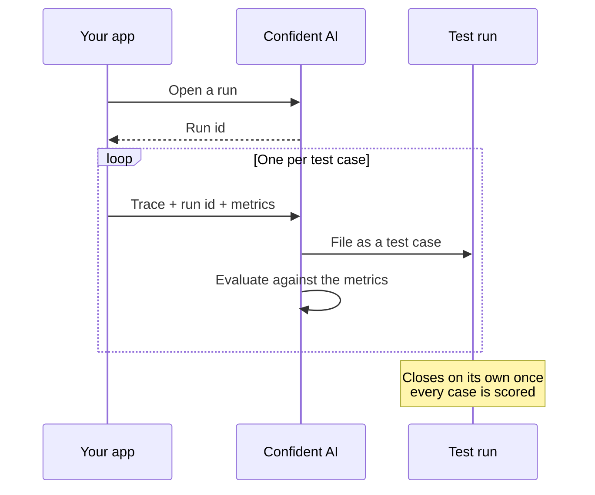

## Overview

Before you ship a change, you want to know your app still clears the bar — that no regression is slipping through to production. That's what a **test run** is for: a batch of test cases, each evaluated by the metrics you care about, with one pass-or-fail read at the end. This guide builds one from something your app already produces on every request — its **traces**.

The whole idea fits in one sentence: **point a trace at an open test run, and it becomes an evaluated test case.** Confident AI scores it against your metrics, files it under the run, and closes the run out when the last case lands.

Traces reach Confident AI two ways — over the API or through OpenTelemetry — so you can build a run in your most comfortable stack.



In this guide, you will:

- **Open a test run** and capture your traces as test cases inside this run.
- **Send traces** with the run id and a metric collection to evaluate them on cloud and automatically convert them to test cases.
- **Evaluate the steps inside each trace** — the retriever, the LLM call — not just the final answer with component level evals.
- **Send test cases over OpenTelemetry** with span attributes, for users who already have instrumentation in place.

By the end, you'll have a repeatable way to benchmark quality before every release, built entirely from your app's traces.

<Note>

Trace-based test runs are **single-turn** — one input, one output per test case. Build your [metric collection](/docs/metrics/metric-collections) from single-turn metrics.

</Note>

## Prerequisites

Two things need to exist before your first test case lands:

- **A Project API Key** — `CONFIDENT_API_KEY` (e.g. `confident_us_proj_...`). [Retrieve yours here](/docs/api-reference/authentication).
- **A single-turn [metric collection](/docs/metrics/metric-collections)** in your project. This is what "good" means for your test cases — pass rates, quality thresholds, the metrics you'd gate a release on. You'll refer to it by name, so note the exact name.

## Send Traces via the API

Each step calls the Evals API — every snippet links straight to its reference, where you can try the call live. Prefer to instrument with OpenTelemetry instead? The [OpenTelemetry](#send-traces-over-opentelemetry) section covers the same flow.

<Steps>

<Step title="Open a test run">

Start by opening an empty run. Confident AI hands back an `id`, and the run stays **in progress** — ready to take in test cases — until you're done sending.

<EndpointRequestSnippet endpoint="POST /v1/test-runs" />

Both fields are optional. `identifier` is a label so you can find the run again later; `metricCollection` sets a **default** collection for any case that doesn't name its own. You get back the run's `id` and a `link` to it on the platform:

<EndpointResponseSnippet endpoint="POST /v1/test-runs" />

Hold onto that `id` — every trace you send as a test case carries it.

<Warning>

The `metricCollection` must already exist in your project and be single-turn. A name that doesn't match returns `404`; a multi-turn collection returns `400`.

</Warning>

</Step>

<Step title="Send a trace as a test case">

Now send a trace with the run's `id` as its `testRunId`. That single field is what turns an ordinary trace into a test case: Confident AI pulls it into the run, evaluates it, and files the result. The metric collection that evaluates it either rides on the trace — as below — or falls back to the run's default.

<EndpointRequestSnippet endpoint="POST /v1/traces" example="Test-Run-Id" />

Its `input` and `output` are what the trace-level metrics evaluate — what your app was asked, and how it answered — while `uuid`, `name`, `startTime`, and `endTime` (ISO-8601) round it out. That's a complete test case.

<Note>

**Every test case needs a metric collection to evaluate it** — set one on the trace to evaluate this case specifically, or set a default when you [open the run](#open-a-test-run) and every trace inherits it. The trace's own collection wins when both are set.

</Note>

</Step>

<Step title="Evaluate the steps inside the trace">

A trace-level score tells you the final answer was good. It doesn't tell you *why* — or, when the answer is wrong, which step let you down. Was it the retriever that pulled the wrong context, or the model that ignored the right one?

To answer that, you can evaluate your **spans** by giving each one its own `metricCollection`. Each span is a component, evaluated on its own and can be seen in the Observatory or the test case's trace view.

<EndpointRequestSnippet endpoint="POST /v1/traces" example="Test-Run-Component-Level" />

Here the trace still gets its end-to-end score from its own `metricCollection`, while each span is evaluated by the collection you attach to it — one for the retriever, another for the model. Set each span's `type` — `retriever`, `llm`, `tool`, or `agent` — so it's evaluated by the right kind of metric.

<Tip>

Give a component the metrics that fit its job: retrieval relevancy on the retriever, faithfulness or answer quality on the model, argument correctness on a tool. That's how a failed test case points you straight at the step that caused it.

</Tip>

</Step>

<Step title="Read the results">

Confident AI automatically closes the run out on its own, tallies the pass and fail counts, and marks it complete — see [When a run finishes](#when-a-run-finishes) for more details.

Open the `link` from step 1 to read the run on the platform — every test case, its trace, and its scores at both levels. To pull the results into your own pipeline instead, fetch the run:

<EndpointRequestSnippet endpoint="GET /v1/test-runs/{testRunId}" />

Done ✅. The response gives you the run's overall `metricsScores` and a `testCases` array to analyze them on your own.

</Step>

</Steps>

## Send Traces over OpenTelemetry

If your app already emits [OpenTelemetry](/docs/integrations/opentelemetry) spans, you can easily carry the same fields as span **attributes** and export the spans to Confident AI's OTel endpoint.

The moves are identical to the walkthrough above. You still [open the run over the API](#open-a-test-run) to get a `testRunId`; from there, everything rides on the spans you already emit. Point your OTLP/HTTP exporter at Confident AI's OpenTelemetry endpoint, authenticated with the `x-confident-api-key` header:

```bash
https://otel.confident-ai.com/v1/traces
```

Then set two groups of attributes:

- On the **root span** — the test case itself: `confident.trace.test_run_id`, `confident.trace.metric_collection`, `confident.trace.input`, `confident.trace.output`, and `confident.trace.name`.
- On each **child span** — a component: `confident.span.type`, `confident.span.name`, `confident.span.input`, `confident.span.output`, and `confident.span.metric_collection`.

Attribute values are strings, so JSON-encode anything structured — a list of retrieved chunks, for instance.

OpenTelemetry is language agnostic, so you can always send the traces from your app natively and still get the same test runs as the API or regular SDK users. Here are a few examples in different languages:

<Tabs>

<Tab title="Rust" language="rust">

The root span carries the `confident.trace.*` attributes that make it a test case; the child span carries `confident.span.*` to evaluate a component.

```rust title="src/main.rs"
use opentelemetry::{global, trace::{Tracer, TraceContextExt}, KeyValue};
use opentelemetry_otlp::WithExportConfig;
use opentelemetry_sdk::runtime;
use std::collections::HashMap;

fn init_tracer() {
    let mut headers = HashMap::new();
    headers.insert(
        "x-confident-api-key".to_string(),
        std::env::var("CONFIDENT_API_KEY").expect("CONFIDENT_API_KEY not set"),
    );

    opentelemetry_otlp::new_pipeline()
        .tracing()
        .with_exporter(
            opentelemetry_otlp::new_exporter()
                .http()
                .with_endpoint("https://otel.confident-ai.com/v1/traces")
                .with_headers(headers),
        )
        .install_batch(runtime::Tokio)
        .expect("failed to install tracer");
}

#[tokio::main]
async fn main() {
    init_tracer();
    let tracer = global::tracer("confident-test-run");
    let test_run_id = "your-test-run-id"; // the id from step 1

    let input = "Can I get a refund on my annual plan after two months?";
    let output = "Annual plans are refundable on a prorated basis within the first 30 days...";

    // Root span → the test case, evaluated end to end.
    tracer.in_span("Refund policy question", |cx| {
        let root = cx.span();
        root.set_attribute(KeyValue::new("confident.trace.test_run_id", test_run_id));
        root.set_attribute(KeyValue::new("confident.trace.metric_collection", "Agent Quality"));
        root.set_attribute(KeyValue::new("confident.trace.name", "Refund policy question"));
        root.set_attribute(KeyValue::new("confident.trace.input", input));
        root.set_attribute(KeyValue::new("confident.trace.output", output));

        // Child span → a component, evaluated on its own.
        tracer.in_span("generate_answer", |cx| {
            let span = cx.span();
            span.set_attribute(KeyValue::new("confident.span.type", "llm"));
            span.set_attribute(KeyValue::new("confident.span.name", "generate_answer"));
            span.set_attribute(KeyValue::new("confident.span.input", "Answer using the policy context..."));
            span.set_attribute(KeyValue::new("confident.span.output", output));
            span.set_attribute(KeyValue::new("confident.span.metric_collection", "Answer Quality"));
        });
    });

    global::shutdown_tracer_provider(); // flush before the process exits
}
```

</Tab>

<Tab title="Clojure" language="clojure">

Using the OpenTelemetry Java SDK through interop. The exporter points at Confident AI with the `x-confident-api-key` header; the root and child spans carry the same attributes.

```clojure title="src/traces.clj"
(ns traces
  (:import
   [io.opentelemetry.api.common Attributes]
   [io.opentelemetry.exporter.otlp.http.trace OtlpHttpSpanExporter]
   [io.opentelemetry.sdk OpenTelemetrySdk]
   [io.opentelemetry.sdk.trace SdkTracerProvider]
   [io.opentelemetry.sdk.trace.export BatchSpanProcessor]
   [java.util.concurrent TimeUnit]))

(defn build-sdk []
  (let [exporter (-> (OtlpHttpSpanExporter/builder)
                     (.setEndpoint "https://otel.confident-ai.com/v1/traces")
                     (.addHeader "x-confident-api-key" (System/getenv "CONFIDENT_API_KEY"))
                     (.build))
        provider (-> (SdkTracerProvider/builder)
                     (.addSpanProcessor (-> (BatchSpanProcessor/builder exporter) (.build)))
                     (.build))]
    (-> (OpenTelemetrySdk/builder)
        (.setTracerProvider provider)
        (.build))))

(defn -main []
  (let [sdk         (build-sdk)
        tracer      (.getTracer sdk "confident-test-run")
        test-run-id "your-test-run-id" ; the id from step 1
        input       "Can I get a refund on my annual plan after two months?"
        output      "Annual plans are refundable on a prorated basis within the first 30 days..."
        ;; Root span → the test case, evaluated end to end.
        root (-> (.spanBuilder tracer "Refund policy question")
                 (.setAllAttributes
                  (-> (Attributes/builder)
                      (.put "confident.trace.test_run_id" test-run-id)
                      (.put "confident.trace.metric_collection" "Agent Quality")
                      (.put "confident.trace.name" "Refund policy question")
                      (.put "confident.trace.input" input)
                      (.put "confident.trace.output" output)
                      (.build)))
                 (.startSpan))]
    (with-open [_ (.makeCurrent root)]
      ;; Child span → a component, evaluated on its own.
      (let [child (-> (.spanBuilder tracer "generate_answer")
                      (.setAllAttributes
                       (-> (Attributes/builder)
                           (.put "confident.span.type" "llm")
                           (.put "confident.span.name" "generate_answer")
                           (.put "confident.span.input" "Answer using the policy context...")
                           (.put "confident.span.output" output)
                           (.put "confident.span.metric_collection" "Answer Quality")
                           (.build)))
                      (.startSpan))]
        (.end child)))
    (.end root)
    ;; Flush before the process exits.
    (.. sdk getSdkTracerProvider (shutdown) (join 10 TimeUnit/SECONDS))))
```

</Tab>

</Tabs>

<Warning>

A short-lived script can exit before its spans are sent, and the test cases never arrive. Shut the tracer down before the process ends — `shutdown_tracer_provider()` in Rust, `shutdown().join(...)` in Clojure — so the batch flushes first.

</Warning>

Once the spans land, they join the same run and finalize just like the cases you sent over the API. [Read the results](#read-the-results) the same way.

## Field & Attribute Reference

The API body and the OpenTelemetry attributes carry the same test case — one names its fields in JSON, the other on spans. Use this to move between them:

| What it is | API field | OpenTelemetry attribute |
| ---------- | --------- | ----------------------- |
| The run to file the case under | `testRunId` | `confident.trace.test_run_id` |
| Metrics that evaluate the test case *(unless the run sets a default)* | `metricCollection` | `confident.trace.metric_collection` |
| What the app was asked | `input` | `confident.trace.input` |
| What the app answered | `output` | `confident.trace.output` |
| A name for the case | `name` | `confident.trace.name` |
| A component's kind | `spans[].type` | `confident.span.type` |
| A component's name | `spans[].name` | `confident.span.name` |
| A component's input | `spans[].input` | `confident.span.input` |
| A component's output | `spans[].output` | `confident.span.output` |
| Metrics that evaluate a component | `spans[].metricCollection` | `confident.span.metric_collection` |

## Concepts

The walkthrough is enough to run a benchmark. This section covers what's happening underneath — how a trace turns into a test case, and how a run knows when it's done.

### How a trace becomes a test case

A trace, on its own, is a record of something your app did in production. Two things promote it to a test case: a `testRunId` pointing at an open run, and a `metricCollection` to evaluate it with.



With both present, Confident AI derives a test case from the trace's `input` and `output`, evaluates it with the collection you named, and files the result under the run. Everything else about the trace — its spans, its timings, its metadata — is kept intact, so opening a test case shows you the exact trace behind its score.

### Evaluating the whole vs. the parts

The two levels answer different questions, and they run together on the same case:

- **The whole** — the `metricCollection` on the trace — asks: *given this input, was the final answer good?*
- **The parts** — a `metricCollection` on a span — asks: *did this one step do its job?* Was the retrieved context relevant, did the tool get the right arguments, did the model stay on policy?

Trace-level scores tell you *whether* a case failed. Component-level scores tell you *where*. Together they turn a red test case into a diagnosis.

### When a run finishes

There's no "done" call. A run stays open and keeps accepting test cases for as long as they keep arriving — which is what lets you stream cases in over the life of a test suite.

Confident AI closes the run automatically once it has been **idle for 4 hours** — four hours with no new or updated test case. At that point it computes the run's pass and fail totals and marks it complete — which means it no longer accepts new test cases. Each case you send resets the idle clock, so an active run never closes mid-suite; when your suite stops, the run settles on its own about four hours after the last case lands.

## Best Practices

A few habits keep trace-based runs trustworthy as your app and test suite grow:

- **Keep one metric collection per level, and reuse it.** Evaluate every test case in a run with the same trace-level collection so scores are comparable, and reserve dedicated collections for the components you care about.
- **Own your trace `uuid`s.** Generate them yourself so you can tie a test case back to your own logs and re-send it deterministically when you need to.
- **JSON-encode structured OpenTelemetry values.** Attributes are strings — encode lists and objects (like a span's retrieved context) as JSON so they come through intact.
- **Always flush before exit.** Batch exporters drop spans when a process dies first. Shut the tracer down at the end of a test script so every case is sent.
- **Keep benchmarks out of production data.** Run pre-deployment benchmarks in a dedicated project or environment so test cases don't blur into your production observability.

## FAQ

<AccordionGroup>
  <Accordion title="My traces are showing up as normal traces, not test cases.">
    A trace becomes a test case only when it carries a `testRunId` pointing at an
    open run in your project, plus a metric collection to evaluate it — set on the
    trace or inherited from the run. If the `testRunId` is wrong, points at a run
    that's already closed, or belongs to another project, the trace is kept as
    ordinary telemetry instead.
  </Accordion>
  <Accordion title="Do I have to send traces over the API and OpenTelemetry both?">
    No — pick whichever your app already uses. Both produce the same test cases
    in the same run, so you can even mix them: send some cases over the API and
    others over OpenTelemetry into the same test run.
  </Accordion>
  <Accordion title="Can I benchmark conversations this way?">
    Not yet — trace-based runs are single-turn, one input and output per case.
    For multi-turn, conversational evaluations, see [metric
    collections](/docs/metrics/metric-collections) and the multi-turn
    evaluation options.
  </Accordion>
  <Accordion title="How do I know when the run is finished?">
    Fetch `GET /v1/test-runs/{id}` and check its status, or watch it on the
    platform. It flips to complete on its own once the run has been idle for 4
    hours — four hours with no new or updated test case. See [When a run
    finishes](#when-a-run-finishes).
  </Accordion>
</AccordionGroup>

## Next Steps

You can now benchmark quality before every release, built entirely from your app's traces. To go further:

<CardGroup cols={2}>
  <Card title="Metric Collections" icon="layer-group" href="/docs/metrics/metric-collections">
    Define what "good" means — the collections that evaluate your test cases end to end and step by step.
  </Card>
  <Card title="OpenTelemetry" icon="globe" href="/docs/integrations/opentelemetry">
    See how Confident AI ingests spans and which `confident.*` attributes it reads.
  </Card>
  <Card title="Trace Broadcasting" icon="tower-broadcast" href="/docs/integrations/opentelemetry/trace-broadcasting">
    Send OpenTelemetry traces to Confident AI from Go, Java, Ruby, C#, and more.
  </Card>
  <Card title="LLM Evaluation" icon="flask" href="/docs/llm-evaluation/introduction">
    Compare runs over time, gate releases on them, and track quality as your app evolves.
  </Card>
</CardGroup>
