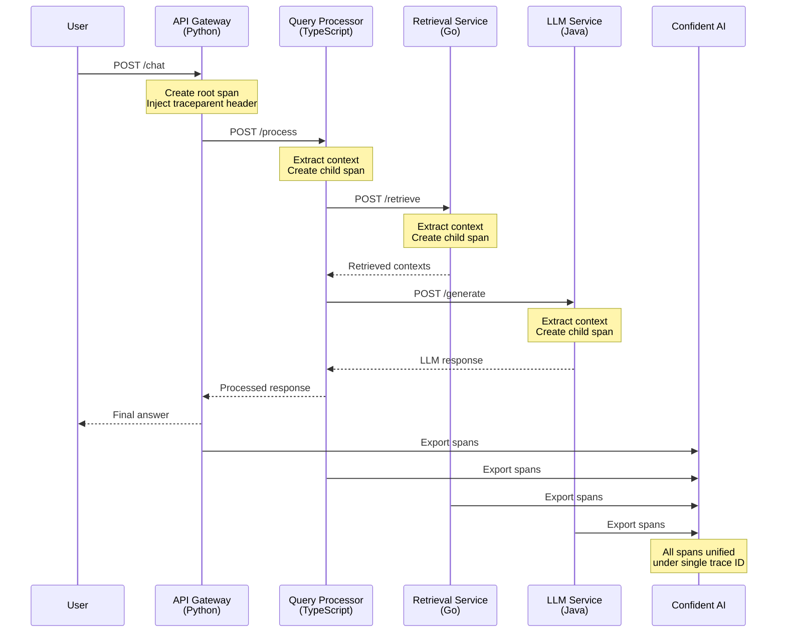
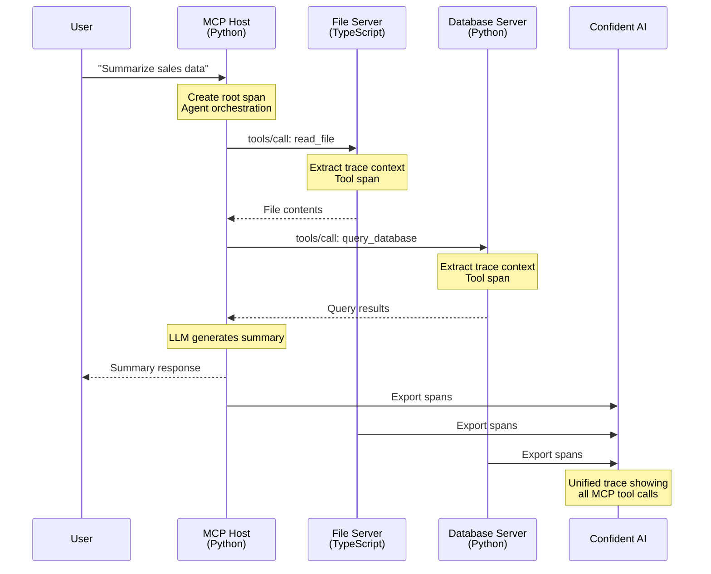

Distributed tracing allows you to track requests as they flow through multiple services in your system. OpenTelemetry provides built-in support for context propagation, enabling you to correlate spans across service boundaries.

## Overview

In a distributed system, a single user request might touch multiple services (e.g., an API gateway, an LLM orchestrator, a retrieval service). Distributed tracing helps you:

- Visualize the complete request flow across services
- Identify bottlenecks and latency issues
- Debug failures across service boundaries
- Understand dependencies between services

## Context Propagation

OpenTelemetry uses **context propagation** to link spans across services. When Service A calls Service B, it injects trace context into the request headers. Service B extracts this context and creates child spans under the same trace.

The key functions are:

- **Inject** - Adds trace context (`traceparent`, `tracestate` headers) to outgoing requests
- **Extract** - Reads trace context from incoming request headers to establish parent-child relationships

## Environment Setup

All services in the following examples need these environment variables:

```bash
export CONFIDENT_API_KEY="your-api-key"
export OTEL_EXPORTER_OTLP_ENDPOINT="https://otel.confident-ai.com"
```

## Multi-Language RAG Pipeline Example

This example demonstrates a complete RAG (Retrieval-Augmented Generation) pipeline with four services, each written in a different language. All services export traces to Confident AI, where they're unified into a single distributed trace.

### Architecture



---

### Service 1: API Gateway (Python)

The entry point that receives user requests and orchestrates the pipeline.

```python title="gateway/main.py" {8,44} maxLines=100
import os
import requests
from flask import Flask, request, jsonify
from opentelemetry import trace
from opentelemetry.sdk.trace import TracerProvider
from opentelemetry.sdk.trace.export import BatchSpanProcessor
from opentelemetry.exporter.otlp.proto.http.trace_exporter import OTLPSpanExporter
from opentelemetry.propagate import inject

app = Flask(__name__)

# OpenTelemetry setup
OTLP_ENDPOINT = os.getenv("OTEL_EXPORTER_OTLP_ENDPOINT")
CONFIDENT_API_KEY = os.getenv("CONFIDENT_API_KEY")

trace_provider = TracerProvider()
exporter = OTLPSpanExporter(
    endpoint=f"{OTLP_ENDPOINT}/v1/traces",
    headers={"x-confident-api-key": CONFIDENT_API_KEY},
)
trace_provider.add_span_processor(BatchSpanProcessor(exporter))
trace.set_tracer_provider(trace_provider)
tracer = trace.get_tracer("api-gateway")


@app.route("/chat", methods=["POST"])
def chat():
    user_query = request.json["query"]
    user_id = request.json.get("user_id", "anonymous")

    with tracer.start_as_current_span("api-gateway") as span:
        # Set trace-level attributes (apply to entire trace)
        span.set_attribute("confident.trace.name", "rag-pipeline")
        span.set_attribute("confident.trace.input", user_query)
        span.set_attribute("confident.trace.user_id", user_id)
        span.set_attribute("confident.trace.tags", ["rag", "production", "multi-language"])

        # Set span-level attributes
        span.set_attribute("confident.span.type", "agent")
        span.set_attribute("confident.span.input", user_query)

        # Inject trace context into headers for downstream service
        headers = {"Content-Type": "application/json"}
        inject(headers)

        # Call Query Processor (TypeScript service)
        response = requests.post(
            "http://query-processor:3000/process",
            json={"query": user_query},
            headers=headers
        )
        result = response.json()

        span.set_attribute("confident.span.output", result["answer"])
        span.set_attribute("confident.trace.output", result["answer"])

        return jsonify(result)


if __name__ == "__main__":
    app.run(host="0.0.0.0", port=8000)
```

**Dependencies:**

```bash
pip install flask opentelemetry-api opentelemetry-sdk opentelemetry-exporter-otlp-proto-http requests
```

---

### Service 2: Query Processor (TypeScript)

Processes the query and coordinates retrieval and generation.

```typescript title="query-processor/src/index.ts" {6,26,32-35,38,53} maxLines=100
import express from "express";
import * as opentelemetry from "@opentelemetry/api";
import { NodeTracerProvider } from "@opentelemetry/sdk-trace-node";
import { BatchSpanProcessor } from "@opentelemetry/sdk-trace-base";
import { OTLPTraceExporter } from "@opentelemetry/exporter-trace-otlp-proto";
import { W3CTraceContextPropagator } from "@opentelemetry/core";

const app = express();
app.use(express.json());

// OpenTelemetry setup
const OTLP_ENDPOINT = process.env.OTEL_EXPORTER_OTLP_ENDPOINT;
const CONFIDENT_API_KEY = process.env.CONFIDENT_API_KEY;

const provider = new NodeTracerProvider({
  spanProcessors: [
    new BatchSpanProcessor(
      new OTLPTraceExporter({
        url: `${OTLP_ENDPOINT}/v1/traces`,
        headers: { "x-confident-api-key": CONFIDENT_API_KEY || "" },
      })
    ),
  ],
});

opentelemetry.propagation.setGlobalPropagator(new W3CTraceContextPropagator());
opentelemetry.trace.setGlobalTracerProvider(provider);
const tracer = opentelemetry.trace.getTracer("query-processor");

app.post("/process", async (req, res) => {
  // Extract trace context from incoming headers
  const parentContext = opentelemetry.propagation.extract(
    opentelemetry.context.active(),
    req.headers
  );

  // Run within the extracted context
  await opentelemetry.context.with(parentContext, async () => {
    await tracer.startActiveSpan("query-processor", async (span) => {
      const query = req.body.query;

      span.setAttributes({
        "confident.span.type": "tool",
        "confident.tool.name": "query-processor",
        "confident.tool.description": "Processes and validates user queries",
        "confident.span.input": query,
      });

      // Prepare headers with trace context for downstream calls
      const headers: Record<string, string> = {
        "Content-Type": "application/json",
      };
      opentelemetry.propagation.inject(opentelemetry.context.active(), headers);

      // Call Retrieval Service (Go)
      const retrievalResponse = await fetch(
        "http://retrieval-service:8080/retrieve",
        {
          method: "POST",
          headers,
          body: JSON.stringify({ query }),
        }
      );
      const { contexts } = await retrievalResponse.json();

      // Call LLM Service (Java) with retrieved context
      const llmResponse = await fetch("http://llm-service:8081/generate", {
        method: "POST",
        headers,
        body: JSON.stringify({ query, contexts }),
      });
      const { answer } = await llmResponse.json();

      span.setAttribute(
        "confident.span.output",
        JSON.stringify({ answer, contexts })
      );
      span.end();

      res.json({ answer, contexts });
    });
  });
});

app.listen(3000, () => console.log("Query Processor running on port 3000"));
```

**Dependencies:**

```bash
npm install express @opentelemetry/api @opentelemetry/sdk-trace-node \
  @opentelemetry/sdk-trace-base @opentelemetry/exporter-trace-otlp-proto \
  @opentelemetry/core
```

---

### Service 3: Retrieval Service (Go)

Performs vector search to find relevant context.

```go title="retrieval-service/main.go" {12,29,43,45} maxLines=100
package main

import (
    "context"
    "encoding/json"
    "net/http"
    "os"

    "go.opentelemetry.io/otel"
    "go.opentelemetry.io/otel/attribute"
    "go.opentelemetry.io/otel/exporters/otlp/otlptrace/otlptracehttp"
    "go.opentelemetry.io/otel/propagation"
    sdktrace "go.opentelemetry.io/otel/sdk/trace"
)

var tracer = otel.Tracer("retrieval-service")

func initTracer() *sdktrace.TracerProvider {
    endpoint := os.Getenv("OTLP_ENDPOINT") // "otel.confident-ai.com"
    apiKey := os.Getenv("CONFIDENT_API_KEY")

    exporter, _ := otlptracehttp.New(context.Background(),
        otlptracehttp.WithEndpoint(endpoint),
        otlptracehttp.WithHeaders(map[string]string{"x-confident-api-key": apiKey}),
    )

    tp := sdktrace.NewTracerProvider(sdktrace.WithBatcher(exporter))
    otel.SetTracerProvider(tp)
    otel.SetTextMapPropagator(propagation.TraceContext{})
    return tp
}

type RetrievalRequest struct {
	Query string `json:"query"`
}

type RetrievalResponse struct {
	Contexts []string `json:"contexts"`
}

func retrieveHandler(w http.ResponseWriter, r *http.Request) {
	// Extract trace context from incoming headers
	ctx := otel.GetTextMapPropagator().Extract(r.Context(), propagation.HeaderCarrier(r.Header))

	_, span := tracer.Start(ctx, "vector-search")
	defer span.End()

	var req RetrievalRequest
	json.NewDecoder(r.Body).Decode(&req)

	// Set retriever span attributes
	span.SetAttributes(
		attribute.String("confident.span.type", "retriever"),
		attribute.String("confident.retriever.embedder", "text-embedding-3-small"),
		attribute.String("confident.span.input", req.Query),
		attribute.Int("confident.retriever.top_k", 3),
		attribute.Int("confident.retriever.chunk_size", 512),
	)

	// Simulate vector search results
	contexts := []string{
		"Paris is the capital and largest city of France, with a population of over 2 million.",
		"France is a country in Western Europe, known for its rich history and culture.",
		"The Eiffel Tower, built in 1889, is located in Paris and stands 330 meters tall.",
	}

	span.SetAttributes(
		attribute.StringSlice("confident.retriever.retrieval_context", contexts),
	)

	w.Header().Set("Content-Type", "application/json")
	json.NewEncoder(w).Encode(RetrievalResponse{Contexts: contexts})
}

func main() {
	tp := initTracer()
	defer tp.Shutdown(context.Background())

	http.HandleFunc("/retrieve", retrieveHandler)
	http.ListenAndServe(":8080", nil)
}
```

**Dependencies:**

```bash
go mod init retrieval-service
go get go.opentelemetry.io/otel
go get go.opentelemetry.io/otel/sdk/trace
go get go.opentelemetry.io/otel/exporters/otlp/otlptrace/otlptracehttp
```

---

### Service 4: LLM Service (Java)

Generates the final response using an LLM.

```java title="llm-service/src/main/java/com/example/LlmService.java" {6-7,56-68,71-73} maxLines=100
package com.example;

import io.opentelemetry.api.GlobalOpenTelemetry;
import io.opentelemetry.api.trace.Span;
import io.opentelemetry.api.trace.Tracer;
import io.opentelemetry.context.Context;
import io.opentelemetry.context.propagation.TextMapGetter;
import io.opentelemetry.exporter.otlp.http.trace.OtlpHttpSpanExporter;
import io.opentelemetry.sdk.OpenTelemetrySdk;
import io.opentelemetry.sdk.trace.SdkTracerProvider;
import io.opentelemetry.sdk.trace.export.BatchSpanProcessor;
import com.sun.net.httpserver.HttpServer;
import com.sun.net.httpserver.HttpExchange;
import com.google.gson.Gson;

import java.io.*;
import java.net.InetSocketAddress;
import java.util.List;
import java.util.Map;

public class LlmService {
    private static final Gson gson = new Gson();
    private static Tracer tracer;

    public static void main(String[] args) throws IOException {
        initTracer();

        HttpServer server = HttpServer.create(new InetSocketAddress(8081), 0);
        server.createContext("/generate", LlmService::handleGenerate);
        server.start();
        System.out.println("LLM Service running on port 8081");
    }

    private static void initTracer() {
        String endpoint = System.getenv("OTEL_EXPORTER_OTLP_ENDPOINT");
        String apiKey = System.getenv("CONFIDENT_API_KEY");

        OtlpHttpSpanExporter exporter = OtlpHttpSpanExporter.builder()
            .setEndpoint(endpoint + "/v1/traces")
            .addHeader("x-confident-api-key", apiKey)
            .build();

        SdkTracerProvider tracerProvider = SdkTracerProvider.builder()
            .addSpanProcessor(BatchSpanProcessor.builder(exporter).build())
            .build();

        OpenTelemetrySdk.builder()
            .setTracerProvider(tracerProvider)
            .buildAndRegisterGlobal();

        tracer = GlobalOpenTelemetry.getTracer("llm-service");
    }

    private static void handleGenerate(HttpExchange exchange) throws IOException {
        // Extract trace context from headers
        Context extractedContext = GlobalOpenTelemetry.getPropagators()
            .getTextMapPropagator()
            .extract(Context.current(), exchange.getRequestHeaders(), new TextMapGetter<>() {
                @Override
                public Iterable<String> keys(com.sun.net.httpserver.Headers carrier) {
                    return carrier.keySet();
                }
                @Override
                public String get(com.sun.net.httpserver.Headers carrier, String key) {
                    List<String> values = carrier.get(key);
                    return values != null && !values.isEmpty() ? values.get(0) : null;
                }
            });

        // Create span within extracted context
        Span span = tracer.spanBuilder("llm-generation")
            .setParent(extractedContext)
            .startSpan();

        try {
            // Parse request
            InputStreamReader reader = new InputStreamReader(exchange.getRequestBody());
            Map<String, Object> request = gson.fromJson(reader, Map.class);
            String query = (String) request.get("query");
            List<String> contexts = (List<String>) request.get("contexts");

            // Set LLM span attributes
            span.setAttribute("confident.span.type", "llm");
            span.setAttribute("confident.llm.model", "gpt-4o");
            span.setAttribute("confident.span.input", gson.toJson(Map.of(
                "messages", List.of(
                    Map.of("role", "system", "content", "Context: " + String.join(" ", contexts)),
                    Map.of("role", "user", "content", query)
                )
            )));

            // Simulate LLM response
            String answer = "Paris is the capital of France. It is the largest city in France " +
                           "with over 2 million residents, and is home to the iconic Eiffel Tower, " +
                           "which was built in 1889 and stands 330 meters tall.";

            span.setAttribute("confident.span.output", answer);
            span.setAttribute("confident.llm.input_token_count", 180);
            span.setAttribute("confident.llm.output_token_count", 52);

            // Send response
            String response = gson.toJson(Map.of("answer", answer));
            exchange.getResponseHeaders().set("Content-Type", "application/json");
            exchange.sendResponseHeaders(200, response.length());
            exchange.getResponseBody().write(response.getBytes());

        } finally {
            span.end();
            exchange.close();
        }
    }
}
```

**Dependencies (Maven pom.xml):**

```xml
<dependencies>
    <dependency>
        <groupId>io.opentelemetry</groupId>
        <artifactId>opentelemetry-api</artifactId>
        <version>1.32.0</version>
    </dependency>
    <dependency>
        <groupId>io.opentelemetry</groupId>
        <artifactId>opentelemetry-sdk</artifactId>
        <version>1.32.0</version>
    </dependency>
    <dependency>
        <groupId>io.opentelemetry</groupId>
        <artifactId>opentelemetry-exporter-otlp</artifactId>
        <version>1.32.0</version>
    </dependency>
    <dependency>
        <groupId>com.google.code.gson</groupId>
        <artifactId>gson</artifactId>
        <version>2.10.1</version>
    </dependency>
</dependencies>
```

## MCP (Model Context Protocol) Example

[Model Context Protocol (MCP)](https://modelcontextprotocol.io/) is an open standard for connecting AI models to external tools, data sources, and services. This example shows how to implement distributed tracing across an MCP host and multiple MCP servers.

### Architecture



### Context Propagation in MCP

MCP uses JSON-RPC for communication. To propagate trace context, we include the W3C trace context in the request metadata:

```json
{
  "jsonrpc": "2.0",
  "method": "tools/call",
  "params": {
    "name": "read_file",
    "arguments": { "path": "/data/sales.csv" },
    "_meta": {
      "traceparent": "00-0af7651916cd43dd8448eb211c80319c-b7ad6b7169203331-01"
    }
  },
  "id": 1
}
```

---

### MCP Host (Python)

The MCP host orchestrates tool calls to multiple MCP servers.

```python title="mcp_host/main.py" {8,24,27-31,42,48} maxLines=100
import os
import json
import asyncio
from opentelemetry import trace
from opentelemetry.sdk.trace import TracerProvider
from opentelemetry.sdk.trace.export import BatchSpanProcessor
from opentelemetry.exporter.otlp.proto.http.trace_exporter import OTLPSpanExporter
from opentelemetry.trace.propagation.tracecontext import TraceContextTextMapPropagator
from mcp import ClientSession, StdioServerParameters
from mcp.client.stdio import stdio_client

# OpenTelemetry setup
OTLP_ENDPOINT = os.getenv("OTEL_EXPORTER_OTLP_ENDPOINT")
CONFIDENT_API_KEY = os.getenv("CONFIDENT_API_KEY")

trace_provider = TracerProvider()
exporter = OTLPSpanExporter(
    endpoint=f"{OTLP_ENDPOINT}/v1/traces",
    headers={"x-confident-api-key": CONFIDENT_API_KEY},
)
trace_provider.add_span_processor(BatchSpanProcessor(exporter))
trace.set_tracer_provider(trace_provider)
tracer = trace.get_tracer("mcp-host")
propagator = TraceContextTextMapPropagator()


def inject_trace_context() -> dict:
    """Inject current trace context into a dict for MCP metadata."""
    carrier = {}
    propagator.inject(carrier)
    return carrier


async def call_tool_with_tracing(session: ClientSession, tool_name: str, arguments: dict):
    """Call an MCP tool with trace context propagation."""
    with tracer.start_as_current_span(f"mcp-tool-{tool_name}") as span:
        span.set_attribute("confident.span.type", "tool")
        span.set_attribute("confident.tool.name", tool_name)
        span.set_attribute("confident.span.input", json.dumps(arguments))

        # Inject trace context into MCP request metadata
        trace_meta = inject_trace_context()

        # Call the MCP tool with trace context in _meta
        result = await session.call_tool(
            tool_name,
            arguments=arguments,
            _meta=trace_meta  # Pass trace context
        )

        span.set_attribute("confident.span.output", json.dumps(result.content))
        return result


async def process_query(query: str):
    """Process a user query using MCP tools."""
    with tracer.start_as_current_span("mcp-agent") as span:
        span.set_attribute("confident.trace.name", "mcp-tool-orchestration")
        span.set_attribute("confident.span.type", "agent")
        span.set_attribute("confident.span.input", query)
        span.set_attribute("confident.agent.name", "mcp-orchestrator")
        span.set_attribute("confident.agent.available_tools", [
            "read_file", "query_database", "write_file"
        ])

        # Connect to File Server (TypeScript)
        async with stdio_client(StdioServerParameters(
            command="npx",
            args=["ts-node", "file-server/index.ts"]
        )) as (read, write):
            async with ClientSession(read, write) as file_session:
                await file_session.initialize()

                # Call read_file tool with tracing
                file_result = await call_tool_with_tracing(
                    file_session,
                    "read_file",
                    {"path": "/data/sales.csv"}
                )

        # Connect to Database Server (Python)
        async with stdio_client(StdioServerParameters(
            command="python",
            args=["db-server/main.py"]
        )) as (read, write):
            async with ClientSession(read, write) as db_session:
                await db_session.initialize()

                # Call query_database tool with tracing
                db_result = await call_tool_with_tracing(
                    db_session,
                    "query_database",
                    {"sql": "SELECT * FROM sales WHERE year = 2024"}
                )

        # Generate summary (simulated LLM call)
        with tracer.start_as_current_span("llm-summarize") as llm_span:
            llm_span.set_attribute("confident.span.type", "llm")
            llm_span.set_attribute("confident.llm.model", "claude-3-5-sonnet")

            summary = "Sales increased 23% YoY with Q4 showing strongest growth."

            llm_span.set_attribute("confident.span.output", summary)

        span.set_attribute("confident.span.output", summary)
        return summary


async def main():
    result = await process_query("Summarize our 2024 sales data")
    print(f"Result: {result}")
    trace_provider.force_flush()


if __name__ == "__main__":
    asyncio.run(main())
```

**Dependencies:**

```bash
pip install mcp opentelemetry-api opentelemetry-sdk opentelemetry-exporter-otlp-proto-http
```

---

### MCP File Server (TypeScript)

An MCP server that provides file system tools.

```typescript title="file-server/index.ts" {7,25-26,54,57-63,66} maxLines=100
import { Server } from "@modelcontextprotocol/sdk/server/index.js";
import { StdioServerTransport } from "@modelcontextprotocol/sdk/server/stdio.js";
import * as opentelemetry from "@opentelemetry/api";
import { NodeTracerProvider } from "@opentelemetry/sdk-trace-node";
import { BatchSpanProcessor } from "@opentelemetry/sdk-trace-base";
import { OTLPTraceExporter } from "@opentelemetry/exporter-trace-otlp-proto";
import { W3CTraceContextPropagator } from "@opentelemetry/core";
import * as fs from "fs/promises";

// OpenTelemetry setup
const OTLP_ENDPOINT = process.env.OTEL_EXPORTER_OTLP_ENDPOINT;
const CONFIDENT_API_KEY = process.env.CONFIDENT_API_KEY;

const provider = new NodeTracerProvider({
  spanProcessors: [
    new BatchSpanProcessor(
      new OTLPTraceExporter({
        url: `${OTLP_ENDPOINT}/v1/traces`,
        headers: { "x-confident-api-key": CONFIDENT_API_KEY || "" },
      })
    ),
  ],
});

const propagator = new W3CTraceContextPropagator();
opentelemetry.propagation.setGlobalPropagator(propagator);
opentelemetry.trace.setGlobalTracerProvider(provider);
const tracer = opentelemetry.trace.getTracer("mcp-file-server");

// Create MCP server
const server = new Server(
  { name: "file-server", version: "1.0.0" },
  { capabilities: { tools: {} } }
);

// Define tools
server.setRequestHandler("tools/list", async () => ({
  tools: [
    {
      name: "read_file",
      description: "Read contents of a file",
      inputSchema: {
        type: "object",
        properties: {
          path: { type: "string", description: "File path to read" },
        },
        required: ["path"],
      },
    },
  ],
}));

server.setRequestHandler("tools/call", async (request) => {
  const { name, arguments: args, _meta } = request.params;

  // Extract trace context from MCP metadata
  let parentContext = opentelemetry.context.active();
  if (_meta?.traceparent) {
    parentContext = opentelemetry.propagation.extract(
      opentelemetry.context.active(),
      _meta
    );
  }

  // Execute within parent context
  return opentelemetry.context.with(parentContext, async () => {
    return tracer.startActiveSpan(`tool-${name}`, async (span) => {
      span.setAttributes({
        "confident.span.type": "tool",
        "confident.tool.name": name,
        "confident.tool.description": "MCP file system tool",
        "confident.span.input": JSON.stringify(args),
      });

      try {
        if (name === "read_file") {
          const content = await fs.readFile(args.path, "utf-8");
          span.setAttribute("confident.span.output", content.slice(0, 1000));
          span.end();
          return { content: [{ type: "text", text: content }] };
        }

        throw new Error(`Unknown tool: ${name}`);
      } catch (error) {
        span.recordException(error as Error);
        span.end();
        throw error;
      }
    });
  });
});

// Start server
const transport = new StdioServerTransport();
server.connect(transport);
```

**Dependencies:**

```bash
npm install @modelcontextprotocol/sdk @opentelemetry/api @opentelemetry/sdk-trace-node \
  @opentelemetry/sdk-trace-base @opentelemetry/exporter-trace-otlp-proto @opentelemetry/core
```

---

### MCP Database Server (Python)

An MCP server that provides database query tools.

```python title="db-server/main.py" {7,23,47,49-51,53-55} maxLines=100
import os
import json
from opentelemetry import trace
from opentelemetry.sdk.trace import TracerProvider
from opentelemetry.sdk.trace.export import BatchSpanProcessor
from opentelemetry.exporter.otlp.proto.http.trace_exporter import OTLPSpanExporter
from opentelemetry.trace.propagation.tracecontext import TraceContextTextMapPropagator
from mcp.server import Server
from mcp.server.stdio import stdio_server

# OpenTelemetry setup
OTLP_ENDPOINT = os.getenv("OTEL_EXPORTER_OTLP_ENDPOINT")
CONFIDENT_API_KEY = os.getenv("CONFIDENT_API_KEY")

trace_provider = TracerProvider()
exporter = OTLPSpanExporter(
    endpoint=f"{OTLP_ENDPOINT}/v1/traces",
    headers={"x-confident-api-key": CONFIDENT_API_KEY},
)
trace_provider.add_span_processor(BatchSpanProcessor(exporter))
trace.set_tracer_provider(trace_provider)
tracer = trace.get_tracer("mcp-db-server")
propagator = TraceContextTextMapPropagator()

# Create MCP server
server = Server("db-server")


@server.list_tools()
async def list_tools():
    return [
        {
            "name": "query_database",
            "description": "Execute a SQL query",
            "inputSchema": {
                "type": "object",
                "properties": {
                    "sql": {"type": "string", "description": "SQL query to execute"},
                },
                "required": ["sql"],
            },
        }
    ]


@server.call_tool()
async def call_tool(name: str, arguments: dict, _meta: dict = None):
    # Extract trace context from MCP metadata
    parent_context = None
    if _meta and "traceparent" in _meta:
        parent_context = propagator.extract(carrier=_meta)

    with tracer.start_as_current_span(
        f"tool-{name}",
        context=parent_context
    ) as span:
        span.set_attribute("confident.span.type", "tool")
        span.set_attribute("confident.tool.name", name)
        span.set_attribute("confident.tool.description", "MCP database tool")
        span.set_attribute("confident.span.input", json.dumps(arguments))

        if name == "query_database":
            sql = arguments["sql"]

            # Simulate database query
            results = [
                {"month": "Jan", "revenue": 125000},
                {"month": "Feb", "revenue": 142000},
                {"month": "Mar", "revenue": 158000},
            ]

            output = json.dumps(results)
            span.set_attribute("confident.span.output", output)

            return {"content": [{"type": "text", "text": output}]}

        raise ValueError(f"Unknown tool: {name}")


async def main():
    async with stdio_server() as (read, write):
        await server.run(read, write, server.create_initialization_options())


if __name__ == "__main__":
    import asyncio
    asyncio.run(main())
```

**Dependencies:**

```bash
pip install mcp opentelemetry-api opentelemetry-sdk opentelemetry-exporter-otlp-proto-http
```

---

### Resulting MCP Trace

When the MCP host orchestrates tool calls across servers, Confident AI displays:

```
📊 Trace: mcp-tool-orchestration
├── 🤖 mcp-agent ───────────────────────── 1.2s
│   ├── 🔧 mcp-tool-read_file ──────────── 45ms
│   │   └── 📄 tool-read_file (FS Server)── 42ms
│   ├── 🔧 mcp-tool-query_database ─────── 89ms
│   │   └── 🗄️ tool-query_database (DB)─── 85ms
│   └── 💬 llm-summarize ───────────────── 890ms
```

This gives you full visibility into:

- Which MCP tools were called
- Latency of each tool execution
- Input/output of each tool
- The complete agent orchestration flow

## Resulting Trace in Confident AI

When a request flows through all four services, Confident AI's Observatory displays a unified trace:

```
📊 Trace: rag-pipeline
├── 🐍 api-gateway (Python) ─────────────── 245ms
│   └── 📦 query-processor (TypeScript) ── 198ms
│       ├── 🔍 vector-search (Go) ──────── 23ms
│       └── 🤖 llm-generation (Java) ───── 156ms
```

Each span includes:

- **Timing data** - Latency for each service
- **Span type** - `agent`, `tool`, `retriever`, `llm`
- **Input/Output** - What each service received and returned
- **Custom attributes** - Model names, token counts, retrieval contexts

## Trace Context Headers

OpenTelemetry uses the [W3C Trace Context](https://www.w3.org/TR/trace-context/) standard for propagating trace information. The following headers are automatically injected/extracted:

| Header        | Description                                        |
| ------------- | -------------------------------------------------- |
| `traceparent` | Contains trace ID, parent span ID, and trace flags |
| `tracestate`  | Optional vendor-specific trace information         |

Example `traceparent` header:

```
traceparent: 00-0af7651916cd43dd8448eb211c80319c-b7ad6b7169203331-01
             │  │                                │                │
             │  │                                │                └─ Trace flags
             │  │                                └─ Parent span ID (16 hex chars)
             │  └─ Trace ID (32 hex chars)
             └─ Version
```

<Note>
  All services must use the **same `CONFIDENT_API_KEY`** to ensure spans are
  unified under a single trace in Confident AI Observatory. If services use
  different API keys, they'll export to different projects and the distributed
  trace won't be unified.
</Note>
