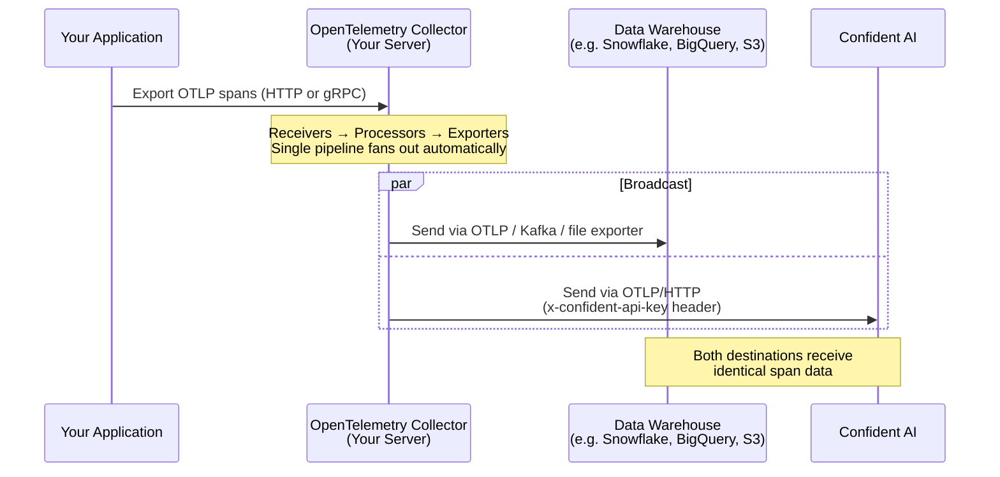
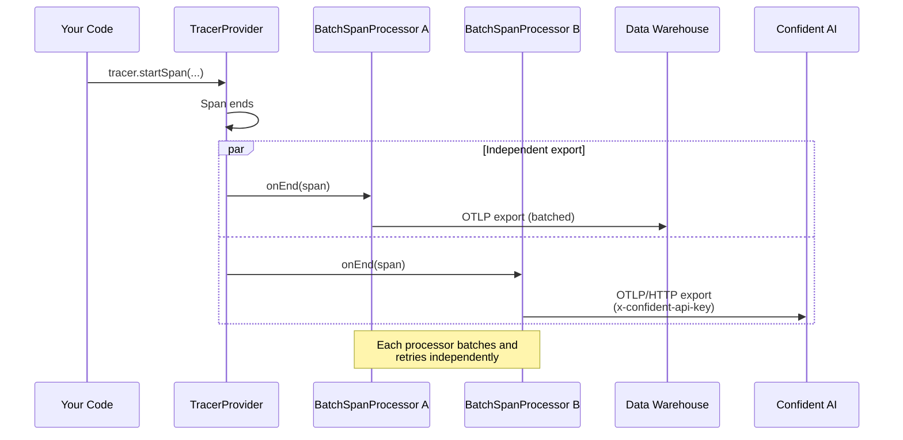
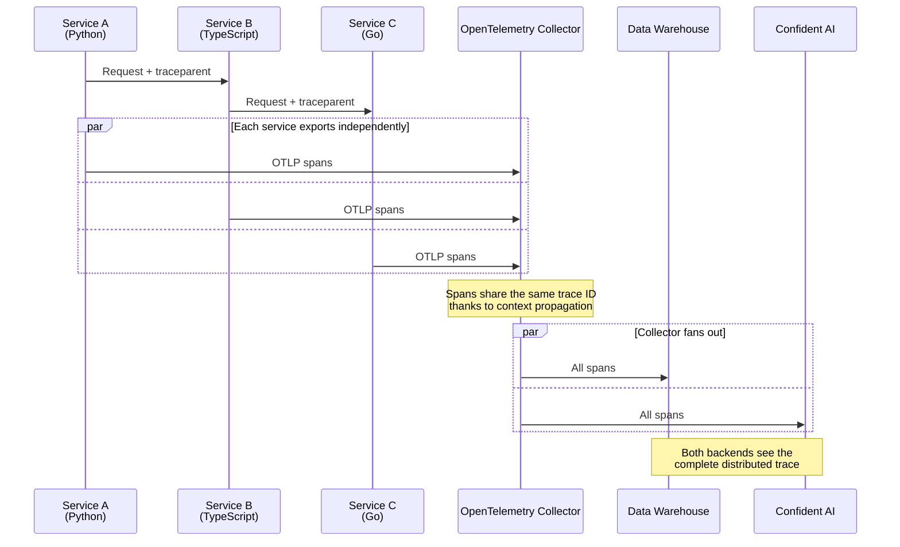

Trace broadcasting lets you send the same OpenTelemetry traces to multiple destinations at once — for example, your own data warehouse for long-term storage and analytics, plus Confident AI for LLM observability and online evaluations.

Because Confident AI accepts standard [OTLP/HTTP](https://opentelemetry.io/docs/specs/otlp/#otlphttp), any pipeline that can produce OTLP can broadcast a copy of every trace to `https://otel.confident-ai.com/v1/traces`. No proprietary protocol or wrapper SDK is required.

## Overview

Common reasons teams broadcast traces to multiple destinations:

- **Compliance / data residency** — store a copy of every trace in an internal warehouse (Snowflake, BigQuery, S3, Kafka) before anything leaves their network.
- **Vendor independence** — keep raw spans in their own infrastructure so they can switch or add observability vendors later.
- **Specialized backends** — use a general-purpose APM (Datadog, New Relic, Grafana Tempo, Jaeger) for service-level monitoring, and Confident AI for LLM-specific evaluation and Observatory views.
- **Sampling separation** — keep 100% of traces locally for debugging, but only send a sampled subset to external vendors to control cost.

There are two architectures that achieve this:

| Approach                       | Where fan-out happens     | When to use                                                                                              |
| ------------------------------ | ------------------------- | -------------------------------------------------------------------------------------------------------- |
| **OpenTelemetry Collector**    | A separate "trace server" | Recommended for production. Buffering, retries, sampling, PII scrubbing, and routing all centralized.    |
| **Multi-exporter in SDK**      | Inside the application    | Simpler. Good for single-service apps or when you don't want to deploy a Collector.                      |

<Note>
  Confident AI does **not** support gRPC for OTLP — only HTTP. When configuring
  the exporter that targets `otel.confident-ai.com`, use `otlphttp` (Collector)
  or the `OTLPSpanExporter` from the `proto-http` package (SDK).
</Note>

## Approach 1: OpenTelemetry Collector

The [OpenTelemetry Collector](https://opentelemetry.io/docs/collector/) is the canonical way to receive traces from your applications and fan them out to multiple destinations. Your services export OTLP to the Collector, and the Collector pipeline declares one or more exporters — every span flows to all of them.

### Architecture



### Minimal Collector configuration

This is the smallest config that fans every received trace out to both your own warehouse and Confident AI. Save it as `otel-collector-config.yaml`:

```yaml title="otel-collector-config.yaml"
receivers:
  otlp:
    protocols:
      http:
        endpoint: 0.0.0.0:4318
      grpc:
        endpoint: 0.0.0.0:4317

processors:
  batch:
    timeout: 5s
    send_batch_size: 512

exporters:
  # Your own data warehouse (replace with whatever exporter you use)
  otlphttp/warehouse:
    endpoint: https://traces.internal.yourcompany.com
    headers:
      authorization: Bearer ${env:WAREHOUSE_API_KEY}

  # Confident AI — must be otlphttp (gRPC is not supported)
  otlphttp/confident:
    endpoint: https://otel.confident-ai.com
    headers:
      x-confident-api-key: ${env:CONFIDENT_API_KEY}

service:
  pipelines:
    traces:
      receivers: [otlp]
      processors: [batch]
      exporters: [otlphttp/warehouse, otlphttp/confident]
```

When a single exporter list contains multiple exporters, the Collector automatically delivers every span to **all** of them — there is no extra configuration needed for fan-out.

Run it with the official Collector image:

```bash
docker run -p 4317:4317 -p 4318:4318 \
  -v $(pwd)/otel-collector-config.yaml:/etc/otelcol-contrib/config.yaml \
  -e CONFIDENT_API_KEY=confident_us... \
  -e WAREHOUSE_API_KEY=... \
  otel/opentelemetry-collector-contrib:latest
```

### Pointing your application at the Collector

Once the Collector is running, every service in your stack just exports OTLP to the Collector — they don't need to know about Confident AI or the warehouse at all. Set:

```bash
export OTEL_EXPORTER_OTLP_ENDPOINT="http://your-collector:4318"
```

Or in code:

<CodeBlocks>

```python
exporter = OTLPSpanExporter(endpoint="http://your-collector:4318/v1/traces")
```

```typescript
const exporter = new OTLPTraceExporter({
  url: "http://your-collector:4318/v1/traces",
});
```

```go
exporter, _ := otlptracehttp.New(context.Background(),
    otlptracehttp.WithEndpoint("your-collector:4318"),
    otlptracehttp.WithInsecure(),
)
```

```ruby
OpenTelemetry::Exporter::OTLP::Exporter.new(
  endpoint: "http://your-collector:4318/v1/traces"
)
```

```csharp
options.Endpoint = new Uri("http://your-collector:4318/v1/traces");
options.Protocol = OtlpExportProtocol.HttpProtobuf;
```

</CodeBlocks>

<Info>
  Notice that no application code mentions Confident AI directly. All routing
  decisions live in the Collector configuration, which means you can change
  destinations, add sampling, or scrub PII without touching service code.
</Info>

### Selective broadcasting with the routing processor

Sometimes you don't want every trace to go to every destination — for example, you might want to send 100% of traces to your warehouse but only LLM-related spans to Confident AI. The [`routing` connector](https://github.com/open-telemetry/opentelemetry-collector-contrib/tree/main/connector/routingconnector) handles this:

```yaml title="otel-collector-config.yaml"
connectors:
  routing:
    default_pipelines: [traces/warehouse]
    table:
      - context: span
        statement: route() where attributes["confident.span.type"] != nil
        pipelines: [traces/warehouse, traces/confident]

service:
  pipelines:
    traces/in:
      receivers: [otlp]
      processors: [batch]
      exporters: [routing]

    traces/warehouse:
      receivers: [routing]
      exporters: [otlphttp/warehouse]

    traces/confident:
      receivers: [routing]
      exporters: [otlphttp/confident]
```

In this example, every span goes to the warehouse, but only spans tagged with a `confident.span.type` attribute (LLM, agent, retriever, tool) are also sent to Confident AI.

### Tail-based sampling for cost control

If your warehouse handles high volume but you only want representative samples in Confident AI, add a [`tail_sampling`](https://github.com/open-telemetry/opentelemetry-collector-contrib/tree/main/processor/tailsamplingprocessor) processor on the Confident AI pipeline:

```yaml title="otel-collector-config.yaml"
processors:
  batch:
    timeout: 5s

  tail_sampling/confident:
    decision_wait: 10s
    policies:
      - name: errors
        type: status_code
        status_code:
          status_codes: [ERROR]
      - name: random
        type: probabilistic
        probabilistic:
          sampling_percentage: 10

service:
  pipelines:
    traces/warehouse:
      receivers: [otlp]
      processors: [batch]
      exporters: [otlphttp/warehouse]

    traces/confident:
      receivers: [otlp]
      processors: [tail_sampling/confident, batch]
      exporters: [otlphttp/confident]
```

This sends 100% of traces to the warehouse and 10% (plus all error traces) to Confident AI.

### Scrubbing PII before broadcasting

Use the [`attributes`](https://github.com/open-telemetry/opentelemetry-collector-contrib/tree/main/processor/attributesprocessor) or [`redaction`](https://github.com/open-telemetry/opentelemetry-collector-contrib/tree/main/processor/redactionprocessor) processor to remove or hash sensitive fields before they leave your network:

```yaml title="otel-collector-config.yaml"
processors:
  attributes/redact:
    actions:
      - key: user.email
        action: hash
      - key: http.request.header.authorization
        action: delete

service:
  pipelines:
    traces:
      receivers: [otlp]
      processors: [attributes/redact, batch]
      exporters: [otlphttp/warehouse, otlphttp/confident]
```

### Sending to other observability vendors

The same pipeline pattern works with any OTLP-compatible backend. A few common examples:

```yaml title="otel-collector-config.yaml"
exporters:
  # Confident AI
  otlphttp/confident:
    endpoint: https://otel.confident-ai.com
    headers:
      x-confident-api-key: ${env:CONFIDENT_API_KEY}

  # Datadog
  datadog:
    api:
      key: ${env:DD_API_KEY}
      site: datadoghq.com

  # Honeycomb
  otlp/honeycomb:
    endpoint: api.honeycomb.io:443
    headers:
      x-honeycomb-team: ${env:HONEYCOMB_API_KEY}

  # Grafana Tempo / Jaeger / any OTLP backend
  otlp/tempo:
    endpoint: tempo.your-grafana.net:443
    headers:
      authorization: Basic ${env:TEMPO_BASIC_AUTH}

service:
  pipelines:
    traces:
      receivers: [otlp]
      processors: [batch]
      exporters:
        - otlphttp/confident
        - datadog
        - otlp/honeycomb
        - otlp/tempo
```

## Approach 2: Multi-Exporter SDK

If you don't want to deploy a Collector, you can attach **multiple span processors** to a single `TracerProvider` directly in your application. Every span the SDK creates is handed to each processor, and each processor exports independently.

### Architecture



### Implementation

The pattern is identical across languages: build two `OTLP` exporters (one per destination), wrap each in a `BatchSpanProcessor`, and register both on the same `TracerProvider`.

<Tabs>

<Tab title="Python">

Install dependencies:

```bash
pip install opentelemetry-api opentelemetry-sdk opentelemetry-exporter-otlp-proto-http
```

```python title="main.py"
import os
from opentelemetry import trace
from opentelemetry.sdk.trace import TracerProvider
from opentelemetry.sdk.trace.export import BatchSpanProcessor
from opentelemetry.exporter.otlp.proto.http.trace_exporter import OTLPSpanExporter

CONFIDENT_API_KEY = os.environ["CONFIDENT_API_KEY"]
WAREHOUSE_ENDPOINT = os.environ["WAREHOUSE_ENDPOINT"]
WAREHOUSE_API_KEY = os.environ["WAREHOUSE_API_KEY"]

# Exporter A: your own data warehouse
warehouse_exporter = OTLPSpanExporter(
    endpoint=f"{WAREHOUSE_ENDPOINT}/v1/traces",
    headers={"authorization": f"Bearer {WAREHOUSE_API_KEY}"},
)

# Exporter B: Confident AI
confident_exporter = OTLPSpanExporter(
    endpoint="https://otel.confident-ai.com/v1/traces",
    headers={"x-confident-api-key": CONFIDENT_API_KEY},
)

# Attach both as independent BatchSpanProcessors
trace_provider = TracerProvider()
trace_provider.add_span_processor(BatchSpanProcessor(warehouse_exporter))
trace_provider.add_span_processor(BatchSpanProcessor(confident_exporter))
trace.set_tracer_provider(trace_provider)

tracer = trace.get_tracer("my-llm-app")

with tracer.start_as_current_span("llm-call") as span:
    span.set_attribute("confident.trace.name", "example-trace")
    span.set_attribute("confident.span.type", "llm")
    span.set_attribute("confident.llm.model", "gpt-4o")
    span.set_attribute("confident.span.input", "What is the capital of France?")
    span.set_attribute("confident.span.output", "Paris")

trace_provider.force_flush()
```

</Tab>

<Tab title="TypeScript">

Install dependencies:

```bash
npm install @opentelemetry/api @opentelemetry/sdk-trace-node \
  @opentelemetry/sdk-trace-base @opentelemetry/exporter-trace-otlp-proto
```

```typescript title="index.ts"
import * as opentelemetry from "@opentelemetry/api";
import { NodeTracerProvider } from "@opentelemetry/sdk-trace-node";
import { BatchSpanProcessor } from "@opentelemetry/sdk-trace-base";
import { OTLPTraceExporter } from "@opentelemetry/exporter-trace-otlp-proto";

const CONFIDENT_API_KEY = process.env.CONFIDENT_API_KEY ?? "";
const WAREHOUSE_ENDPOINT = process.env.WAREHOUSE_ENDPOINT ?? "";
const WAREHOUSE_API_KEY = process.env.WAREHOUSE_API_KEY ?? "";

// Exporter A: your own data warehouse
const warehouseExporter = new OTLPTraceExporter({
  url: `${WAREHOUSE_ENDPOINT}/v1/traces`,
  headers: { authorization: `Bearer ${WAREHOUSE_API_KEY}` },
});

// Exporter B: Confident AI
const confidentExporter = new OTLPTraceExporter({
  url: "https://otel.confident-ai.com/v1/traces",
  headers: { "x-confident-api-key": CONFIDENT_API_KEY },
});

const provider = new NodeTracerProvider({
  spanProcessors: [
    new BatchSpanProcessor(warehouseExporter),
    new BatchSpanProcessor(confidentExporter),
  ],
});

opentelemetry.trace.setGlobalTracerProvider(provider);
const tracer = opentelemetry.trace.getTracer("my-llm-app");

async function main() {
  tracer.startActiveSpan("llm-call", (span) => {
    span.setAttributes({
      "confident.trace.name": "example-trace",
      "confident.span.type": "llm",
      "confident.llm.model": "gpt-4o",
      "confident.span.input": "What is the capital of France?",
      "confident.span.output": "Paris",
    });
    span.end();
  });

  await provider.shutdown();
}

main();
```

</Tab>

<Tab title="Go">

Install dependencies:

```bash
go get go.opentelemetry.io/otel \
       go.opentelemetry.io/otel/sdk/trace \
       go.opentelemetry.io/otel/exporters/otlp/otlptrace/otlptracehttp
```

```go title="main.go"
package main

import (
    "context"
    "log"
    "os"

    "go.opentelemetry.io/otel"
    "go.opentelemetry.io/otel/attribute"
    "go.opentelemetry.io/otel/exporters/otlp/otlptrace/otlptracehttp"
    sdktrace "go.opentelemetry.io/otel/sdk/trace"
)

func main() {
    ctx := context.Background()

    // Exporter A: your own data warehouse
    warehouseExporter, err := otlptracehttp.New(ctx,
        otlptracehttp.WithEndpoint(os.Getenv("WAREHOUSE_ENDPOINT")),
        otlptracehttp.WithHeaders(map[string]string{
            "authorization": "Bearer " + os.Getenv("WAREHOUSE_API_KEY"),
        }),
    )
    if err != nil {
        log.Fatal(err)
    }

    // Exporter B: Confident AI
    confidentExporter, err := otlptracehttp.New(ctx,
        otlptracehttp.WithEndpoint("otel.confident-ai.com"),
        otlptracehttp.WithHeaders(map[string]string{
            "x-confident-api-key": os.Getenv("CONFIDENT_API_KEY"),
        }),
    )
    if err != nil {
        log.Fatal(err)
    }

    // Register both batchers on the same TracerProvider
    tp := sdktrace.NewTracerProvider(
        sdktrace.WithBatcher(warehouseExporter),
        sdktrace.WithBatcher(confidentExporter),
    )
    otel.SetTracerProvider(tp)
    defer tp.Shutdown(ctx)

    _, span := otel.Tracer("my-llm-app").Start(ctx, "llm-call")
    span.SetAttributes(
        attribute.String("confident.trace.name", "example-trace"),
        attribute.String("confident.span.type", "llm"),
        attribute.String("confident.llm.model", "gpt-4o"),
        attribute.String("confident.span.input", "What is the capital of France?"),
        attribute.String("confident.span.output", "Paris"),
    )
    span.End()
}
```

</Tab>

<Tab title="Java">

Add to your `pom.xml`:

```xml
<dependency>
    <groupId>io.opentelemetry</groupId>
    <artifactId>opentelemetry-sdk</artifactId>
    <version>1.32.0</version>
</dependency>
<dependency>
    <groupId>io.opentelemetry</groupId>
    <artifactId>opentelemetry-exporter-otlp</artifactId>
    <version>1.32.0</version>
</dependency>
```

```java title="App.java"
import io.opentelemetry.api.trace.Span;
import io.opentelemetry.api.trace.Tracer;
import io.opentelemetry.exporter.otlp.http.trace.OtlpHttpSpanExporter;
import io.opentelemetry.sdk.OpenTelemetrySdk;
import io.opentelemetry.sdk.trace.SdkTracerProvider;
import io.opentelemetry.sdk.trace.export.BatchSpanProcessor;

public class App {
    public static void main(String[] args) {
        // Exporter A: your own data warehouse
        OtlpHttpSpanExporter warehouseExporter = OtlpHttpSpanExporter.builder()
            .setEndpoint(System.getenv("WAREHOUSE_ENDPOINT") + "/v1/traces")
            .addHeader("authorization", "Bearer " + System.getenv("WAREHOUSE_API_KEY"))
            .build();

        // Exporter B: Confident AI
        OtlpHttpSpanExporter confidentExporter = OtlpHttpSpanExporter.builder()
            .setEndpoint("https://otel.confident-ai.com/v1/traces")
            .addHeader("x-confident-api-key", System.getenv("CONFIDENT_API_KEY"))
            .build();

        // Attach both as independent BatchSpanProcessors
        SdkTracerProvider tracerProvider = SdkTracerProvider.builder()
            .addSpanProcessor(BatchSpanProcessor.builder(warehouseExporter).build())
            .addSpanProcessor(BatchSpanProcessor.builder(confidentExporter).build())
            .build();

        OpenTelemetrySdk sdk = OpenTelemetrySdk.builder()
            .setTracerProvider(tracerProvider)
            .buildAndRegisterGlobal();

        Tracer tracer = sdk.getTracer("my-llm-app");

        Span span = tracer.spanBuilder("llm-call").startSpan();
        span.setAttribute("confident.trace.name", "example-trace");
        span.setAttribute("confident.span.type", "llm");
        span.setAttribute("confident.llm.model", "gpt-4o");
        span.setAttribute("confident.span.input", "What is the capital of France?");
        span.setAttribute("confident.span.output", "Paris");
        span.end();

        tracerProvider.shutdown();
    }
}
```

</Tab>

<Tab title="Ruby">

Add to your `Gemfile`:

```ruby title="Gemfile"
source 'https://rubygems.org'

gem 'opentelemetry-sdk'
gem 'opentelemetry-exporter-otlp'
```

Install:

```bash
bundle install
```

```ruby title="app.rb"
require 'opentelemetry/sdk'
require 'opentelemetry/exporter/otlp'

CONFIDENT_API_KEY = ENV.fetch('CONFIDENT_API_KEY')
WAREHOUSE_ENDPOINT = ENV.fetch('WAREHOUSE_ENDPOINT')
WAREHOUSE_API_KEY  = ENV.fetch('WAREHOUSE_API_KEY')

OpenTelemetry::SDK.configure do |c|
  # Exporter A: your own data warehouse
  c.add_span_processor(
    OpenTelemetry::SDK::Trace::Export::BatchSpanProcessor.new(
      OpenTelemetry::Exporter::OTLP::Exporter.new(
        endpoint: "#{WAREHOUSE_ENDPOINT}/v1/traces",
        headers:  { 'authorization' => "Bearer #{WAREHOUSE_API_KEY}" },
      )
    )
  )

  # Exporter B: Confident AI
  c.add_span_processor(
    OpenTelemetry::SDK::Trace::Export::BatchSpanProcessor.new(
      OpenTelemetry::Exporter::OTLP::Exporter.new(
        endpoint: 'https://otel.confident-ai.com/v1/traces',
        headers:  { 'x-confident-api-key' => CONFIDENT_API_KEY },
      )
    )
  )
end

tracer = OpenTelemetry.tracer_provider.tracer('my-llm-app')

tracer.in_span('llm-call') do |span|
  span.set_attribute('confident.trace.name', 'example-trace')
  span.set_attribute('confident.span.type', 'llm')
  span.set_attribute('confident.llm.model', 'gpt-4o')
  span.set_attribute('confident.span.input', 'What is the capital of France?')
  span.set_attribute('confident.span.output', 'Paris')
end

OpenTelemetry.tracer_provider.shutdown
```

</Tab>

<Tab title="C#">

Add NuGet packages:

```bash
dotnet add package OpenTelemetry
dotnet add package OpenTelemetry.Exporter.OpenTelemetryProtocol
```

```csharp title="Program.cs"
using System;
using OpenTelemetry;
using OpenTelemetry.Exporter;
using OpenTelemetry.Resources;
using OpenTelemetry.Trace;

var confidentApiKey  = Environment.GetEnvironmentVariable("CONFIDENT_API_KEY");
var warehouseEndpoint = Environment.GetEnvironmentVariable("WAREHOUSE_ENDPOINT");
var warehouseApiKey   = Environment.GetEnvironmentVariable("WAREHOUSE_API_KEY");

// AddOtlpExporter() can be called multiple times — each registers a new
// BatchExportProcessor under the hood, giving us fan-out for free.
using var tracerProvider = Sdk.CreateTracerProviderBuilder()
    .SetResourceBuilder(ResourceBuilder.CreateDefault().AddService("my-llm-app"))
    .AddSource("my-llm-app")

    // Exporter A: your own data warehouse
    .AddOtlpExporter(o =>
    {
        o.Endpoint = new Uri($"{warehouseEndpoint}/v1/traces");
        o.Headers  = $"authorization=Bearer {warehouseApiKey}";
        o.Protocol = OtlpExportProtocol.HttpProtobuf;
    })

    // Exporter B: Confident AI
    .AddOtlpExporter(o =>
    {
        o.Endpoint = new Uri("https://otel.confident-ai.com/v1/traces");
        o.Headers  = $"x-confident-api-key={confidentApiKey}";
        o.Protocol = OtlpExportProtocol.HttpProtobuf;
    })
    .Build();

var tracer = tracerProvider.GetTracer("my-llm-app");

using (var span = tracer.StartActiveSpan("llm-call"))
{
    span.SetAttribute("confident.trace.name", "example-trace");
    span.SetAttribute("confident.span.type", "llm");
    span.SetAttribute("confident.llm.model", "gpt-4o");
    span.SetAttribute("confident.span.input", "What is the capital of France?");
    span.SetAttribute("confident.span.output", "Paris");
}

tracerProvider.ForceFlush();
```

</Tab>

</Tabs>

<Info>
  Each `BatchSpanProcessor` maintains its own queue, batch timer, and retry
  state. A failure or backpressure on one destination does **not** affect the
  other — your warehouse export is fully isolated from Confident AI export.
</Info>

## Combining with Distributed Tracing

If you already use [distributed tracing](/integrations/opentelemetry/distributed-tracing) across multiple services, trace broadcasting plugs in cleanly. The recommended setup is to point all services at a shared Collector, and let the Collector handle the broadcast:



Because trace context (`traceparent`) is propagated end-to-end, every destination receives a complete, unified trace — not fragmented pieces from each service.

<Note>
  All services must use the **same `CONFIDENT_API_KEY`** when exporting to
  Confident AI (whether directly or via the Collector). Different keys route to
  different projects and break trace unification.
</Note>

## Best Practices

### Always set Confident AI attributes

Broadcasting only changes *where* spans go, not *what* they contain. Spans must still carry the `confident.*` attributes (e.g. `confident.span.type`, `confident.span.input`, `confident.llm.model`) for them to render correctly in [Observatory](/llm-tracing/introduction). See [Span-Level Attribute Mappings](/integrations/opentelemetry#span-level-attribute-mappings) for the full reference.

### Prefer a Collector for production

Even though the SDK approach works, a Collector is strongly recommended once you have more than one service, because:

- A single buffer absorbs spikes instead of every app holding its own queue.
- Failures (network blips to Confident AI or your warehouse) only affect the Collector — your apps stay snappy.
- You can change destinations, add sampling, or scrub PII without redeploying any application code.

### Use HTTP for the Confident AI exporter

Confident AI's OTLP endpoint accepts **HTTP only** ([as noted in the main OpenTelemetry guide](/integrations/opentelemetry#otel-endpoints)). Using `otlp` (gRPC) targeting `otel.confident-ai.com` will fail. Use `otlphttp` in the Collector and `OTLPSpanExporter` from `opentelemetry-exporter-otlp-proto-http` in the SDK.

### Set the environment per destination

You can use [`OTEL_RESOURCE_ATTRIBUTES`](/integrations/opentelemetry#advanced-configurations) to control which Confident AI [environment](/llm-tracing/features/environment) traces land in:

```bash
OTEL_RESOURCE_ATTRIBUTES="confident.trace.environment=production"
```

If you want different environments for different destinations, run two pipelines in the Collector and apply different resource processors to each.

### Verify both sinks separately

When debugging missing traces, test each destination in isolation. Disable one exporter at a time in the Collector pipeline (or comment out one `BatchSpanProcessor` in the SDK) to confirm whether the issue is upstream (your app) or in one specific exporter.
