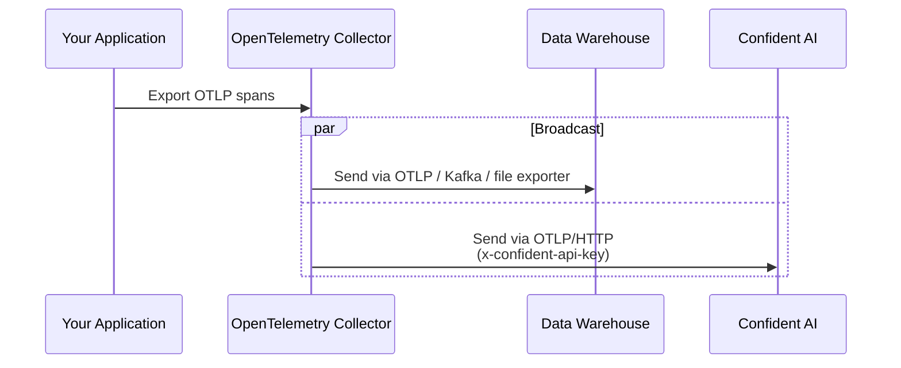
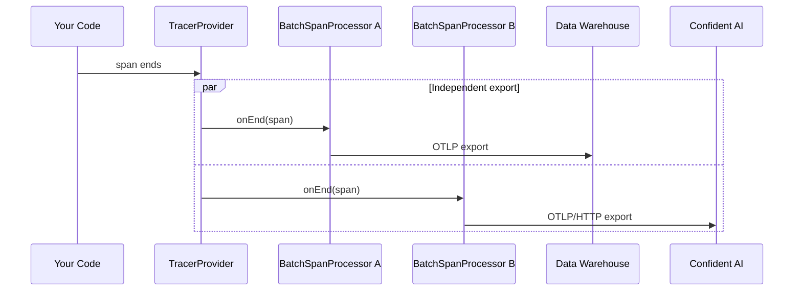
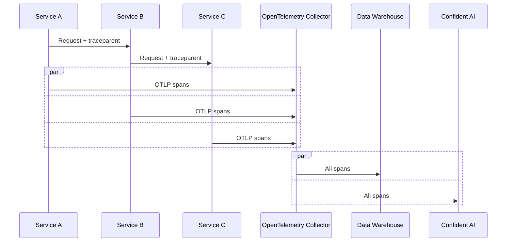

Trace broadcasting lets you send the same OpenTelemetry traces to multiple destinations at once — for example, your own data warehouse for long-term storage, plus Confident AI for LLM observability and online evaluations.

Because Confident AI accepts standard [OTLP/HTTP](https://opentelemetry.io/docs/specs/otlp/#otlphttp), any pipeline that produces OTLP can broadcast a copy of every trace to `https://otel.confident-ai.com/v1/traces`. No proprietary protocol or wrapper SDK is required.

## Overview

Common reasons teams broadcast traces:

- **Compliance / data residency** — keep a copy of every trace in an internal warehouse before anything leaves their network.
- **Vendor independence** — keep raw spans in their own infrastructure so they can switch or add observability vendors later.
- **Specialized backends** — use a general-purpose APM (Datadog, Tempo, Jaeger) for service monitoring, and Confident AI for LLM-specific evaluation.
- **Sampling separation** — keep 100% of traces locally for debugging, but only send a sampled subset externally.

Two architectures achieve this:

| Approach                       | Where broadcast happens   | When to use                                                                                       |
| ------------------------------ | ------------------------- | ------------------------------------------------------------------------------------------------- |
| **OpenTelemetry Collector**    | A separate trace server   | Recommended for production. Buffering, retries, sampling, and PII scrubbing are all centralized.  |
| **Multi-exporter in SDK**      | Inside the application    | Simpler. Good for single-service apps or when you don't want to run a Collector.                  |

<Note>
  Confident AI does **not** support gRPC for OTLP — only HTTP. Use `otlphttp`
  (Collector) or `OTLPSpanExporter` from the `proto-http` package (SDK).
</Note>

## Approach 1: Collector

The [OpenTelemetry Collector](https://opentelemetry.io/docs/collector/) receives OTLP from your services and broadcasts to multiple destinations. Every exporter listed in a pipeline gets a copy of every span — no extra config required.

### Architecture



### Configuration

```yaml title="otel-collector-config.yaml"
receivers:
  otlp:
    protocols:
      http:
      grpc:

exporters:
  otlphttp/warehouse:
    endpoint: https://traces.internal.yourcompany.com
    headers:
      authorization: Bearer ${env:WAREHOUSE_API_KEY}

  otlphttp/confident:
    endpoint: https://otel.confident-ai.com
    headers:
      x-confident-api-key: ${env:CONFIDENT_API_KEY}

service:
  pipelines:
    traces:
      receivers: [otlp]
      exporters: [otlphttp/warehouse, otlphttp/confident]
```

Listing both exporters in the same `traces` pipeline is all that's needed — every span goes to both.

### Selective broadcast

To send only LLM-tagged spans to Confident AI while keeping 100% in the warehouse, use the [`routing` connector](https://github.com/open-telemetry/opentelemetry-collector-contrib/tree/main/connector/routingconnector):

```yaml title="otel-collector-config.yaml"
connectors:
  routing:
    default_pipelines: [traces/warehouse]
    table:
      - context: span
        statement: route() where attributes["confident.span.type"] != nil
        pipelines: [traces/warehouse, traces/confident]
```

### Sampling

To keep 100% locally but only sample 10% (plus all errors) to Confident AI:

```yaml title="otel-collector-config.yaml"
processors:
  tail_sampling/confident:
    decision_wait: 10s
    policies:
      - name: errors
        type: status_code
        status_code: { status_codes: [ERROR] }
      - name: random
        type: probabilistic
        probabilistic: { sampling_percentage: 10 }
```

Apply it to the Confident AI pipeline only, leaving the warehouse pipeline unsampled.

### PII scrubbing

Strip or hash sensitive fields before they leave your network:

```yaml title="otel-collector-config.yaml"
processors:
  attributes/redact:
    actions:
      - { key: user.email, action: hash }
      - { key: http.request.header.authorization, action: delete }
```

Then add `attributes/redact` to the pipeline's `processors` list.

## Approach 2: Multi-Exporter SDK

Attach two `BatchSpanProcessor`s to a single `TracerProvider`. Each batches and retries independently — backpressure on one destination doesn't affect the other.

### Architecture



### Setup

<Tabs>

<Tab title="Python">

```python title="setup.py"
from opentelemetry import trace
from opentelemetry.sdk.trace import TracerProvider
from opentelemetry.sdk.trace.export import BatchSpanProcessor
from opentelemetry.exporter.otlp.proto.http.trace_exporter import OTLPSpanExporter

provider = TracerProvider()

provider.add_span_processor(BatchSpanProcessor(OTLPSpanExporter(
    endpoint=f"{WAREHOUSE_ENDPOINT}/v1/traces",
    headers={"authorization": f"Bearer {WAREHOUSE_API_KEY}"},
)))

provider.add_span_processor(BatchSpanProcessor(OTLPSpanExporter(
    endpoint="https://otel.confident-ai.com/v1/traces",
    headers={"x-confident-api-key": CONFIDENT_API_KEY},
)))

trace.set_tracer_provider(provider)
```

</Tab>

<Tab title="TypeScript">

```typescript title="setup.ts"
import { trace } from "@opentelemetry/api";
import { NodeTracerProvider } from "@opentelemetry/sdk-trace-node";
import { BatchSpanProcessor } from "@opentelemetry/sdk-trace-base";
import { OTLPTraceExporter } from "@opentelemetry/exporter-trace-otlp-proto";

const provider = new NodeTracerProvider({
  spanProcessors: [
    new BatchSpanProcessor(new OTLPTraceExporter({
      url: `${process.env.WAREHOUSE_ENDPOINT}/v1/traces`,
      headers: { authorization: `Bearer ${process.env.WAREHOUSE_API_KEY}` },
    })),
    new BatchSpanProcessor(new OTLPTraceExporter({
      url: "https://otel.confident-ai.com/v1/traces",
      headers: { "x-confident-api-key": process.env.CONFIDENT_API_KEY ?? "" },
    })),
  ],
});

trace.setGlobalTracerProvider(provider);
```

</Tab>

<Tab title="Go">

```go title="setup.go"
warehouseExp, _ := otlptracehttp.New(ctx,
    otlptracehttp.WithEndpoint(os.Getenv("WAREHOUSE_ENDPOINT")),
    otlptracehttp.WithHeaders(map[string]string{
        "authorization": "Bearer " + os.Getenv("WAREHOUSE_API_KEY"),
    }),
)

confidentExp, _ := otlptracehttp.New(ctx,
    otlptracehttp.WithEndpoint("otel.confident-ai.com"),
    otlptracehttp.WithHeaders(map[string]string{
        "x-confident-api-key": os.Getenv("CONFIDENT_API_KEY"),
    }),
)

tp := sdktrace.NewTracerProvider(
    sdktrace.WithBatcher(warehouseExp),
    sdktrace.WithBatcher(confidentExp),
)
otel.SetTracerProvider(tp)
```

</Tab>

<Tab title="Java">

```java title="Setup.java"
OtlpHttpSpanExporter warehouse = OtlpHttpSpanExporter.builder()
    .setEndpoint(System.getenv("WAREHOUSE_ENDPOINT") + "/v1/traces")
    .addHeader("authorization", "Bearer " + System.getenv("WAREHOUSE_API_KEY"))
    .build();

OtlpHttpSpanExporter confident = OtlpHttpSpanExporter.builder()
    .setEndpoint("https://otel.confident-ai.com/v1/traces")
    .addHeader("x-confident-api-key", System.getenv("CONFIDENT_API_KEY"))
    .build();

SdkTracerProvider provider = SdkTracerProvider.builder()
    .addSpanProcessor(BatchSpanProcessor.builder(warehouse).build())
    .addSpanProcessor(BatchSpanProcessor.builder(confident).build())
    .build();

OpenTelemetrySdk.builder()
    .setTracerProvider(provider)
    .buildAndRegisterGlobal();
```

</Tab>

<Tab title="Ruby">

```ruby title="setup.rb"
require 'opentelemetry/sdk'
require 'opentelemetry/exporter/otlp'

OpenTelemetry::SDK.configure do |c|
  c.add_span_processor(
    OpenTelemetry::SDK::Trace::Export::BatchSpanProcessor.new(
      OpenTelemetry::Exporter::OTLP::Exporter.new(
        endpoint: "#{ENV['WAREHOUSE_ENDPOINT']}/v1/traces",
        headers: { 'authorization' => "Bearer #{ENV['WAREHOUSE_API_KEY']}" },
      )
    )
  )

  c.add_span_processor(
    OpenTelemetry::SDK::Trace::Export::BatchSpanProcessor.new(
      OpenTelemetry::Exporter::OTLP::Exporter.new(
        endpoint: 'https://otel.confident-ai.com/v1/traces',
        headers: { 'x-confident-api-key' => ENV['CONFIDENT_API_KEY'] },
      )
    )
  )
end
```

</Tab>

<Tab title="C#">

```csharp title="Setup.cs"
using var provider = Sdk.CreateTracerProviderBuilder()
    .AddSource("my-llm-app")
    .AddOtlpExporter(o => {
        o.Endpoint = new Uri($"{Environment.GetEnvironmentVariable("WAREHOUSE_ENDPOINT")}/v1/traces");
        o.Headers  = $"authorization=Bearer {Environment.GetEnvironmentVariable("WAREHOUSE_API_KEY")}";
        o.Protocol = OtlpExportProtocol.HttpProtobuf;
    })
    .AddOtlpExporter(o => {
        o.Endpoint = new Uri("https://otel.confident-ai.com/v1/traces");
        o.Headers  = $"x-confident-api-key={Environment.GetEnvironmentVariable("CONFIDENT_API_KEY")}";
        o.Protocol = OtlpExportProtocol.HttpProtobuf;
    })
    .Build();
```

</Tab>

</Tabs>

After this, emit spans as you normally would — every span flows to both destinations.

## Combining with Distributed Tracing

If you already use [distributed tracing](/integrations/opentelemetry/distributed-tracing) across multiple services, point all services at a shared Collector and let it handle the broadcast:



Because `traceparent` is propagated end-to-end, every destination receives a complete, unified trace.

<Note>
  All services must use the **same `CONFIDENT_API_KEY`**. Different keys route
  to different projects and break trace unification.
</Note>

## Best Practices

### Set Confident AI attributes

Broadcasting only changes *where* spans go, not *what* they contain. Spans must still carry the `confident.*` attributes (e.g. `confident.span.type`, `confident.span.input`, `confident.llm.model`) to render correctly in [Observatory](/llm-tracing/introduction). See [Span-Level Attribute Mappings](/integrations/opentelemetry#span-level-attribute-mappings).

### Prefer the Collector in production

Once you have more than one service, a Collector is strongly recommended:

- A single buffer absorbs spikes instead of every app holding its own queue.
- Network blips to either destination only affect the Collector — your apps stay snappy.
- You can change destinations, sampling, or PII rules without redeploying app code.

### Use HTTP, not gRPC

Confident AI's OTLP endpoint accepts HTTP only. Use `otlphttp` in the Collector and `OTLPSpanExporter` from `opentelemetry-exporter-otlp-proto-http` in the SDK.

### Set environment per pipeline

Use [`OTEL_RESOURCE_ATTRIBUTES`](/integrations/opentelemetry#advanced-configurations) to control which Confident AI [environment](/llm-tracing/features/environment) traces land in:

```bash
OTEL_RESOURCE_ATTRIBUTES="confident.trace.environment=production"
```

For different environments per destination, run two Collector pipelines with different resource processors.

### Debug sinks in isolation

When traces look wrong, disable one exporter at a time to confirm whether the issue is upstream or specific to one destination.
