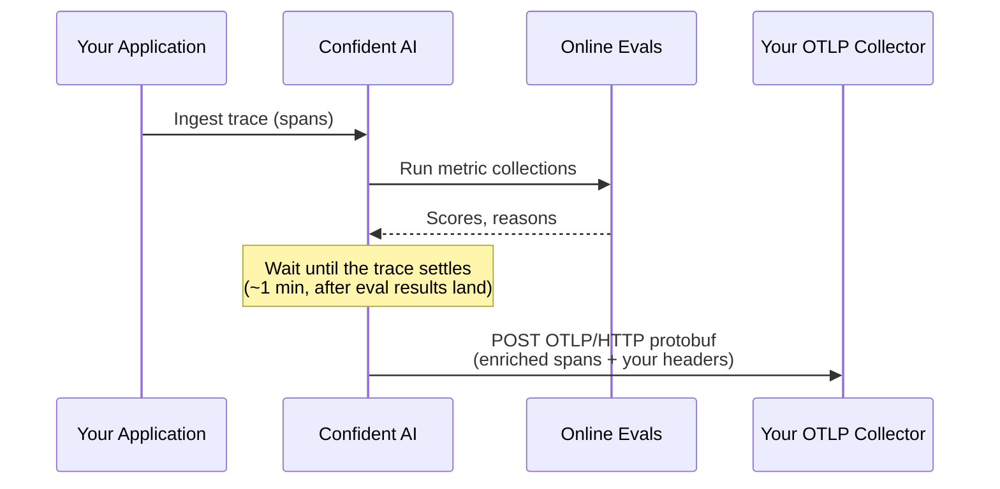

Trace forwarding sends every trace Confident AI ingests — enriched with [online evaluation](/llm-tracing/online-evals) scores, cost, and token usage — onward to your own OTLP/HTTP collector. It runs entirely server-side: you point Confident AI at a collector endpoint in the dashboard, and forwarding happens automatically for new traces. No SDK, exporter, or application change is required.

<Note>
  Forwarding is the **outbound** mirror of [Trace
  Broadcasting](/integrations/opentelemetry/trace-broadcasting). With
  broadcasting, **your** pipeline sends a copy of each trace *into* Confident AI.
  With forwarding, **Confident AI** sends each trace *out* to your collector —
  after it has been enriched with evaluation results. See [Forwarding vs.
  broadcasting](#forwarding-vs-broadcasting) below.
</Note>

## Overview

Once a trace is ingested and evaluated, teams often want that data in their own systems too. Forwarding is useful for:

- **Centralized observability** — land LLM traces (now carrying eval scores and cost) in the APM or trace backend you already run, like Datadog, Grafana Tempo, or Jaeger.
- **Long-term retention / compliance** — keep a copy of every trace in your own warehouse or data store.
- **Downstream pipelines** — feed evaluation results into your own dashboards, alerting, or data lake without polling the API.

Key properties:

- **Server-side** — configured per project in the dashboard; nothing to install or run.
- **Enriched** — forwarded spans include the `confident.*` and `gen_ai.*` attributes Confident AI computes, including [metric collection](/metrics/metric-collections) scores from online evaluations. This is data that only exists *after* ingestion.
- **Standard OTLP** — payloads are OTLP/HTTP protobuf, so any OTLP-compatible collector can receive them with no custom integration.

## How it works



- **Timing.** A trace is forwarded shortly after it finishes — once it has been quiet for about a minute with no new spans. Confident AI waits deliberately so that [online evaluation](/llm-tracing/online-evals) results are computed and included in the forwarded payload.
- **Delivery.** Transient failures (HTTP 429, 5xx, network errors, timeouts) are retried automatically with backoff. Delivery is *at-least-once*, and every forwarded trace keeps a stable trace ID — so if you receive a duplicate after a retry, deduplicate on trace ID.
- **Transport.** Confident AI sends OTLP over **HTTP with protobuf encoding** (`Content-Type: application/x-protobuf`). gRPC is not supported, and endpoints must use **HTTPS**.

## Set up a forwarding connector

A *forwarding connector* is a single destination: an endpoint, its auth headers, and an optional environment filter. You can configure up to **three** connectors per project. Managing connectors requires the `trace:evaluate` permission.

<Steps>

<Step title="Open the Forwarding tab">
  Go to **Project Settings → Exports → Forwarding** and click **Add connector**.
</Step>

<Step title="Configure the destination">
  Fill in the connector:

  - **Name** — a recognizable label, e.g. `Snowflake production`.
  - **Collector endpoint** — the HTTPS OTLP traces endpoint of your collector, e.g. `https://collector.example.com/v1/traces`.
  - **Environments** — which [environments](/llm-tracing/features/environment) to forward. Leave empty to forward all.
  - **Headers** — any auth headers your collector requires, such as `Authorization: Bearer <token>` or `x-api-key`. Header values are hidden after saving.
</Step>

<Step title="Test the connection">
  Click **Test connection**. Confident AI sends a minimal OTLP test span to the endpoint with your headers and reports whether the collector was reachable.
</Step>

<Step title="Save">
  Click **Save connector**. Forwarding begins automatically for traces ingested from then on. Use the toggle on each connector to pause or resume it without deleting its configuration.
</Step>

</Steps>

<Note>
  The endpoint must be a publicly reachable HTTPS URL. Confident AI rejects
  internal or non-routable addresses.
</Note>

## What gets forwarded

Each Confident AI trace is converted to an OTLP trace that preserves the original span tree, names, timestamps, and error status. Spans carry the same `confident.*` and GenAI semantic-convention `gen_ai.*` attributes used throughout Confident AI, plus enrichment added during ingestion — most notably online-evaluation scores.

A single LLM span, decoded from protobuf for readability, looks roughly like:

```json
{
  "resource": {
    "service.name": "confident-ai",
    "confident.project_id": "proj_abc123",
    "deployment.environment": "production"
  },
  "span": {
    "name": "generate_answer",
    "attributes": {
      "confident.span.type": "llm",
      "gen_ai.system": "openai",
      "gen_ai.request.model": "gpt-4o",
      "gen_ai.usage.input_tokens": 412,
      "gen_ai.usage.output_tokens": 87,
      "confident.metric.answer_relevancy.score": 0.92,
      "confident.metric.answer_relevancy.success": true
    }
  }
}
```

Beyond the per-span attributes above, forwarded traces also include trace-level context (name, tags, thread, and user), evaluation scores and reasons, human annotations, and any custom [metadata](/llm-tracing/features/metadata) — all under the `confident.*` namespace. For the full attribute vocabulary, see [Attribute mappings](/integrations/opentelemetry#span-level-attribute-mappings) on the OpenTelemetry page.

<Tip>
  Because forwarded spans follow standard OTLP and GenAI conventions, your
  collector can treat Confident AI like any other OTLP source. Put an
  OpenTelemetry Collector in front of
  your backend to route, filter, or transform spans without touching Confident AI.
</Tip>

## Monitor connectors

Each connector shows its recent delivery status in the **Forwarding** tab:

- **Last forwarded** — when a trace was most recently delivered (or *Never*).
- **Delivered / failed** — cumulative success and failure counts.
- **Last error** — the most recent error message, shown when a delivery fails.

A connector you've turned off shows a **Currently disabled** badge and stops forwarding until re-enabled. Deleting a connector stops forwarding to that collector immediately.

## Forwarding vs. broadcasting

Both get OTLP traces into your own systems, but they run in opposite directions and at different points in a trace's life:

|             | **Trace Forwarding** (this page)                | **[Trace Broadcasting](/integrations/opentelemetry/trace-broadcasting)** |
| ----------- | ----------------------------------------------- | ------------------------------------------------------------------------ |
| Direction   | Confident AI → your collector                   | Your app → Confident AI (and others)                                     |
| Runs        | Server-side, in Confident AI                    | Client-side, in your pipeline or SDK                                     |
| Setup       | Dashboard, no code                              | Collector config or SDK exporters                                        |
| Payload     | Enriched with eval scores and cost              | Raw spans as your app emits them                                         |
| Use when    | You want Confident AI's *evaluated* traces in your stack | You want a copy of *raw* traces in multiple backends            |

Broadcast when you need raw spans in your warehouse *before* they reach Confident AI; forward when you want Confident AI's evaluated traces in your stack *after* ingestion. The two are complementary.
