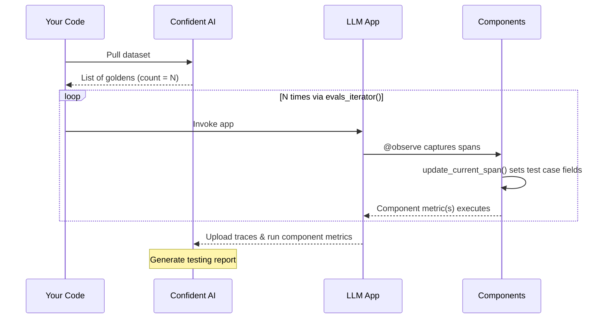

## Overview

Component-level testing lets you evaluate individual parts of your LLM application — retrievers, generators, tools, planners — rather than just the final output. This is essential for debugging complex pipelines where you need to pinpoint exactly which component is failing.

**Requirements:**

- A [dataset of goldens](/llm-evaluation/dataset-management/automate-dataset-management) — determines how many times your app runs
- [LLM tracing](/llm-tracing/quickstart) setup with `@observe` decorators
- [Metrics](/evaluation-metrics/introduction) defined per component via the `metrics` parameter in `@observe()`

<Warning>
  Component-level testing is currently only supported for users using `deepeval`
  Python, and **must run locally.** However, ad-hoc online-evals for components
  in production are still [available here.](/llm-tracing/evaluations)
</Warning>

## How It Works

1. Setup LLM tracing with `@observe` decorators and define `metrics` for each component
2. Pull your dataset from Confident AI
3. Loop through goldens using the `evals_iterator()` and invoke your LLM app



<Tip>
  Unlike end-to-end testing, you don't need to use `golden.input` to call your
  LLM app. The `evals_iterator()` simply controls how many times your app runs
  (once per golden). Test case fields are set via `update_current_span()` inside
  each component — the golden just determines the iteration count.
</Tip>

## Run Component-Level Tests Locally

This section is nearly identical to this part of the previous section, where we use LLM tracing to run end-to-end evals. This is because LLM tracing is just so convenient to evaluate everything and anything.

<Note>
  In this example we're basically just swapping `update_current_trace` with
  `update_current_span` instead.
</Note>

We're also using the same mock LLM app in the [previous section](/llm-evaluation/single-turn/end-to-end#how-it-works) to demonstrate LLM tracing:

<Accordion title="See Mock LLM App">

```python main.py
from openai import OpenAI

def llm_app(query: str) -> str:
    # Retriever for your vector db
    def retriever(query: str) -> list[str]:
        return ["List", "of", "text", "chunks"]
    # Generator that combines retrieved context with user query
    def generator(query: str, text_chunks: list[str]) -> str:
        return OpenAI().chat.completions.create(
            model="gpt-4o",
            messages=[
                {"role": "user", "content": query}
            ]
        ).choices[0].message.content
    # Calls retriever then generator
    return generator(query, retriever(query))
```

</Accordion>

<Steps>

<Step title="Setup LLM tracing, and define metrics">

Decorate your application with the `@observe` decorator, and provide `metrics` for components that you wish to evaluate:

```python main.py focus={5,8,11,14,18} maxLines=21
from openai import OpenAI
from deepeval.metrics import AnswerRelevancyMetric, ContextualRelevancyMetric
from deepeval.tracing import observe, update_current_span

@observe()
def llm_app(query: str) -> str:

    @observe(metrics=[ContextualRelevancyMetric()], embedder="your-embedding-model-name")
    def retriever(query: str) -> list[str]:
        chunks = ["List", "of", "text", "chunks"]
        update_current_span(input=query, retrieval_context=chunks)
        return chunks

    @observe(metrics=[AnswerRelevancyMetric()])
    def generator(query: str, text_chunks: list[str]) -> str:
        res = OpenAI().chat.completions.create(model="gpt-4o", messages=[{"role": "user", "content": query}]
        ).choices[0].message.content
        update_current_span(input=query, output=res)
        return res

    return generator(query, retriever(query))
```

The example above shows how we are tracing our LLM app by simply adding a few `@observe` decorators:

- Each `@observe` decorator creates a **span**, which represents **components**
- A **trace** on the other hand is created by the top-level `@observe` decorator, and is made up of many spans/components
- You include a list of `metrics` in `@observe()` for components you wish to evaluate, and call the `update_current_span` function inside said components to create test cases for evaluation

<Tip>

When you call `update_current_span()` to set `input`s, `output`s, `retrieval_context`s, etc. `deepeval` automatically maps these to create [`LLMTestCase`s.](/llm-evaluation/core-concepts/test-cases-goldens-datasets#test-cases)

</Tip>

</Step>

<Step title="Pull dataset, and loop through goldens">

Pull your dataset and use the `.evals_iterator()` to iterate. The iterator controls how many times your LLM app runs — once per golden in your dataset.

```python main.py
from deepeval.dataset import EvaluationDataset

dataset = EvaluationDataset()
dataset.pull(alias="YOUR-DATASET-ALIAS")

for _ in dataset.evals_iterator():
    llm_app("any input") # golden.input is optional for component-level testing
```

Since test case fields are populated via `update_current_span()` inside your components, you can pass any input to your LLM app — or use `golden.input` if your test scenarios require specific inputs.

Done ✅. You should see a link to your newly created sharable testing report.

<Frame caption="Component-Level Testing Report">
  <video
    autoPlay
    loop
    muted
    data-video="evaluation.singleTurnComponentLevel"
    type="video/mp4"
  />
</Frame>

</Step>

</Steps>

<Note>
You can also run your for-loop asynchronously:

```python focus={8-9}
import asyncio
from deepeval.dataset import EvaluationDataset

dataset = EvaluationDataset()
dataset.pull(alias="YOUR-DATASET-ALIAS")

for golden in dataset.evals_iterator():
    task = asyncio.create_task(a_llm_app(golden.input))
    dataset.evaluate(task)
```

</Note>

When you call your LLM app inside a dataset's `evals_iterator()`, `deepeval` automatically captures invocations of your LLM app and creates test cases dynamically based on the `@observe`ed component's hierarchy. Here are some more info about component-level evals:

- For components that are `@observe`ed but with no `metrics` attached, Confident AI will simply not test those components and display them as regular spans instead
- You would generally not use reference-based metrics for component-level testing. This is because goldens are designed to map 1-to-1 to test cases, which makes arguments such as `expected_output` redundant
