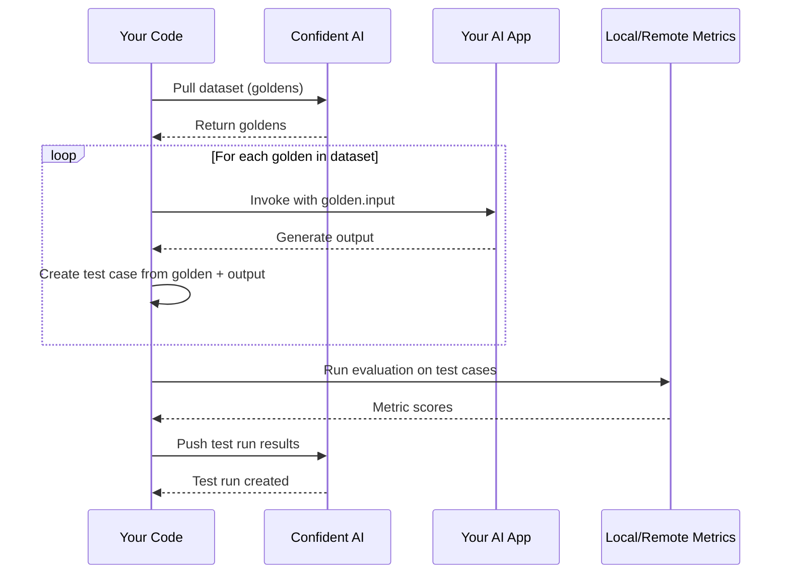

## Overview

In the previous section, we learnt how to push and queue goldens via Confident's Evals API. In this section, we will learn how to:

- Pull single and multi-turn datasets for evaluation
- Access custom column values from goldens
- Parse multi-modal goldens (images) into an evaluatable format
- Use the `evals_iterator` to run evals on single-turn datasets (Python only)

## How it works

Code-driven evals follow a similar process to [no-code evals](/llm-evaluation/no-code-evals/single-turn-evals#how-it-works), but you control the evaluation loop:

1. **Pull dataset** — fetch goldens from Confident AI using the Evals API
2. **Invoke AI app** — call your AI app with each golden's input
3. **Create test cases** — map golden fields and AI outputs into test cases
4. **Run evaluation** — execute metrics on your test cases and push results

Here's a visual representation of the data flow:



The key difference from no-code evals is that **you control the evaluation
loop** — pulling goldens, invoking your AI app, and constructing test cases
all happen in your code.

<Tip>
You can manage your datasets in any project by configuring a `CONFIDENT_API_KEY`.

- For default usage, set `CONFIDENT_API_KEY` as an environment variable.
- To target a specific project, pass a `confident_api_key` directly when creating the `EvaluationDataset`.

```python
from deepeval.dataset import EvaluationDataset

dataset = EvaluationDataset(confident_api_key="confident_us...")
dataset.delete(alias="YOUR-DATASET-ALIAS")
```

When both are provided, the `confident_api_key` passed to `EvaluationDataset` always takes precedence over the environment variable.

</Tip>

## Pull Goldens via Evals API

Datasets are either single or multi-turn, and you should know that pulling a single-turn dataset will give you single-turn goldens, and vice versa.

<Note>
  You will be responsible for mapping single-turn goldens to single-turn test
  cases, and vice versa.
</Note>

Pulling goldens via the Evals API will only pull **finalized** goldens by default. Below is a single-turn dataset example ([click here](/docs/llm-evaluation/code-driven/multi-turn) for multi-turn usage of datasets):

<Tabs>

<Tab title="Python" language="python">

<Steps>

<Step title="Pull goldens">

First use the `.pull()` method:

```python main.py
from deepeval.dataset import EvaluationDataset

dataset = EvaluationDataset()
dataset.pull(alias="YOUR-DATASET-ALIAS")

print(dataset.goldens) # Check it's pulled correctly
```

</Step>

<Step title="Construct test cases">

Then loop through your dataset of goldens to create a list of test cases:

```python main.py focus={7-13}
from deepeval.dataset import EvaluationDataset
from deepeval.test_case import LLMTestCase

dataset = EvaluationDataset()
dataset.pull(alias="YOUR-DATASET-ALIAS")

for golden in dataset.goldens:
    test_case = LLMTestCase(
        input=golden.input,
        actual_output=llm_app(golden.input),
        # map any additional fields here
    )
    dataset.add_test_case(test_case)
```

<Tip>
  For **multi-turn** datasets, you will create `ConversationalTestCase`s instead:

```python main.py
from deepeval.test_case import ConversationalTestCase

for golden in dataset.goldens:
  test_case = simulate(golden) # simulate conversation
  dataset.add_test_case(test_case)
```

</Tip>

</Step>

<Step title="Run an evaluation">

By calling `.add_test_case()` in the previous step, each time you run evaluate Confident AI will automatically associate any created test run with your dataset:

```python
from deepeval import evaluate

evaluate(test_cases=dataset.test_cases, metrics=[...])
```

</Step>

</Steps>

</Tab>
<Tab title="Typescript" language="typescript">

<Steps>

<Step title="Pull goldens">

First use the `.pull()` method:

```ts index.ts
import { EvaluationDataset } from "deepeval-ts";

const dataset = new EvaluationDataset();
dataset.pull({ alias: "YOUR-DATASET-ALIAS" });

console.log(dataset.goldens);
```

</Step>

<Step title="Construct test cases">

Then loop through your dataset of goldens to create a list of test cases:

```ts index.ts focus={7-13}
import { EvaluationDataset, Golden, LLMTestCase } from "deepeval-ts";

const dataset = new EvaluationDataset();
dataset.pull({ alias: "YOUR-DATASET-ALIAS" });

for (const golden of dataset.goldens as Golden[]) {
  const testCase = new LLMTestCase({
    input: golden.input,
    actualOutput: llmApp(golden.input),
    // map any additional fields here
  });

  dataset.addTestCase(testCase);
}
```

<Tip>
  For **multi-turn** datasets, you will create `ConversationalTestCase`s instead:

```ts index.ts
import {
  ConversationalGolden,
  ConversationSimulator,
  EvaluationDataset,
} from "deepeval-ts";

const dataset = new EvaluationDataset();
dataset.pull({ alias: "YOUR-DATASET-ALIAS" });

const simulator = new ConversationSimulator({ modelCallback: chatbotCallback });
const testCases = await simulator.simulate({
  conversationalGoldens: dataset.goldens as ConversationalGolden[],
});

for (const testCase of testCases) {
  dataset.addTestCase(testCase);
}
```

</Tip>

</Step>

<Step title="Run an evaluation">

By calling `.addTestCase()` in the previous step, each time you run evaluate Confident AI will automatically associate any created test run with your dataset:

```ts
import { ConversationalTestCase, EvaluationDataset, evaluate } from "deepeval-ts";

const dataset = new EvaluationDataset();
dataset.pull({ alias: "YOUR-DATASET-ALIAS" });

evaluate({
  conversationalTestCases: dataset.testCases as ConversationalTestCase[],
  metrics: [...],
});
```

</Step>

</Steps>

</Tab>
<Tab title="curL" language="curl">

<Steps>

<Step title="Pull goldens">

First, pull goldens using the `/v1/datasets` endpoint.

<EndpointRequestSnippet endpoint="GET /v1/datasets/{alias}" />

</Step>

<Step title="Construct test cases">

Construct a JSON array of test cases from the goldens you pulled, preserving the golden fields.

<Tabs>
  <Tab title="Single-Turn">
    ```json
    [
      {
        "input": "How tall is Mount Everest?",
        // Replace with your LLM app output
        "actualOutput": "Mount Everest is 9K meters tall."
      }
    ]
    ```
    <Accordion title="Click here to see the parameters for creating a single-turn test case">
      <Card title="Parameters of `LLMTestCase`" href="/docs/api-reference/evaluation/evaluate-llm#request.body.llmTestCases">
      <br />
        - input: `string`
        - actualOutput: `string`
        - name: `string`
        - expectedOutput: `string`
        - retrievalContext: `list of strings`
        - context: `list of strings`
        - toolsCalled: `list of ToolCall`
        - expectedTools: `list of ToolCall`
      </Card>
    </Accordion>
  </Tab>
  <Tab title="Multi-Turn">
    ```json
    [
      {
        "scenario": "User asking about Mount Everest height.",
        "turns": [
          { "role": "user", "content": "How tall is Mount Everest?" },
          { "role": "assistant", "content": "Mount Everest is 9K meters tall." }
          // Replace with your LLM app outputs
        ],
      }
    ]
    ```
    <Accordion title="Click here to see the parameters for creating a multi-turn test case">
      <Card title="Parameters of `ConversationalTestCase`" href="/docs/api-reference/evaluation/evaluate-llm#request.body.conversationalTestCases">
      <br />
        - turns: `list of Turn`
        - scenario: `string`
        - name: `string`
        - expectedOutput: `string`
        - userDescription: `string`
        - chatbotRole: `string`
      </Card>
    </Accordion>
  </Tab>
</Tabs>

</Step>

<Step title="Create metric collection">

Create a metric collection through `v1/metric-collections`.

<EndpointRequestSnippet endpoint="POST /v1/metric-collections" />

</Step>

<Step title="Run an evaluation">

Run an evaluation using the test cases you constructed and metric collection you created using `/v1/evaluate`.

<EndpointRequestSnippet endpoint="POST /v1/evaluate" />

</Step>

</Steps>

</Tab>

</Tabs>

## Using Custom Columns

If your dataset has custom columns, you can access them via the `custom_column_key_values` field on each golden:

<Tabs>

<Tab title="Python" language="python">

```python main.py
from deepeval.dataset import EvaluationDataset
from deepeval.test_case import LLMTestCase

dataset = EvaluationDataset()
dataset.pull(alias="YOUR-DATASET-ALIAS")

for golden in dataset.goldens:
    # Access custom column values
    difficulty = golden.custom_column_key_values.get("difficulty")
    category = golden.custom_column_key_values.get("category")

    # Use them in your test case or LLM app invocation
    test_case = LLMTestCase(
        input=golden.input,
        actual_output=llm_app(golden.input, difficulty=difficulty),
    )
    dataset.add_test_case(test_case)
```

</Tab>

<Tab title="Typescript" language="typescript">

```ts index.ts
import { EvaluationDataset, Golden, LLMTestCase } from "deepeval-ts";

const dataset = new EvaluationDataset();
await dataset.pull({ alias: "YOUR-DATASET-ALIAS" });

for (const golden of dataset.goldens as Golden[]) {
  // Access custom column values
  const difficulty = golden.customColumnKeyValues?.difficulty;
  const category = golden.customColumnKeyValues?.category;

  // Use them in your test case or LLM app invocation
  const testCase = new LLMTestCase({
    input: golden.input,
    actualOutput: await llmApp(golden.input, { difficulty }),
  });
  dataset.addTestCase(testCase);
}
```

</Tab>

</Tabs>

## Using Images

Any (list of) golden text fields (such as input, scenario, etc.) that contains an image will be in the format of [TODO].

For goldens containing images, here you can parse and use it accordingly as follows:

<Tabs>

<Tab title="Python" language="python">
  TODO
</Tab>

<Tab title="Typescript" language="typescript">
  TODO
</Tab>

<Tab title="curL" language="curl">
  TODO
</Tab>

</Tabs>

<Tip>

This is only required when using datasets in code - Confident AI automatically handles image parsing and conversion on the platform.

</Tip>

## Using Evals Iterator

Typically, you would just provide your dataset as a list of test cases for evaluation. However, if you're running **single-turn, end-to-end OR component-level** evaluations and using `deepeval` in Python, you can use the `evals_iterator()` instead:

```python main.py
from deepeval.dataset import EvaluationDataset

dataset = EvaluationDataset()
dataset.pull(alias="YOUR-DATASET-ALIAS")

for golden in dataset.evals_iterator():
    llm_app(golden.input) # Replace with your LLM app

# Async version
# import asyncio
#
# for golden in dataset.evals_iterator():
#    task = asyncio.create_task(a_llm_app(golden.input))
#    dataset.evaluate(task)
```

You'll need to trace your LLM app to make this work. Read this section on running [single-turn end-to-end evals with tracing](/docs/llm-evaluation/single-turn/end-to-end#llm-tracing-for-e2e-evals) to learn more.

## Datasets in CI/CD

Using datasets in CI/CD follows the same pattern as local evaluation — pull your dataset, create test cases, and run evaluation. The only difference is that you use `assert_test()` instead of `evaluate()` to integrate with `pytest`:

```python test_llm_app.py
import pytest
from deepeval.test_case import LLMTestCase
from deepeval.dataset import EvaluationDataset
from deepeval.metrics import AnswerRelevancyMetric
from deepeval import assert_test

dataset = EvaluationDataset()
dataset.pull(alias="YOUR-DATASET-ALIAS")

for golden in dataset.goldens:
    test_case = LLMTestCase(input=golden.input, actual_output=llm_app(golden.input))
    dataset.add_test_case(test_case)

@pytest.mark.parametrize("test_case", dataset.test_cases)
def test_llm_app(test_case: LLMTestCase):
    assert_test(test_case, metrics=[AnswerRelevancyMetric()])
```

Then run with `deepeval test run test_llm_app.py` to execute your tests. Learn more about setting up automated testing in the [Unit-Testing in CI/CD](/llm-evaluation/unit-testing-cicd) section.

## Next Steps

Now that you're familiar with the full dataset lifecycle, time to dive into running evaluations end to end.

<CardGroup cols={2}>
  <Card
    title="Single-Turn Evals"
    icon="arrow-right"
    href="/docs/llm-evaluation/code-driven/single-turn/end-to-end"
  >
    Run end-to-end or component-level evaluations on single-turn interactions.
  </Card>
  <Card
    title="Multi-Turn Evals"
    icon="comments"
    href="/docs/llm-evaluation/code-driven/multi-turn"
  >
    Evaluate conversational AI with multi-turn test cases.
  </Card>
</CardGroup>
