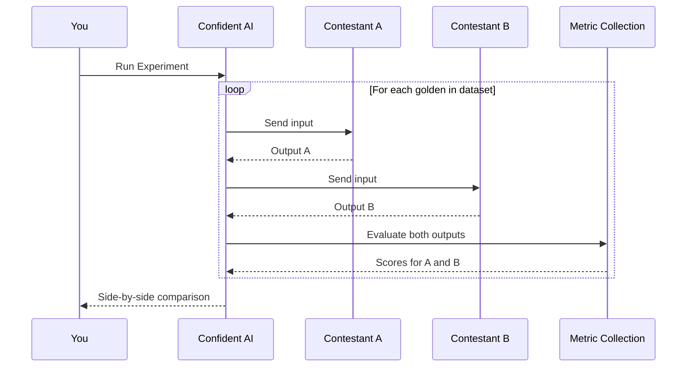

## Overview

Now that you've ran your AI app in the Arena (or created a test run), it's time to systematically find out **which version of your AI app is actually better**.

Experiments let you compare two or more versions of your AI app side-by-side, using the same dataset and metrics.

This is fundamentally different from running [single-turn](/llm-evaluation/no-code-evals/single-turn-evals) or [multi-turn](/llm-evaluation/no-code-evals/multi-turn-evals) evaluations:

- **Single/multi-turn evals** produce a single test run — a one-off snapshot of how one version of your AI app performs
- **Experiments** run the same dataset through multiple versions simultaneously and provide aggregate statistics to declare a winner

Think of it this way: evals answer "how good is this version?" while experiments answer "which version is better?"

<Frame caption="Experiment results comparison view showing multiple test runs">
  
</Frame>

<Note>
  Experiments require the **same dataset** and **same metric collection**. This
  ensures you're comparing apples to apples.
</Note>

## How to Experiment

You can kick off an experiment in two ways:

- **Arena** — you've been iterating on prompts and want to formalize the comparison
- **Existing Test Runs** — you already have test runs and want to compare them retroactively

Either way you'll get the same result, however running experiments from Arena will be the more natural workflow.

<Tip>

It is highly recommended that you only change one independent variable (such as the prompt version) at a time to ensure fair experimentation.

</Tip>

## Arena Experiments

As covered in the [Arena section](/docs/llm-evaluation/no-code-evals/arena), the Arena is great for quick, qualitative comparisons. But when you're ready to graduate from vibes to data, it's time to run a proper experiment.

Here's the key difference:

- **Arena** — fast feedback on a few inputs, great for exploration
- **Experiments** — run your entire dataset through each configuration and get statistically meaningful results

Here's what happens when you run an experiment:

For example, for an experiment with 4 contestants, 5 goldens, and 3 metrics, there will be a grand total of 20 (4 x 5) outputs generated and 60 (20 x 3) evaluations total.

<Steps>
  <Step title="Set up contestants">
    In the Arena, configure **at least 2 contestants**. Each can be a **Prompt** or **AI Connection** ([learn more](/docs/llm-evaluation/no-code-evals/quickstart#generating-ai-outputs)).

    <Frame caption="Arena with multiple contestants configured">

  
</Frame>

  </Step>

  <Step title="Run as Experiment">
    Click **Run as Experiment** in the top right corner. You'll see a dialog to configure your experiment:

    - **Experiment Name** — give it something memorable so you can find it later
    - **Dataset** — select the dataset to evaluate against
    - **Metric Collection** — select the metrics to score each output

    <Frame caption="Run Experiment dialog">

  
</Frame>

    <Tip>
      **Variables Mapping** is optional but highly recommended. If your prompts use variables like `{input}`, map them to golden fields here. Without this, every golden gets the same static prompt — not very useful for comparison.
    </Tip>

  </Step>

  <Step title="Analyze results">
    Confident AI generates outputs for each contestant across your entire dataset, then runs your metrics on every test case.

    When complete, you'll see:

    **Metrics Overview** — a side-by-side comparison of all contestants:
    - Average score per metric for each contestant
    - Winner indicator showing which contestant performed best on each metric
    - Score differences (e.g., +0.02, -0.01) relative to the base run

    <Tip>
      All differences are compared against the **base run**. You can switch which contestant is the base run to change your control — useful when you want to see how everything compares to a different baseline.
    </Tip>

    **Experiment Test Cases** — drill into individual goldens:
    - Score breakdown per metric × contestant
    - View the actual input, expected output, and each contestant's output
    - Link to view traces for deeper debugging

    <Frame caption="Analyzing experiment results from existing test runs">
      <video autoPlay loop muted data-video="experiments.overview" type="video/mp4" />
    </Frame>

  </Step>
</Steps>

<Tip>
  Running experiments from Arena is perfect when you're actively iterating. Set
  up your contestants, tweak prompts, and run experiments until you find a
  winner.
</Tip>

## Experiments with test runs

Already have test runs from previous evaluations? You can create an experiment directly from them — no need to re-run anything.

This is different from regression testing:

- **Regression Testing** — compare two test runs to spot what got better or worse
- **Experiments** — compare multiple test runs with aggregate statistics and declare a winner

<Steps>
  <Step title="Navigate to your test run">
    Go to **Test Runs** and select a test run you want to include in the experiment.
  </Step>

  <Step title="Create experiment">
    Click **Create Experiment** and select the other test runs you want to compare against.

    <Warning>
      Only test runs using the same dataset and metric collection can be compared in an experiment.
    </Warning>

    <Frame caption="Creating experiment from test run view">

  
</Frame>

  </Step>

  <Step title="Analyze results">
    The experiment view aggregates all your test runs and shows you:

    - **Winner by metric** — which version performed best on each metric
    - **Statistical significance** — confidence levels for the comparisons
    - **Score distributions** — visualize how scores varied across test cases

<Frame caption="Experiment results showing metrics overview and test cases">
  
</Frame>

  </Step>
</Steps>

## Reading Results

A good experiment tells you more than just "A is better than B." Here's what to look for:

- **Consistent winners** — if one contestant wins across all metrics, you have a clear choice
- **Trade-offs** — one contestant might be more relevant but less concise; decide what matters most
- **Close calls** — if scores are within a few percentage points, you may need more test cases for confidence
- **Outliers** — dig into test cases where one contestant dramatically outperformed or underperformed

[VIDEO: Experiment results with annotations explaining key sections such as traces and prompts side drawer]

## Next Steps

Now that you've run an experiment, the next step is making your results even more reliable. Your experiment is only as valid as the quality of your dataset. That means scaling your dataset and keeping it well-maintained.

<Card title="Datasets" icon="database" href="/docs/datasets">
  Learn how to grow, curate, and maintain your test datasets for better
  experiments.
</Card>
