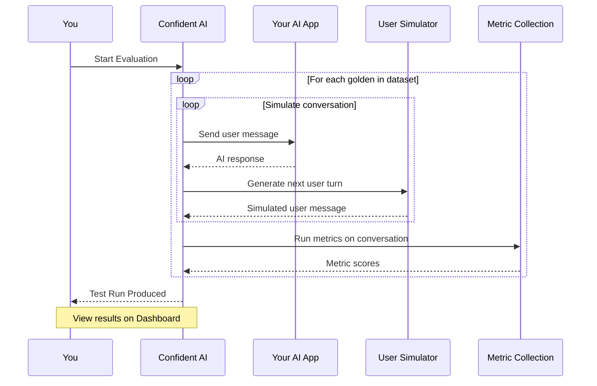

## Overview

Multi-turn evaluations test **conversational interactions** where context accumulates across multiple exchanges. These are use cases where the AI must maintain coherence throughout a conversation:

- **Chatbots** — customer support, sales assistants, or general-purpose chat
- **Conversational agents** — multi-step task completion with back-and-forth
- **Agentic systems** — complex workflows with tool calls and reasoning across turns

Unlike single-turn evals, multi-turn evals require generating the **entire conversation** before metrics can be applied, is the most time-consuming part of the process.

<Tip>

Fortunately, Confident AI handles the simulation aspect as well so you don't have to manually prompt your AI for hours on end.

</Tip>

## Requirements

To run a multi-turn evaluation, you need:

1. **A multi-turn dataset** — goldens with conversation starters or full conversation histories
2. **A multi-turn metric collection** — metrics designed for conversational evaluation

<Note>
  Multi-turn metrics evaluate the conversation as a whole, not individual
  messages. Examples include turn faithfulness and turn contextual relevancy.
</Note>

## How it works

Multi-turn evals follow a 5-step process — the key difference from single-turn is the **simulation step**:

1. **Define metrics** — choose conversational metrics (e.g., turn relevancy, conversation completeness)
2. **Create dataset** — build goldens with conversation starters
3. **Configure output generation** — set up your AI connection or prompt
4. **Simulate conversations** — generate full conversations by simulating user turns
5. **Evaluate** — run metrics against completed conversations

Here's a visual representation of the data flow:

<Warning>
  Because conversations must be fully simulated before evaluation, multi-turn
  evals can take slightly longer than single-turn. Plan accordingly for large
  datasets.
</Warning>

## Controlling Simulations

To control simulations within your dataset, you will have to edit the scenario, expected outcome, and user description fields of your `goldens`. Each field will control your simulations in a different way:

- **Scenario** — sets the context and topic of the conversation, guiding what the simulated user will discuss and what situation they are in (e.g., "User is trying to book a flight to Paris for next weekend")
- **Expected outcome** — defines the goal that must be achieved for the simulation to end successfully (e.g., "User successfully books a flight" or "User receives a refund confirmation")
- **User description** — shapes the simulated user's persona, tone, and behavior throughout the conversation (e.g., "A frustrated customer who is impatient and asks short, direct questions")

It is important to note that simulations will automatically end if the expected outcome is not met after the max number of user turns simulated. This can be configured in the dropdown settings of a multi-turn dataset.

## Run an Evaluation

<Steps>
  <Step title="Select your dataset and metrics">
    1. Navigate to **Project** > **Datasets**
    2. Select your dataset
    3. Click **Evaluate**
    4. Select your **Metric Collection**
  </Step>

  <Step title="Configure output generation">
    Select how your AI app will respond to each turn:

    <Tabs>
      <Tab title="Prompt">
        For prompt-based chatbots, select a prompt template that includes conversation history.

        1. Go to **Prompts** and create a prompt with variables like `{{messages}}` or `{{conversation_history}}`
        2. In the evaluation setup, select this prompt as your output generation method
        3. Confident AI calls your LLM for each turn, passing the conversation history
      </Tab>
      <Tab title="AI Connection">
        For deployed conversational systems, connect Confident AI directly to your HTTP endpoint.

        1. Go to **Settings** → **AI Connections** and create a connection
        2. Configure your endpoint to accept conversation history in the request payload
        3. In the evaluation setup, select this AI Connection as your output generation method
      </Tab>
    </Tabs>

  </Step>

  <Step title="Configure simulation">
    This is the critical step for multi-turn evals. Configure how Confident AI simulates user turns to generate complete conversations:

    - **Simulation model** — select the LLM that will simulate user responses
    - **Simulation instructions** — guide the simulator's persona and behavior (e.g., "Act as a frustrated customer trying to get a refund")
    - **Max turns** — set the maximum conversation length
    - **Stop conditions** — define when the conversation should end (e.g., goal achieved, user says goodbye)

    <Tip>
    Well-crafted simulation instructions are key to realistic conversations. Be specific about the user's goals, tone, and knowledge level.
    </Tip>

  </Step>

  <Step title="Run and view results">
    Click **Run Evaluation** and wait for simulations to complete. This may take longer than single-turn evals due to the conversation generation step.

    Your test run dashboard shows:

    - **Score distributions** — average, median, and percentiles for each metric
    - **Pass/fail results** — a conversation passes only if all metrics meet their thresholds
    - **Full conversation logs** — review the complete simulated conversations
    - **Turn-by-turn analysis** — see how the AI performed at each step

    <Frame caption="Multi-turn test run results">
      <video
        autoPlay
        loop
        muted
        data-video="evaluation.multiTurnReport"
        type="video/mp4"
      />
    </Frame>

  </Step>
</Steps>

## Regression Testing

Once you have **two or more test runs**, you can compare them side-by-side to identify regressions.

<Steps>
  <Step title="Open regression testing">
    1. Go to your test run's **A|B Regression Test** tab
    2. Click **New Regression Test**
    3. Select the test runs you want to compare
  </Step>

  <Step title="Analyze regressions">
    The comparison view highlights:

    - **Regressions** (red) — conversations that got worse
    - **Improvements** (green) — conversations that got better
    - **Side-by-side scores** — metric comparisons across runs

    <Frame caption="A|B regression testing">
      <video
        autoPlay
        loop
        muted
        data-video="evaluation.abRegressionTesting"
        type="video/mp4"
      />
    </Frame>

  </Step>
</Steps>

## Next Steps

<CardGroup cols={2}>
  <Card
    title="Single-Turn Evals"
    icon="arrow-right"
    href="/docs/llm-evaluation/no-code-evals/single-turn-evals"
  >
    Evaluate one-shot Q&A, summarization, and classification tasks.
  </Card>
  <Card
    title="Arena"
    icon="swords"
    href="/docs/llm-evaluation/no-code-evals/arena"
  >
    Compare prompts and models side-by-side in real-time.
  </Card>
</CardGroup>
