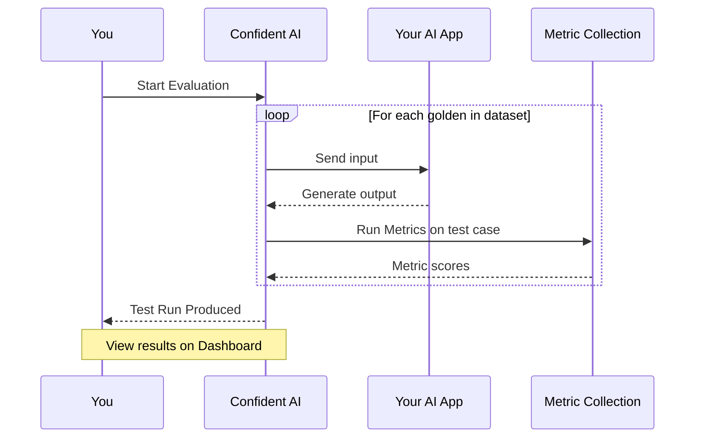

## Overview

Single-turn evaluations test **one input → one output** interactions. These are use cases where each request is independent and doesn't rely on conversation history:

- **Q&A systems** — answering questions from documents or knowledge bases
- **Summarization** — condensing long content into key points
- **Classification** — categorizing text into predefined labels
- **RAG pipelines** — retrieval-augmented generation with context

Single-turn evals treat your AI app as a black box — only the output, tools called, and retrieval context matter for evaluation.

## Requirements

To run a single-turn evaluation, you need:

1. **A single-turn [dataset](/docs/llm-evaluation/dataset-management/manage-datasets)** — goldens with `input` and optionally `expected_output`, `context`, etc.
2. **A single-turn [metric collection](/docs/metrics/metric-collections)** — the metrics you want to evaluate against

<Note>
  If you completed the
  [Quickstart](/docs/llm-evaluation/no-code-evals/quickstart), you already have
  both of these ready.
</Note>

## How it works

No-code evals follow a simple 4-step process:

1. **Define metrics** — choose what aspects of quality to measure (e.g., relevancy, faithfulness)
2. **Create dataset** — build goldens with parameters such as inputs and expected outputs
3. **Generate AI output** — provide actual outputs from your AI app
4. **Evaluate** — run metrics against your test cases and view results

Here's a visual representation on the data flow during evaluation:

<Tip>

Your "AI app" as shown in the diagram can be anything from single-prompt, multi-prompt, or full on any AI app reachable through the internet. More on this in later sections.

</Tip>

## Run an Evaluation

<Steps>
  <Step title="Select your dataset and metrics">
    1. Navigate to **Project** > **Datasets**, and select your single-turn dataset to evaluate
    2. Click **Evaluate**
    3. Select your single-turn **Metric Collection**
  </Step>

  <Step title="Configure output generation">
    Select how to generate actual outputs:

    <Tabs>
      <Tab title="Prompt">

<Frame caption="Configure prompt for single-turn evaluation">
  
</Frame>

        For single-prompt systems, select a prompt template that Confident AI will use to call your configured LLM provider.

        1. Select your desired prompt and the version of the prompt as your output generation method
        2. Map any golden fields from your current dataset to any variables defined within your prompt
        3. Confident AI calls your prompt for each golden and generates outputs automatically

        <Note>

You'll need an existing prompt for this to work. If you haven't already, you can create a prompt on the [Prompt Studio.](/docs/llm-evaluation/prompt-management/version-prompts)

</Note>

      </Tab>
      <Tab title="AI Connection">

<Frame caption="Configure AI Connection for single-turn evaluation">
  
</Frame>

        For deployed AI systems, connect Confident AI directly to your HTTP endpoint.

        1. Go to **Settings** → **AI Connections** and create a connection
        2. Configure your endpoint URL, request payload mapping, response parsing, and headers
        3. In the evaluation setup, select this AI Connection as your output generation method

        <Note>

You'll need an existing AI connection for this to work. If you haven't already, you can create an AI connection in [project settings.](/docs/settings/project/ai-connections)

</Note>

      </Tab>
    </Tabs>

  </Step>

  <Step title="Run and view results">
    Click **Run Evaluation** and wait for it to complete. You'll be redirected to your test run dashboard showing:

    - **Score distributions** — average, median, and percentiles for each metric
    - **Pass/fail results** — a test case passes only if all metrics meet their thresholds
    - **AI-generated summary** — automated analysis of patterns and issues
    - **Individual test cases** — drill down into specific failures

    <Frame caption="Single-turn test run results">
      <video
        autoPlay
        loop
        muted
        data-video="evaluation.singleTurnE2E"
        type="video/mp4"
      />
    </Frame>

  </Step>
</Steps>

## Regression Testing

Once you have **two or more test runs**, you can compare them side-by-side to identify regressions.

<Steps>
  <Step title="Open regression testing">
    1. Go to your test run's **A|B Regression Test** tab
    2. Click **New Regression Test**
    3. Select the test runs you want to compare
  </Step>

  <Step title="Analyze regressions">
    The comparison view highlights:

    - **Regressions** (red) — test cases that got worse
    - **Improvements** (green) — test cases that got better
    - **Side-by-side scores** — metric comparisons across runs

    <Frame caption="A|B regression testing">
      <video
        autoPlay
        loop
        muted
        data-video="evaluation.abRegressionTesting"
        type="video/mp4"
      />
    </Frame>

  </Step>
</Steps>

<Tip>
  Name your test runs with identifiers (e.g., "gpt-4o baseline", "claude-3.5
  v2") to make regression comparisons easier to track.
</Tip>

## Next Steps

<CardGroup cols={2}>
  <Card
    title="Multi-Turn Evals"
    icon="comments"
    href="/docs/llm-evaluation/no-code-evals/multi-turn-evals"
  >
    Evaluate conversational AI where context builds across multiple exchanges.
  </Card>
  <Card
    title="Arena"
    icon="swords"
    href="/docs/llm-evaluation/no-code-evals/arena"
  >
    Compare prompts and models side-by-side in real-time.
  </Card>
</CardGroup>
