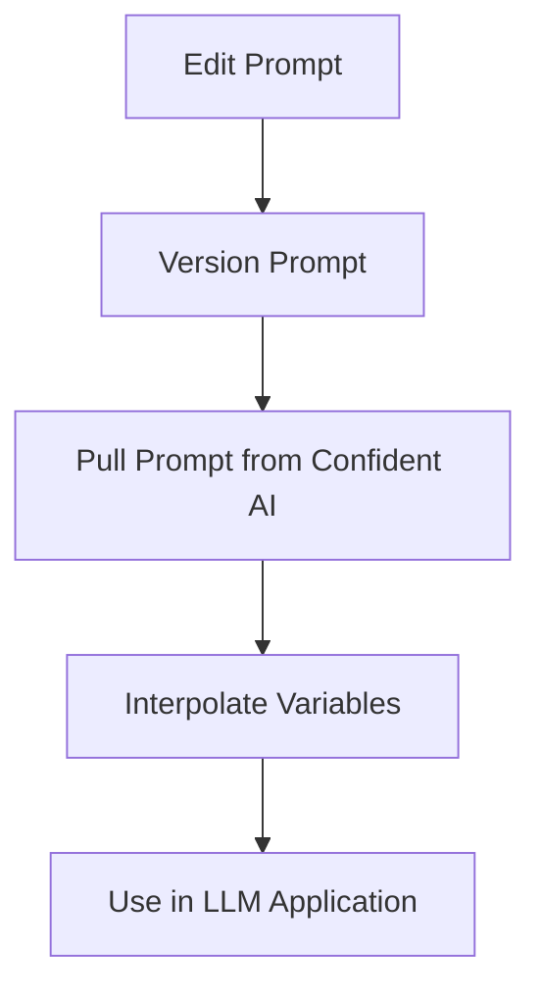

You can pull a prompt version from Confident AI like how you would pull a dataset. You should pull prompts once and save it in memory instead of pulling it everytime you need to use it.

<CodeBlock>

</CodeBlock>

## Code Summary

<CodeBlock>
```python {6, 9, 12}
from deepeval.prompt import Prompt

# Replace with your actual prompt alias
prompt = Prompt(alias="System Prompt")
# Defaults to latest version
prompt.pull()

# Customized accordingly based on your variables
prompt_to_llm = prompt.interpolate()

# Replace with your actual LLM app
output = your_llm_app(prompt_to_llm)
```
</CodeBlock>

## Pull a Prompt Version

Pull your prompt version from Confident AI by providing the `alias` you've defined:

<CodeBlock>
```python
from deepeval.prompt import Prompt

# Replace with your actual alias
prompt = Prompt(alias="System Prompt")
prompt.pull()

print(prompt._text_template)
```
</CodeBlock>

You'll notice that unlike the `pull()` method on an `EvaluationDataset`, the `alias` is actually defined on `Prompt` instantiation instead. This is because the `pull()` method on a `Prompt` is reserved to specify the version instead.

### Specify the Version

When no parameters are provided to the `pull()` method, the latest version is pulled by default. To specify the version, simply supply the `version` as an argument:

<CodeBlock>
```python
...

prompt.pull(version="00.00.01")
print(prompt._text_template)
```
</CodeBlock>

## Interpolate Variables

Now that you have your prompt template, use the `interpolate()` method to interpolate any dynamic variables you may have defined in your prompt version. For example, if you have a `{{ name }}` variable, it will look like this:

<CodeBlock>
```python
...

# Customized accordingly based on your variables
prompt_to_llm = prompt.interpolate(name="Joe")
```
</CodeBlock>

And if you don't have any variables, you should still use the `interpolate()` method to create a copy of your prompt template to be used in your LLM application.

<Error title="Warning">
Referencing the `template` variable in a `Prompt` class is extremely bad practice and should be **avoided at all cost**. Always use the `interpolate()` method before supplying prompt templates to your LLM application.
</Error>

## Pull a List of Prompt Messages

You pull prompt messages the same way you would pull a single prompt, the difference is it is now stored in the `_messages_template` variable instead, and you can print it out to see it for yourself:

<CodeBlock>
```python
from deepeval.prompt import Prompt

prompt = Prompt(alias="your-alias-here")
prompt.pull()
print(prompt._messages_template)
# [
#   PromptMessage(role="system", content="You are a helpful assistant."),
#   PromptMessage(role="user", content="What is the capital of France?"),
# ]

messages_to_llm = prompt.interpolate()
print(messages_to_llm)
# [
#   {"role": "system", "content": "You are a helpful assistant."},
#   {"role": "user", "content": "What is the capital of France?"}
# ]
```
</CodeBlock>

To be clear, here is an example of how you can use it for OpenAI's APIs:

<CodeBlock>
```python {9, 17}
from openai import OpenAI
from deepeval.prompt import Prompt

client = OpenAI()
prompt = Prompt(alias="your-alias-here")
prompt.pull()

# Don't forget to interpolate it
messages_to_llm = prompt.interpolate()

def your_llm_app(user_input: str):
    # Combine dynamically with user input
    messages = messages_to_llm + [{"role": "user", "content": user_input}]

    response = client.chat.completions.create(
        model="gpt-4",
        messages=messages
    )
    return response.choices[0].message.content

# Print the response
print(your_llm_app("Hi!"))
```
</CodeBlock>
