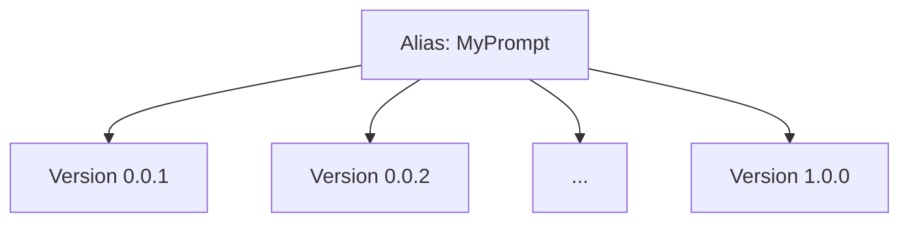

## Overview

Prompt versioning allows you to optimize and test different versions of your prompts. Managing prompts on Confident AI allows you to:

1. Collaborate and centralize where prompt is stored and edited, even for non-technical team members
2. Pinpoint which version, or even combination of your prompt versions, performed best

There are a million places you can keep your prompts - on GitHub, CSV files, in memory in code, Google Sheets, Notion, or even written in a diary hidden under your table drawer. But only by keeping on prompts on Confident AI can you fully leverage Confident AI's evaluation features.

<Note>
  Prompts are a type of hyperparameter on Confident AI. Other include things
  like models, embedders, top-K, and max tokens. When you run evals against
  prompts that kept on Confident AI, we can tell you which version performs
  best, and later automatically optimize it for you.
</Note>

## Two Types of Prompts

There are two types of prompts you can create:

- **(Single) Text Prompt**: Use this when you need a straightforward, one-off prompt for simple completions.
- **Prompt Message List**: Use this when you need to define multiple messages with specific roles (system, user, assistant) in an OpenAI messages format. This format is ideal for few-shot prompting, where you can start with a system message that sets the context.

<Tip>
  If you ever see a prompt being mentioned without any mention of "message" or
  "list", assume it is a single prompt we're talking about.
</Tip>

## Prompts vs Prompt Versions

In Confident AI, each prompt is identified by a unique `alias`. This `alias` acts as a unique identifier and refers to a single, specific prompt. Different aliases refer to completely separate prompts.

<Info title="Example">
Suppose you have a prompt with the alias `MyPrompt`. This prompt can have multiple versions, such as `0.0.1`, `0.0.2`, ..., up to `1.0.0`.



</Info>

A **prompt version** represents a different variation of the same prompt. Each `version` is an iteration or improvement of the original prompt, serving the same purpose but with adjustments—similar to how software versions evolve over time.

## Create a Prompt Version

You can create a prompt version in **Project** > **Prompt Studio** through two simple steps:

1. Create a text or messages prompt
2. Edit and commit an initial prompt version in the prompt editor

<Tip>A prompt cannot be both a text and message prompt at the same time.</Tip>

<Tabs>

<Tab title="Messages">

<Frame caption="Create Prompt Messages" background="subtle">

<video
  autoPlay
  loop
  muted
  src="https://confident-docs.s3.us-east-1.amazonaws.com/prompts:create-messages-4k.mp4"
  type="video/mp4"
/>

</Frame>

</Tab>

<Tab title="Text">

<Frame caption="Create Prompt Text" background="subtle">

<video
  autoPlay
  loop
  muted
  src="https://confident-docs.s3.us-east-1.amazonaws.com/prompts:create-text-4k.mp4"
  type="video/mp4"
/>

</Frame>

</Tab>

</Tabs>

Don't forget to **commit** an initial version of your prompt after you're done
editing it. Alternately, you can create a prompt version from code.

<Tabs>
<Tab title="Messages" language="python">
```python
from deepeval.prompt import Prompt, PromptMessage

prompt = Prompt(
  alias="YOUR-PROMPT-ALIAS",
  messages_template=[PromptMessage(role="...", content="...")]
)
prompt.version = "1.0.0"
prompt.push()
```
</Tab>

<Tab title="Text" language="python">
```python
from deepeval.prompt import Prompt

prompt = Prompt(
  alias="YOUR-PROMPT-ALIAS",
  text="..."
)
prompt.version = "1.0.0"
prompt.push()
```

</Tab>

</Tabs>

## Setting Dynamic Variables

You can include variables that can be interpolated dynamically in your LLM application later on. There are four ways currently for you to include variables:

- `{variable}`
- `{{ variable }}`
- `{{variable}}`
- `${variable}`

For example, the `{variable}` interpolation type must follow these rules:

1. No spaces in the variable name
2. Exactly one space between the braces and the variable name

For example:

```python
# ✅ Correct usage:
"Hi, my name is {name}."
"The temperature is {temperature} degrees."
"User input: {user_input}"

# ❌ Incorrect usage:

"Hi, my name is {variable name}." # Spaces in variable name
"Hi, my name is {variable_name }." # Extra spaces around variable name

```

## Using Conditional Logic

Apart from variables, Confident AI also supports [jinja templates](https://realpython.com/primer-on-jinja-templating/), which would allow you to render more complex logic such as conditional if/else blocks:

```txt If/Else

Welcome back, mighty admin {{ name }}!

Hello {{ name }}, you have regular access.

```

As well as for loops:

```txt For loop
Shopping List:

- {{ item }}

```

<Note>Jinja interpolated prompts are only available for Python users.</Note>

In the next section, we'll show you how to work with prompts you've created on Confident AI.

## Labelling Prompt Versions

You can also label different versions of your prompt in the **Version History** page so no code changes are required to "deploy" a new version into a certain environment.

<video
  autoPlay
  loop
  muted
  src="https://confident-docs.s3.us-east-1.amazonaws.com/prompts:label-versions.mp4"
  type="video/mp4"
/>

<Info>

The next section will dive deeper into this topic but this is how you can pull a prompt via its label in python:

```python main.py
from deepeval.prompt import Prompt

prompt = Prompt(alias="YOUR-PROMPT-ALIAS")
prompt.pull(label="staging")
```

</Info>

## Update Prompts

You can update your prompt templates in code by specifying the prompt `alias` and `version`.

<Tabs>

<Tab title="Messages">

```python
from deepeval.prompt import Prompt, PromptVersion

prompt = Prompt(alias="YOUR-PROMPT-ALIAS")
prompt.update(version="1.0.0", messages=[PromptVersion(role="...", content="...")])

```

</Tab>

<Tab title="Text">

```python
from deepeval.prompt import Prompt

prompt = Prompt(alias="YOUR-PROMPT-ALIAS")
prompt.update(version="1.0.0", text="...")

```

</Tab>

</Tabs>
You can also update a prompt's model settings, interpolation type, output type, and output schema through the `update` method.

```python
from deepeval.prompt import Prompt, ModelSettings, InterpolationType, OutputType

prompt = Prompt(alias="YOUR-PROMPT-ALIAS")
prompt.update(
    version="1.0.0",
    model_settings=ModelSettings(model="gpt-4o-mini"),
    interpolation_type=InterpolationType.FSTRING,
    output_type=OutputType.TEXT,
)
```
