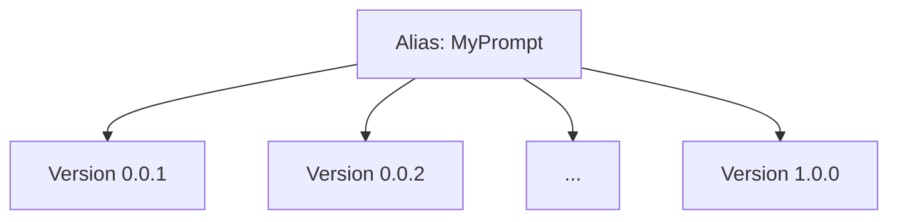

## Overview

Confident AI's **Prompt Studio** allows you to create and version different versions of your prompts. This allows you to:

1. Collaborate and centralize where prompt is stored and edited, even for non-technical team members
2. Use it within your LLM application
3. Pinpoint which version, or even combination of your prompt versions, performs best

There are a million places you can keep your prompts - on GitHub, CSV files, in memory in code, Google Sheets, Notion, or even written in a diary hidden under your table drawer. But only by keeping on prompts on Confident AI can you fully leverage Confident AI's evaluation features.

<Note>
  Prompts are a type of hyperparameter on Confident AI. Other
  [hyperparameters](/docs/concepts/hyperparameters) include things like models,
  embedders, top-K, and max tokens. By running evaluations using the same
  prompts that kept on Confident AI, we can tell you which version performs
  best, and later automatically optimize it for you.
</Note>

## Two Types of Prompts

There are two types of prompts you can create:

- **(Single) Text Prompt**: Use this when you need a straightforward, one-off prompt for simple completions.
- **Prompt Message List**: Use this when you need to define multiple messages with specific roles (system, user, assistant) in an OpenAI messages format. This format is ideal for few-shot prompting, where you can start with a system message that sets the context.

<Tip>
  If you ever see a prompt being mentioned without any mention of "message" or
  "list", assume it is a single prompt we're talking about.
</Tip>

## Prompts vs Prompt Versions

A **prompt** is a reusable instruction template that guides your LLM application. In Confident AI, each prompt is identified by a unique `alias`. This `alias` acts as a unique identifier and refers to a single, specific prompt. Different aliases refer to completely separate prompts.

A **prompt version** represents a different variation of the same prompt. Each `version` is an iteration or improvement of the original prompt, serving the same purpose but with adjustments—similar to how software versions evolve over time.

<Info title="Example">
Suppose you have a prompt with the alias `MyPrompt`. This prompt can have multiple versions, such as `0.0.1`, `0.0.2`, ..., up to `1.0.0`.



</Info>

## Create a Prompt Text

You can create prompts in the Confident AI platform

## Create Prompt Messages

## Using Dynamic Variables

You can include variables that can be interpolated dynamically in your LLM application later on. There are four ways currently for you to include variables:

- `{variable}`
- `{{ variable }}`
- `{{variable}}`
- `${variable}`

For example, the `{variable}` interpolation type must follow these rules:

1. No spaces in the variable name
2. Exactly one space between the braces and the variable name

For example:

```python
# ✅ Correct usage:
"Hi, my name is {name}."
"The temperature is {temperature} degrees."
"User input: {user_input}"

# ❌ Incorrect usage:

"Hi, my name is {variable name}." # Spaces in variable name
"Hi, my name is {variable_name }." # Extra spaces around variable name

```

You can select which variable interpolation type you wish to use in the **Prompt Editor**.

```

```