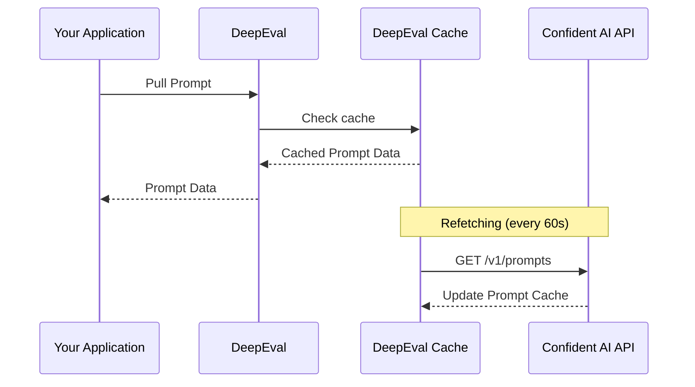
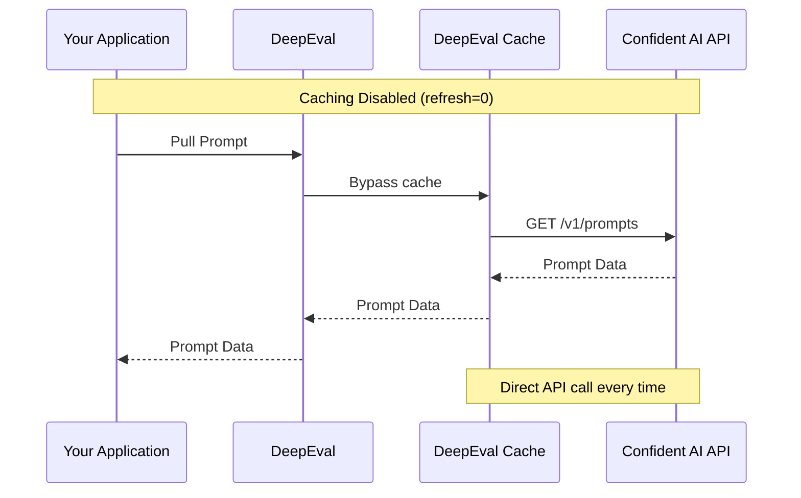

## Overview

You can pull a prompt version from Confident AI like how you would pull a dataset. It works by:

- Providing Confident AI with the alias and optionally version of the prompt you wish to retrieve
- Confident AI will provide the non-interpolated version of the prompt
- You will then interpolate the variables in code

You should pull prompts once and save it in memory instead of pulling it everytime you need to use it.

<Tip>
You can pull and manage your prompts in any project by configuring a `CONFIDENT_API_KEY`.

- For default usage, set `CONFIDENT_API_KEY` as an environment variable.
- To target a specific project, pass a `confident_api_key` directly when creating the `Prompt` object.

```python
from deepeval.prompt import Prompt, PromptMessage

prompt = Prompt(
  alias="YOUR-PROMPT-ALIAS",
  confident_api_key="confident_us...",
)
```

When both are provided, the `confident_api_key` passed to `Prompt` always takes precedence over the environment variable.
</Tip>

## Using Prompt Versions

<Steps>

<Step title="Pull prompt with alias">

Pull your prompt version by providing the `alias` you've defined:

<Tabs>

<Tab title="Python" language="python">

```python
from deepeval.prompt import Prompt

prompt = Prompt(alias="YOUR-PROMPT-ALIAS")
prompt.pull()
```

<Tip>
  By default, Confident AI will return the latest version of your prompt.
  However, you can also specify the `version` to override this behavior.

```python
prompt.pull(version="00.00.01")
```

</Tip>

</Tab>

<Tab title="TypeScript" language="typescript">

```typescript
import { Prompt } from "deepeval-ts";

const prompt = new Prompt({ alias: "YOUR-PROMPT-ALIAS" });
await prompt.pull();
```

<Tip>
  By default, Confident AI will return the latest version of your prompt.
  However, you can also specify the `version` to override this behavior.

```typescript
await prompt.pull({ version: "00.00.01" });
```

</Tip>

</Tab>

<Tab title="curL" language="curl">
  <EndpointRequestSnippet endpoint="GET /v1/prompts/{alias}/versions/{version}" />
</Tab>

</Tabs>

</Step>

<Step title="Interpolate variables">

Now that you have your prompt template, interpolate any dynamic variables you may have defined in your prompt version.

<Tabs>

<Tab title="Python" language="python">

```python
interpolated_prompt = prompt.interpolate(name="Joe")
```

</Tab>
<Tab title="TypeScript" language="typescript">

```typescript
const interpolatedPrompt = prompt.interpolate({ name: "Joe" });
```

</Tab>

<Tab title="curL" language="curl">

```bash
# Interpolation is done client-side after pulling the prompt
# The API response includes an "interpolationType" field indicating the format:
# - "FSTRING": Use {{ variable }} format (default)
# - "HANDLEBARS": Use {{variable}} format
# Replace variables manually based on the interpolationType in your application code
```

</Tab>

</Tabs>

For example, if this is your prompt version:

<Tabs>

<Tab title="Messages" language="messages">

```json
{
  "role": "system",
  "content": "You are a helpful assistant called {{ name }}. Speak normally like a human."
}
```

And your interpolation type is `{{ variable }}`, interpolating the name (e.g. "Joe") would give you this prompt that is ready for use:

```json
{
  "role": "system",
  "content": "You are a helpful assistant called Joe. Speak normally like a human."
}
```

</Tab>

<Tab title="Text" language="text">

```plaintext
You are a helpful assistant called {{ name }}. Speak normally like a human.
```

And your interpolation type is `{{ variable }}`, interpolating the name (e.g. “Joe”) would give you this prompt that is ready for use:

```plaintext
You are a helpful assistant called Joe. Speak normally like a human.
```

<Tabs>

<Tab title="Python" language="python">

```python
interpolated_prompt = prompt.interpolate(name="Joe")
```

</Tab>
<Tab title="TypeScript" language="typescript">

```typescript
const interpolatedPrompt = prompt.interpolate({ name: "Joe" });
```

</Tab>

<Tab title="curL" language="curl">

```bash
# Interpolation is done client-side after pulling the prompt
# The API response includes an "interpolationType" field indicating the format:
# - "FSTRING": Use {{ variable }} format (default)
# - "HANDLEBARS": Use {{variable}} format
# Replace variables manually based on the interpolationType in your application code
```

</Tab>

</Tabs>

</Tab>
</Tabs>

And if you don't have any variables, you must still use the `interpolate()` method to create a copy of your prompt template to be used in your LLM application.

</Step>

<Step title="Use interpolated prompt">

By now you should have an interpolated prompt version, for example:

<Tabs>

<Tab title="Messages" language="messages">

```json
{
  "role": "system",
  "content": "You are a helpful assistant called Joe. Speak normally like a human."
}
```

Which you can use to generate text from your LLM provider of choice. Here are some examples with OpenAI:

<Tabs>

<Tab title="Python" language="python">

```python main.py {10}
from deepeval.prompt import Prompt
from openai import OpenAI

prompt = Prompt(alias="YOUR-PROMPT-ALIAS")
prompt.pull()
interpolated_prompt = prompt.interpolate() # interpolate prompt

response = OpenAI().chat.completions.create(
    model="gpt-4o-mini",
    messages=interpolated_prompt
)

print(response.choices[0].message.content)
```

</Tab>

<Tab title="TypeScript" language="typescript" >

```typescript index.ts {11}
import { Prompt } from "deepeval-ts";
import { OpenAI } from "openai";

const prompt = new Prompt({ alias: "YOUR-PROMPT-ALIAS" });
await prompt.pull();
const interpolatedPrompt = prompt.interpolate(); // interpolate prompt

const openai = new OpenAI();
const response = await openai.chat.completions.create({
  model: "gpt-4o",
  messages: interpolatedPrompt as any[],
});

console.log(response.choices[0].message.content);
```

</Tab>

<Tab title="curL" language="curl">

First, pull the prompt from Confident AI:

<EndpointRequestSnippet endpoint="GET /v1/prompts" />

Then, interpolate the variables and use the interpolated prompt with OpenAI:

```curl
curl -X POST "https://api.openai.com/v1/chat/completions" \
  -H "Authorization: Bearer YOUR_OPENAI_API_KEY" \
  -H "Content-Type: application/json" \
  -d '{
    "model": "gpt-4.1",
    "messages": <YOUR-INTERPOLATED-PROMPT>
  }'
```

</Tab>

</Tabs>

</Tab>

<Tab title="Text" language="text">

```plaintext
You are a helpful assistant called Joe. Speak normally like a human.
```

Which you can use to generate text from your LLM provider of choice. Here are some examples with OpenAI:

<Tabs>

<Tab title="Python" language="python">

```python main.py {10}
from deepeval.prompt import Prompt
from openai import OpenAI

prompt = Prompt(alias="YOUR-PROMPT-ALIAS")
prompt.pull()
interpolated_prompt = prompt.interpolate() # interpolate prompt

response = OpenAI().chat.completions.create(
    model="gpt-4o-mini",
    messages={"role": "system", "content": interpolated_prompt}
)

print(response.choices[0].message.content)
```

</Tab>

<Tab title="TypeScript" language="typescript">

```typescript index.ts {11}
import { Prompt } from "deepeval-ts";
import { OpenAI } from "openai";

const prompt = new Prompt({ alias: "YOUR-PROMPT-ALIAS" });
await prompt.pull();
const interpolatedPrompt = prompt.interpolate(); // interpolate prompt

const openai = new OpenAI();
const response = await openai.chat.completions.create({
  model: "gpt-4o-mini",
  messages: [{ role: "system", content: interpolatedPrompt }],
});

console.log(response.choices[0].message.content);
```

</Tab>

<Tab title="curL" language="curl">

First, pull the prompt from Confident AI:

<EndpointRequestSnippet endpoint="GET /v1/prompts" />

Then, interpolate the variables and use the interpolated prompt with OpenAI:

```curl
curl -X POST "https://api.openai.com/v1/chat/completions" \
  -H "Authorization: Bearer YOUR_OPENAI_API_KEY" \
  -H "Content-Type: application/json" \
  -d '{
    "model": "gpt-4.1",
    "messages": <YOUR-INTERPOLATED-PROMPT>
  }'
```

</Tab>

</Tabs>

</Tab>

</Tabs>

</Step>

</Steps>

## Accessing Tools from Prompts

After pulling a prompt, you can access any tools that were defined in the prompt version via the `tools` property. Each tool contains:

- **name**: The name of the tool
- **description**: A description of what the tool does
- **input schema**: The JSON schema defining the tool's input parameters

<Tabs>

<Tab title="Python" language="python">

```python main.py
from deepeval.prompt import Prompt

prompt = Prompt(alias="YOUR-PROMPT-ALIAS")
prompt.pull()

# Access tools from the prompt
for tool in prompt.tools:
    print(f"Tool Name: {tool.name}")
    print(f"Description: {tool.description}")
    print(f"Input Schema: {tool.input_schema}")
```

</Tab>

<Tab title="TypeScript" language="typescript">

```typescript index.ts
import { Prompt } from "deepeval-ts";

const prompt = new Prompt({ alias: "YOUR-PROMPT-ALIAS" });
await prompt.pull();

// Access tools from the prompt
for (const tool of prompt.tools) {
  console.log(`Tool Name: ${tool.name}`);
  console.log(`Description: ${tool.description}`);
  console.log(`Input Schema: ${JSON.stringify(tool.inputSchema)}`);
}
```

</Tab>

</Tabs>

## Pull Prompts By Label

You can pull a prompt from Confident AI using its `alias`, you can also pull specific versions of prompts using `verion` and `label`.

<Tabs>

<Tab title="Version">

```python main.py
from deepeval.prompt import Prompt

prompt = Prompt(alias="YOUR-PROMPT-ALIAS")
prompt.pull(version="00.00.01")
```

</Tab>

<Tab title="Label">

```python main.py
from deepeval.prompt import Prompt

prompt = Prompt(alias="YOUR-PROMPT-ALIAS")
prompt.pull(label="staging")
```

You must manually label each prompt version before pulling it. [Click here](/docs/llm-evaluation/prompt-optimization/prompt-versioning#labelling-prompt-versions) to learn how to do so.

</Tab>

</Tabs>

## How Are Prompts Pulled?

Confident AI automatically caches prompts on the client side to **minimize API call latency and ensure prompt availability**, which is especially useful in production environments.

<Tabs>

<Tab title="Cache" language="mermaid">



</Tab>

<Tab title="No Cache" language="mermaid">



</Tab>

</Tabs>

### Customize refresh rate

By default, the cache is refetched every 60 seconds, where DeepEval will automatically update the cached prompt with the up-to-date version from Confident AI. This can be overridden by setting the `refresh` parameter to a different value. Fetching is done asynchronously, so it will not block your application.

<Tabs>

<Tab title="Python" language="python">

```python main.py {4}
from deepeval.prompt import Prompt

prompt = Prompt(alias="YOUR-PROMPT-ALIAS")
prompt.pull(refresh=60)
interpolated_prompt = prompt.interpolate(name="Joe")
```

</Tab>

<Tab title="TypeScript" language="typescript">

```typescript index.ts {4}
import { Prompt } from "deepeval-ts";

const prompt = new Prompt({ alias: "YOUR-PROMPT-ALIAS" });
await prompt.pull({ refresh: 60 });
const interpolatedPrompt = prompt.interpolate({ name: "Joe" });
```

</Tab>

</Tabs>

### Disable Caching

To disable caching, you can set `refresh=0`. This will force an API call every time you pull the prompt, which is particularly useful for development and testing.

<Tabs>

<Tab title="Python" language="python">

```python main.py {4}
from deepeval.prompt import Prompt

prompt = Prompt(alias="YOUR-PROMPT-ALIAS")
prompt.pull(refresh=0)
interpolated_prompt = prompt.interpolate(name="Joe")
```

</Tab>

<Tab title="TypeScript" language="typescript">

```typescript index.ts {4}
import { Prompt } from "deepeval-ts";

const prompt = new Prompt({ alias: "YOUR-PROMPT-ALIAS" });
await prompt.pull({ refresh: 0 });
const interpolatedPrompt = prompt.interpolate({ name: "Joe" });
```

</Tab>

</Tabs>

## Log Prompts During Evals

You can associate a prompt with your evals to get detailed insights on how each prompt and their versions are performing. It works by:

- Pulling or creating prompts in `deepeval` using the `Prompt` object
- Logging prompts as hyperparameters in your evaluations

<Steps>

<Step title="Pull prompts">

You should first pull a prompt from Confident AI using alias, version or label.

<Tabs>

<Tab title="Python" language="python">

```python
from deepeval.prompt import Prompt

prompt = Prompt(alias="YOUR-PROMPT-ALIAS")
prompt.pull(version="00.00.01")
```

</Tab>

<Tab title="TypeScript" language="typescript">

```typescript
import { Prompt } from "deepeval-ts";

const prompt = new Prompt({ alias: "YOUR-PROMPT-ALIAS" });
await prompt.pull((version = "00.00.01"));
```

</Tab>

<Tab title="curL" language="curl">
  <EndpointRequestSnippet endpoint="GET /v1/prompts/{alias}/versions/{version}" />
</Tab>

</Tabs>

You can now interpolate and use this prompt in your LLM app.

</Step>

<Step title="Logging prompt in `evaluate`">

Now, simply add this prompt as a free-form key-value pair to the `hyperparameters` argument in the `evaluate()` function

<Tabs>

<Tab title="Python" language="python">

```python
evaluate(
    ...
    hyperparameters={
        "Model": "YOUR-MODEL",
        "Prompt": prompt,
    },
)
```

</Tab>

<Tab title="Typescript" language="typescript">

```ts
evaluate({
  ...
  hyperparameters: {
    Model: "YOUR-MODEL",
    "Prompt": prompt,
  },
});
```

</Tab>

<Tab title="curL" language="curl">

<EndpointRequestSnippet
  endpoint="POST /v1/evaluate"
  example="Logging Parameters"
/>

</Tab>

</Tabs>

This will automatically attribute the prompt used during this test run, which will allow you get detailed insights in the Confident AI platform.

</Step>

</Steps>

## Log Prompts During Tracing

Associating prompts with [LLM traces and spans](/docs/llm-tracing/introduction) is a great way to determine which prompts performs best in production.

<Steps>

<Step title="Setup tracing">

Attach the `@observe` decorator to functions/methods that make up your agent, and specify type `llm` for your LLM-calling functions.

```python main.py {4}
from deepeval.tracing import observe

@observe(type="llm", model="gpt-4.1")
def your_llm_component():
    ...
```

<Tip>
  Specifying the type is necessary because logging prompts is only available for
  LLM spans.
</Tip>

</Step>

<Step title="Pull and interpolate prompt">

Pull and interpolate the prompt version to use it for LLM generation.

```python main.py {8,9}
from deepeval.tracing import observe
from deepeval.prompt import Prompt
from openai import OpenAI

@observe(type="llm", model="gpt-4.1")
def your_llm_component():
    prompt = Prompt(alias="YOUR-PROMPT-ALIAS")
    prompt.pull()
    interpolated_prompt = prompt.interpolate(name="Joe")
    response = OpenAI().chat.completions.create(model="gpt-4o-mini", messages=interpolated_prompt)
    return response.choices[0].message.content
```

</Step>

<Step title="Execute your function">

Then simply provide the prompt to the `update_llm_span` function.

```python main.py {11}
from deepeval.tracing import observe, update_llm_span
from deepeval.prompt import Prompt
from openai import OpenAI

@observe(type="llm", model="gpt-4.1")
def your_llm_component():
    prompt = Prompt(alias="YOUR-PROMPT-ALIAS")
    prompt.pull()
    interpolated_prompt = prompt.interpolate(name="Joe")
    response = OpenAI().chat.completions.create(model="gpt-4o-mini", messages=interpolated_prompt)
    update_llm_span(prompt=prompt)
    return response.choices[0].message.content
```

<Info>
  Remember to pull the prompt before updating the span, otherwise the prompt
  will not be logged.
</Info>

This will automatically attribute the prompt used to the LLM span.

</Step>

</Steps>
