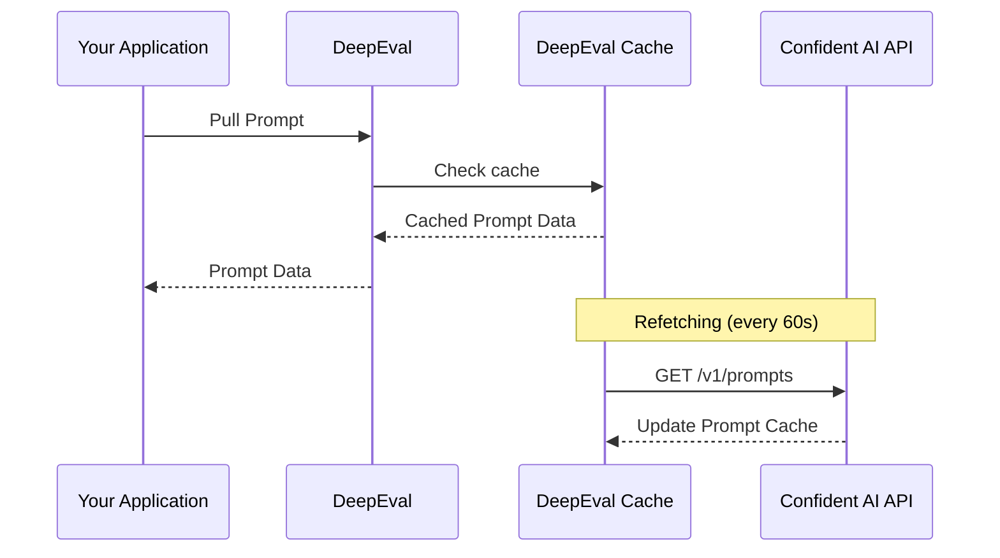
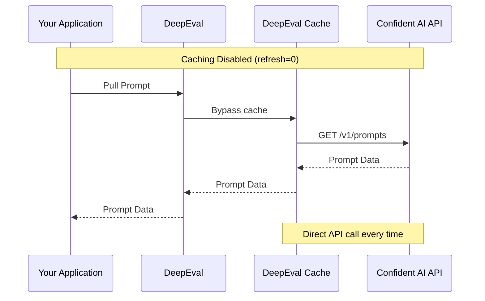

## Overview

You can pull a prompt version from Confident AI like how you would pull a dataset. It works by:

- Providing Confident AI with the alias and optionally version of the prompt you wish to retrieve
- Confident AI will provide the non-interpolated version of the prompt
- You will then interpolate the variables in code

You should pull prompts once and save it in memory instead of pulling it everytime you need to use it.

## Pull Prompt By Version

<Steps>

<Step title="Pull prompt with alias">

Pull your prompt version by providing the `alias` you've defined:

<Tabs>

<Tab title="Python" language="python">

```python
from deepeval.prompt import Prompt

prompt = Prompt(alias="YOUR-PROMPT-ALIAS")
prompt.pull()
```

<Tip>
  By default, Confident AI will return the latest version of your prompt.
  However, you can also specify the `version` to override this behavior.

```python
prompt.pull(version="00.00.01")
```

</Tip>

</Tab>

<Tab title="TypeScript" language="typescript">

```typescript
import { Prompt } from "deepeval-ts";

const prompt = new Prompt({ alias: "YOUR-PROMPT-ALIAS" });
await prompt.pull();
```

<Tip>
  By default, Confident AI will return the latest version of your prompt.
  However, you can also specify the `version` to override this behavior.

```typescript
await prompt.pull({ version: "00.00.01" });
```

</Tip>

</Tab>

<Tab title="curL" language="curl">
  <EndpointRequestSnippet endpoint="GET /v1/prompts/{alias}/versions/{version}" />
</Tab>

</Tabs>

</Step>

<Step title="Interpolate variables">

Now that you have your prompt template, interpolate any dynamic variables you may have defined in your prompt version.

<Tabs>

<Tab title="Python" language="python">

```python
interpolated_prompt = prompt.interpolate(name="Joe")
```

</Tab>
<Tab title="TypeScript" language="typescript">

```typescript
const interpolatedPrompt = prompt.interpolate({ name: "Joe" });
```

</Tab>

<Tab title="curL" language="curl">

```bash
# Interpolation is done client-side after pulling the prompt
# The API response includes an "interpolationType" field indicating the format:
# - "FSTRING": Use {{ variable }} format (default)
# - "HANDLEBARS": Use {{variable}} format
# Replace variables manually based on the interpolationType in your application code
```

</Tab>

</Tabs>

For example, if this is your prompt version:

<Tabs>

<Tab title="Messages" language="messages">

```json
{
  "role": "system",
  "content": "You are a helpful assistant called {{ name }}. Speak normally like a human."
}
```

And your interpolation type is `{{ variable }}`, interpolating the name (e.g. "Joe") would give you this prompt that is ready for use:

```json
{
  "role": "system",
  "content": "You are a helpful assistant called Joe. Speak normally like a human."
}
```

</Tab>

<Tab title="Text" language="text">

```plaintext
You are a helpful assistant called {{ name }}. Speak normally like a human.
```

And your interpolation type is `{{ variable }}`, interpolating the name (e.g. “Joe”) would give you this prompt that is ready for use:

```plaintext
You are a helpful assistant called Joe. Speak normally like a human.
```

<Tabs>

<Tab title="Python" language="python">

```python
interpolated_prompt = prompt.interpolate(name="Joe")
```

</Tab>
<Tab title="TypeScript" language="typescript">

```typescript
const interpolatedPrompt = prompt.interpolate({ name: "Joe" });
```

</Tab>

<Tab title="curL" language="curl">

```bash
# Interpolation is done client-side after pulling the prompt
# The API response includes an "interpolationType" field indicating the format:
# - "FSTRING": Use {{ variable }} format (default)
# - "HANDLEBARS": Use {{variable}} format
# Replace variables manually based on the interpolationType in your application code
```

</Tab>

</Tabs>

</Tab>
</Tabs>

And if you don't have any variables, you must still use the `interpolate()` method to create a copy of your prompt template to be used in your LLM application.

</Step>

<Step title="Use interpolated prompt">

By now you should have an interpolated prompt version, for example:

<Tabs>

<Tab title="Messages" language="messages">

```json
{
  "role": "system",
  "content": "You are a helpful assistant called Joe. Speak normally like a human."
}
```

Which you can use to generate text from your LLM provider of choice. Here are some examples with OpenAI:

<Tabs>

<Tab title="Python" language="python">

```python main.py {10}
from deepeval.prompt import Prompt
from openai import OpenAI

prompt = Prompt(alias="YOUR-PROMPT-ALIAS")
prompt.pull()
interpolated_prompt = prompt.interpolate() # interpolate prompt

response = OpenAI().chat.completions.create(
    model="gpt-4o-mini",
    messages=interpolated_prompt
)

print(response.choices[0].message.content)
```

</Tab>

<Tab title="TypeScript" language="typescript" >

```typescript index.ts {11}
import { Prompt } from "deepeval-ts";
import { OpenAI } from "openai";

const prompt = new Prompt({ alias: "YOUR-PROMPT-ALIAS" });
await prompt.pull();
const interpolatedPrompt = prompt.interpolate(); // interpolate prompt

const openai = new OpenAI();
const response = await openai.chat.completions.create({
  model: "gpt-4o",
  messages: interpolatedPrompt as any[],
});

console.log(response.choices[0].message.content);
```

</Tab>

<Tab title="curL" language="curl">

First, pull the prompt from Confident AI:

<EndpointRequestSnippet endpoint="GET /v1/prompts" />

Then, interpolate the variables and use the interpolated prompt with OpenAI:

```curl
curl -X POST "https://api.openai.com/v1/chat/completions" \
  -H "Authorization: Bearer YOUR_OPENAI_API_KEY" \
  -H "Content-Type: application/json" \
  -d '{
    "model": "gpt-4.1",
    "messages": <YOUR-INTERPOLATED-PROMPT>
  }'
```

</Tab>

</Tabs>

</Tab>

<Tab title="Text" language="text">

```plaintext
You are a helpful assistant called Joe. Speak normally like a human.
```

Which you can use to generate text from your LLM provider of choice. Here are some examples with OpenAI:

<Tabs>

<Tab title="Python" language="python">

```python main.py {10}
from deepeval.prompt import Prompt
from openai import OpenAI

prompt = Prompt(alias="YOUR-PROMPT-ALIAS")
prompt.pull()
interpolated_prompt = prompt.interpolate() # interpolate prompt

response = OpenAI().chat.completions.create(
    model="gpt-4o-mini",
    messages={"role": "system", "content": interpolated_prompt}
)

print(response.choices[0].message.content)
```

</Tab>

<Tab title="TypeScript" language="typescript">

```typescript index.ts {11}
import { Prompt } from "deepeval-ts";
import { OpenAI } from "openai";

const prompt = new Prompt({ alias: "YOUR-PROMPT-ALIAS" });
await prompt.pull();
const interpolatedPrompt = prompt.interpolate(); // interpolate prompt

const openai = new OpenAI();
const response = await openai.chat.completions.create({
  model: "gpt-4o-mini",
  messages: [{ role: "system", content: interpolatedPrompt }],
});

console.log(response.choices[0].message.content);
```

</Tab>

<Tab title="curL" language="curl">

First, pull the prompt from Confident AI:

<EndpointRequestSnippet endpoint="GET /v1/prompts" />

Then, interpolate the variables and use the interpolated prompt with OpenAI:

```curl
curl -X POST "https://api.openai.com/v1/chat/completions" \
  -H "Authorization: Bearer YOUR_OPENAI_API_KEY" \
  -H "Content-Type: application/json" \
  -d '{
    "model": "gpt-4.1",
    "messages": <YOUR-INTERPOLATED-PROMPT>
  }'
```

</Tab>

</Tabs>

</Tab>

</Tabs>

</Step>

</Steps>

## Pull Prompts By Label

You can pull a prompt from Confident AI using its `alias`, you can also pull specific versions of prompts using `version` and `label`.

<Tabs>

<Tab title="Version">

```python main.py
from deepeval.prompt import Prompt

prompt = Prompt(alias="YOUR-PROMPT-ALIAS")
prompt.pull(version="00.00.01")
```

</Tab>

<Tab title="Label">

```python main.py
from deepeval.prompt import Prompt

prompt = Prompt(alias="YOUR-PROMPT-ALIAS")
prompt.pull(label="staging")
```

You must manually label each prompt version before pulling it. [Click here](/docs/llm-evaluation/prompt-management/version-prompts#labelling-prompt-versions) to learn how to do so.

</Tab>

</Tabs>

<Note>

By pulling via labels, you effectively allow users with sufficient permission to "deploy" new versions of your prompt without going through code.

</Note>

## How Are Prompts Pulled?

Confident AI automatically caches prompts on the client side to **minimize API call latency and ensure prompt availability**, which is especially useful in production environments.

<Tabs>

<Tab title="Cache" language="mermaid">



</Tab>

<Tab title="No Cache" language="mermaid">



</Tab>

</Tabs>

### Customize refresh rate

By default, the cache is refetched every 60 seconds, where DeepEval will automatically update the cached prompt with the up-to-date version from Confident AI. This can be overridden by setting the `refresh` parameter to a different value. Fetching is done asynchronously, so it will not block your application.

<Tabs>

<Tab title="Python" language="python">

```python main.py {4}
from deepeval.prompt import Prompt

prompt = Prompt(alias="YOUR-PROMPT-ALIAS")
prompt.pull(refresh=60)
interpolated_prompt = prompt.interpolate(name="Joe")
```

</Tab>

<Tab title="TypeScript" language="typescript">

```typescript index.ts {4}
import { Prompt } from "deepeval-ts";

const prompt = new Prompt({ alias: "YOUR-PROMPT-ALIAS" });
await prompt.pull();
const interpolatedPrompt = prompt.interpolate({ name: "Joe" });
```

</Tab>

</Tabs>

### Configure cache

To disable caching, you can set `refresh=0`. This will force an API call every time you pull the prompt, which is particularly useful for development and testing.

<Tabs>

<Tab title="Python" language="python">

```python main.py {4}
from deepeval.prompt import Prompt

prompt = Prompt(alias="YOUR-PROMPT-ALIAS")
prompt.pull(refresh=0)
interpolated_prompt = prompt.interpolate(name="Joe")
```

</Tab>

<Tab title="TypeScript" language="typescript">

```typescript index.ts {4}
import { Prompt } from "deepeval-ts";

const prompt = new Prompt({ alias: "YOUR-PROMPT-ALIAS" });
await prompt.pull();
const interpolatedPrompt = prompt.interpolate({ name: "Joe" });
```

</Tab>

</Tabs>

## Advanced Usage

As you learnt in [earlier sections](/docs/llm-evaluation/prompt-management/version-prompts#model-config), prompts have the additional option to not just version text/messages but also model settings (provider, name, parameters), output type, and tools.

### Using model settings

After pulling a prompt, you can access any model settings that were configured for the prompt version via the `model_settings` property. Model settings include the provider, model name, and model parameters (temperature, max_tokens, etc.).

<Tabs>

<Tab title="Python" language="python">

```python main.py maxLines={0} focus={1-7}
from deepeval.prompt import Prompt
from openai import OpenAI

prompt = Prompt(alias="YOUR-PROMPT-ALIAS")
prompt.pull()
interpolated_prompt = prompt.interpolate()
settings = prompt.model_settings

# Use model settings (provider, name, parameters) in your OpenAI call
response = OpenAI().chat.completions.create(
    model=settings.name,
    messages=interpolated_prompt,
    temperature=settings.temperature,
    max_tokens=settings.max_tokens,
    top_p=settings.top_p,
    frequency_penalty=settings.frequency_penalty,
    presence_penalty=settings.presence_penalty,
    stop=settings.stop_sequence,
)

print(response.choices[0].message.content)
```

</Tab>

<Tab title="TypeScript" language="typescript">

```typescript index.ts maxLines={0} focus={1-7}
import { Prompt } from "deepeval-ts";
import { OpenAI } from "openai";

const prompt = new Prompt({ alias: "YOUR-PROMPT-ALIAS" });
await prompt.pull();
const interpolatedPrompt = prompt.interpolate();
const settings = prompt.modelSettings;

// Use model settings (provider, name, parameters) in your OpenAI call
const openai = new OpenAI();
const response = await openai.chat.completions.create({
  model: settings.name,
  messages: interpolatedPrompt as any[],
  temperature: settings.temperature,
  max_tokens: settings.maxTokens,
  top_p: settings.topP,
  frequency_penalty: settings.frequencyPenalty,
  presence_penalty: settings.presencePenalty,
  stop: settings.stopSequence,
});

console.log(response.choices[0].message.content);
```

</Tab>

<Tab title="curL" language="curl">

<EndpointRequestSnippet endpoint="GET /v1/prompts/{alias}/versions/{version}" />

The response includes a `modelSettings` object with the configured model settings.

</Tab>

</Tabs>

<Tip>
  Model settings are optional. If no model settings were configured for the
  prompt version, `model_settings` will be `None`.
</Tip>

### Using output type

After pulling a prompt, you can access the output configuration via the `output_type` and `output_schema` properties. This is useful when you want to enforce structured outputs from your LLM.

<Tabs>

<Tab title="Python" language="python">

```python main.py maxLines={0} focus={1-17}
from deepeval.prompt import Prompt
from deepeval.prompt.api import OutputType
from openai import OpenAI

prompt = Prompt(alias="YOUR-PROMPT-ALIAS")
prompt.pull()
interpolated_prompt = prompt.interpolate()

# Build response_format based on output type
response_format = None
if prompt.output_type == OutputType.JSON:
    response_format = {"type": "json_object"}
elif prompt.output_type == OutputType.SCHEMA:
    response_format = {
        "type": "json_schema",
        "json_schema": prompt.output_schema
    }

# Use output type in your OpenAI call
response = OpenAI().chat.completions.create(
    model="gpt-4o",
    messages=interpolated_prompt,
    response_format=response_format,
)

print(response.choices[0].message.content)
```

</Tab>

<Tab title="TypeScript" language="typescript">

```typescript index.ts maxLines={0} focus={1-17}
import { Prompt, OutputType } from "deepeval-ts";
import { OpenAI } from "openai";

const prompt = new Prompt({ alias: "YOUR-PROMPT-ALIAS" });
await prompt.pull();
const interpolatedPrompt = prompt.interpolate();

// Build response_format based on output type
let responseFormat: any = undefined;
if (prompt.outputType === OutputType.JSON) {
  responseFormat = { type: "json_object" };
} else if (prompt.outputType === OutputType.SCHEMA) {
  responseFormat = {
    type: "json_schema",
    json_schema: prompt.outputSchema,
  };
}

// Use output type in your OpenAI call
const openai = new OpenAI();
const response = await openai.chat.completions.create({
  model: "gpt-4o",
  messages: interpolatedPrompt as any[],
  response_format: responseFormat,
});

console.log(response.choices[0].message.content);
```

</Tab>

<Tab title="curL" language="curl">

<EndpointRequestSnippet endpoint="GET /v1/prompts/{alias}/versions/{version}" />

The response includes `outputType` and `outputSchema` fields for the output configuration. The `outputSchema` field contains the output schema definition when `outputType` is `SCHEMA`.

</Tab>

</Tabs>

The available output types are:

- **TEXT** - Plain text output (default)
- **JSON** - JSON formatted output (maps to `{"type": "json_object"}`)
- **SCHEMA** - Structured output validated against a schema (maps to `{"type": "json_schema", ...}`)

### Using tools

After pulling a prompt, you can access any tools that were defined in the prompt version via the `tools` property. Each tool contains:

- **name**: The name of the tool
- **description**: A description of what the tool does
- **input_schema**: The JSON schema defining the tool's input parameters
- **mode**: The tool mode (`ALLOW_ADDITIONAL`, `NO_ADDITIONAL`, or `STRICT`)

<Tabs>

<Tab title="Python" language="python">

```python main.py maxLines={30} focus={1-20}
from deepeval.prompt import Prompt
from openai import OpenAI

prompt = Prompt(alias="YOUR-PROMPT-ALIAS")
prompt.pull()
interpolated_prompt = prompt.interpolate()

# Convert prompt tools to OpenAI format
openai_tools = [
    {
        "type": "function",
        "function": {
            "name": tool.name,
            "description": tool.description,
            "parameters": tool.input_schema,
            "strict": tool.mode == "STRICT",
        },
    }
    for tool in prompt.tools
]

# Use tools in your OpenAI call
response = OpenAI().chat.completions.create(
    model="gpt-4o",
    messages=interpolated_prompt,
    tools=openai_tools,
)

print(response.choices[0].message)
```

</Tab>

<Tab title="TypeScript" language="typescript">

```typescript index.ts maxLines={30} focus={1-18}
import { Prompt } from "deepeval-ts";
import { OpenAI } from "openai";

const prompt = new Prompt({ alias: "YOUR-PROMPT-ALIAS" });
await prompt.pull();
const interpolatedPrompt = prompt.interpolate();

// Convert prompt tools to OpenAI format
const openaiTools = prompt.tools.map((tool) => ({
  type: "function" as const,
  function: {
    name: tool.name,
    description: tool.description,
    parameters: tool.inputSchema,
    strict: tool.mode === "STRICT",
  },
}));

// Use tools in your OpenAI call
const openai = new OpenAI();
const response = await openai.chat.completions.create({
  model: "gpt-4o",
  messages: interpolatedPrompt as any[],
  tools: openaiTools,
});

console.log(response.choices[0].message);
```

</Tab>

<Tab title="curL" language="curl">

<EndpointRequestSnippet endpoint="GET /v1/prompts/{alias}/versions/{version}" />

The response includes a `tools` array with each tool's `name`, `description`, `inputSchema`, and `mode`.

</Tab>

</Tabs>

### Using images

For prompts containing images, here's how you would parse it and pass it for use in your MLLM of choice:

<Tabs>

<Tab title="Python" language="python">

The `deepeval` python SDK offers a utility method called `convert_to_multi_modal_array`. This method is useful for converting a string containing images in the `[DEEPEVAL:IMAGE:url]` format into a list of strings and `MLLMImage` items.

```python
from deepeval.prompt import Prompt
from deepeval.utils import convert_to_multi_modal_array

prompt = Prompt(alias="YOUR-PROMPT-ALIAS")
prompt.pull()

multimodal_array = convert_to_multi_modal_array(prompt.text)
```

The `multimodal_array` here is a list containing strings and `MLLMImage`s, you can loop over this list to construct a messages array with images to pass to your MLLM. Here's an example showing how to construct messages array for `openai`:

```python
messages = []
for element in multimodal_array:
    if isinstance(element, str):
        messages.append({"type": "text", "text": element})
    elif isinstance(element, MLLMImage):
      if element.url:
          messages.append(
              {
                  "type": "image_url",
                  "image_url": {"url": element.url},
              }
          )
```

</Tab>

<Tab title="TypeScript" language="typescript">

You can use a custom method to parse strings with images in `[DEEPEVAL:IMAGE:url]` format to convert them into an array of strings and URLs

```typescript maxLines=0
const parseMultimodalString = (s: string) => {
  const PATTERN = /\[DEEPEVAL:IMAGE:(.*?)\]/g;

  const result = [];
  let lastEnd = 0;
  let match;

  while ((match = PATTERN.exec(s)) !== null) {
    const start = match.index;
    const end = PATTERN.lastIndex;

    if (start > lastEnd) {
      result.push(s.slice(lastEnd, start));
    }

    const imageUrl = match[1];
    result.push({ url: imageUrl });

    lastEnd = end;
  }

  if (lastEnd < s.length) {
    result.push(s.slice(lastEnd));
  }

  return result;
}
```

You can now use this method to get `multimodalArray` from prompt text and construct messages array to pass it to your MLLM. Here's an example on how to use it to construct `openai` format messages:

```typescript maxLines=0
import { Prompt } from "deepeval-ts";

const prompt = new Prompt({ alias: "YOUR-PROMPT-ALIAS" });
await prompt.pull();

const multimodalArray = parseMultimodalString(prompt.text);

const messages = [];

for (const element of multimodalArray) {
  if (typeof element === "string") {
    messages.push({
      type: "text",
      text: element,
    });
  } else if (element.url) {
    messages.push({
      type: "image_url",
      image_url: { url: element.url },
    });
  }
}
```

</Tab>

<Tab title="curL" language="curl">

<EndpointRequestSnippet endpoint="GET /v1/prompts/{alias}/versions/{version}" />

The prompt pulled here has images in text / messages fields with the pattern `[DEEPEVAL:IMAGE:url]`. Please parse the fields to fetch the public `url` and use it as necessary.

</Tab>


<Tab title="Custom" language="custom">

You can use a custom method to parse strings with images in `[DEEPEVAL:IMAGE:url]` format to convert them into an array of strings and URLs

```python
def parse_multimodal_string(s: str):
    PATTERN = r"\[DEEPEVAL:IMAGE:(.*?)\]"
    matches = list(re.finditer(pattern, s))

    result = []
    last_end = 0
    for m in matches:
        start, end = m.span()
        if start > last_end:
          result.append(s[last_end:start])

        image_url = m.group(1)

        result.append({url: image_url})
        last_end = end

    if last_end < len(s):
        result.append(s[last_end:])
        return result
```

You can now use this method to get `multimodal_array` and construct messages array to pass it to your MLLM. Here's an example on how to use it:

```python
multimodal_array = parse_multimodal_string(prompt.text)

messages = []
for element in multimodal_array:
    if isinstance(element, str):
        messages.append({"type": "text", "text": element})
    else:
        if element.url:
          messages.append(
              {
                  "type": "image_url",
                  "image_url": {"url": element.url},
              }
          )
```

</Tab>

</Tabs>

<Tip>

Confident AI automatically handles any multi-modal conversation when running evals using one of our [no-code workflows.](/docs/llm-evaluation/no-code-evals/quickstart)

</Tip>

## Prompt Association

You can and should definitely associate prompt versions with test runs and traced data for Confident AI to let you know which version of your prompt performs best.

### Evals

You can associate a prompt with your evals to get detailed insights on how each prompt and their versions are performing. It works by:

- Pulling prompt via the Evals API
- Logging prompts as a hyperparameter during evaluation

<Tabs>

<Tab title="Python" language="python">

Simply add the **pulled prompt instance** as a free-form key-value pair to the `hyperparameters` argument in the `evaluate()` function

```python
evaluate(
    ...
    hyperparameters={
        "Model": "YOUR-MODEL",
        "Prompt": prompt,
    },
)
```

</Tab>

<Tab title="Typescript" language="typescript">

Simply add the **pulled prompt instance** as a free-form key-value pair to the `hyperparameters` argument in the `evaluate()` function

```ts
evaluate({
  ...
  hyperparameters: {
    Model: "YOUR-MODEL",
    "Prompt": prompt,
  },
});
```

</Tab>

<Tab title="curL" language="curl">

<EndpointRequestSnippet
  endpoint="POST /v1/evaluate"
  example="Logging Parameters"
/>

</Tab>

</Tabs>

This will automatically attribute the prompt used during this test run, which will allow you get detailed insights in the Confident AI platform.

<Warning>

Never ever ever associate the **interpolated** prompt version - Confident AI will treat it as a string literal and you will not be able to associate prompt versions but instead raw strings (which isn't helpful at all).

</Warning>

### Tracing

Associating prompts with [LLM traces and spans](/docs/llm-tracing/introduction) is a great way to determine which prompts performs best in production.

<Steps>

<Step title="Setup tracing">

Attach the `@observe` decorator to functions/methods that make up your agent, and specify type `llm` for your LLM-calling functions.

```python main.py {4}
from deepeval.tracing import observe

@observe(type="llm", model="gpt-4.1")
def your_llm_component():
    ...
```

<Tip>
  Specifying the type is necessary because logging prompts is only available for
  LLM spans.
</Tip>

</Step>

<Step title="Pull and interpolate prompt">

Pull and interpolate the prompt version to use it for LLM generation.

```python main.py {8,9}
from deepeval.tracing import observe
from deepeval.prompt import Prompt
from openai import OpenAI

@observe(type="llm", model="gpt-4.1")
def your_llm_component():
    prompt = Prompt(alias="YOUR-PROMPT-ALIAS")
    prompt.pull()
    interpolated_prompt = prompt.interpolate(name="Joe")
    response = OpenAI().chat.completions.create(model="gpt-4o-mini", messages=interpolated_prompt)
    return response.choices[0].message.content
```

</Step>

<Step title="Execute your function">

Then simply provide the prompt to the `update_llm_span` function.

```python main.py {11}
from deepeval.tracing import observe, update_llm_span
from deepeval.prompt import Prompt
from openai import OpenAI

@observe(type="llm", model="gpt-4.1")
def your_llm_component():
    prompt = Prompt(alias="YOUR-PROMPT-ALIAS")
    prompt.pull()
    interpolated_prompt = prompt.interpolate(name="Joe")
    response = OpenAI().chat.completions.create(model="gpt-4o-mini", messages=interpolated_prompt)
    update_llm_span(prompt=prompt)
    return response.choices[0].message.content
```

<Info>
  Remember to pull the prompt before updating the span, otherwise the prompt
  will not be logged.
</Info>

This will automatically attribute the prompt used to the LLM span.

</Step>

</Steps>

## Switching Projects

You can pull and manage your prompts in any project by configuring a `CONFIDENT_API_KEY`.

- For default usage, set `CONFIDENT_API_KEY` as an environment variable.
- To target a specific project, pass a `confident_api_key` directly when creating the `Prompt` object.

```python
from deepeval.prompt import Prompt, PromptMessage

prompt = Prompt(
  alias="YOUR-PROMPT-ALIAS",
  confident_api_key="confident_us...",
)
```

When both are provided, the `confident_api_key` passed to `Prompt` always takes precedence over the environment variable.

## Next Steps

Now that you can pull prompts into your app, learn how to push them programmatically or run evaluations.

<CardGroup cols={2}>
  <Card
    title="Automate Prompt Management"
    icon="robot"
    href="/docs/llm-evaluation/prompt-management/automate-prompt-management"
  >
    Push and manage prompts programmatically via the Evals API.
  </Card>
  <Card
    title="Run Evaluations"
    icon="flask"
    href="/docs/llm-evaluation/code-driven/quickstart"
  >
    Evaluate your LLM app with metrics and datasets.
  </Card>
</CardGroup>
