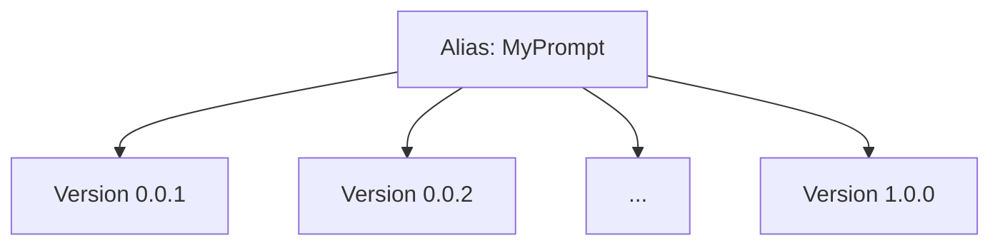

## Overview

Prompt versioning allows you to optimize and test different versions of your prompts. Managing prompts on Confident AI allows you to:

1. Collaborate and centralize where prompts are stored and edited, even for non-technical team members
2. Pinpoint which version, or even combination of your prompt versions, performed best
3. Optionally co-locate model settings, output type, and tools with prompts to version them as a single unit

There are a million places you can keep your prompts - on GitHub, CSV files, in memory in code, Google Sheets, Notion, or even written in a diary hidden under your table drawer. But only by keeping prompts on Confident AI can you fully leverage Confident AI's evaluation features.

<Note>
  Prompts are a type of hyperparameter on Confident AI. Others include things
  like models, embedders, top-K, and max tokens. When you run evals against
  prompts kept on Confident AI, we can tell you which version performs best, and
  later automatically optimize it for you.
</Note>

<Tip>
  **Prompts vs Prompts + Model Config:** You can use Confident AI purely for
  prompt versioning — pull your prompts and use them with whatever model you
  configure in your code. Alternatively, if you want to manage prompts and model
  configurations together as a single versioned unit, you can attach model
  settings, output type, and tools to prompt versions.
</Tip>

## Different Types of Prompts

There are two types of prompts you can create:

- **(Single) Text Prompt**: Use this when you need a straightforward, one-off prompt for simple completions.
- **Prompt Message List**: Use this when you need to define multiple messages with specific roles (system, user, assistant) in an OpenAI messages format. This format is ideal for few-shot prompting, where you can start with a system message that sets the context.

<Tip>
  If you ever see a prompt being mentioned without any mention of "message" or
  "list", assume it is a single prompt we're talking about.
</Tip>

## Understanding Prompt Versions

In Confident AI, each prompt is identified by a unique `alias`. This `alias` acts as a unique identifier and refers to a single, specific prompt. Different aliases refer to completely separate prompts.

<Info title="Example">
Suppose you have a prompt with the alias `MyPrompt`. This prompt can have multiple versions, such as `0.0.1`, `0.0.2`, ..., up to `1.0.0`.



</Info>

A **prompt version** represents a different variation of the same prompt. Each `version` is an iteration or improvement of the original prompt, serving the same purpose but with adjustments—similar to how software versions evolve over time.

## Create a Prompt Version

You can create a prompt version in **Project** > **Prompt Studio** through two simple steps:

1. Create a text or messages prompt
2. Edit and commit an initial prompt version in the prompt editor

<Note>A prompt cannot be both a text and message prompt at the same time.</Note>

<Tabs>

<Tab title="Messages">

<Frame caption="Create Prompt Messages" background="subtle">

<video
  autoPlay
  loop
  muted
  data-video="prompts.createMessages"
  type="video/mp4"
/>

</Frame>

</Tab>

<Tab title="Text">

<Frame caption="Create Prompt Text" background="subtle">

<video autoPlay loop muted data-video="prompts.createText" type="video/mp4" />

</Frame>

</Tab>

</Tabs>

Don't forget to **commit** an initial version of your prompt after you're done
editing it. Alternately, you can create a prompt version from code.

<Tip>
You can manage your prompts in any project by configuring a `CONFIDENT_API_KEY`.

- For default usage, set `CONFIDENT_API_KEY` as an environment variable.
- To target a specific project, pass a `confident_api_key` directly when creating the `Prompt` object.

```python
from deepeval.prompt import Prompt, PromptMessage

prompt = Prompt(
  alias="YOUR-PROMPT-ALIAS",
  messages_template=[PromptMessage(role="...", content="...")],
  confident_api_key="confident_us...",
)
prompt.push()
```

When both are provided, the `confident_api_key` passed to `Prompt` always takes precedence over the environment variable.

</Tip>

<Tabs>
<Tab title="Messages" language="python">
```python
from deepeval.prompt import Prompt
from deepeval.prompt.api import PromptMessage

prompt = Prompt(alias="YOUR-PROMPT-ALIAS")
prompt.push(messages=[PromptMessage(role="...", content="...")])

````
</Tab>

<Tab title="Text" language="python">
```python
from deepeval.prompt import Prompt

prompt = Prompt(alias="YOUR-PROMPT-ALIAS")
prompt.push(text="...")
````

</Tab>

</Tabs>

<Tip>
  For more advanced push options including model settings, output type, and
  tools, see [Automate Prompt
  Management](/llm-evaluation/prompt-management/automate-prompt-management).
</Tip>

## Templating Options

### Dynamic variables

You can include variables that can be interpolated dynamically in your LLM application later on. There are five interpolation types available:

| Type                  | Syntax           | Example                           |
| --------------------- | ---------------- | --------------------------------- |
| `FSTRING`             | `{variable}`     | `Hello, {name}!`                  |
| `MUSTACHE`            | `{{variable}}`   | `Hello, {{name}}!`                |
| `MUSTACHE_WITH_SPACE` | `{{ variable }}` | `Hello, {{ name }}!`              |
| `DOLLAR_BRACKETS`     | `${variable}`    | `Hello, ${name}!`                 |
| `JINJA`               | ``      | `Hello!` |

Variable names must not contain spaces:

```python
# ✅ Correct usage:
"Hi, my name is {name}."
"The temperature is {temperature} degrees."
"User input: {user_input}"

# ❌ Incorrect usage:
"Hi, my name is {variable name}." # Spaces in variable name
```

### Conditional logic

Conditional logic can be added when using JINJA interpolation. JINJA supports [jinja templates](https://realpython.com/primer-on-jinja-templating/), which allows you to render more complex logic such as conditional if/else blocks:

```txt If/Else

Welcome back, mighty admin {{ name }}!

Hello {{ name }}, you have regular access.

```

As well as for loops:

```txt For loop
Shopping List:

- {{ item }}

```

<Note>Jinja interpolated prompts are only available for Python users.</Note>

### Including images

You can also include images simply by dragging and dropping something into the text areas.

<Frame caption="Prompt with images">
  
</Frame>

## Model Configs

Beyond creating and editing prompt versions, you can also configure model settings, output type, and tools associated with your prompt. This allows you to:

- Version not just prompts, but also models associated with it
- Use directly in code when [pulling prompts in code](/docs/llm-evaluation/prompt-management/pull-prompts)
- Compare the impact of models on the same prompt (and vice versa) when [running experiments on your AI app](/docs/llm-evaluation/experiments)

<Tip>

Keeping model configs for prompt versions on Confident AI does no harm but it doesn't mean you have to use it - for both in code and on the platform in the [Arena](/docs/llm-evaluation/no-code-evals/arena) or when running experiments. However, if model configs confuses you, feel free to leave them out.

</Tip>

### Model settings

You can configure the model provider, model name, and model parameters for each prompt version. This ensures that when you pull a prompt in code, you also get the exact model configuration needed to run it.

<Frame caption="Configure Model Settings">
  
</Frame>

| Field          | Description                                                  | Example                                    |
| -------------- | ------------------------------------------------------------ | ------------------------------------------ |
| **Provider**   | The LLM provider (e.g., OpenAI, Anthropic, Azure)            | `openai`                                   |
| **Model**      | The specific model name                                      | `gpt-4.1`                                  |
| **Parameters** | Model-specific parameters like temperature, max tokens, etc. | `{"temperature": 0.7, "max_tokens": 1024}` |

<Info title="Example">
For an OpenAI GPT-4.1 configuration with custom temperature and max tokens:

- **Provider**: `openai`
- **Model**: `gpt-4.1`
- **Parameters**:
  ```json
  {
    "temperature": 0.7,
    "max_tokens": 1024
  }
  ```

</Info>

### Output type

You can specify the expected output format for your prompt by selecting an output type:

- **Text Output**: Standard text response (default)
- **JSON Output**: Structured JSON response
- **Schema Output**: Structured response conforming to a defined schema

<Frame caption="Configure Output Type">
  
</Frame>

When using **Schema Output**, you can define a custom schema that your LLM response should conform to. This is useful for ensuring structured, predictable outputs.

To configure a schema:

1. Click on **Schema Output** in the output type dropdown
2. Enter a **Schema Name** (required)
3. Add **Schema Fields** with their property names and types (String, Number, Boolean, etc.)
4. Click **Save Schema**

<Frame caption="Configure Schema Output">
  
</Frame>

The schema will be previewed as a Pydantic `BaseModel` class, making it easy to visualize how your structured output will look.

### Attach tools

You can attach tools to your prompt version for function calling capabilities. This allows your LLM to invoke external tools like web search, APIs, or custom functions.

To attach tools:

1. Click on the **Tools** button in the prompt editor
2. Search for available tools
3. Select the tools you want to enable for this prompt version

<Frame caption="Attach Tools">
  
</Frame>

## Assign Prompt Labels

You can also label different versions of your prompt in the **Version History** page so no code changes are required to "deploy" a new version into a certain environment.

<Frame>
  <video
    autoPlay
    loop
    muted
    data-video="prompts.labelVersions"
    type="video/mp4"
  />
</Frame>

Only users with [sufficient permissions](/docs/settings/project/roles-and-permissions) are able to modify prompt labels.

<Info>

The next section will dive deeper into this topic but this is how you can pull a prompt via its label in python:

```python main.py
from deepeval.prompt import Prompt

prompt = Prompt(alias="YOUR-PROMPT-ALIAS")
prompt.pull(label="staging")
```

</Info>

## Next Steps

Now that you know how to version prompts on the platform, put them to work in evaluations.

<CardGroup cols={2}>
  <Card
    title="Experiments"
    icon="flask"
    href="/docs/llm-evaluation/experiments"
  >
    Compare prompt versions side-by-side with statistical rigor.
  </Card>
  <Card
    title="Single-Turn Evals"
    icon="arrow-right"
    href="/docs/llm-evaluation/no-code-evals/single-turn-evals"
  >
    Run evaluations on your prompts without writing code.
  </Card>
</CardGroup>

<CardGroup cols={2}>
  <Card
    title="Pull Prompts"
    icon="arrow-down-to-bracket"
    href="/docs/llm-evaluation/prompt-management/pull-prompts"
  >
    Pull prompt versions into your code for use in your LLM app.
  </Card>
  <Card
    title="Automate Prompt Management"
    icon="robot"
    href="/docs/llm-evaluation/prompt-management/automate-prompt-management"
  >
    Push and manage prompts programmatically via the Evals API.
  </Card>
</CardGroup>
