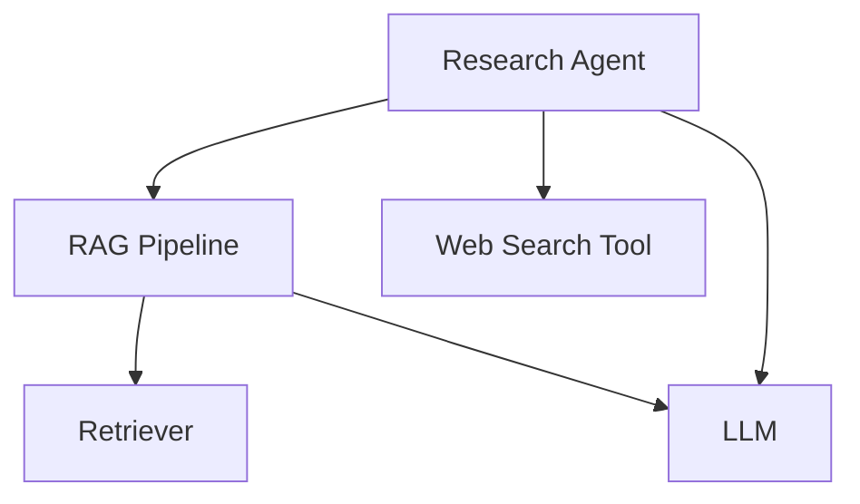

Span types are **hugely optional** but allow you to classify the most common types of components in LLM applications, which includes these 4 default span types:

- `"llm"`
- `"retriever"`
- `"tool"`
- `"agent"`

This is set via the `type` argument in the `@observe` decorator. By classifying span types you can create more tailored UIs on Confident AI, and set more specific [`attribtues`](/docs/llm-tracing/tracing-features/attributes) instead of using generalized [`metadata`](/docs/llm-tracing/tracing-features/metadata).

<Callout>
Anything that is **NOT** one of these four default span types are **automatically custom spans.**
</Callout>


## Custom span

The most flexible `type` out of all (and the default type if `type` is not provided), custom spans are essential for creating hierarchical structures or grouping related spans together. They provide flexibility in organizing your tracing data.

<Tabs>
    <Tab title="Python">
        <CodeBlock>
            ```python
            from deepeval.tracing import observe
            
            @observe(name="RAG Pipeline")
            def rag_pipeline(query: str) -> str:
                pass
            ```
        </CodeBlock>
    </Tab>
    <Tab title="Js/TypeScript">
        <CodeBlock>
            ```typescript
            import { observe } from '@deepeval-ts/tracing';
            
            const ragPipeline = (query: string): string => {
            // Implementation
            return "";
            };
            
            const observedRagPipeline = observe({
                name: "RAG Pipeline",
                fn: ragPipeline
            });
            ```
        </CodeBlock>
    </Tab>
</Tabs>

There is **ONE** mandatory and **TWO** optional parameters when decorating a function of the Custom span type:

- `type`: The type of span. Anything other than `"llm"`, `"retriever"`, `"tool"`, and `"agent"` is a custom span type. Defaulted to the `name`.
- [Optional] `name`: A string specifying how this custom span is displayed on Confident AI. Defaulted to the name of the decorated function.
- [Optional] `metrics` A list of strings specifying the names of the online metrics you wish to run upon tracing to Confident AI. Learn more about using online metrics in the [next section here.](/docs/llm-tracing/evaluations)

The `input` and `output`s of a custom span is defaulted to the function input arguments and the output, however you can also [set it dynamically yourself.](/docs/llm-tracing/tracing-features/input-output#set-span-io-at-runtime)

## LLM Span

An LLM span represents a call to a language model. It tracks the input, output, and token usage of the model.

<Tabs>
    <Tab title="Python">
        <CodeBlock>
            ```python title="main.py"
            from deepeval.tracing import observe
            
            @observe(type="llm", model="gpt-4")
            def generate_response(prompt: str) -> str:
                pass
            ```
        </CodeBlock>
    </Tab>
    <Tab title="Js/TypeScript">
        <CodeBlock>
            ```typescript title="index.ts"
            import { observe } from '@deepeval-ts/tracing';
            
            const generateResponse = (prompt: string): string => {
            // Implementation
            return "";
            };
            
            const observedGenerateResponse = observe({
                type: "llm",
                model: "gpt-4",
                fn: generateResponse
            });
            ```
        </CodeBlock>
    </Tab>
</Tabs>

There are **TWO** mandatory and **FOUR** optional parameters when decorating a function of the LLM span type:

- `type`: The type of span. Must be `"llm"` for LLM spans.
- `model`: A string representing the name of the LLM used.
- [Optional] `cost_per_input_token`: A float specifying the cost per input token. Defaulted to None.
- [Optional] `cost_per_output_token`: A float specifying the cost per output token. Defaulted to None.
- [Optional] `name`: A string specifying the display name on Confident AI. Defaulted to the name of the decorated function.
- [Optional] `metrics` A list of strings specifying the names of the online metrics you wish to run upon tracing to Confident AI. Learn more about using online metrics in the [next section here.](/docs/llm-tracing/evaluations)

<Callout>
  If `cost_per_input_token` is not set, setting `input_token_count` will not help calculate the cost. The same applies to
  output tokens.
</Callout>

## Retriever Span

A Retriever span represents a component that fetches relevant information from a vector store or knowledge base. It's a crucial part of RAG (Retrieval-Augmented Generation) pipelines, handling the embedding and retrieval process.

<Tabs>
    <Tab title="Python">
        <CodeBlock>
            ```python title="main.py"
            from deepeval.tracing import observe
            from typing import List
            
            @observe(type="retriever", embedder="text-embedding-ada-002")
            def retrieve_documents(query: str) -> List[str]:
                pass
            ```
        </CodeBlock>
    </Tab>
    <Tab title="Js/TypeScript">
        <CodeBlock>
            ```typescript title="index.ts"
            import { observe } from '@deepeval-ts/tracing';
            
            const retrieveDocuments = (query: string): string[] => {
            // Implementation
            return [];
            };
            
            const observedRetrieveDocuments = observe({
                type: "retriever",
                embedder: "text-embedding-ada-002",
                fn: retrieveDocuments
            });
            ```
        </CodeBlock>
    </Tab>
</Tabs>

There are **TWO** mandatory and **TWO** optional parameters when decorating a function of the retriever span type:

- `type`: The type of span. Must be `"retriever"` for retriever spans.
- `embedder`: A string representing the name of the embedding model used.
- [Optional] `name`: A string specifying the display name on Confident AI. Defaulted to the name of the decorated function.
- [Optional] `metrics` A list of strings specifying the names of the online metrics you wish to run upon tracing to Confident AI. Learn more about using online metrics in the [next section here.](/docs/llm-tracing/evaluations)

## Tool Span

A Tool span represents a function that an agent can call to perform a specific task. It's commonly used for function calling in LLM applications.

<Tabs>
    <Tab title="Python">
        <CodeBlock>
            ```python title="main.py"
            from deepeval.tracing import observe
            
            @observe(type="tool")
            def web_search(query: str) -> str:
                pass
            ```
        </CodeBlock>
    </Tab>
    <Tab title="Js/TypeScript">
        <CodeBlock>
            ```typescript title="index.ts"
            import { observe } from '@deepeval-ts/tracing';
            
            const webSearch = (query: string): string => {
            // Implementation
            return "";
            };
            
            const observedWebSearch = observe({
                type: "tool",
                fn: webSearch
            });
            ```
        </CodeBlock>
    </Tab>
</Tabs>

There are **ONE** mandatory and **THREE** optional parameters when decorating a function of the tool span type:

- `type`: The type of span. Must be `"tool"` for tool spans.
- [Optional] `description`: A string that describes what the tool does. Defaulted to an empty string.
- [Optional] `name`: A string specifying the display name on Confident AI. Defaulted to the name of the decorated function.
- [Optional] `metrics` A list of strings specifying the names of the online metrics you wish to run upon tracing to Confident AI. Learn more about using online metrics in the [next section here.](/docs/llm-tracing/evaluations)

## Agent Span

An Agent span represents an autonomous entity that can make decisions and interact with other components. It's particularly useful for implementing thinking agents or multi-agent systems.

<Tabs>
    <Tab title="Python">
        <CodeBlock>
            ```python title="main.py"
            from deepeval.tracing import observe
            
            @observe(
                type="agent",
                available_tools=["search", "calculator"],
                handoff_agents=["research_agent", "math_agent"],
            )
            def supervisor_agent(query: str) -> str:
                pass
            ```
        </CodeBlock>
    </Tab>
    <Tab title="Js/TypeScript">
        <CodeBlock>
            ```typescript title="index.ts"
            import { observe } from '@deepeval-ts/tracing';
            
            const supervisorAgent = (query: string): string => {
            // Implementation
            return "";
            };
            
            const observedSupervisorAgent = observe({
            type: "agent",
            availableTools: ["search", "calculator"],
            handoffAgents: ["research_agent", "math_agent"],
            fn: supervisorAgent
            });
            ```
        </CodeBlock>
    </Tab>
</Tabs>

There are **ONE** mandatory and **FOUR** optional parameters when decorating a function of the agent span type:

- `type`: The type of span. Must be `"agent"` for agent spans.
- [Optional] `available_tools`: A list of strings specifying the tools this agent can use. Defaulted to an empty list.
- [Optional] `handoff_agents`: A list of strings specifying other agents this agent can delegate to. Defaulted to an empty list.
- [Optional] `name`: A string specifying the display name on Confident AI. Defaulted to the name of the decorated function.
- [Optional] `metrics` A list of strings specifying the names of the online metrics you wish to run upon tracing to Confident AI. Learn more about using online metrics in the [next section here.](/docs/llm-tracing/evaluations)

Agents can be nested within other agents, which is useful for implementing hierarchical agent architectures. For instance, a "supervisor" agent might coordinate communication between specialized agents.

## Full Example

Consider this LLM app/agentic workflow:

<div className='flex items-center justify-center'>

</div>

<CodeBlock>
```python title="main.py" {10, 17, 34, 44, 56}
from typing import List
from deepeval.tracing import (
    observe,
    update_current_span,
    update_llm_span,
)


# Tool
@observe(type="tool")
def web_search(query: str) -> str:
    # <--Include implementation to search web here-->
    return "Latest search results for: " + query


# Retriever
@observe(type="retriever", embedder="text-embedding-ada-002")
def retrieve_documents(query: str) -> List[str]:
    # <--Include implementation to fetch from vector database here-->
    fetched_documents = [
        "Document 1: This is relevant information about the query.",
        "Document 2: More relevant information here.",
        "Document 3: Additional context that might be useful.",
    ]

    update_current_span(
        input=query,
        retrieval_context=fetched_documents,
    )
    return fetched_documents


# LLM
@observe(type="llm", model="gpt-4")
def generate_response(input: str) -> str:
    # <--Include format prompts and call your LLM provider here-->
    output = "Generated response based on the prompt: " + input

    update_llm_span(input=input, output=output)
    return output


# Custom span wrapping the RAG pipeline
@observe(type="custom", name="RAG Pipeline")
def rag_pipeline(query: str) -> str:
    # Retrieve
    docs = retrieve_documents(query)
    context = "\n".join(docs)

    # Generate
    response = generate_response(f"Context: {context}\nQuery: {query}")
    return response


# Agent that does RAG + tool calling
@observe(type="agent", available_tools=["web_search"])
def research_agent(query: str) -> str:
    # Call RAG pipeline
    initial_response = rag_pipeline(query)

    # Use web search tool on the results
    search_results = web_search(initial_response)

    # Generate final response incorporating both RAG and search results
    final_response = generate_response(
        f"Initial response: {initial_response}\n"
        f"Additional search results: {search_results}\n"
        f"Query: {query}"
    )
    return final_response


# Calling the agent will create traces on Confident AI
research_agent("What is the weather like in San Francisco?")
```
</CodeBlock>
