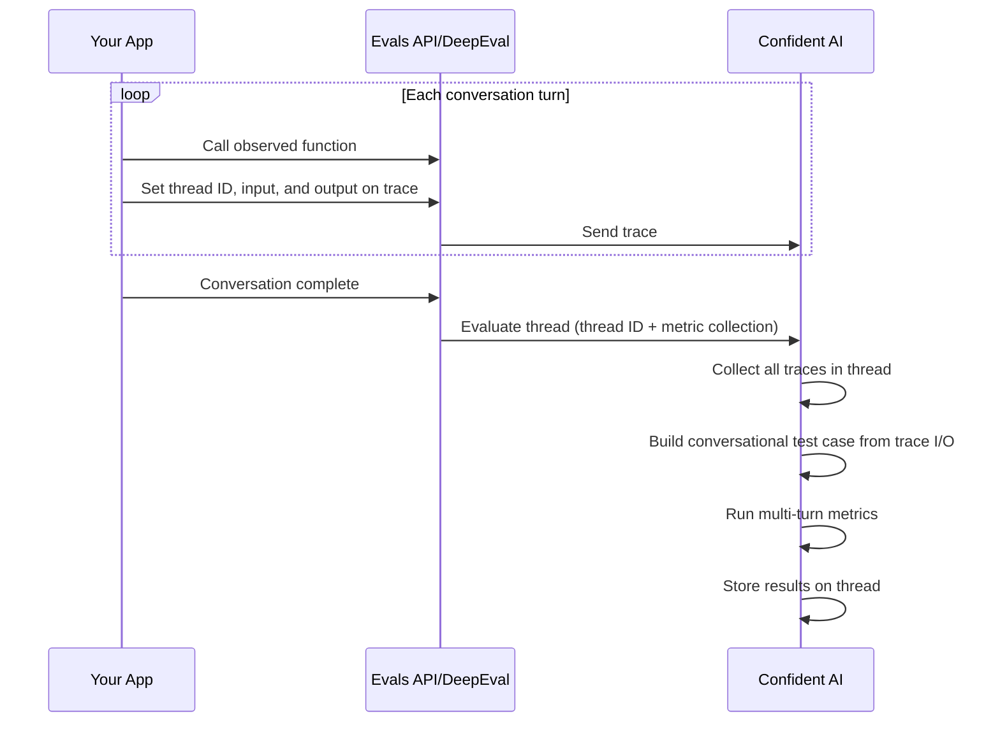

## Overview

Thread evaluations let you evaluate an entire multi-turn conversation as a single unit, rather than evaluating individual traces or spans in isolation. This is essential for conversational AI apps where quality depends on the full context of a conversation.

<Note>
  For evaluating individual traces and spans, see [Evaluate Traces &
  Spans](/docs/llm-tracing/online-evals).
</Note>

## How It Works

Thread evaluations follow these steps:

1. You [create a **multi-turn** metric collection](/docs/llm-evaluation/metrics/create-on-the-cloud) on Confident AI with the conversational metrics you want to run.
2. Your app creates traces with a shared thread ID, setting `input` and `output` on each trace to represent conversation turns.
3. Once the conversation is complete, you call the evaluate thread function with the thread ID and metric collection name.
4. Confident AI builds a conversational test case from the trace I/O values — each trace's `input` becomes a user turn, and each `output` becomes an assistant turn.
5. Your multi-turn metrics run against the full conversation and results appear on the thread in the dashboard.

Only **multi-turn** metric collections work for thread evaluations. Using a single-turn collection will not produce results.



## How Thread Evals Differ

|                       | Trace & Span Evals                           | Thread Evals                                            |
| --------------------- | -------------------------------------------- | ------------------------------------------------------- |
| **Scope**             | Single request/response                      | Entire multi-turn conversation                          |
| **Metric collection** | Single-turn metrics                          | Multi-turn metrics                                      |
| **When to run**       | Real-time or retrospectively                 | Retrospectively only (after conversation ends)          |
| **Data source**       | Test case parameters you set on spans/traces | Trace `input`/`output` values become conversation turns |

The key difference is that you don't set test case parameters for thread evals — instead, Confident AI automatically constructs the conversation from trace I/O:

- **Trace `input`** → user message
- **Trace `output`** → assistant message

This is why [setting trace I/O](/docs/llm-tracing/features/input-output) correctly is critical for thread evaluations.

<Warning>
  If you don't set `input` and/or `output` on any traces in the thread,
  Confident AI will have no turns to evaluate and the evaluation will produce no
  results.
</Warning>

## Evaluate a Thread

Thread evaluations must be triggered manually after a conversation has completed, since Confident AI cannot automatically know when a multi-turn conversation is finished.

Call the evaluate thread function once the conversation is done:

<Tabs>
<Tab title="Python" language="python">

```python title="main.py" {19}
from openai import OpenAI
from deepeval.tracing import observe, update_current_trace, evaluate_thread

client = OpenAI()
your_thread_id = "your-thread-id"

@observe()
def llm_app(query: str):
    res = client.chat.completions.create(
        model="gpt-4o",
        messages=[{"role": "user", "content": query}]
    ).choices[0].message.content
    update_current_trace(thread_id=your_thread_id, input=query, output=res)
    return res

llm_app("What's the weather in SF?")
llm_app("What about tomorrow?")

evaluate_thread(thread_id=your_thread_id, metric_collection="My Multi-Turn Collection")
```

</Tab>
<Tab title="TypeScript" language="typescript">

```typescript title="index.ts" {25} maxLines={0}
import {
  observe,
  updateCurrentTrace,
  evaluateThread,
} from "deepeval-ts/tracing";
import OpenAI from "openai";

const yourThreadId = "your-thread-id";

const llmApp = async (query: string) => {
  const openai = new OpenAI();
  const res = await openai.chat.completions.create({
    model: "gpt-4o",
    messages: [{ role: "user", content: query }],
  });
  const data = res.choices[0].message.content;
  updateCurrentTrace({ threadId: yourThreadId, input: query, output: data });
  return data;
};
const observedLlmApp = observe({ fn: llmApp });

await observedLlmApp("What's the weather in SF?");
await observedLlmApp("What about tomorrow?");

await evaluateThread({
  threadId: yourThreadId,
  metricCollection: "My Multi-Turn Collection",
});
```

</Tab>
</Tabs>

<Tip>
  The asynchronous version `a_evaluate_thread` is also available in Python.
</Tip>

## Add Turn Context

You can optionally enrich each turn with tools called and retrieval context. This gives multi-turn metrics additional context about how each response was generated.

<Note>

For more information on how trace parameters map to test case parameters, [click here.](/docs/llm-tracing/online-evals#map-test-case-parameters)

</Note>

<Tabs>
<Tab title="Python" language="python">

```python title="main.py" {10,11}
from deepeval.tracing import observe, update_current_trace
from deepeval.test_case import ToolCall

@observe()
def llm_app(query: str):
    chunks = retrieve(query)
    res = generate(query, chunks)
    update_current_trace(
        thread_id="your-thread-id",
        input=query,
        output=res,
        retrieval_context=[chunk.text for chunk in chunks],
        tools_called=[ToolCall(name="WebSearch")]
    )
    return res
```

</Tab>
<Tab title="TypeScript" language="typescript">

```typescript title="index.ts" {9,10} maxLines={0}
import { observe, updateCurrentTrace } from "deepeval-ts/tracing";

const llmApp = async (query: string) => {
  const chunks = await retrieve(query);
  const res = await generate(query, chunks);
  updateCurrentTrace({
    threadId: "your-thread-id",
    input: query,
    output: res,
    retrievalContext: chunks.map((c) => c.text),
    toolsCalled: [{ name: "WebSearch" }],
  });
  return res;
};
const observedLlmApp = observe({ fn: llmApp });
```

</Tab>
</Tabs>

## Examples

**Quick quiz:** Given the code below, will Confident AI successfully evaluate the thread?

<Tabs>
<Tab title="Python" language="python">

```python title="main.py"
from deepeval.tracing import observe, update_current_trace, evaluate_thread

your_thread_id = "your-thread-id"

@observe(metric_collection="Collection 1")
def llm_app(query: str):
    update_current_trace(thread_id=your_thread_id)

llm_app("Hello")
evaluate_thread(thread_id=your_thread_id, metric_collection="Collection 2")
```

</Tab>
<Tab title="TypeScript" language="typescript">

```typescript title="index.ts" maxLines={0}
import {
  observe,
  updateCurrentTrace,
  evaluateThread,
} from "deepeval-ts/tracing";

const yourThreadId = "your-thread-id";

const llmApp = (query: string) => {
  updateCurrentTrace({ threadId: yourThreadId });
};
const observedLlmApp = observe({
  metricCollection: "Collection 1",
  fn: llmApp,
});

observedLlmApp("Hello");
await evaluateThread({
  threadId: yourThreadId,
  metricCollection: "Collection 2",
});
```

</Tab>
</Tabs>

**Answer:** **No** — the thread evaluation will produce no results because neither `input` nor `output` has been set on the trace. Without these, Confident AI has no conversation turns to evaluate.

<Warning>
  The metric collection on the `observe` decorator/wrapper is for
  **trace-level** single-turn evaluations. For thread evaluations, you need to
  set `input` and `output` on the trace — these are what become conversation
  turns — and call the evaluate thread function separately.
</Warning>

## Next Steps

<CardGroup cols={2}>
  <Card
    title="Thread Traces"
    href="/llm-tracing/features/threads"
    icon="messages"
    iconType="light"
  >
    Learn how to create threads, set I/O, and log tools called and retrieval
    context per turn.
  </Card>
  <Card
    title="Customize Traces"
    href="/llm-tracing/features/tags"
    icon="tags"
    iconType="light"
  >
    Add tags, metadata, and user info to your traces for filtering and analysis.
  </Card>
</CardGroup>
