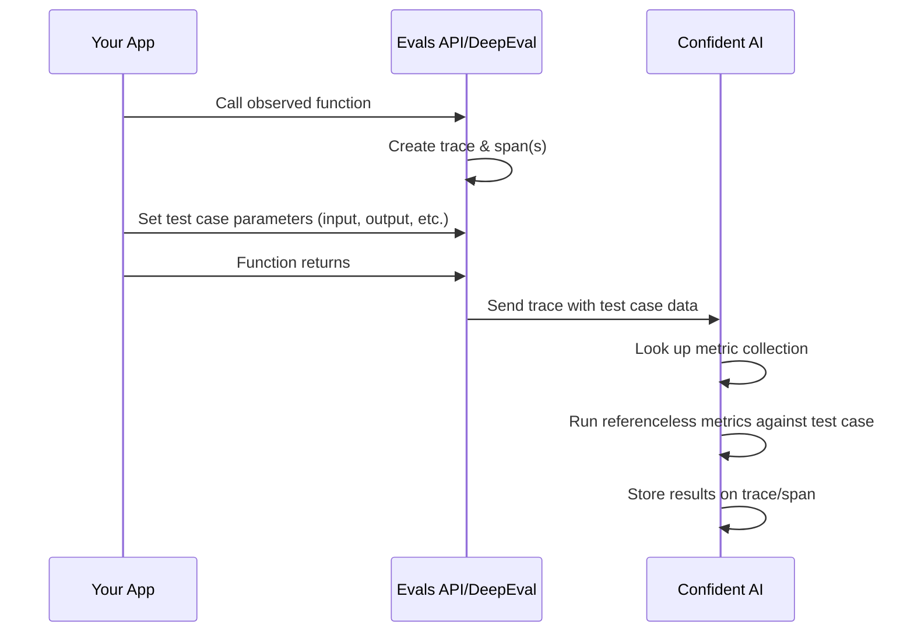

## Overview

Online evaluations let you run metrics on traces and spans on-the-fly as they're ingested into Confident AI, giving you real-time production monitoring of your AI's quality.

<Frame caption="Online Evaluations on Confident AI">
  
</Frame>

You can also trigger evaluations retrospectively on historical traces and spans.

<Note>
  For evaluating multi-turn conversations (threads), see [Evaluate
  Threads](/docs/llm-tracing/evaluate-threads).
</Note>

## How It Works

Online evaluations for traces and spans follow these steps:

1. You [create a metric collection](/docs/llm-evaluation/metrics/create-on-the-cloud) on Confident AI with the **single-turn** metrics you want to run.
2. You reference that metric collection by name in the `observe` decorator/wrapper via the metric collection parameter.
3. Inside your observed function, you set [test case parameters](/docs/llm-evaluation/core-concepts/test-cases-goldens-datasets) on the span or trace using the update current span or update current trace function.
4. When the trace is sent to Confident AI, it runs the metrics in your collection against the test case data you provided.
5. Results appear on the trace/span in the Confident AI dashboard.



<Warning>
  Only **referenceless** metrics in your metric collection will run during
  tracing. [Referenceless metrics](/docs/concepts/metrics#referenceless-metrics)
  can evaluate your LLM's performance without requiring reference data (like
  `expected_output` or `expected_tools`). Non-referenceless metrics are silently
  skipped.
</Warning>

## Map Test Case Parameters

To run evaluations, you first need to understand how trace span parameters map to [test case parameters](/docs/llm-evaluation/core-concepts/test-cases-goldens-datasets), which is what metrics use for evaluation. These parameters provide the data that metrics evaluate against.

The parameters you pass to the update current span or update current trace function map directly to test case parameters that metrics evaluate against:

<Tabs>
<Tab title="Python" language="python">

| Trace/Span Parameter | Test Case Parameter | Description                                            |
| -------------------- | ------------------- | ------------------------------------------------------ |
| `input`              | `input`             | The input to your AI app                               |
| `output`             | `actual_output`     | The output of your AI app                              |
| `expected_output`    | `expected_output`   | The expected output of your AI app                     |
| `retrieval_context`  | `retrieval_context` | List of retrieved text chunks from a retrieval system  |
| `context`            | `context`           | List of ideal retrieved text chunks                    |
| `tools_called`       | `tools_called`      | List of `ToolCall` objects representing tools called   |
| `expected_tools`     | `expected_tools`    | List of `ToolCall` objects representing expected tools |

</Tab>
<Tab title="TypeScript" language="typescript">

| Trace/Span Parameter | Test Case Parameter | Description                                            |
| -------------------- | ------------------- | ------------------------------------------------------ |
| `input`              | `input`             | The input to your AI app                               |
| `output`             | `actualOutput`      | The output of your AI app                              |
| `expectedOutput`     | `expectedOutput`    | The expected output of your AI app                     |
| `retrievalContext`   | `retrievalContext`  | List of retrieved text chunks from a retrieval system  |
| `context`            | `context`           | List of ideal retrieved text chunks                    |
| `toolsCalled`        | `toolsCalled`       | List of `ToolCall` objects representing tools called   |
| `expectedTools`      | `expectedTools`     | List of `ToolCall` objects representing expected tools |

</Tab>
</Tabs>

All parameters are **optional** — you only need to provide the ones required by the metrics in your collection.

<Tip>
  Each metric requires different test case parameters. For details on what each
  metric needs, refer to the [official DeepEval
  documentation](https://deepeval.com/docs/metrics-introduction).
</Tip>

## Evaluate Spans Online

Provide a metric collection on the span's `observe` decorator/wrapper and set test case parameters via the update current span function:

<Tabs>
<Tab title="Python" language="python">

```python title="main.py" {6,13}
from deepeval.tracing import observe, update_current_span
from openai import OpenAI

client = OpenAI()

@observe(metric_collection="My Collection")
def llm_app(query: str) -> str:
    res = client.chat.completions.create(
        model="gpt-4o",
        messages=[{"role": "user", "content": query}]
    ).choices[0].message.content

    update_current_span(input=query, output=res)
    return res

llm_app("Write me a poem.")
```

</Tab>
<Tab title="TypeScript" language="typescript">

```typescript title="index.ts" {4,11} maxLines={0}
import { observe, updateCurrentSpan } from "deepeval-ts/tracing";

const generate = async (prompt: string): Promise<string> => {
  updateCurrentSpan({ input: prompt, output: "LLM response" });
  return "LLM response";
};

const observedGenerate = observe({
  type: "llm",
  metricCollection: "My Collection",
  fn: generate,
});
```

</Tab>
</Tabs>

<Tip>
  If a metric collection name doesn't match any collection on Confident AI, it
  will fail silently. Make sure the names align exactly (watch out for trailing
  spaces).
</Tip>

## Evaluate Traces Online

Similar to spans, but use the update current trace function to set test case parameters. The metric collection **must be set on the root-level (outermost) span**.

<Tabs>
<Tab title="Python" language="python">

```python title="main.py" {6,13}
from deepeval.tracing import observe, update_current_trace
from openai import OpenAI

client = OpenAI()

@observe(metric_collection="My Collection")
def llm_app(query: str) -> str:
    res = client.chat.completions.create(
        model="gpt-4o",
        messages=[{"role": "user", "content": query}]
    ).choices[0].message.content

    update_current_trace(input=query, output=res)
    return res

llm_app("Write me a poem.")
```

</Tab>
<Tab title="TypeScript" language="typescript">

```typescript title="index.ts" {4,11} maxLines={0}
import { observe, updateCurrentTrace } from "deepeval-ts/tracing";

const generate = async (prompt: string): Promise<string> => {
  updateCurrentTrace({ input: prompt, output: "LLM response" });
  return "LLM response";
};

const observedGenerate = observe({
  type: "llm",
  metricCollection: "My Collection",
  fn: generate,
});
```

</Tab>
</Tabs>

<Tip>You can run online evals on both traces and spans at the same time.</Tip>

If you specify a metric collection but don't provide sufficient test case parameters for a metric, it will show up as an error on Confident AI but won't block or cause issues in your code.

## Run Evals Offline

You can also trigger evaluations on traces and spans that have already been ingested. This is useful for re-evaluating with new metrics or running evals on historical data.

<Warning>

This is currently only available for Python users.

</Warning>

### Evaluate a trace

```python title="main.py"
from deepeval.tracing import evaluate_trace

evaluate_trace(trace_uuid="your-trace-uuid", metric_collection="Collection Name")
```

<Tip>The asynchronous version `a_evaluate_trace` is also available.</Tip>

Your trace must already contain the necessary test case parameters — you cannot update them when evaluating retrospectively.

### Evaluate a span

```python title="main.py"
from deepeval.tracing import evaluate_span

evaluate_span(span_uuid="your-span-uuid", metric_collection="Collection Name")
```

<Tip>The asynchronous version `a_evaluate_span` is also available.</Tip>

The metric collection you provide must be a **single-turn** collection.

## Examples

**Quick quiz:** Given the code below, will Confident AI run online evaluations on the trace using metrics in `"Collection 2"` or `"Collection 1"`?

<Tabs>
<Tab title="Python" language="python">

```python title="main.py"
from deepeval.tracing import observe, update_current_span, update_current_trace

@observe(metric_collection="Collection 1")
def outer_function():
    @observe(metric_collection="Collection 2")
    def inner_function():
        update_current_span(input=..., output=...)
        update_current_trace(input=..., output=...)
```

</Tab>
<Tab title="TypeScript" language="typescript">

```typescript title="index.ts" maxLines={0}
import {
  observe,
  updateCurrentSpan,
  updateCurrentTrace,
} from "deepeval-ts/tracing";

const innerFunction = () => {
  updateCurrentSpan({ input: "...", output: "..." });
  updateCurrentTrace({ input: "...", output: "..." });
};
const observedInner = observe({
  metricCollection: "Collection 2",
  fn: innerFunction,
});

const outerFunction = () => {
  observedInner();
};
const observedOuter = observe({
  metricCollection: "Collection 1",
  fn: outerFunction,
});
```

</Tab>
</Tabs>

**Answer:** `"Collection 1"` runs for the **trace**, and `"Collection 2"` runs for the **span**.

This is because:

1. The outer function creates the root span — its metric collection is used for trace-level evals
2. The inner function creates a nested span — its metric collection is used for span-level evals
3. The update current span call updates the innermost active span (the "inner" span)
4. The update current trace call always updates the trace regardless of where it's called

## Next Steps

Now that you can evaluate individual traces and spans, learn how to evaluate entire conversations.

<CardGroup cols={2}>
  <Card
    title="Evaluate Threads"
    href="/llm-tracing/evaluate-threads"
    icon="comments"
    iconType="light"
  >
    Run evaluations on multi-turn conversations and understand how thread evals
    differ from trace evals.
  </Card>
  <Card
    title="Customize Traces"
    href="/llm-tracing/features/tags"
    icon="tags"
    iconType="light"
  >
    Add tags, metadata, and user info to your traces for filtering and analysis.
  </Card>
</CardGroup>
