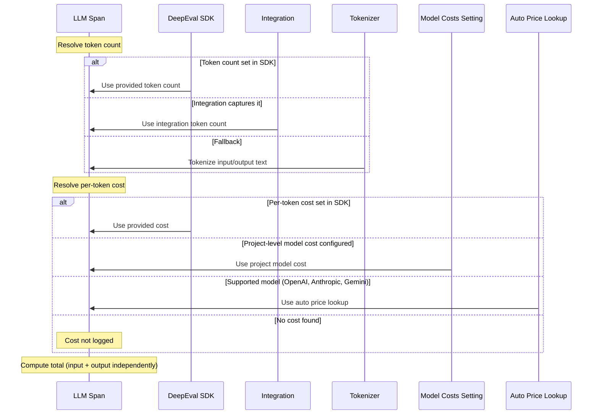

## Overview

Confident AI tracks the token usage and cost of your LLM calls, helping you identify high-cost models and heavy usage patterns across your application.

<Note>
  Cost tracking only applies to [LLM
  spans](/docs/llm-tracing/features/span-types#llm-spans). If you haven't
  already, learn how to [configure span
  types](/docs/llm-tracing/features/span-types) first.
</Note>

<Frame caption="LLM Cost Tracking">
  <video data-video="tracing.costTracking" autoPlay />
</Frame>

## How It Works

Confident AI resolves token usage and cost for each LLM span in the following order of precedence, and separately for both input and output tokens:

1. Per-token costs and counts set in **Evals API/DeepEval** (via `observe` or `update_llm_span` / `updateLlmSpan`) take the **highest priority** and will always override any other source.
   - Integrations may provide token count but cost calculation happens the same way.
2. **Custom set model costs** — if you provide token counts but not per-token costs, Confident AI will use the pricing you've configured in your [Model Costs settings](/docs/settings/project/model-costs) to calculate the cost.
3. **Automatic inference** — if neither per-token costs nor project-level costs are available, Confident AI tokenizes the span's input/output text using a provider-specific tokenizer and internally looks up pricing based on the `model`.

Once token counts and per-token costs are resolved for each side, the total cost is computed as:

```
input_cost  = input_token_count  × cost_per_input_token   (if both are non-null)
output_cost = output_token_count × cost_per_output_token   (if both are non-null)
total_cost  = input_cost + output_cost
```

Input and output costs are computed **independently** — cost will only be logged for a side (input or output) if its values are non-null (they do not default to 0).



<Note>
  Automatic inference is only available for **OpenAI**, **Anthropic**, and
  **Gemini** models. For all other providers, supply token counts and costs
  manually or configure [Model Costs](/docs/settings/project/model-costs) in
  your project settings.
</Note>

## Track Token Usage Count

You can manually set the input and output token counts on an LLM span using `update_llm_span` / `updateLlmSpan`. This is useful when your provider returns token usage in the response and you want to log it precisely.

<Tabs>
<Tab title="Python">

```python title="main.py" {11,12}
from deepeval.tracing import observe, update_llm_span

@observe(type="llm", model="gpt-4o")
def generate_response(prompt: str) -> str:
    response = call_llm(prompt)
    update_llm_span(
        input_token_count=response.usage.prompt_tokens,
        output_token_count=response.usage.completion_tokens,
    )
    return response.text
```

</Tab>
<Tab title="TypeScript">

```typescript title="index.ts" {10,11} maxLines={0}
import { observe, updateLlmSpan } from "deepeval-ts/tracing";

const generateResponse = async (prompt: string) => {
  const response = await callLlm(prompt);
  updateLlmSpan({
    inputTokenCount: response.usage.promptTokens,
    outputTokenCount: response.usage.completionTokens,
  });
  return response.text;
};

const observedGenerateResponse = observe({
  type: "llm",
  model: "gpt-4o",
  fn: generateResponse,
});
```

</Tab>
</Tabs>

If you don't provide token counts and aren't using an integration, Confident AI will attempt to infer them by tokenizing the span's input and output text using the appropriate provider tokenizer. The table below summarizes each supported provider and its tokenization method.

| Provider  | Tokenizer                                                                        | Example Models                                       | Token Counting Method                                   |
| --------- | -------------------------------------------------------------------------------- | ---------------------------------------------------- | ------------------------------------------------------- |
| OpenAI    | [tiktoken](https://github.com/openai/tiktoken)                                   | `gpt-4o`, `gpt-4.1`, `o1`, `o3`                      | Client-side tokenization using model-specific encodings |
| Anthropic | [@anthropic-ai/tokenizer](https://www.npmjs.com/package/@anthropic-ai/tokenizer) | `claude-3.5-sonnet`, `claude-3.7-sonnet`, `claude-4` | Claude-specific tokenization algorithm                  |
| Google    | Gemini API                                                                       | `gemini-2.0-flash`, `gemini-2.5-pro`                 | Server-side token counting via API call                 |

See the [OpenAI documentation](https://platform.openai.com/docs/guides/text-generation/token-counting), [Anthropic documentation](https://docs.anthropic.com/claude/references/token-counting), or [Google documentation](https://ai.google.dev/pricing) for the most up-to-date pricing.

<Tip>

Note that the input and output are calculated separately - you don't have to provide both to set the cost for either.

</Tip>

## Track Token Usage Cost

Once token counts are available (either set manually, captured by an integration, or inferred automatically), Confident AI resolves the per-token cost using the following precedence:

1. **Per-token costs set in DeepEval/Evals API** — if you provide cost per input/output tokens directly in code, these always take priority.
2. **Custom set model costs** — if per-token costs aren't set in code, Confident AI uses the pricing configured in your [Model Costs settings](/docs/settings/project/model-costs).
3. **Automatic price lookup** — if no project-level costs are configured, Confident AI looks up the per-token pricing internally based on the `model`. This is only available for **OpenAI**, **Anthropic**, and **Gemini** models.

If none of the above resolve a per-token cost, the cost for that side (input or output) is **not logged**.

### Explicit cost setting

Set the per-token costs explicitly in the `observe` decorator/wrapper alongside your token counts. This spares you for provider models not supported by automatic price lookup.

<Note>

Explicit cost setting is best for teams that want programtic control over cost. For teams wanting to set model costs on the platform directory, see [custom price lookup.](/docs/llm-tracing/cost-tracking#custom-price-lookup)

</Note>

<Tabs>
<Tab title="Python" language="python">

```python title="main.py" {6,7,12,13}
from deepeval.tracing import observe, update_llm_span

@observe(
    type="llm",
    model="gpt-4o",
    cost_per_input_token=0.001,
    cost_per_output_token=0.001
)
def generate_response(prompt: str) -> str:
    output = call_llm(prompt)
    update_llm_span(
        input_token_count=10,
        output_token_count=20,
    )
    return output
```

</Tab>
<Tab title="TypeScript" language="typescript">

```typescript title="index.ts" {6,7,15,16} maxLines={0}
import { observe, updateLlmSpan } from "deepeval-ts/tracing";

const generateResponse = (prompt: string): string => {
  const output = callLlm(prompt);
  updateLlmSpan({
    inputTokenCount: 10,
    outputTokenCount: 20,
  });
  return output;
};

const observedGenerateResponse = observe({
  type: "llm",
  model: "gpt-4o",
  costPerInputToken: 0.001,
  costPerOutputToken: 0.001,
  fn: generateResponse,
});
```

</Tab>
</Tabs>

### Custom price lookup

If you provide token counts but don't set per-token costs in code, Confident AI will use the pricing you've configured in your project's [Model Costs settings](/docs/settings/project/model-costs). This is useful when you want to manage pricing centrally without changing any code.

Model costs are matched against the `model` name on your LLM span using wildcard patterns. For example:

- `gpt-4o` — matches only `gpt-4o`
- `gpt-4*` — matches `gpt-4o`, `gpt-4o-mini`, `gpt-4-turbo`, etc.
- `claude-*` — matches all Claude model variants

You can optionally restrict a cost rule to a specific provider, and set input and output costs independently per million tokens. See the full [Model Costs settings](/docs/settings/project/model-costs) page for setup instructions.

<Frame caption="Configure Model Costs">
  
</Frame>

### Automatic price lookup

If you provide a supported `model` on your LLM span and neither SDK-level nor project-level costs are configured, Confident AI will automatically look up the per-token pricing and calculate the cost — no additional code needed.

<Tabs>
<Tab title="Python" language="python">

```python title="main.py" {3}
from deepeval.tracing import observe, update_current_span

@observe(type="llm", model="gpt-4o")
def generate_response(prompt: str) -> str:
    output = call_llm(prompt)
    update_current_span(input=prompt, output=output)
    return output
```

</Tab>
<Tab title="TypeScript" language="typescript">

```typescript title="index.ts" {11} maxLines={0}
import { observe, updateCurrentSpan } from "deepeval-ts/tracing";

const generateResponse = async (prompt: string) => {
  const output = await callLlm(prompt);
  updateCurrentSpan({ input: prompt, output: output });
  return output;
};

const observedGenerateResponse = observe({
  type: "llm",
  model: "gpt-4o",
  fn: generateResponse,
});
```

</Tab>
</Tabs>

<Note>
  Automatic price lookup is only available for **OpenAI**, **Anthropic**, and
  **Gemini** models. For all other providers, set per-token costs manually or
  configure [Model Costs](/docs/settings/project/model-costs) in your project
  settings.
</Note>

## Cost on Traces

Cost on traces are automatically set by summing up the cost of all LLM spans in said trace. Similar to LLM spans, trace cost defaults to null values if no LLM spans have non-null values.

## Next Steps

With cost tracking configured, continue setting up the rest of your instrumentation.

<CardGroup cols={2}>
  <Card
    title="Set Input/Output"
    href="/llm-tracing/features/input-output"
    icon="i-cursor"
    iconType="light"
  >
    Override the default input and output on traces and spans for better
    visualization and evaluation.
  </Card>
  <Card
    title="Thread Traces"
    href="/llm-tracing/features/threads"
    icon="messages"
    iconType="light"
  >
    Group traces into threads to track multi-turn conversations and evaluate
    entire workflows.
  </Card>
</CardGroup>
