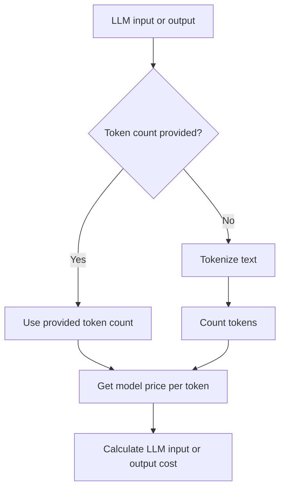

Confident AI lets you track the latency and cost of your LLM calls, which can help you identify inefficiencies in your LLM systems, such as high-cost models or heavy user usage. There are 2 types of cost tracking:
- **Manual cost tracking**: define the token count and per-token costs manually in code
- **Automatic cost tracking**: Confident AI infers the token count and per-token costs based on the `model`

<Callout type="info">
The `@observe` decorator automatically tracks [span](/docs/llm-tracing/tracing-features/span-types) latency. Therefore, this guide will mainly focus on how to set up **cost tracking**.
</Callout>

<Frame caption="LLM Cost and Latency Tracking">
    <video style={{ aspectRatio: '16 / 9', width: '100%' }} controls>
        <source src="https://confident-docs.s3.us-east-1.amazonaws.com/llm-tracing:cost-tracking.mp4" type="video/mp4" />
    </video>
</Frame>

<Tabs>
<Tab title="Manual Cost Tracking">
<CodeBlock>
```python title="main.py" {6,7,13,14}
from deepeval.tracing import update_current_span, LlmAttributes
 
@observe(
    type="llm", 
    model="gpt-4o", 
    cost_per_input_token=0.001, 
    cost_per_output_token=0.001
)
def generate_response(prompt: str) -> str:
    output = "Generated response"
    update_current_span(
        attributes=LlmAttributes(
            input_token_count=10,
            output_token_count=20,
        )
    )
    return output
```
</CodeBlock>
</Tab>
<Tab title="Automatic Cost Tracking">
<CodeBlock>
```python title="main.py" {5}
from deepeval.tracing import update_current_span, LlmAttributes
 
@observe(
    type="llm", 
    model="gpt-4o"
)
def generate_response(prompt: str) -> str:
    output = "Generated response"
    update_current_span(
        attributes=LlmAttributes(
            input=prompt,
            output=output,
        )
    )
    return output
```
</CodeBlock>
</Tab>
</Tabs>

## Setup Cost Tracking

You can either manually configure cost tracking or let Confident AI calculate your costs automatically from the [inputs and outputs](/docs/llm-tracing/tracing-features/input-output) of your LLM span based on the provided `model`.

<Callout>
Automatic cost tracking is only available for **OpenAI**, **Anthropic**, and **Gemini** models.
</Callout>

<div className='flex items-center justify-center'>

</div>

If token-usage and cost data are provided in code, Confident AI computes the cost directly from those values. If not, it attempts to **infer the cost** from the model, input, and output by following these steps:

   1. Verify that the model, input, and output are all available and valid.  
   2. Select the appropriate tokenizer for the model provider.  
   3. Count the input and output tokens.  
   4. Retrieve the per-token pricing from the provider.  
   5. Compute the total cost.  


### Automatic Cost Tracking

To set up automatic cost tracking, provide the `model` in the `@observe` decorator of your [LLM span](/docs/llm-tracing/tracing-features/span-types#llm-span), and provide the `input` and `output` in your `LlmAttributes`.

<CodeBlock>
```python title="main.py" {5}
from deepeval.tracing import update_current_span, LlmAttributes
 
@observe(
    type="llm", 
    model="gpt-4o"
)
def generate_response(prompt: str) -> str:
    output = "Generated response"
    update_current_span(
        attributes=LlmAttributes(
            input=prompt,
            output=output,
        )
    )
    return output
```
</CodeBlock>

The table below summarizes each available model provider and its corresponding tokenization method.

|  Provider | Tokenizer | Example Models | Token Counting Method |
|-------------|-----------|----------------|----------------------|
| OpenAI | [tiktoken](https://github.com/openai/tiktoken) | GPT-4, GPT-3.5, O1, O3 | Client-side tokenization using model-specific encodings |
| Anthropic | [@anthropic-ai/tokenizer](https://www.npmjs.com/package/@anthropic-ai/tokenizer) | Claude 3 Opus, Claude 3 Sonnet, Claude 3 Haiku | Claude-specific tokenization algorithm |
| Google | Gemini API | Gemini 1.5 Pro, Gemini 2.0 Flash | Server-side token counting via API call |

See the [OpenAI documentation](https://platform.openai.com/docs/guides/text-generation/token-counting), [Anthropic documentation](https://docs.anthropic.com/claude/references/token-counting), or [Google documentation](https://ai.google.dev/pricing) for the most up-to-date pricing and token counting information.

### Manual Cost Tracking

To manually set up cost tracking, provide the `cost_per_input_token` and `cost_per_output_token` in the `@observe` decorator of your [LLM span](/docs/llm-tracing/tracing-features/span-types#llm-span), and pass the input and output token counts via `LlmAttributes`.

<Callout >
Manual cost tracking is the **recommended approach** if you want to ensure accurate cost tracking, and if your model provider does not support automatic cost tracking. 
</Callout>

<CodeBlock>
```python title="main.py" {6,7,13,14} 
from deepeval.tracing import update_current_span, LlmAttributes
 
@observe(
    type="llm", 
    model="gpt-4o", 
    cost_per_input_token=0.001, 
    cost_per_output_token=0.001
)
def generate_response(prompt: str) -> str:
    output = "Generated response"
    update_current_span(
        attributes=LlmAttributes(
            input_token_count=10,
            output_token_count=20,
        )
    )
    return output

generate_response("Calculate the cost of this call")
```
</CodeBlock>

The total cost of this call will be computed as:

<CodeBlock>
```
(input_token_count × cost_per_input_token) + (output_token_count × cost_per_output_token)
```
</CodeBlock>
