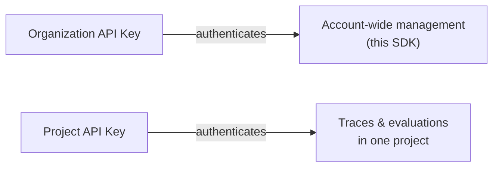

## Overview

API keys authenticate requests to Confident AI, and come in two scopes:

- **Organization API keys** authenticate at the organization level. They're used for account-wide administration — including every management method in this SDK.
- **Project API keys** are scoped to a single project. They're the keys your application uses to send traces and run evaluations against that project.

Each scope has its own `ConfidentClient` methods: organization methods manage org-wide keys, while project methods take a leading `project_id`. Use them to list, create, enable/disable, and rotate keys in code.



<Warning>

The full secret `value` of an API key is **only returned when it is created**. Subsequent reads return a masked value, so store the secret securely at creation time.

</Warning>

<Note>

All methods on this page require an **Organization API Key**. See [Setup](/docs/management/introduction#setup) to create a client.

</Note>

## List API Keys

You can list every API key at the organization or project level, with secret values masked.

<Tabs>

<Tab title="Python" language="python">

```python
from deepeval.confident import ConfidentClient

client = ConfidentClient()

api_keys = client.list_organization_api_keys()
api_keys = client.list_project_api_keys(project_id="proj_123")
```

</Tab>

<Tab title="TypeScript" language="typescript">

```typescript
import { ConfidentClient } from "deepeval";

const client = new ConfidentClient();

const apiKeys = await client.listOrganizationApiKeys();
const projectApiKeys = await client.listProjectApiKeys("proj_123");
```

</Tab>

</Tabs>

## Get an API Key

You can retrieve a single API key by its `api_key_id`, with its secret value masked.

<Tabs>

<Tab title="Python" language="python">

```python
api_key = client.get_organization_api_key(api_key_id=7)
api_key = client.get_project_api_key(project_id="proj_123", api_key_id=7)
```

</Tab>

<Tab title="TypeScript" language="typescript">

```typescript
const apiKey = await client.getOrganizationApiKey(7);
const projectApiKey = await client.getProjectApiKey("proj_123", 7);
```

</Tab>

</Tabs>

## Create an API Key

You can create a new key at the organization or project level, and the returned object's `value` is the full secret — capture it right away.

<Tabs>

<Tab title="Python" language="python">

```python
api_key = client.create_organization_api_key(name="ci-pipeline")
print(api_key.value)  # full secret, shown only once

api_key = client.create_project_api_key(
    project_id="proj_123",
    name="ci-pipeline",
)
```

</Tab>

<Tab title="TypeScript" language="typescript">

```typescript
const apiKey = await client.createOrganizationApiKey("ci-pipeline");
console.log(apiKey.value); // full secret, shown only once

const projectApiKey = await client.createProjectApiKey(
  "proj_123",
  "ci-pipeline",
);
```

</Tab>

</Tabs>

## Enable or Disable an API Key

You can set `valid` to `false` to revoke a key without deleting it, or back to `true` to re-enable it.

<Tabs>

<Tab title="Python" language="python">

```python
api_key = client.update_organization_api_key(api_key_id=7, valid=False)
api_key = client.update_project_api_key(
    project_id="proj_123",
    api_key_id=7,
    valid=False,
)
```

</Tab>

<Tab title="TypeScript" language="typescript">

```typescript
const apiKey = await client.updateOrganizationApiKey(7, false);
const projectApiKey = await client.updateProjectApiKey("proj_123", 7, false);
```

</Tab>

</Tabs>

## Delete an API Key

You can permanently delete an API key by its `api_key_id`, which immediately revokes it.

<Tabs>

<Tab title="Python" language="python">

```python
client.delete_organization_api_key(api_key_id=7)
client.delete_project_api_key(project_id="proj_123", api_key_id=7)
```

</Tab>

<Tab title="TypeScript" language="typescript">

```typescript
await client.deleteOrganizationApiKey(7);
await client.deleteProjectApiKey("proj_123", 7);
```

</Tab>

</Tabs>

## Next Steps

Use your keys to authenticate the rest of the platform and SDKs:

<CardGroup cols={2}>
  <Card title="Authentication" icon="lock-keyhole" href="/docs/api-reference/authentication">
    Learn how organization- and project-level auth works.
  </Card>
  <Card title="Projects" icon="folder" href="/docs/management/projects">
    Manage the projects your keys are scoped to.
  </Card>
</CardGroup>
