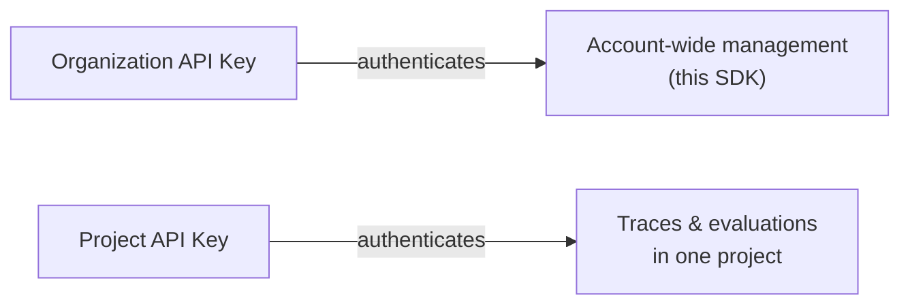

## Overview

API keys authenticate requests to Confident AI, and come in two scopes:

- **Organization API keys** authenticate at the organization level. They're used for account-wide administration — including every management method in this SDK.
- **Project API keys** are scoped to a single project. They're the keys your application uses to send traces and run evaluations against that project.

Each scope is accessed through its own client: `client.organization().api_keys` manages org-wide keys, while `client.project(project_id).api_keys` manages a single project's keys. Use them to list, create, enable/disable, and rotate keys in code.



<Warning>

The full secret `value` of an API key is **only returned when it is created**. Subsequent reads return a masked value, so store the secret securely at creation time.

</Warning>

<Note>

All methods on this page require an **Organization API Key**. See [Setup](/docs/management/introduction#setup) to create a client.

</Note>

## List API Keys

You can list every API key at the organization or project level, with secret values masked.

<Tabs>

<Tab title="Python" language="python">

```python
from confidentai import ConfidentAI

client = ConfidentAI()

org = client.organization()
project = client.project("clq9z3x1k0001la08f7t3g5p2")

api_keys = org.api_keys.list()
project_api_keys = project.api_keys.list()
```

</Tab>

<Tab title="TypeScript" language="typescript">

```typescript
import { ConfidentAI } from "confidentai";

const client = new ConfidentAI();

const org = client.organization();
const project = client.project("clq9z3x1k0001la08f7t3g5p2");

const apiKeys = await org.apiKeys.list();
const projectApiKeys = await project.apiKeys.list();
```

</Tab>

</Tabs>

## Get an API Key

You can retrieve a single API key by its `api_key_id`, with its secret value masked.

<Tabs>

<Tab title="Python" language="python">

```python
org = client.organization()
project = client.project("clq9z3x1k0001la08f7t3g5p2")

api_key = org.api_keys.get(7)
project_api_key = project.api_keys.get(7)
```

</Tab>

<Tab title="TypeScript" language="typescript">

```typescript
const org = client.organization();
const project = client.project("clq9z3x1k0001la08f7t3g5p2");

const apiKey = await org.apiKeys.get(7);
const projectApiKey = await project.apiKeys.get(7);
```

</Tab>

</Tabs>

## Create an API Key

You can create a new key at the organization or project level, and the returned object's `value` is the full secret — capture it right away.

<Tabs>

<Tab title="Python" language="python">

```python
org = client.organization()
project = client.project("clq9z3x1k0001la08f7t3g5p2")

api_key = org.api_keys.create("ci-pipeline")
print(api_key.value)  # e.g. "confident_us_org_8Kj2mNpQ4rVz...", shown only once

project_api_key = project.api_keys.create("ci-pipeline")
print(project_api_key.value)  # e.g. "confident_us_proj_WQDt3T2mLpu7..."
```

</Tab>

<Tab title="TypeScript" language="typescript">

```typescript
const org = client.organization();
const project = client.project("clq9z3x1k0001la08f7t3g5p2");

const apiKey = await org.apiKeys.create({ name: "ci-pipeline" });
console.log(apiKey.value); // e.g. "confident_us_org_8Kj2mNpQ4rVz...", shown only once

const projectApiKey = await project.apiKeys.create({ name: "ci-pipeline" });
console.log(projectApiKey.value); // e.g. "confident_us_proj_WQDt3T2mLpu7..."
```

</Tab>

</Tabs>

## Enable or Disable an API Key

You can set `valid` to `false` to revoke a key without deleting it, or back to `true` to re-enable it.

<Tabs>

<Tab title="Python" language="python">

```python
org = client.organization()
project = client.project("clq9z3x1k0001la08f7t3g5p2")

api_key = org.api_keys.update(7, valid=False)
project_api_key = project.api_keys.update(7, valid=False)
```

</Tab>

<Tab title="TypeScript" language="typescript">

```typescript
const org = client.organization();
const project = client.project("clq9z3x1k0001la08f7t3g5p2");

const apiKey = await org.apiKeys.update(7, { valid: false });
const projectApiKey = await project.apiKeys.update(7, { valid: false });
```

</Tab>

</Tabs>

## Delete an API Key

You can permanently delete an API key by its `api_key_id`, which immediately revokes it.

<Tabs>

<Tab title="Python" language="python">

```python
org = client.organization()
project = client.project("clq9z3x1k0001la08f7t3g5p2")

org.api_keys.delete(7)
project.api_keys.delete(7)
```

</Tab>

<Tab title="TypeScript" language="typescript">

```typescript
const org = client.organization();
const project = client.project("clq9z3x1k0001la08f7t3g5p2");

await org.apiKeys.delete(7);
await project.apiKeys.delete(7);
```

</Tab>

</Tabs>

## Next Steps

Use your keys to authenticate the rest of the platform and SDKs:

<CardGroup cols={2}>
  <Card title="Authentication" icon="lock-keyhole" href="/docs/api-reference/authentication">
    Learn how organization- and project-level auth works.
  </Card>
  <Card title="Projects" icon="folder" href="/docs/management/projects">
    Manage the projects your keys are scoped to.
  </Card>
</CardGroup>
