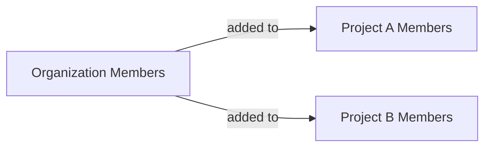

## Overview

Members are the people with access to your account, and they exist at two levels:

- **Organization members** belong to your entire organization. Anyone you invite to the org becomes an organization member, and can be given an organization-level role.
- **Project members** belong to a single project. You add organization members to individual projects to grant them access there, with a project-level role.

A user is always an organization member first — project membership is layered on top to grant access to specific projects. New members join by accepting an invitation, and each level has its own `ConfidentClient` methods: organization methods manage org-wide membership, while project methods take a leading `project_id`.



<Note>

All methods on this page require an **Organization API Key**. See [Setup](/docs/management/introduction#setup) to create a client.

</Note>

## Members

You can manage the people in your organization and its individual projects.

### List Members

You can list members page by page; the listing defaults to `page=1` and `page_size=25`.

<Tabs>

<Tab title="Python" language="python">

```python
from deepeval.confident import ConfidentClient

client = ConfidentClient()

# Organization members
members = client.list_organization_members(page=1, page_size=25)

# Project members
members = client.list_project_members(project_id="proj_123", page=1)
```

</Tab>

<Tab title="TypeScript" language="typescript">

```typescript
import { ConfidentClient } from "deepeval";

const client = new ConfidentClient();

// Organization members
const members = await client.listOrganizationMembers({ page: 1, pageSize: 25 });

// Project members
const projectMembers = await client.listProjectMembers("proj_123", { page: 1 });
```

</Tab>

</Tabs>

### Update a Member's Role

You can assign a role to a member by their `user_id`. Roles are managed in the [Roles, Policies & Permissions](/docs/management/roles-policies-permissions) section.

<Tabs>

<Tab title="Python" language="python">

```python
# Organization-level role
member = client.update_organization_member_role(
    user_id="user_123",
    role_id="role_abc",
)

# Project-level role
member = client.update_project_member_role(
    project_id="proj_123",
    user_id="user_123",
    role_id="role_abc",
)
```

</Tab>

<Tab title="TypeScript" language="typescript">

```typescript
// Organization-level role
const member = await client.updateOrganizationMemberRole(
  "user_123",
  "role_abc",
);

// Project-level role
const projectMember = await client.updateProjectMemberRole(
  "proj_123",
  "user_123",
  "role_abc",
);
```

</Tab>

</Tabs>

### Remove a Member

You can remove a member from your organization or a specific project by their `user_id`.

<Tabs>

<Tab title="Python" language="python">

```python
client.remove_organization_member(user_id="user_123")
client.remove_project_member(project_id="proj_123", user_id="user_123")
```

</Tab>

<Tab title="TypeScript" language="typescript">

```typescript
await client.removeOrganizationMember("user_123");
await client.removeProjectMember("proj_123", "user_123");
```

</Tab>

</Tabs>

## Invitations

You can invite new people to your organization or projects, and manage invitations that are still pending.

### List Invitations

You can list the pending invitations at the organization or project level.

<Tabs>

<Tab title="Python" language="python">

```python
invitations = client.list_organization_invitations()
invitations = client.list_project_invitations(project_id="proj_123")
```

</Tab>

<Tab title="TypeScript" language="typescript">

```typescript
const invitations = await client.listOrganizationInvitations();
const projectInvitations = await client.listProjectInvitations("proj_123");
```

</Tab>

</Tabs>

### Create Invitations

You can invite one or more emails at once, and the optional `role_id` assigns a role to invitees when they join.

<Tabs>

<Tab title="Python" language="python">

```python
# Organization invitations
invitations = client.create_organization_invitations(
    emails=["alice@acme.com", "bob@acme.com"],
    role_id="role_abc",
)

# Project invitations
invitations = client.create_project_invitations(
    project_id="proj_123",
    emails=["alice@acme.com"],
    role_id="role_abc",
)
```

</Tab>

<Tab title="TypeScript" language="typescript">

```typescript
// Organization invitations
const invitations = await client.createOrganizationInvitations(
  ["alice@acme.com", "bob@acme.com"],
  "role_abc",
);

// Project invitations
const projectInvitations = await client.createProjectInvitations(
  "proj_123",
  ["alice@acme.com"],
  "role_abc",
);
```

</Tab>

</Tabs>

### Resend & Delete Invitations

You can resend a pending invitation by its `invitation_id`, or delete it to revoke access before it's accepted.

<Tabs>

<Tab title="Python" language="python">

```python
# Resend
client.resend_organization_invitation(invitation_id=42)
client.resend_project_invitation(project_id="proj_123", invitation_id=42)

# Delete
client.delete_organization_invitation(invitation_id=42)
client.delete_project_invitation(project_id="proj_123", invitation_id=42)
```

</Tab>

<Tab title="TypeScript" language="typescript">

```typescript
// Resend
await client.resendOrganizationInvitation(42);
await client.resendProjectInvitation("proj_123", 42);

// Delete
await client.deleteOrganizationInvitation(42);
await client.deleteProjectInvitation("proj_123", 42);
```

</Tab>

</Tabs>

## Next Steps

To control what your members can do, define the roles you assign them:

<CardGroup cols={2}>
  <Card title="Roles, Policies & Permissions" icon="user-shield" href="/docs/management/roles-policies-permissions">
    Create the roles you assign to members.
  </Card>
  <Card title="Projects" icon="folder" href="/docs/management/projects">
    Manage the projects members belong to.
  </Card>
</CardGroup>
