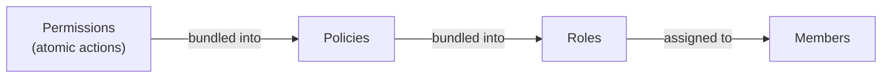

## Overview

Confident AI uses role-based access control (RBAC). Access is granted by composing three building blocks — you bundle permissions into policies, bundle policies into roles, then assign roles to members:

- **Permissions** are the atomic actions you can grant (e.g. `traces:read`). They are predefined by the platform, so you can only list them.
- **Policies** are named bundles of permissions.
- **Roles** are named bundles of policies that you assign to [members](/docs/management/members-and-invitations).



Each building block exists independently at both the **organization** and **project** level: organization-level roles govern org-wide access, while project-level roles govern access within a single project. The two sets mirror each other — every method has an `*_organization_*` variant and a `*_project_*` variant (the latter takes a leading `project_id`). To learn more about RBAC concepts, see [RBAC](/docs/settings/rbac).

<Note>

All methods on this page require an **Organization API Key**. See [Setup](/docs/management/introduction#setup) to create a client.

</Note>

## Permissions

Permissions are read-only. List them to discover the `id`s you'll attach to policies.

<Tabs>

<Tab title="Python" language="python">

```python
from deepeval.confident import ConfidentClient

client = ConfidentClient()

permissions = client.list_organization_permissions()
permissions = client.list_project_permissions(project_id="proj_123")
```

</Tab>

<Tab title="TypeScript" language="typescript">

```typescript
import { ConfidentClient } from "deepeval";

const client = new ConfidentClient();

const permissions = await client.listOrganizationPermissions();
const projectPermissions = await client.listProjectPermissions("proj_123");
```

</Tab>

</Tabs>

## Policies

A policy bundles permissions together. Provide `permission_ids` from the permissions listing above.

### List, Create, Update & Delete Policies

Each policy takes a `name`, a list of `permission_ids`, and an optional `description`.

<Tabs>

<Tab title="Python" language="python">

```python
# List
policies = client.list_organization_policies()
policies = client.list_project_policies(project_id="proj_123")

# Create
policy = client.create_organization_policy(
    name="Dataset Editor",
    permission_ids=["perm_1", "perm_2"],
    description="Can edit datasets",
)

# Update
policy = client.update_organization_policy(
    policy_id="policy_123",
    name="Dataset Editor",
    permission_ids=["perm_1", "perm_2", "perm_3"],
)

# Delete
client.delete_organization_policy(policy_id="policy_123")
```

</Tab>

<Tab title="TypeScript" language="typescript">

```typescript
// List
const policies = await client.listOrganizationPolicies();
const projectPolicies = await client.listProjectPolicies("proj_123");

// Create
const policy = await client.createOrganizationPolicy({
  name: "Dataset Editor",
  permissionIds: ["perm_1", "perm_2"],
  description: "Can edit datasets",
});

// Update
const updated = await client.updateOrganizationPolicy("policy_123", {
  name: "Dataset Editor",
  permissionIds: ["perm_1", "perm_2", "perm_3"],
});

// Delete
await client.deleteOrganizationPolicy("policy_123");
```

</Tab>

</Tabs>

<Tip>

Project-scoped policies use the equivalent `*_project_policy` / `*ProjectPolicy` methods, which take a leading `project_id` argument.

</Tip>

## Roles

A role bundles policies together and is assigned to members. Provide `policy_ids` from the policies above.

### List, Create, Update & Delete Roles

Each role takes a `name`, a list of `policy_ids`, and an optional `description`.

<Tabs>

<Tab title="Python" language="python">

```python
# List
roles = client.list_organization_roles()
roles = client.list_project_roles(project_id="proj_123")

# Create
role = client.create_organization_role(
    name="Data Scientist",
    policy_ids=["policy_123"],
    description="Read/write datasets and prompts",
)

# Update
role = client.update_organization_role(
    role_id="role_abc",
    name="Data Scientist",
    policy_ids=["policy_123", "policy_456"],
)

# Delete
client.delete_organization_role(role_id="role_abc")
```

</Tab>

<Tab title="TypeScript" language="typescript">

```typescript
// List
const roles = await client.listOrganizationRoles();
const projectRoles = await client.listProjectRoles("proj_123");

// Create
const role = await client.createOrganizationRole({
  name: "Data Scientist",
  policyIds: ["policy_123"],
  description: "Read/write datasets and prompts",
});

// Update
const updated = await client.updateOrganizationRole("role_abc", {
  name: "Data Scientist",
  policyIds: ["policy_123", "policy_456"],
});

// Delete
await client.deleteOrganizationRole("role_abc");
```

</Tab>

</Tabs>

<Tip>

Project-scoped roles use the equivalent `*_project_role` / `*ProjectRole` methods, which take a leading `project_id` argument.

</Tip>

## Next Steps

With your roles defined, assign them to your team:

<CardGroup cols={2}>
  <Card title="Members & Invitations" icon="user-group" href="/docs/management/members-and-invitations">
    Assign roles to members and invitees.
  </Card>
  <Card title="RBAC" icon="user-shield" href="/docs/settings/rbac">
    Understand the RBAC model in depth.
  </Card>
</CardGroup>
