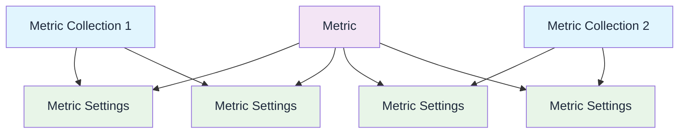

## Overview

A metric collection on Confident AI is a collection of metric and their respective settings. It is what allows you to run evaluations remotely. This can be for either:

- Evals in development, through the Evals APIs
- Evals for LLM tracing, through the means of online or offline evals

Metric collections are strictly used for **remote evals**, and are identified by an unique name, and does not require any code to manage.

<Tip>Both **single and multi-turn** metric collections are supported.</Tip>

<CardGroup cols={2}>
  <Card
    title="Local Evals"
    icon="laptop"
    iconType="solid"
  >

    - Run evaluations locally using `deepeval` with full control over metrics
    - Support for custom metrics, DAG, and advanced evaluation algorithms

    **Suitable for:** Python users, development, and pre-deployment workflows

  </Card>
  <Card
    title="Remote Evals"
    icon="cloud"
    iconType="solid"
  >

    - Run evaluations on Confident AI platform with pre-built metrics
    - Integrated with monitoring, datasets, and team collaboration features

    **Suitable for:** Non-python users, online + offline evals for tracing in prod

  </Card>
</CardGroup>

## Why Metric Collection?

Metric collections solve key challenges when running evaluations at scale:

- **Reusable configurations** — Define your evaluation setup once and reuse it across test runs, experiments, and production monitoring
- **Customizable settings per context** — The same metric can have different thresholds or strictness levels in different collections (e.g., stricter for production, lenient for development)
- **No-code management** — Create and update collections entirely through the UI without touching any code
- **Consistent evaluations** — Ensure all team members and automated pipelines use the same evaluation criteria

## Create a Metric Collection

<Tabs>
  <Tab title="Via UI">

You can create a single or multi-turn metric collection under **Project** > **Metrics** > **Collections**. All you need to do is provide it with a unique name, select the appropriate metrics, and edit their settings (if required).

<Frame caption="Metric Collection for Remote Evals" background="subtle">

<video
  autoPlay
  loop
  muted
  data-video="metrics.createCollection"
  type="video/mp4"
/>

</Frame>

  </Tab>
  <Tab title="Via Code">

You can also create metric collections programmatically using the Evals API:

<EndpointRequestSnippet endpoint="POST /v1/metric-collections" />

  </Tab>
</Tabs>

You can use metric collections for any remote evals in Confident AI:

- Running [single](/docs/llm-evaluation/single-turn/end-to-end#run-e2e-tests-remotely) or [multi-turn E2E testing](/docs/llm-evaluation/multi-turn/end-to-end#run-e2e-tests-remotely) via Evals API
- Running single or mult-turn [online/offline evals](/docs/llm-tracing/evaluations) during LLM tracing

## Understanding Metric Collections

Metric collections and metrics are connected in-directly via **metric settings**, which specifies the specific threshold, strictness, etc. of each metric in different collections.

• **Metric Collection**: A group of metrics that you wish to evaluate together (either for a test run or online evaluation).

• **Metric Settings**: Configuration options for how a metric within a metric collection should be evaluated, including the **threshold**, **strictness**, and whether to **include reasoning**.

When you run remote evals by providing a metric collection name, Confident AI will fetch the metric and their settings related to said collection, before using all these configs to run evals.
