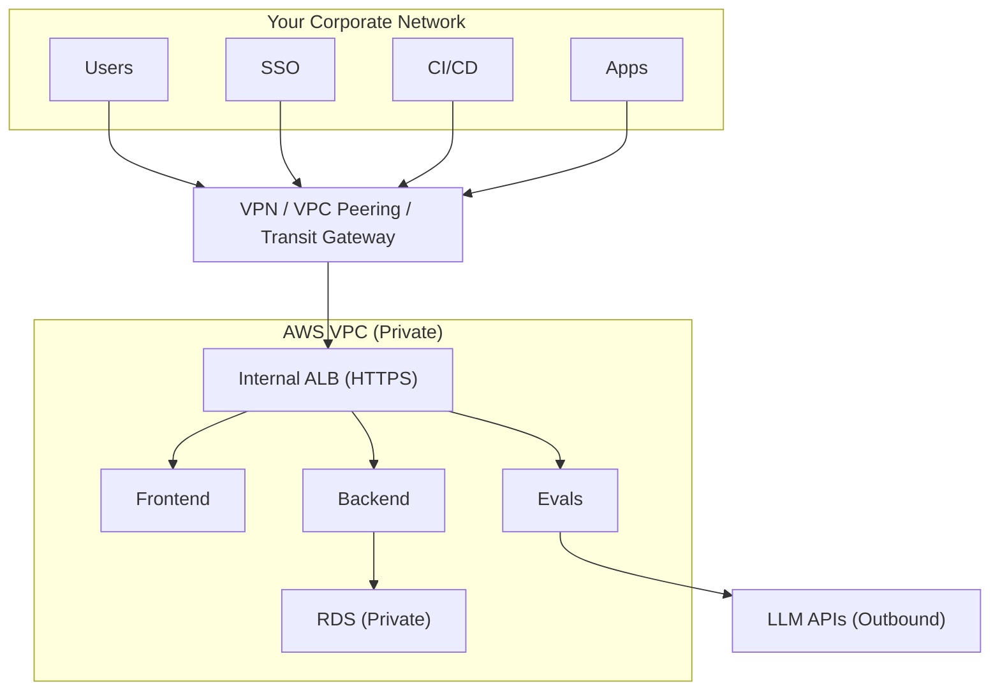

This page provides detailed security information for your security team's review.

## Networking

All traffic flows through your private network. There is no public internet ingress—users access Confident AI through your existing VPN or network peering setup. The only outbound traffic is to LLM providers for evaluations (if using external models) and optional notification services.

## Integration points

The deployment supports several integration points with your existing infrastructure. All inbound connections come through your private network; outbound connections go through NAT Gateway with optional PrivateLink support.

| Integration                       | Direction     | Protocol   | Purpose                                                                |
| --------------------------------- | ------------- | ---------- | ---------------------------------------------------------------------- |
| **Corporate SSO**                 | Inbound       | SAML/OIDC  | User authentication via your identity provider                         |
| **LLM Providers**                 | Outbound      | HTTPS      | OpenAI, Azure OpenAI, Anthropic, or self-hosted models for evaluations |
| **VPC Peering / Transit Gateway** | Bidirectional | Private    | Connect to your existing AWS infrastructure                            |
| **Slack / Email**                 | Outbound      | HTTPS/SMTP | Alert notifications and evaluation reports                             |
| **OTEL Collectors**               | Inbound       | gRPC/HTTP  | Receive traces from your LLM applications                              |
| **CI/CD Pipelines**               | Inbound       | HTTPS      | Trigger evaluations from GitHub Actions, Jenkins, etc.                 |

<Tip>
  All integration endpoints can be configured to use AWS PrivateLink where
  available, eliminating the need for public internet traffic.
</Tip>

## Authentication

Confident AI does not maintain its own user database. All user authentication is handled through your corporate identity provider via SAML or OIDC. This means user credentials never touch Confident AI systems—authentication tokens are validated against your IdP directly.

| Method               | Description                                                                     |
| -------------------- | ------------------------------------------------------------------------------- |
| **SSO (SAML/OIDC)**  | Primary authentication method via your identity provider (Okta, Azure AD, etc.) |
| **Local accounts**   | Not supported—all users must authenticate via SSO                               |
| **API keys**         | Scoped per project for programmatic access                                      |
| **Service accounts** | IRSA (IAM Roles for Service Accounts) for pod-level AWS access                  |

## Data retention

All application data is stored within your AWS account. Retention periods are configurable per data type, allowing you to meet compliance requirements while managing storage costs. Data deletion is handled automatically based on your configured policies.

| Data Type              | Retention                              | Storage Location |
| ---------------------- | -------------------------------------- | ---------------- |
| **Traces & spans**     | Configurable (default: 90 days)        | RDS PostgreSQL   |
| **Evaluation results** | Configurable (default: indefinite)     | RDS PostgreSQL   |
| **Uploaded files**     | Configurable (default: 30 days)        | S3 bucket        |
| **Audit logs**         | Configurable via CloudWatch/CloudTrail | CloudWatch Logs  |
| **Application logs**   | 14 days (default)                      | CloudWatch Logs  |

<Note>
  Retention periods are fully configurable. Contact your Confident AI
  representative to adjust based on your compliance requirements.
</Note>

## Encryption

All data is encrypted both in transit and at rest using AWS-native encryption services. Encryption keys are managed through AWS KMS within your account—Confident AI does not have access to your encryption keys.

| Layer             | Method                                         |
| ----------------- | ---------------------------------------------- |
| **In transit**    | TLS 1.2+ for all internal and external traffic |
| **At rest (RDS)** | AWS KMS encryption                             |
| **At rest (S3)**  | AWS KMS encryption with bucket policies        |
| **Secrets**       | AWS Secrets Manager with KMS encryption        |

## Logging & audit

Comprehensive logging is enabled by default for security monitoring and compliance. All logs are stored in CloudWatch Logs within your AWS account, with CloudTrail capturing AWS API-level activity.

| Log Type             | Destination     | Contents                                      |
| -------------------- | --------------- | --------------------------------------------- |
| **Application logs** | CloudWatch Logs | Service logs, errors, request traces          |
| **Access logs**      | CloudWatch Logs | ALB access logs, API request logs             |
| **Audit trail**      | CloudTrail      | AWS API calls, IAM actions, resource changes  |
| **Database logs**    | CloudWatch Logs | PostgreSQL query logs (optional), connections |
