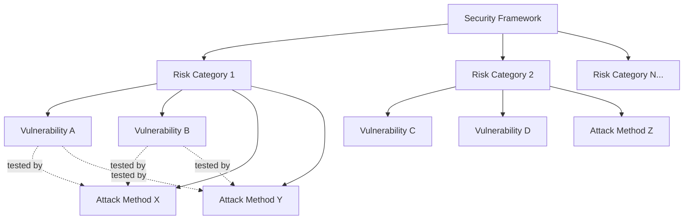

## Overview

Confident AI provides access to industry-standard AI security frameworks out of the box:

- OWASP Top 10 for LLMs — 10 risk categories curated by the [OWASP community](https://genai.owasp.org).
- OWASP Top 10 Agentic Applications — 10 risk categories for agentic applications, also from the OWASP community.
- MITRE ATLAS — adversary tactics and techniques based on real-world observations from [MITRE ATT&CK](https://attack.mitre.org).
- NIST AI RMF — the [NIST](https://www.nist.gov/itl/ai-risk-management-framework) risk management framework for managing AI-associated risks to individuals, organizations, and society.

All default frameworks are simply starting templates that can be customized to fit your application's needs.

<Note>

A security framework is a configuration of vulnerabilities and attacks used to assess your AI application during risk assessments. Default frameworks include:

</Note>

## What you can manage

Each security framework on Confident AI is fully configurable:

<CardGroup cols={3}>
  <Card title="Vulnerabilities" icon="bug">
    Define which vulnerability types (e.g., prompt injection, PII leakage) your
    framework tests for.
  </Card>
  <Card title="Attacks" icon="crosshairs">
    Configure which attack methods are used to probe each vulnerability during
    assessments.
  </Card>
  <Card title="Risk Categories" icon="layer-group">
    Group vulnerabilities and attacks into risk categories with configurable
    priority levels.
  </Card>
</CardGroup>

Here's how these components relate to each other:



Each risk category contains its own set of vulnerabilities and attacks. Every vulnerability in a category is tested by every attack in that category, producing one test case per pair.

## Create Your First Framework

There are three ways to get started with a framework:

1. Use a default — pick a template like OWASP or NIST and use it as-is.
2. Start from a default and customize — pick a template, then edit its vulnerabilities, attacks, and priorities to fit your needs.
3. Build from scratch — use the Custom Framework Builder to create a fully custom framework.

<Steps>
    <Step title="Create a Framework">
        1. Navigate to the **Frameworks** tab in the sidebar
        2. Click **Add Framework**
        3. Choose a default template (e.g., OWASP, NIST) to use as-is or as a starting point, or choose Custom Framework Builder to start from scratch
        4. Click **Save**

        <Frame caption="Defining a framework on Confident AI">
            
        </Frame>

        You'll be redirected to the framework configuration page where you can review and edit your framework.
    </Step>

    <Step title="Customize Your Framework">
        Whether you started from a default or from scratch, every framework is fully customizable. There are three things you can configure:

        1. Add, remove, or edit risk categories
        2. For each risk category, configure its vulnerabilities and set their priority levels
        3. For each risk category, configure which attack methods are used

        <Frame caption="Customizing risk categories">
            
        </Frame>

        To add or edit a risk category:

        1. Click **Add Risk Category** (or select an existing one to edit)
        2. Select vulnerabilities and set their priority levels
        3. Scroll down and add or modify attack methods
        4. Click **Save changes**
    </Step>

    <Step title="Run the Assessment">
        Click **Run Assessment** to test your AI application against your framework.

        The number of test cases generated for each risk category is:

        ```
        Test Cases per Risk Category = Vulnerabilities × Attacks
        ```

        And the total number of simulated attacks across your entire assessment is:

        ```
        Total Test Cases = sum of (Vulnerabilities × Attacks) across all risk categories
        ```

        <Tip>
            Fewer, targeted risk categories run faster. Start focused and expand coverage as needed.
        </Tip>
    </Step>

</Steps>

## Customize Frameworks

Every framework — whether default or custom — can be edited from its configuration page. Here's what you can change:

### Risk categories

Risk categories are the top-level groupings in your framework. Each category targets a specific security concern (e.g., "Prompt Injection", "PII Leakage").

- Add new risk categories to expand coverage
- Remove categories that aren't relevant to your application
- Reorder categories to reflect your testing priorities

### Vulnerabilities

Within each risk category, you define which vulnerabilities to test for. A vulnerability represents a specific weakness your AI might exhibit.

- Add or remove vulnerability types within a category
- Set priority levels (critical, high, medium, low) to control how findings are weighted in your CVSS score
- Each vulnerability type generates test cases when paired with attacks

### Attacks

Attacks are the methods used to probe each vulnerability. They define how adversarial inputs are generated and delivered to your AI application.

- Add or remove attack methods per risk category
- Each attack is applied to every vulnerability in the category, so the total test cases for a risk category equals vulnerabilities times attacks

<Note>

Changes to a framework take effect on the next assessment run — previous assessment results are not affected.

</Note>

## Next steps

Once your framework is configured, learn how to interpret your results or run assessments programmatically:

<CardGroup cols={2}>
  <Card
    title="Risk Profiles"
    icon="triangle-exclamation"
    iconType="solid"
    href="/docs/red-teaming/risk-profile"
  >
    Understand CVSS scores, vulnerability coverage, and exploitability
    breakdowns across your assessments.
  </Card>
  <Card
    title="Red Team Using DeepTeam"
    icon="laptop-code"
    iconType="solid"
    href="/docs/red-teaming/code-driven-assessments"
  >
    Run red teaming programmatically via `deepteam` for CI/CD integration and
    custom attack development.
  </Card>
</CardGroup>
