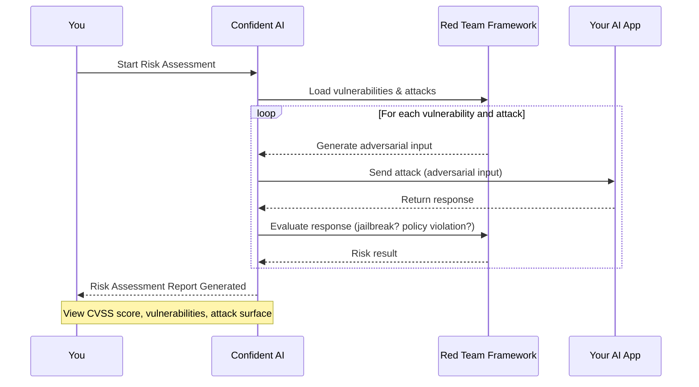

## Overview

This quickstart walks you through running your first no-code risk assessment on Confident AI. By the end of this guide, you'll have:

- Connected your AI app to Confident AI
- Configured your first red teaming framework
- Run a risk assessment on your AI application and viewed it on the dashboard

Our no code risk assessment flows allow any non-technical teams to analyze an AI application for all security and compliance issues without having to go through any complex steps, intuitively all within the Confident AI platform.

<Warning>
  You'll need a Confident AI account to follow along. [Sign up here](https://app.confident-ai.com/) if you haven't already.
</Warning>

## How it works

Risk assessments follow a simple 4-step process:

1. **Connect your AI application** — configure an AI Connection so Confident AI can communicate with your system.
2. **Define a red teaming framework** — select or create a framework (e.g., OWASP Top 10 for LLMs, MITRE ATLAS) that contains vulnerabilities and attacks of your choice.
3. **Generate and execute attacks** — automatically generate adversarial inputs and send them to your AI application.
4. **Evaluate and assess risk** — Confident AI analyzes responses, detects successful exploitations, and generates a structured risk assessment report.

Here's a visual representation of the data flow during a risk assessment:

<Tip>
Your AI app can be any application reachable over the internet — Confident AI communicates with it directly through your configured AI Connection.
</Tip>

## Run your first risk assessment

To run your first risk assessment, there are a few steps you'll have to go through, you can follow along this step-by-step process given below as an example:

<Steps>
    <Step title="Connect your AI application to Confident AI">
        To run a risk assessment on your AI application, we need to first provide a way for Confident AI to communicate with your application, you can connect your AI application as shown in the [AI Connection docs](/docs/settings/project/ai-connections), but here's a quick example:

        <Frame caption="Setup AI Connection">
            
        </Frame>

        1. Navigate to **Project Settings** → **AI Connections**
        2. Click **New AI Connection**
        3. Give it a unique identifying name
        4. Click **Save**

        <Note>
            Now you just need to configure the endpoint, payload, and add the actual output key path to finish setting up, this allows you to run red teaming on your AI application.
        </Note>
    </Step>

    <Step title="Create a Red Teaming Framework">
        A red teaming framework on Confident AI is a pre-defined or custom configurable framework that contains various vulnerabilities and attacks that will be used to red team your AI application.
        
        <Frame caption="Add a Framework on Confident AI">
            
        </Frame>

        You can choose from various safety frameworks like **OWASP, MITRE, NIST**. Alternatively, you can also create a fully custom framework with your own vulnerabilities and attack configurations.
        
        To create a framework:

        1. Navigate to **Frameworks** tab
        2. Click **Add Framework**
        3. Select any template from the defaults provided (e.g., OWASP, NIST) and click **Save**

        You can now edit vulnerabilities, attacks, and add or update priorities anytime in the framework configuration page.

    </Step>

    <Step title="Running a Risk Assessment">
        After saving your red teaming framework, you'll be redirected to your framework configuration page, where you can edit your current framework or run risk assessments on your AI application.
        
        <Frame caption="Run a risk assessment">
            
        </Frame>

        You can now click **Run Assessment** and choose your AI connection you want to red team on, Confident AI will now run red teaming on your AI application.

        <Tip>
            Name your risk assessments with identifiers (e.g., "compliance-test-feb-11") to make it easier to find your assessments later on.
        </Tip>
    </Step>

    <Step title="Viewing Results">
        Once Confident AI finishes running red teaming, your risk assessment report in risk profile section where you view and download your risk assessment report.
        
        <Frame caption="Viewing risk assessment results">
            
        </Frame>

        This page shows you the full risk assessment overview like:

        - **Executive Summary**: Overall pass rate, vulnerability coverage, attack vectors and critical issues
        - **Test Cases**: All test cases containing adversarial inputs generated by Confident AI and your AI's responses.
        - **CVSS Score & Overview**: Your overall CVSS risk score distribution and exploitabiliy breakdown by vulnerability and attacks.
    </Step>

</Steps>

Confident AI allows you to download a PDF report for your risk assessment which is a comprehensive report that gives insights into where your model is exploitable, what steps to take and the methodologies used to assess your AI application.

You can learn more about what CVSS score, vulnerability coverage, attack surface scores are and how they're calculated in the [risk profile section](/docs/red-teaming/risk-profile).