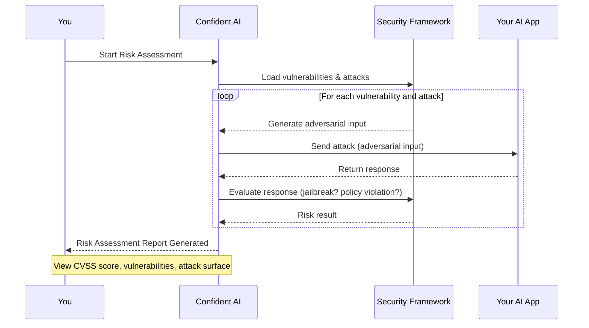

## Overview

This quickstart walks you through running your first no-code risk assessment on Confident AI. By the end of this guide, you'll have:

- Connected your AI app to Confident AI
- Configured your first security framework
- Run a risk assessment on your AI application and viewed it on the dashboard

No-code risk assessments let any team member analyze an AI application for security and compliance issues directly in the Confident AI platform.

## How it works

Risk assessments follow a simple 4-step process:

1. **Connect your AI application** — configure an AI Connection so Confident AI can communicate with your system.
2. **Define a security framework** — select or create a framework (e.g., OWASP Top 10 for LLMs, MITRE ATLAS) that contains vulnerabilities and attacks of your choice.
3. **Generate and execute attacks** — automatically generate adversarial inputs and send them to your AI application.
4. **Evaluate and assess risk** — Confident AI analyzes responses, detects successful exploitations, and generates a structured risk assessment report.

<Note>
  Your AI app can be any application reachable over the internet — Confident AI
  communicates with it directly through your configured AI Connection.
</Note>

Here's a visual representation of the data flow during a risk assessment:

## Run your first risk assessment

<Warning>
  You'll need a Confident AI account to follow along. [Sign up
  here](https://app.confident-ai.com/) if you haven't already.
</Warning>

<Steps>
    <Step title="Connect Your AI App">
        First, set up an [AI Connection](/docs/settings/project/ai-connections) so Confident AI can communicate with your app.

        <Frame caption="Setup AI Connection">
            
        </Frame>

        1. Navigate to **Project Settings** → **AI Connections**
        2. Click **New AI Connection**
        3. Give it a unique identifying name
        4. Configure the endpoint, payload, and output key path
        5. Click **Save**
    </Step>

    <Step title="Create a Framework">
        A framework defines the vulnerabilities and attacks that will be used in your assessment.

        <Frame caption="Add a Framework on Confident AI">
            
        </Frame>

        1. Navigate to the **Frameworks** tab
        2. Click **Add Framework**
        3. Select a template (e.g., OWASP, NIST, MITRE ATLAS) or create a custom framework
        4. Click **Save**

        You can edit vulnerabilities, attacks, and priorities anytime from the framework configuration page.
    </Step>

    <Step title="Run the Assessment">
        From your framework configuration page, click **Run Assessment** and select the AI Connection you want to test.

        <Frame caption="Create a risk assessment">
            
        </Frame>

        Confident AI will generate adversarial inputs from your framework and send them to your app.

        <Tip>
            Name your assessments descriptively (e.g., "compliance-test-feb-11") so they're easy to find later.
        </Tip>
    </Step>

    <Step title="View Results">
        Once the assessment completes, your report will be available in the risk profile section.

        <Frame caption="Viewing risk assessment results">
            
        </Frame>

        The report includes:

        - **Executive Summary** — overall pass rate, vulnerability coverage, and critical issues
        - **Test Cases** — every adversarial input and your AI's response
        - **CVSS Score & Overview** — risk score distribution and exploitability breakdown by vulnerability

        Done ✅. You've run your first no-code risk assessment. You can also download a PDF report with the full breakdown and remediation recommendations.
    </Step>

</Steps>

## Next steps

Now that you've run your first risk assessment, dive deeper into the platform:

<CardGroup cols={2}>
  <Card
    title="Frameworks & Policies"
    icon="shield-check"
    iconType="solid"
    href="/docs/red-teaming/framework-policies"
  >
    Customize frameworks, add vulnerabilities, and configure attack priorities
    for your use case.
  </Card>
  <Card
    title="Risk Profiles"
    icon="triangle-exclamation"
    iconType="solid"
    href="/docs/red-teaming/risk-profile"
  >
    Understand CVSS scores, vulnerability coverage, and exploitability
    breakdowns across your assessments.
  </Card>
</CardGroup>
