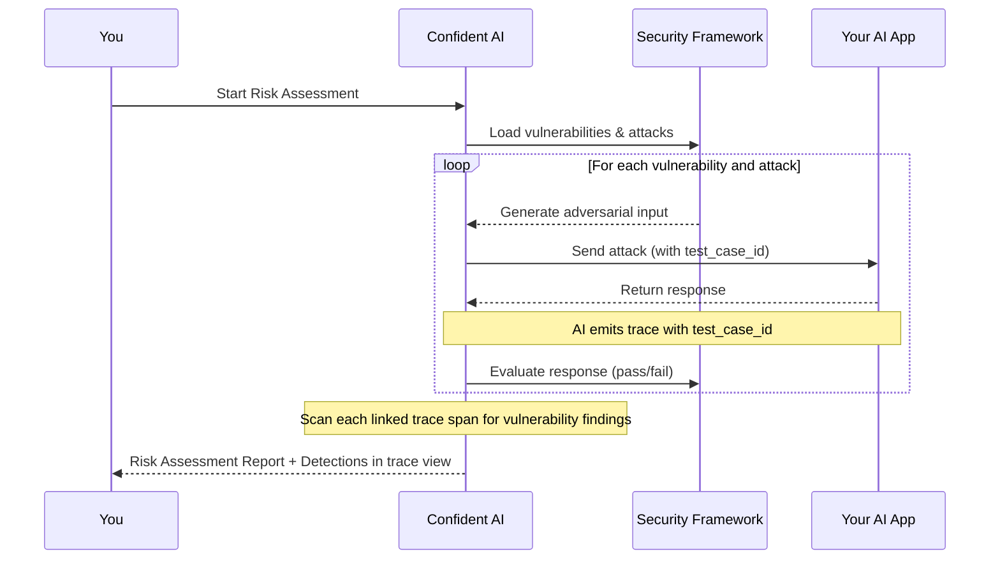

## Overview

When your AI application is traced and linked to a risk assessment via `test_case_id` (or `turn_id` for multi-turn), Confident AI scans each span in the trace for vulnerability findings after the assessment completes. These per-span findings are called **Detections**.

<Note>
  This requires your AI application to be instrumented for tracing. See [LLM
  Tracing Introduction](/docs/llm-tracing/introduction) to get started.
</Note>

## How it works

The trace scan runs once the assessment finalizes. No extra configuration is required beyond linking your traces to test cases.

## Prerequisites

- Your AI application instrumented for tracing on Confident AI — see [LLM Tracing Introduction](/docs/llm-tracing/introduction)
- Each trace linked to its test case using `test_case_id` (single-turn) or `turn_id` (multi-turn) — see setup instructions below

## Linking traces to test cases

When Confident AI sends an attack to your AI Connection, it includes a `test_case_id` in the request payload. Pass that ID into your tracing implementation so Confident AI can match the trace back to the correct test case.

<Tabs>
  <Tab title="AI Connections">
    Confident AI sends `testCaseId` (and `turnId` for multi-turn) automatically in the request payload. Forward it to your tracing setup.

    Setup instructions and code examples:

    - [Linking test cases to traces (single-turn)](/docs/settings/project/ai-connections/linking-traces#linking-test-cases-to-traces)
    - [Linking turns to traces (multi-turn)](/docs/settings/project/ai-connections/linking-traces#linking-turns-to-traces)
  </Tab>
  <Tab title="OpenTelemetry">
    Set the `confident.trace.test_case_id` attribute on your root span to link the trace.

    Attribute reference and examples:

    - [Test Case Id attribute](/docs/integrations/opentelemetry#test-case-id) (single-turn)
    - [Turn Id attribute](/docs/integrations/opentelemetry#turn-id) (multi-turn)
  </Tab>
</Tabs>

## Detections

A detection is a vulnerability finding attributed to a specific span. The assessment's configured evaluation model analyzes each span's input and output, together with its position in the execution tree, to determine whether a vulnerability was introduced.

### Outcomes

| Outcome        | Description                                                                                                           |
|----------------|-----------------------------------------------------------------------------------------------------------------------|
| `materialized` | The span produced violating content and it reached the user — no downstream span caught it.                           |
| `mitigated`    | The span produced violating content but a downstream span sanitized, blocked, or replaced it before the final output. |
| `attempted`    | A clear attempt to introduce the vulnerability, but no breach occurred.                                               |

<Tip>
  Distinguishing `materialized` from `mitigated` requires the evaluation model
  to reason across the parent-child span chain. More capable models handle this
  more reliably in deep or complex trace trees.
</Tip>

### Viewing detections

Spans with detections show a shield icon in the trace tree. Click any span and open the **Detections** tab to see the full list of findings for that span — including outcome, vulnerability type, attack vector, and reason.

<Frame caption="Shield icons in the trace tree and the Detections tab in the span detail panel">
  
</Frame>

### Span attribution

Detections are attributed to the span that introduced the vulnerability, not to parent or wrapper spans. For example, if a child LLM span generates harmful content and a parent guardrail span blocks it before output:

- The child LLM span gets a `mitigated` detection
- The parent span gets no detection

This means detections in multi-span pipelines reflect where the issue originated, not which spans happened to pass the output along.

## Notes

- Trace scanning runs alongside the standard pass/fail evaluation on the test case's final output. Both appear in the assessment view.
- The trace scan uses the vulnerability definitions from your security framework, including any custom vulnerabilities.
- Detections are generated for any traced application with traces linked via `test_case_id` or `turn_id`.

## Next steps

<CardGroup cols={2}>
  <Card
    title="Risk Profiles"
    icon="triangle-exclamation"
    iconType="solid"
    href="/docs/red-teaming/risk-profile"
  >
    View CVSS scores, vulnerability coverage, and exploitability breakdowns
    across your assessments.
  </Card>
  <Card
    title="LLM Tracing Introduction"
    icon="chart-network"
    iconType="solid"
    href="/docs/llm-tracing/introduction"
  >
    Instrument your AI application for tracing on Confident AI.
  </Card>
</CardGroup>
