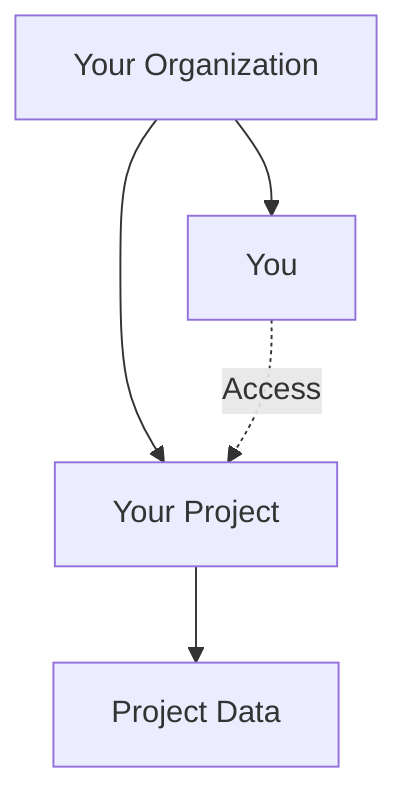

## Data Organization and Separation

When you initially create an account on Confident AI, an **organization** and a **project** within that organization are automatically created for you. Each organization can have multiple **projects** and **users**.

<Tip>
  You should create a separate project for each distinct [LLM use
  case](/docs/llm-use-cases), even when multiple use cases share the same codebase or
  business logic. This is because the datasets and metrics will be different for
  each use case.
</Tip>

<Frame caption="Data Organization and Separation in Confident AI">
  
</Frame>

As your organization scales, you can:

- Invite more **users** to your **project** (they have access to project data)
- Invite more **users** to your **organization** (they don't have access to project data yet)
- Create more **projects** within your **organization**

All data (test case data, metrics data, dataset data, tracing data, etc.) **is separated at the project level**. Users from one project cannot access data in projects they don't belong to, even if they are within the same organization.

### Organization

An organization represents the top-level container for all your Confident AI resources. Subscription plans and billing cycles are managed at the **organization** level. For example, if you subscribe to the [Premium plan](https://confident-ai.com/pricing), all **projects** within your organization will automatically receive premium features.

### Project

Projects function as separate workspaces within your organization where data and access permissions are isolated. They allow different teams or use cases within your organization to maintain distinct LLM evaluation workflows.

<Info>
After completing the initial onboarding process once you've [created an account](/docs/getting-started/setup#create-an-account), you will be the sole **user** belonging to your **project** within your **organization**.
</Info>

<Frame>
<div className='flex justify-center items-center'>

</div>
</Frame>

## Data Retention

Data retention periods vary based on your [pricing plan](https://confident-ai.com/pricing). **Only the following data types are subject to automatic deletion**:

- Test run data (including metrics data)
- Tracing data (including metrics data)

Your datasets and prompts will be preserved as long as you maintain an active account with us. Here are the data retention periods for test run and tracing data by membership tier:

- **Free**: 14 days
- **Starter**: 3 months
- **Premium**: 9 months
- **Enterprise**: Custom

For extended retention periods, please contact support@confident-ai.com.

## Data Residency

By default, all data is stored and processed in the United States of America. You can also request your data to be hosted and processed in the **European Union** instead however, and you would require to be on a [Premium plan](https://confident-ai.com/pricing) with an add on to do so.

Additional data residency options are available on-demand, contact support@confident-ai.com to ask for the available options.

<Note>
Using `deepeval` with Confident AI in the EU region is as simple as running this command:

```bash
deepeval set-confident-region EU
```
</Note>

For those that want to host Confident AI on their premises, [click here.](/docs/on-prem-hosting)

## Data Privacy

All data processed and stored by Confident AI is encrypted at rest and protected by TLS in transit. We maintain SOC II and HIPAA compliance to meet the most stringent data security requirements for our enterprise customers.

SOC II certifications are available for customers on the **Enterprise plan** while HIPAA Business Associate Agreements (BAAs) are available for customers on the **Premium Plan** as an add-on.

## Data Exportation

We protect against vendor lock-in by ensuring you can export all of your data should you decide to leave Confident AI. This service is available to customers on the **Premium plan** or higher, with a 30-day window to submit your request after unsubscribing.

For ongoing use of Confident AI, we provide comprehensive API endpoints that allow you to query and retrieve your data for any downstream processing needs.
