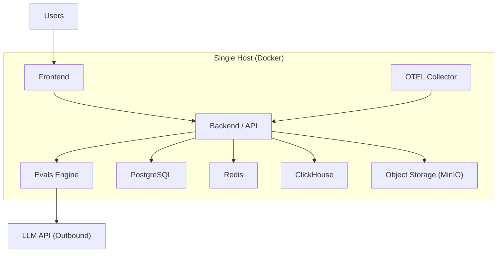

A POC (proof-of-concept) environment lets you run the **entire Confident AI stack on a single machine** using Docker, so your team can trial self-hosting quickly—without provisioning a Kubernetes cluster or standing up managed cloud services.

<Tip>

Self-hosting (including POC environments) is only available for customers with Enterprise licenses. [Talk to us](https://www.confident-ai.com/book-a-demo) to inquire about one.

</Tip>

<Warning>

**POC environments are temporary by design.** They are meant for short-lived evaluation—not for production data, production traffic, or long-term use. When you're ready to go live, move to a [production-grade deployment](#moving-to-production) on your cloud provider.

</Warning>

## Overview

A POC deployment packages every service in the core Confident AI stack into containers that run together on **one host**—an on-prem server, or a single cloud VM, or anything that runs Docker. It is **cloud-provider agnostic**: nothing depends on a specific cloud's managed database, object store, or Kubernetes offering.

This makes it the fastest way to:

- **Validate the product** against your own data and workflows before a full rollout.
- **Confirm network and security fit** within your environment on a small footprint.
- **Give stakeholders a hands-on demo** without a multi-week infrastructure project.

|                  | POC environment                                           | Production-grade deployment                          |
| ---------------- | --------------------------------------------------------- | ---------------------------------------------------- |
| **Footprint**    | Single machine (Docker)                                   | Kubernetes cluster (EKS / AKS / GKE)                 |
| **Data stores**  | Containerized Postgres, Redis, ClickHouse, object storage | Managed database + replicated, backed-up data stores |
| **Setup time**   | Minutes to hours                                          | Typically 1–4 weeks end-to-end                       |
| **Availability** | Single point of failure                                   | Orchestrated, self-healing, horizontally scalable    |
| **Intended use** | Temporary evaluation                                      | Long-lived production workloads                      |
| **Best for**     | Trials, demos, security fit-check                         | Real usage at scale                                  |

## Architecture

Everything runs as containers on a single host. Instead of relying on a cloud's managed services, the POC bundles its own datastores and uses **self-hosted object storage (MinIO)** in place of S3, Azure Blob, or GCS—which is what keeps it portable across any environment.

The only required outbound dependency is an **LLM provider API** (for running evaluations). Everything else—application data, traces, evaluation results, and uploaded files—stays on the single host.

<Warning>

**A POC environment is not suitable for production use.** The single-host setup is intentionally simplified and does not offer the security, resilience, or scalability of a production-grade deployment (see the [limitations](#limitations-of-poc-environment) below). For production workloads, a full enterprise deployment on [AWS](/self-hosting/aws/overview), [Azure](/self-hosting/azure/overview), or [GCP](/self-hosting/gcp/overview) is both possible and recommended.

</Warning>

## What you'll need

| Requirement                | Notes                                                                                                                     |
| -------------------------- | ------------------------------------------------------------------------------------------------------------------------- |
| **A host with Docker**     | A single machine (VM or server) with Docker installed. Sizing depends on your trial volume; a POC is not tuned for scale. |
| **Enterprise license key** | Self-hosting is gated behind an Enterprise license. Your Confident AI representative will provide one.                    |
| **Container images**       | Provided by Confident AI for your chosen registry, or pulled as part of the POC bundle.                                   |
| **An LLM provider key**    | Required for evaluations to run (e.g. OpenAI, Azure OpenAI, or Anthropic). Self-hosted models are also supported.         |

<Note>

Because the POC runs on a single host, exposing it to your team is as simple as putting it behind your existing VPN or an internal load balancer. The same [security principles](/self-hosting/security-and-compliance) apply—no data leaves your environment except outbound LLM calls.

</Note>

## Limitations of POC Environment

A POC environment trades production hardening for speed and simplicity. Understand these limits before relying on it:

- **Temporary by design.** POC environments are intended to be short-lived and may carry an expiration. They should not accumulate production data.
- **No high availability.** Everything runs on one machine—if the host goes down, so does the deployment. There is no failover, no redundancy, and no automatic recovery.
- **No horizontal scaling.** Services can't scale out across nodes. A POC won't reflect the performance or throughput of a production deployment.
- **Datastores are not production-grade.** Postgres, Redis, and ClickHouse run as single containers rather than managed, backed-up, replicated services. ClickHouse runs in single-node (non-replicated) mode.
- **Persistence and backups are your responsibility.** Without deliberate configuration, data lives only for the life of the containers. There is no managed backup, point-in-time recovery, or disaster recovery.
- **Reduced integration surface.** Some capabilities that depend on managed cloud services (e.g. cloud-native secrets management, managed encryption keys, certain code-execution runners) are simplified or unavailable in a POC.
- **Not for compliance-bound production data.** For workloads with regulatory requirements, use a production-grade deployment that inherits your cloud environment's controls.

## Moving to production

When your POC has validated the fit, the next step is a **production-grade deployment** on your cloud provider. These deployments run on managed Kubernetes (EKS, AKS, or GKE) with a managed database, replicated and backed-up data stores, cloud-native encryption and secrets, and horizontal scaling—everything a POC intentionally leaves out.

Each cloud has its own step-by-step guide:

<CardGroup cols={3}>
  <Card title="AWS" icon="fa-light fa-aws" href="/self-hosting/aws/overview">
    Production deployment on Amazon Web Services using EKS.
  </Card>
  <Card
    title="Azure"
    icon="fa-light fa-microsoft"
    href="/self-hosting/azure/overview"
  >
    Production deployment on Microsoft Azure using AKS.
  </Card>
  <Card title="GCP" icon="fa-light fa-google" href="/self-hosting/gcp/overview">
    Production deployment on Google Cloud Platform using GKE.
  </Card>
</CardGroup>

