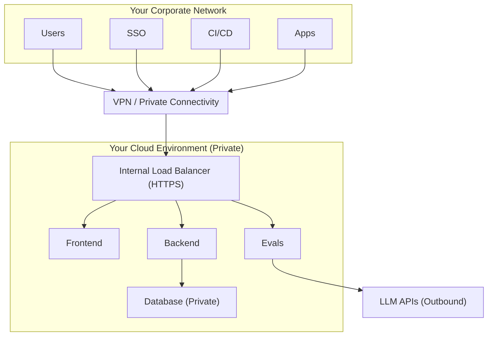

## Overview

This page provides detailed security information for your security team's review. It covers:

- Network architecture and traffic flow
- Integration points with your existing infrastructure
- Authentication and access control
- Data retention and storage
- Encryption at rest and in transit
- Logging and audit capabilities

All self-hosted deployments—regardless of cloud provider—follow these security principles. Provider-specific implementation details are covered in the respective deployment guides.

## Networking

All traffic flows through your private network. There is no public internet ingress by default—users access Confident AI through your existing VPN, network peering, or private connectivity setup. The only outbound traffic is to LLM providers for evaluations (if using external models) and optional notification services.

### Network isolation

| Component                | Network placement                            | Access                      |
| ------------------------ | -------------------------------------------- | --------------------------- |
| **Load balancer**        | Private subnet (or public with restrictions) | Your corporate network only |
| **Application services** | Private subnet                               | No direct internet access   |
| **Database**             | Private/isolated subnet                      | Application services only   |
| **Object storage**       | Private endpoint                             | Application services only   |

<Note>
  **Internet-facing option:** For organizations that prefer public access (with
  authentication), the load balancer can be configured as internet-facing. This
  increases attack surface but simplifies access for distributed teams without
  VPN.
</Note>

## Integration points

The deployment supports several integration points with your existing infrastructure. All inbound connections come through your private network; outbound connections go through NAT/gateway with optional private endpoint support.

| Integration              | Direction     | Protocol   | Purpose                                                                |
| ------------------------ | ------------- | ---------- | ---------------------------------------------------------------------- |
| **Corporate SSO**        | Inbound       | SAML/OIDC  | User authentication via your identity provider                         |
| **LLM providers**        | Outbound      | HTTPS      | OpenAI, Azure OpenAI, Anthropic, or self-hosted models for evaluations |
| **Private connectivity** | Bidirectional | Private    | Connect to your existing cloud infrastructure                          |
| **Slack / Email**        | Outbound      | HTTPS/SMTP | Alert notifications and evaluation reports                             |
| **OTEL collectors**      | Inbound       | gRPC/HTTP  | Receive traces from your LLM applications                              |
| **CI/CD pipelines**      | Inbound       | HTTPS      | Trigger evaluations from GitHub Actions, Jenkins, etc.                 |

<Note>
  **Private endpoints:** All major cloud providers offer private endpoint
  services (AWS PrivateLink, Azure Private Link, GCP Private Service Connect)
  that allow integration traffic to stay within your cloud network, eliminating
  public internet exposure.
</Note>

<Warning>
**Outbound access to LLM providers is required for evaluations.** If your organization restricts outbound traffic, ensure the following are allowlisted:
- `api.openai.com` (OpenAI)
- `*.openai.azure.com` (Azure OpenAI)
- `api.anthropic.com` (Anthropic)

Alternatively, use self-hosted or on-premise LLM models that don't require external network access.

</Warning>

## Authentication

Confident AI does not maintain its own user database for self-hosted deployments. All user authentication is handled through your corporate identity provider via SAML or OIDC. This means user credentials never touch Confident AI systems—authentication tokens are validated against your IdP directly.

| Method               | Description                                                                                       |
| -------------------- | ------------------------------------------------------------------------------------------------- |
| **SSO (SAML/OIDC)**  | Primary authentication method via your identity provider (Okta, Azure AD, Google Workspace, etc.) |
| **Google OAuth**     | Optional OAuth authentication for organizations using Google Workspace                            |
| **API keys**         | Scoped per project for programmatic access (SDK, CI/CD, integrations)                             |
| **Service accounts** | Cloud-native IAM for service-to-service authentication (IRSA, Workload Identity, etc.)            |

<Warning>
  **Local accounts are not supported.** All human users must authenticate via
  SSO. This ensures: - Centralized access control through your IdP - Automatic
  deprovisioning when employees leave - Consistent MFA enforcement - Audit trail
  in your identity system
</Warning>

### API key security

API keys are used for programmatic access and have the following security properties:

- **Project-scoped:** Each API key is tied to a specific project and cannot access other projects
- **Revocable:** Keys can be revoked instantly from the dashboard or API
- **Audited:** All API key usage is logged with request details
- **No user impersonation:** API keys cannot perform user-level actions like changing settings

<Note>
  **Rotate API keys regularly.** We recommend rotating API keys every 90 days or
  immediately if you suspect compromise. The dashboard shows last-used
  timestamps to help identify unused keys.
</Note>

## Data storage and residency

All application data is stored within your cloud account in the region you choose. Confident AI (the company) has no access to your data—everything remains in your infrastructure.

| Data type              | Storage                              | Purpose                               |
| ---------------------- | ------------------------------------ | ------------------------------------- |
| **User data**          | PostgreSQL database                  | Projects, settings, user preferences  |
| **Traces & spans**     | PostgreSQL database                  | LLM application telemetry             |
| **Evaluation results** | PostgreSQL database                  | Metric scores, test runs, experiments |
| **Datasets**           | PostgreSQL database + Object storage | Golden datasets, uploaded files       |
| **Audit logs**         | Cloud logging service                | Security and compliance auditing      |

<Note>
  **Data residency:** Your data never leaves the region you deploy to. This is
  critical for organizations with GDPR, data sovereignty, or regulatory
  requirements that mandate data stay within specific geographic boundaries.
</Note>

## Data retention

Retention periods are configurable per data type, allowing you to meet compliance requirements while managing storage costs. Data deletion is handled automatically based on your configured policies.

| Data type              | Default retention           | Configurable |
| ---------------------- | --------------------------- | ------------ |
| **Traces & spans**     | 90 days                     | Yes          |
| **Evaluation results** | Indefinite                  | Yes          |
| **Uploaded files**     | 30 days                     | Yes          |
| **Audit logs**         | Per cloud provider defaults | Yes          |
| **Application logs**   | 14 days                     | Yes          |

<Warning>
  **Deletion is permanent.** Once data exceeds its retention period, it's
  automatically deleted and cannot be recovered. Ensure your retention settings
  align with your compliance and business requirements before deployment.
</Warning>

<Note>
  Retention periods are fully configurable. Contact your Confident AI
  representative to adjust based on your compliance requirements or modify
  settings in the application configuration.
</Note>

## Encryption

All data is encrypted both in transit and at rest using cloud-native encryption services. Encryption keys are managed within your cloud account—Confident AI does not have access to your encryption keys.

| Layer                  | Method                                                                                           |
| ---------------------- | ------------------------------------------------------------------------------------------------ |
| **In transit**         | TLS 1.2+ for all internal and external traffic                                                   |
| **At rest (database)** | Cloud-managed encryption (AWS KMS, Azure Key Vault, GCP Cloud KMS)                               |
| **At rest (storage)**  | Cloud-managed encryption with bucket/container policies                                          |
| **Secrets**            | Cloud secrets manager with encryption (AWS Secrets Manager, Azure Key Vault, GCP Secret Manager) |

### Encryption key management

| Option                          | Description                                            | Recommended for                                        |
| ------------------------------- | ------------------------------------------------------ | ------------------------------------------------------ |
| **Cloud-managed keys**          | Default encryption using cloud provider's managed keys | Most deployments                                       |
| **Customer-managed keys (CMK)** | You create and control the encryption keys             | Regulated industries, specific compliance requirements |
| **BYOK (Bring Your Own Key)**   | Import keys from your HSM                              | Maximum control, on-premise HSM integration            |

<Note>
  **Default is secure.** Cloud-managed encryption meets most security
  requirements. Customer-managed keys add operational complexity but provide
  additional control for organizations that require it.
</Note>

## Logging and audit

Comprehensive logging is enabled by default for security monitoring and compliance. All logs are stored within your cloud account using native logging services.

| Log type             | Contents                                       | Retention                   |
| -------------------- | ---------------------------------------------- | --------------------------- |
| **Application logs** | Service logs, errors, request traces           | Configurable                |
| **Access logs**      | Load balancer access, API requests             | Configurable                |
| **Audit trail**      | Cloud API calls, IAM actions, resource changes | Per compliance requirements |
| **Database logs**    | Connection logs, slow queries (optional)       | Configurable                |

### What's logged

**User actions:**

- Login/logout events (via SSO)
- Project creation, modification, deletion
- Dataset uploads and modifications
- Evaluation runs and results access
- API key creation and usage

**System events:**

- Service health and errors
- Database connections and queries
- External API calls (LLM providers)
- Resource scaling events

<Warning>
  **PII in logs:** Application logs may contain user-provided data (prompts,
  responses) depending on your tracing configuration. Review your logging
  settings and apply masking rules if needed to prevent sensitive data in logs.
</Warning>

## Compliance considerations

Self-hosted Confident AI supports various compliance frameworks by design:

| Framework            | How self-hosting helps                                                  |
| -------------------- | ----------------------------------------------------------------------- |
| **GDPR**             | Data stays in your chosen EU region, you control retention and deletion |
| **SOC 2**            | Deploy within your existing SOC 2 boundary, inherit your controls       |
| **HIPAA**            | Keep PHI in your compliant environment, sign BAAs with cloud provider   |
| **FedRAMP**          | Deploy in FedRAMP-authorized regions with your ATO                      |
| **Data sovereignty** | Data never leaves your geographic boundary                              |

<Note>
  **Your compliance, your controls.** Self-hosting means Confident AI inherits
  your organization's compliance posture. Work with your compliance team to
  ensure the deployment meets your specific requirements.
</Note>

## Security checklist for your team

Before approving deployment, your security team should verify:

- [ ] Network architecture reviewed and approved
- [ ] VPN/private connectivity plan confirmed
- [ ] SSO integration method selected (SAML/OIDC)
- [ ] Data retention policies defined
- [ ] Encryption key management approach decided
- [ ] Logging and monitoring integration planned
- [ ] Outbound access rules for LLM providers approved
- [ ] Incident response procedures updated to include Confident AI

## Next steps

Once your security team has reviewed this information, proceed to the deployment guide for your chosen cloud provider:

- [AWS Deployment](/self-hosting/aws/overview)
- [Azure Deployment](/self-hosting/azure/overview) (coming soon)
- [GCP Deployment](/self-hosting/gcp/overview) (coming soon)
